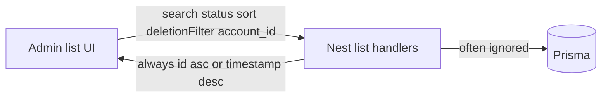

# Admin panel list search, sort, and filter fixes

## Decisions locked (grilling)

- Scope: **all admin list screens** that already expose search/sort/filter.
- Soft-delete: **list filters only** — honor `deletionFilter` / `status`; do **not** implement Delete / GDPR anonymization (Restore already works).
- Account Users: **always scope to the open account** when `account_id` is sent.
- Accounts search: match **name + id + country/state names**.
- SMS Vendors: move search/sort to **Nest** (stop client-only filtering).
- Admin Logs: point UI at **`/api/logs`**, then honor sort (and existing filters).

## Out of scope

- Account Delete button / GDPR anonymization cron ([`.cursor/plans/account-soft-deletion-gdpr-c16ab458.plan.md`](frontend/.cursor/plans/account-soft-deletion-gdpr-c16ab458.plan.md)).
- AccountRoles and System Health grids (no server search/sort UI today).
- BusinessUnits nested list (already has search + sort allowlist).
- Cron-jobs debug page (not a standard list API).
- Translation / new styling changes.

## Problem

UI already sends the right query params; Nest largely ignores them for accounts/users/logs/SMS.

## Implementation

### 1. Accounts — Nest list

Primary file: [`backend/api/src/account-admin/account-admin-entities.service.ts`](backend/api/src/account-admin/account-admin-entities.service.ts)

Extend `AccountAdminListQuery` with `status`, `deletionFilter`, `account_id` (for users).

For `entityType === "accounts"` (dedicated branch before the generic `orderBy: { id: "asc" }` path):

- **Search** (`search` / `query`): OR across `name` (insensitive contains), numeric `id` when the term is digits, and related `Country.name` / `State.name`.
- **Status**: when `Active` / `Inactive`, filter `status`.
- **deletionFilter**:
  - `active` (default if omitted to match UI default): `deleted_at: null`
  - `deleted`: `deleted_at: { not: null }`
  - `all`: no `deleted_at` clause
- **Sort allowlist** mapped from UI fields: `id`, `name`, `status`, `company_number`, `country` → `Country.name`, `state` → `State.name`. Invalid field → `id asc`.
- **Include** `Country` / `State` `{ select: { id, name } }` so [`AccountList.tsx`](frontend/app/[locale]/app/admin/accounts/AccountList.tsx) `Country.name` / `State.name` mapping works.

### 2. Users — Nest list + scoping

Same service, `entityType === "users"`:

- When `query.account_id` is present, **always** `where.account_id = that id` (even for Archaser admins). This matches Account Users tab behavior.
- When absent and caller is Archaser admin with empty scope today, keep current “all users” only if some other admin screen needs it; Account Users always sends `account_id`.
- Apply `status` filter when sent.
- Search already configured: `name`, `email`, `username`.
- Sort allowlist aligned with [`UserList.tsx`](frontend/shared/components/UserList.tsx) columns (at least `name`, `email`, `status`, `username` / whatever the grid marks sortable).

### 3. Admin Logs — path + sort

- Frontend [`admin/logs/LogList.tsx`](frontend/app/[locale]/app/admin/logs/LogList.tsx): change `/api/admin/logs` → `/api/logs`.
- Nest [`logs.controller.ts`](backend/api/src/logs/logs.controller.ts): allowlist `sortField` / `sortDirection` (e.g. `timestamp`, `level`, `source`, `message`); default remains `timestamp desc`.
- Keep existing `search` (message contains), `level`, `source`.
- **`jobName`**: Log model has no `jobName` column — leave ignored unless mapped to `source` or `details` in a follow-up; document as known gap.

### 4. SMS Vendors — Nest search/sort

- [`sms.service.ts`](backend/api/src/sms/sms.service.ts) `listVendors`: accept `search`, `sortField`, `sortDirection`; filter provider/name/currency/priority/cost; allowlisted orderBy.
- Controller: pass query through.
- [`SMSVendors.tsx`](frontend/app/[locale]/app/admin/sms/components/SMSVendors.tsx): send params on fetch; remove client-side filter/sort of the loaded array (keep grid `sortModel` as the source of query params).

### 5. SMS Country Mappings — Nest sort

- `listCountryVendors` already searches; add allowlisted `orderBy` from `sortField`/`sortDirection` (id, country name via relation, vendor name, is_active, etc. matching UI columns).

### 6. Frontend hygiene (Accounts)

In [`AccountList.tsx`](frontend/app/[locale]/app/admin/accounts/AccountList.tsx):

- Rename React Query key from `"customers-virtual"` → `"accounts-virtual"` (including invalidate calls).
- Include `deletionFilter` in the EndlessScroll grid remount `key`.

No soft-delete DELETE wiring.

## Testing strategy

| Requirement | Test |
|-------------|------|
| Accounts search by name/id/country | Nest unit/http: seed accounts + Country/State; assert OR match |
| Accounts status + deletionFilter | Assert `deleted_at` / `status` where clauses and counts |
| Accounts sort by country | Assert orderBy / result order |
| Users scoped to account_id | Admin JWT + `account_id=X` returns only that account’s users |
| Users status + sort | Assert where + orderBy |
| Logs path | Admin LogList calls `/api/logs` |
| Logs sort | Assert orderBy from query |
| SMS vendors search/sort | Service filters/sorts; FE no longer client-filters |
| SMS country sort | Assert orderBy allowlist |

## Codebase scan

**Required**

- [`backend/api/src/account-admin/account-admin-entities.service.ts`](backend/api/src/account-admin/account-admin-entities.service.ts) — accounts/users list filters, search, sort, includes
- [`backend/api/src/logs/logs.controller.ts`](backend/api/src/logs/logs.controller.ts) — sort allowlist
- [`backend/api/src/sms/sms.service.ts`](backend/api/src/sms/sms.service.ts) (+ controller) — vendors query + country-vendors sort
- [`frontend/app/.../admin/accounts/AccountList.tsx`](frontend/app/[locale]/app/admin/accounts/AccountList.tsx) — query key + grid key
- [`frontend/app/.../admin/logs/LogList.tsx`](frontend/app/[locale]/app/admin/logs/LogList.tsx) — `/api/logs`
- [`frontend/app/.../admin/sms/components/SMSVendors.tsx`](frontend/app/[locale]/app/admin/sms/components/SMSVendors.tsx) — server-driven search/sort
- New/extended Nest tests under `backend/api/test/`

**Optional / out of scope**

- Soft-delete DELETE + GDPR ([account-soft-deletion plan](frontend/.cursor/plans/account-soft-deletion-gdpr-c16ab458.plan.md))
- AccountRoles, System Health, cron-jobs
- Logs `jobName` filter (no schema field)
- Translations / new styles
- Export mappers on AccountList (export uses already-loaded rows; will inherit corrected server data)

**No change needed**

- BusinessUnits nested list (already correct)
- Account restore endpoint (already works)
- Prisma schema (Account.`deleted_at` already exists)

## Plan improvements / risks

- Sort on `Country.name` / `State.name` needs Prisma relation `orderBy` + null handling.
- Numeric id search: only treat all-digit terms as id equality to avoid false positives.
- Default `deletionFilter=active` when omitted so soft-deleted accounts do not leak into the default Accounts view after Nest starts respecting `deleted_at`.
- SMS Vendors response shape today is a bare array — keep that shape after adding query params so create/update/delete UI stays intact.
- Archaser admin Logs still scoped to **their** `account_id` via existing Nest logic — unchanged unless product asks for cross-account logs later.
