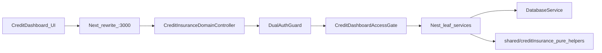

# Credit insurance Nest stub parity + UI walkthrough

## Decision log (grilled)

| # | Topic | Decision |
|---|-------|----------|
| D1 | What next | Fix Nest stubs before UI walkthrough |
| D2 | How | Nest-native port on `DatabaseService` only (no `@/server` adapter) |
| D3 | Scope | All stubbed leaves in one go |
| D4 | Parity bar | Match old response contracts (fields + business meaning); do not re-port Nest `summary` / `customer-dashboard-kpis` unless walkthrough proves wrong |
| D5 | Proof | Nest HTTP contract tests per newly ported leaf |
| D6 | Access | Port credit-dashboard access into Nest |
| D7 | Access routes | All `/api/credit-insurance/*` leaves share one access gate |
| D8 | Phase end | Same phase continues into credit-dashboard (+ portfolio health) UI walkthrough and fix leftover Nest gaps |

## Problem

[`apps/api/src/credit-insurance/credit-insurance.service.ts`](apps/api/src/credit-insurance/credit-insurance.service.ts) owns the rewrite target for `/api/credit-insurance/*`, but these leaves are stubs / empty:

- `summary-history`
- `portfolio-health`
- `customer-policy-trend`
- `insurance-policy-trend`
- `report`

Controller only uses `DualAuthGuard` — missing old `has_credit_insurance`, `view_credit_dashboard`, and BU (business unit) scoping from deleted [`pages/api/credit-insurance/*`](pages/api/credit-insurance/) (recoverable via `git show f05a9b1d6^:pages/api/credit-insurance/...`).

## Approach

1. **Shared Nest access gate** for every credit-insurance leaf: resolve account/role via [`AccessScopeService`](apps/api/src/auth/access-scope.service.ts); require `account.has_credit_insurance`; require `view_credit_dashboard` (default); resolve BU filter / selected BU / accessible BU ids (mirror deleted `authorizeCreditDashboardRequest` + dashboard BU query params).
2. **Exception from codebase (not a new product choice):** `insurance-policy-trend` historically allowed **any of** `view_settings` | `update_insurance_policy` | `view_credit_dashboard` (still require `has_credit_insurance`). Preserve that OR-check on that leaf only so old settings callers keep working.
3. **Nest-native leaf ports** — reimplement query parsing + domain math against `DatabaseService`. Prefer importing **pure** helpers from [`shared/creditInsurance/`](shared/creditInsurance/) where they exist. Do **not** import `@/server/services/...`. Use deleted Pages handlers + existing large services as the **behavioral spec** only.
4. **Split Nest modules by leaf** under [`apps/api/src/credit-insurance/`](apps/api/src/credit-insurance/) (avoid growing one mega `handle()` switch). Keep the catch-all controller; dispatch to focused services.
5. **Wire stub leaves to real implementations**; leave existing Nest `summary` / `customer-dashboard-kpis` / `mark-reported*` logic in place but **route them through the same access gate**.
6. **HTTP contract tests** — extend or split from [`apps/api/test/portal-insurance.http.test.ts`](apps/api/test/portal-insurance.http.test.ts):
   - 401 without auth
   - 403 without credit insurance / without permission
   - 200 with key contract fields for each newly ported leaf (non-empty where seeded mocks allow)
7. **UI walkthrough (same phase)** after HTTP green: `/app/credit-dashboard`, report drill-down, `/app/credit-portfolio-health`; fix Nest gaps found (including `summary` if KPIs are wrong).

### Leaf → old behavioral spec

| Leaf | Old entry (git) | Domain source of truth to mirror |
|------|-----------------|----------------------------------|
| `summary-history` | `summary-history.ts` | `getCreditDashboardSummaryHistory` in `creditDashboardSnapshotService.ts` |
| `portfolio-health` | `portfolio-health.ts` | `getCreditPortfolioHealth` in `creditPortfolioHealthService.ts` |
| `customer-policy-trend` | `customer-policy-trend.ts` | `getCustomerPolicyTrendForCustomer` / `getCustomerPolicyUsageTrend` |
| `insurance-policy-trend` | `insurance-policy-trend.ts` | `getInsurancePolicyTrend` / country / named / changes |
| `report` | `report.ts` (legacy list by `type=`) | `get*Report` + top-up reports in dashboard/top-up services |

## Codebase scan

**Required**

- [`apps/api/src/credit-insurance/`](apps/api/src/credit-insurance/) — access gate + Nest-native leaf services + controller wiring
- [`apps/api/src/auth/access-scope.service.ts`](apps/api/src/auth/access-scope.service.ts) — reuse `hasPermission` / BU helpers; extend only if dashboard BU query parity is missing
- [`apps/api/test/portal-insurance.http.test.ts`](apps/api/test/portal-insurance.http.test.ts) or new `credit-insurance.http.test.ts` — contract + 401/403
- [`apps/api/src/openapi/enrich-strangler-openapi.ts`](apps/api/src/openapi/enrich-strangler-openapi.ts) — keep leaf list accurate
- Deleted handlers via `git show f05a9b1d6^:pages/api/credit-insurance/<leaf>.ts` — query/status contract reference
- Spec sources under [`server/services/creditInsurance/`](server/services/creditInsurance/) — read-only reference while rewriting Nest-native
- Pure helpers under [`shared/creditInsurance/`](shared/creditInsurance/) — reuse when Nest-safe
- UI smoke paths: [`app/[locale]/app/credit-dashboard/`](app/[locale]/app/credit-dashboard/), [`app/[locale]/app/credit-portfolio-health/`](app/[locale]/app/credit-portfolio-health/)

**Optional / out of scope unless walkthrough forces it**

- Full Nest re-port of `summary` / `customer-dashboard-kpis` to match `getCreditDashboardSummary` / `getCustomerDashboardKpis`
- Customer page trend beyond ensuring `customer-policy-trend` contract works
- Cron/snapshot writers (`take*Snapshots`) — leaves are read APIs; writers stay where they are
- i18n / new styles
- Switching browser client to call `:3002` directly (rewrite stays)

**No change needed**

- Prisma schema
- `nest-api-rewrite.cjs` (`credit-insurance` already listed)
- NextAuth bridge / login flow
- ViewBased `/api/reports` path used by credit report grid (separate from legacy `report` leaf)

## Testing strategy

| Requirement | Test unit |
|-------------|-----------|
| Unauthenticated leaf calls fail | Nest HTTP 401 on each ported leaf |
| No credit insurance / missing `view_credit_dashboard` | Nest HTTP 403 (shared gate) |
| `insurance-policy-trend` permission OR | Nest HTTP allows when any of the three permissions present |
| Each stubbed leaf returns old contract keys | Nest HTTP 200 + shape assertions (seed/mocks as needed) |
| Policy not found | 404 when `policyId` outside account (history/trend/health) |
| Dashboard usable after ports | Manual: credit dashboard cards/history/trend; portfolio health; report actions; fix Nest gaps |

## Implementation order

1. Nest `CreditDashboardAccess` helper/gate + apply to all leaves
2. Port `summary-history` + HTTP tests
3. Port `customer-policy-trend` + HTTP tests
4. Port `portfolio-health` + HTTP tests
5. Port `insurance-policy-trend` (OR permissions) + HTTP tests
6. Port legacy `report` (`type=` router) + HTTP tests
7. UI walkthrough; fix leftover Nest gaps (including `summary` if needed)

## Suggest plan improvements (noted)

- Easy to miss: dashboard BU query param parity (`selectedBusinessUnitId` / admin override) — not only static BU hierarchy.
- Easy to miss: `report` is legacy EndlessScroll; UI detail page uses ViewBased reports — still port for scripts/callers.
- Easy to miss: `serializeBigInt` on responses.
- Risk: Nest-native rewrite of ~1.8k-line portfolio health is the longest pole; keep leaf services focused and copy behavior carefully from the old service.
