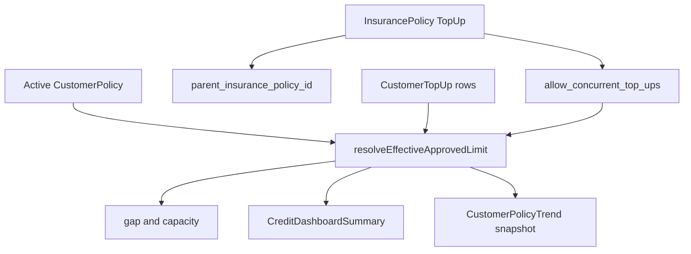

# Credit insurance top-up implementation

## What “top-up” means (industry + product fit)

In trade credit insurance, a **top-up** is **supplemental cover above the primary insurer’s credit limit** for specific buyers, usually for a **limited period**. The primary `approved_limit` on [`CustomerPolicy`](prisma/schema.prisma) stays the baseline; top-ups add temporary capacity.

| Requirement | Design implication |
|-------------|-------------------|
| Per customer | `CustomerTopUp` keyed by `customer_id` |
| Time-limited | `start_date` / `end_date` (inclusive UTC calendar days) |
| Many over time | History rows; active = date window + not cancelled |
| Stack concurrent top-ups | **Default:** sum active top-ups **per policy rules** (see §1a) |
| Fixed or % of limit | `top_up_type` + `top_up_value`; **% recalculates** when `approved_limit` changes |
| Separate policy | FK → `InsurancePolicy` with `policy_kind = TopUp` |
| Concurrent control | **`allow_concurrent_top_ups`** on each TopUp policy |
| Tie to primary contract | **`parent_insurance_policy_id`** on TopUp policy (optional) |

**Out of scope for v1:** changing `reporting_days` / MEP / invoice `policy_id` (invoices stay on primary policy from active `CustomerPolicy`).



---

## 1. Data model

### 1a. `InsurancePolicy` — kind, parent, concurrent flag

Add enum `insurance_policy_kind`: `Primary` | `TopUp` (default `Primary` on backfill).

On [`InsurancePolicy`](prisma/schema.prisma):

| Field | Type | Notes |
|-------|------|--------|
| `insurer_name` | `String?` `@db.VarChar(255)` | **Optional, all policy kinds** (Primary + TopUp). Display label for insurer/carrier; not used in limit math. |
| `policy_kind` | `insurance_policy_kind` | `@default(Primary)` |
| `parent_insurance_policy_id` | `Int?` | Self-FK → `InsurancePolicy`; **TopUp only** |
| `allow_concurrent_top_ups` | `Boolean` | `@default(true)`; **meaningful only when `policy_kind = TopUp`**; ignored on Primary |

**`parent_insurance_policy_id` validation (create/update policy + assign top-up):**

- Allowed only when `policy_kind = TopUp`.
- When set, parent must exist, `parent.policy_kind = Primary`, and `parent.account_id === policy.account_id`.
- When null, top-up policy is **account-wide** (any customer with a primary policy on that account may use it, subject to other rules).
- On **CustomerTopUp create**: if top-up policy has `parent_insurance_policy_id` set, customer’s active [`CustomerPolicy.insurance_policy_id`](prisma/schema.prisma) must equal that parent (reject otherwise with clear error).

**`allow_concurrent_top_ups` semantics:**

- **`true`:** customer may have **multiple** active `CustomerTopUp` rows for the **same** `insurance_policy_id` with overlapping date ranges; amounts **sum**.
- **`false`:** at most **one** active `CustomerTopUp` per `(customer_id, insurance_policy_id)` at any `asOfDate`. Creating a second overlapping row → **409 / validation error**. Different TopUp policies may each have one active row (even if both disallow concurrent internally).

**Effective limit stacking (resolver):**

1. Start with base `approved_limit` from active `CustomerPolicy` (null → no effective limit from top-ups alone; **percentage top-ups contribute 0** until base exists).
2. Load all top-ups where `isActiveTopUp(row, asOfDate)`.
3. For each row, resolve **monetary top-up** via `resolveTopUpMonetaryAmount` (§1b) using **current** base at `asOfDate` (not a frozen amount at create time).
4. Group by `insurance_policy_id`:
   - If policy `allow_concurrent_top_ups === false` and multiple actives exist — prefer **reject at write**; resolver fallback: single row only.
   - Else **sum** resolved monetary amounts per policy.
5. Convert each policy subtotal to limit currency (FX), then **sum across policies** + base.

**Recompute triggers:** gap/capacity refresh when top-up CRUD **or** active `CustomerPolicy.approved_limit` changes (PATCH/import/DCL restore), so percentage top-ups track limit declines automatically.

**Settings UI:** see §6.2 (Primary + TopUp forms). **Display label everywhere:** `formatPolicyLabel(policy)` → `insurer_name ? "${insurer_name} – ${policy_number}" : policy_number` (settings list, customer policy pickers, top-up table, reports).

**Validation:** active `CustomerPolicy.insurance_policy_id` must reference **Primary** only. `insurer_name` optional, non-empty when provided (trim, max length).

### 1b. `CustomerTopUp` table

Add enum `customer_top_up_type`: `Fixed` | `Percentage` (default `Fixed` on backfill).

| Field | Type | Notes |
|-------|------|--------|
| `id` | serial | PK |
| `customer_id` | FK Customer | cascade |
| `insurance_policy_id` | FK InsurancePolicy | TopUp kind, same account |
| `top_up_type` | `customer_top_up_type` | `@default(Fixed)` |
| `top_up_value` | Decimal(20,4) | **Fixed:** absolute amount. **Percentage:** percent of base (e.g. `50` = 50%) |
| `currency` | VarChar(16)? | **Fixed only** — required when `top_up_type = Fixed`; default from TopUp policy. **Ignored for Percentage** (uses active `CustomerPolicy.approved_limit_currency`). |
| `start_date` / `end_date` | Date | inclusive; `end_date >= start_date` |
| `notes` | Text? | |
| `cancelled_at` | Timestamptz? | soft cancel |
| audit | created/modified + user FKs | |

**Do not persist a separate “computed top-up amount” column** — monetary cover is always derived at read/snapshot time from `top_up_type`, `top_up_value`, and **current** base `approved_limit` so a limit decline automatically reduces percentage top-ups.

**`resolveTopUpMonetaryAmount(row, baseApprovedLimit, asOfDate)` (pure):**

```ts
// Pseudocode
if (!isActiveTopUp(row, asOfDate)) return 0;
if (baseApprovedLimit == null || baseApprovedLimit <= 0) return 0;
switch (row.top_up_type) {
  case "Fixed":
    return row.top_up_value;
  case "Percentage":
    return baseApprovedLimit * (row.top_up_value / 100);
}
```

**Validation (`CustomerTopUpService`):**

| Type | Rules |
|------|--------|
| `Fixed` | `top_up_value > 0`; `currency` required (or default from policy) |
| `Percentage` | `top_up_value > 0` and `top_up_value <= 1000` (cap TBD with product; allows “double limit” style 100%+); `currency` must be null / cleared |
| Both | Cannot create **Percentage** top-up if customer has no active primary with `approved_limit` (or show warning: “effective when limit is set”) — default: **reject** at create |

**UI display (Policies tab table, header breakdown):**

- Fixed: `{{value}} {{currency}}`
- Percentage: `{{value}}%` + computed line `({{computedAmount}} {{limitCurrency}})` from live base

Indexes: `(customer_id, start_date, end_date)`, `(customer_id, insurance_policy_id)`, `(insurance_policy_id)`.

Optional DB guard (recommended): partial unique index on `(customer_id, insurance_policy_id)` **where** overlapping active windows — hard to express in SQL; enforce in **`CustomerTopUpService`** when `allow_concurrent_top_ups = false`.

```ts
isActiveTopUp(row, asOfDate) =>
  !row.cancelled_at &&
  startOfUtcDay(asOfDate) >= startOfUtcDay(row.start_date) &&
  startOfUtcDay(asOfDate) <= startOfUtcDay(row.end_date)
```

### 1c. Trend / snapshots (in scope for v1)

#### `CustomerPolicyTrend` (per customer, daily)

Extend [`CustomerPolicyTrend`](prisma/schema.prisma) + [`customerPolicyTrendService.ts`](server/services/creditInsurance/customerPolicyTrendService.ts) upsert:

| New column | Purpose |
|------------|---------|
| `top_up_total` | Sum of **resolved** active top-up monetary amounts at `snapshot_date` (percentage rows use base limit on that date) |
| `effective_approved_limit` | `approved_limit + top_up_total` (null if no base limit) |
| `active_top_up_count` | Count of active top-up rows (optional, for charts) |

Update `usage_pct` denominator to use **`effective_approved_limit`** when present (document in tooltip: “usage vs effective limit including top-ups”).

Customer-level trend API [`customer-policy-trend.ts`](pages/api/credit-insurance/customer-policy-trend.ts): return new fields for customer chart.

#### Account dashboard snapshots

Extend [`creditDashboardSnapshotService.ts`](server/services/creditInsurance/creditDashboardSnapshotService.ts) / `CreditDashboardDailySnapshot` table:

| New column | Purpose |
|------------|---------|
| `top_up_cover_total_amount` | Account (or policy scope): sum of active top-up amounts across customers |
| `customers_with_active_top_up_count` | Distinct customers with ≥1 active top-up |
| `top_up_expiring_customer_count` | Top-ups with `end_date` in next N days (align with `limitWarnings` window) |

Extend [`CreditDashboardHistoryPoint`](server/services/creditInsurance/creditDashboardSnapshotService.ts) + month-over-month delta for the new metrics.

**Cron:** existing daily snapshot job writes new fields when persisting [`getCreditDashboardSummary`](server/services/creditInsurance/creditInsuranceDashboardService.ts) results.

### 1d. Migration

- SQL migration: enum, `InsurancePolicy` columns, `CustomerTopUp` table, trend + snapshot columns.
- Backfill: all policies `policy_kind = Primary`, `allow_concurrent_top_ups = true` (ignored).

---

## 2. Domain layer — `resolveEffectiveApprovedLimit`

Module: [`server/services/creditInsurance/resolveEffectiveApprovedLimit.ts`](server/services/creditInsurance/resolveEffectiveApprovedLimit.ts)

**Output (extended):**

```ts
{
  baseApprovedLimit: Decimal | null;
  topUpByPolicy: Array<{
    insurancePolicyId: number;
    allowConcurrent: boolean;
    parentPrimaryPolicyId: number | null;
    rows: Array<{
      id;
      topUpType: "Fixed" | "Percentage";
      topUpValue: Decimal;
      resolvedMonetaryAmount: Decimal;
      currency: string | null;
      start_date; end_date;
    }>;
    policySubtotal: Decimal;
  }>;
  topUpTotalInLimitCurrency: Decimal;
  effectiveApprovedLimit: Decimal | null;
  limitCurrency: string | null;
  missingRate: boolean;
}
```

**Rules:**

1. `excluded_from_policy` or `outdated_dcl` → no top-up contribution (same as today’s gap=0 for outdated DCL).
2. Base limit null → effective null.
3. Resolve monetary amount per row (§1b) **before** FX; percentage rows use **current** `baseApprovedLimit`.
4. FX per resolved monetary amount → limit currency ([`computeGapInBaseCurrencyService`](server/services/creditInsurance/computeGapInBaseCurrencyService.ts) pattern).
5. Apply §1a grouping before summing.

**`CustomerTopUpService.create` checks:**

- TopUp policy kind + account match.
- Parent primary match on active `CustomerPolicy` when `parent_insurance_policy_id` set.
- Concurrent overlap check when `allow_concurrent_top_ups === false`.
- Post-save: `recomputeGapInBaseCurrencyForCustomer` + `syncInvoiceCapacityGapFlagsForCustomer`.

---

## 3. Wire effective limit into consumers

| Consumer | Change |
|----------|--------|
| [`computeGapInBaseCurrencyService.ts`](server/services/creditInsurance/computeGapInBaseCurrencyService.ts) | Effective limit in `computeGap` |
| [`syncInvoiceCapacityGapFlags.ts`](server/services/creditInsurance/syncInvoiceCapacityGapFlags.ts) | FIFO vs effective limit |
| [`creditInsuranceDashboardService.ts`](server/services/creditInsurance/creditInsuranceDashboardService.ts) | Gap/capacity/at-risk use effective limit; add `topUp` summary block (§5) |
| [`customerPolicyTrendService.ts`](server/services/creditInsurance/customerPolicyTrendService.ts) | §1c columns |
| [`creditDashboardSnapshotService.ts`](server/services/creditInsurance/creditDashboardSnapshotService.ts) | §1c snapshot fields |
| [`enrichCustomersWithActivePolicy.ts`](server/services/creditInsurance/enrichCustomersWithActivePolicy.ts) | `effective_approved_limit`, `top_up_total` (resolved), per-row `resolvedMonetaryAmount` on top-up list DTO |
| [`CustomerPolicyService`](server/services/creditInsurance/CustomerPolicyService.ts) | After `approved_limit` patch → `recomputeGapInBaseCurrencyForCustomer` (percentage top-ups follow new base) |

---

## 4. API

| Method | Route | Behavior |
|--------|-------|----------|
| GET | `/api/entities/customers/:id/top-ups` | List + `is_active`, policy `allow_concurrent_top_ups`, parent policy number |
| POST | same | Create with §2 validations |
| PATCH | `.../top-ups/:id` | Edit / cancel |
| GET | `/api/credit-insurance/summary` | Extended `topUp` section |

Permissions: `update_insurance_policy` (write), `view_customer` / `view_settings` (read).

---

## 4.1 Feature gate — account has no TopUp policy

**Rule:** If the account has **zero** [`InsurancePolicy`](prisma/schema.prisma) rows with `policy_kind = TopUp`, the product behaves as today: **no top-up UI** on credit dashboard or customer pages. Top-up **math** is skipped (effective limit = base only).

**Detection (single source of truth):**

```ts
hasTopUpPolicies(accountId) =>
  prisma.insurancePolicy.count({
    where: { account_id: accountId, policy_kind: "TopUp" },
  }) > 0
```

- Count **any status** (Draft / Active / Inactive) so settings can define a TopUp contract before UI appears.
- Expose on API as `accountCapabilities.hasTopUpPolicies` (or `has_top_up_policies` on account/session payload used by credit-insurance screens).

**Settings (not gated):** Users can always create the **first** TopUp policy (policy kind + insurer name, etc.). Once `hasTopUpPolicies === true`, customer and dashboard top-up surfaces unlock.

### Credit dashboard — hide when `!hasTopUpPolicies`

| Surface | Behavior |
|---------|----------|
| §5A Active top-up cover card | **Do not render** |
| §5B Top-ups expiring soon card | **Do not render** |
| §5 toolbar urgent top-up banner | **Do not render** |
| §5C Policy Usage **3rd bar** (Top-up cover) | **Do not render** — chart stays **2 columns** only |
| Reports `top_up`, `top_up_expiring`, `top_up_cover_declined` | Hide links / menu entries; API may 404 or return empty with flag |
| `CreditDashboardSummary.topUp` | Omit or return `null`; UI must not assume block exists |

Gap/capacity/at-risk continue to use **base** `approved_limit` only (same as pre–top-up).

### Customer page — hide when `!hasTopUpPolicies`

| Surface | Behavior |
|---------|----------|
| §6.1 (1) Header top-up chips / scheduled chip | **Hide** |
| §6.1 (2) Effective limit “base + top-up” breakdown | **Hide** — show **base** approved limit only (current behavior) |
| §6.1 (3) Policies tab badge for top-ups | **Hide** |
| §6.1 (4) “Top-up cover” section + add/edit modal | **Hide** |
| §6.1 (5) Header banner (expiring / multi top-up) | **Hide** |
| `GET/POST …/top-ups` | Return **404** or `{ enabled: false }` — prefer **403/404** if UI never calls when gated |
| Customer enrich fields (`top_up_total`, `has_active_top_up`, …) | Omit or set false/null |

**Still shown:** Primary credit insurance (policy, limits, gap vs **base** limit, policy history accordion).

### Backend

- [`getCreditDashboardSummary`](server/services/creditInsurance/creditInsuranceDashboardService.ts): if `!hasTopUpPolicies`, skip top-up aggregates and third-bar `policyUsage` top-up fields.
- [`resolveEffectiveApprovedLimit`](server/services/creditInsurance/resolveEffectiveApprovedLimit.ts): short-circuit — no `CustomerTopUp` query when gated.
- Optional: include `hasTopUpPolicies` in credit dashboard page query (with `has_credit_insurance`) to avoid layout flash.

---

## 5. Credit Dashboard — cards and charts

**Prerequisite:** `accountCapabilities.hasTopUpPolicies === true` (see §4.1). Otherwise **omit entire §5 top-up blocks**.

Align with existing [`CreditDashboardScreen`](app/[locale]/app/credit-dashboard/CreditDashboardScreen.tsx) patterns (`CreditMetricCard`, [`CreditPolicyUsageChart`](app/[locale]/app/credit-dashboard/CreditPolicyUsageChart.tsx)).

**Explicitly out of scope (per product decision):**

- No changes to [`CreditDashboardTrendChart`](app/[locale]/app/credit-dashboard/CreditDashboardTrendChart.tsx) (no `topUpCoverTotal` / effective-limit trend series).
- No top-up rows in [`CreditCoverageAlertsCard`](app/[locale]/app/credit-dashboard/CreditCoverageAlertsCard.tsx).
- **No TopUp policies** in [`CreditDashboardPolicySelect`](app/[locale]/app/credit-dashboard/CreditDashboardPolicySelect.tsx) — dropdown remains **Primary policies only** (`assigned_only` API filters `policy_kind = Primary`).

**Policy filter + top-up metrics:** When a primary policy is selected, backend scopes top-up KPIs and relief metrics to customers whose active top-up’s `InsurancePolicy.parent_insurance_policy_id` equals that primary (or account-wide top-ups with null parent). Top-up policies are never listed in the filter.

### A. KPI metric card (second row, beside limit warnings) — **MVP**

**“Active top-up cover”** (`CreditMetricCard`) — **also surfaces “cover declined due to limit drop”** (reuse this card; no new card):

- **Value:** `summary.topUp.activeCoverTotal` (account currency; respects primary `policyId` filter via parent FK as above).
- **Default footnote:** `{{customersWithActiveCount}}` customers with active top-up.
- **Warning footnote (when `topUp.coverDeclinedDueToLimit.customerCount > 0`):** use `footnoteTone="warning"` (existing `CreditMetricCard` prop): e.g. “Cover down {{coverLostTotal}} — {{count}} customers (approved limit reduced)”. Replaces or stacks under default footnote when both apply.
- **MoM %:** from snapshot `top_up_cover_total_amount`; `changePolarity="up-is-bad"` when delta negative (cover shrank).
- **Click:** report `top_up`; when warning active, prefer query `?reason=limit_declined` (or dedicated report `top_up_cover_declined`).

**Detection (`topUp.coverDeclinedDueToLimit`) — day-over-day via [`CustomerPolicyTrend`](prisma/schema.prisma):**

Count customer if **all** of:

1. Has ≥1 **active Percentage** `CustomerTopUp` today.
2. Yesterday’s trend row exists for that customer.
3. `approved_limit` today **&lt;** `approved_limit` yesterday (base limit dropped).
4. `top_up_total` today **&lt;** `top_up_total` yesterday (resolved cover dropped — follows from %; confirm in SQL).

```ts
coverDeclinedDueToLimit: {
  customerCount: number;
  coverLostTotal: number; // sum(yesterday.top_up_total - today.top_up_total), clamp >= 0
}
```

Do **not** count: top-up **expiry/cancel** (no base limit drop), **Fixed** top-ups (amount unchanged unless user edits row), **first-day** top-ups (no prior snapshot).

**Secondary hint (same MVP, no new card):** on **§5C Policy Usage** chart, one-line caption under legend when `policyUsage.topUpCapacityRelief` dropped vs prior snapshot day: “Relief decreased {{delta}} (limit reductions on % top-ups)” — links to same report.

### B. Upcoming top-up expirations — **MVP (reuse `CreditMetricCard`, same row as limit warnings)**

**Do not add** [`CreditCoverageAlertsCard`](app/[locale]/app/credit-dashboard/CreditCoverageAlertsCard.tsx) or a new card type. Mirror the existing **Limit warnings** card ([`CreditDashboardScreen`](app/[locale]/app/credit-dashboard/CreditDashboardScreen.tsx) second metric row: Reporting | Limit warnings).

**“Top-ups expiring soon”** — dedicated `CreditMetricCard` in that row (3-column grid on `sm+`, or second row if cramped: Reporting | Limit warnings | Top-ups expiring):

| UI element | Source | Notes |
|------------|--------|--------|
| **Label** | `credit_insurance_dashboard.top_ups_expiring` | |
| **Value** | `summary.topUp.expiringWithinDays.customerCount` | Distinct customers with ≥1 active top-up whose `end_date` ≤ today + N |
| **Footnote** | `{{totalAmount}} at risk · within {{windowDays}} days` | `totalAmount` = sum of **resolved** top-up monetary cover expiring in window (Fixed + % at today’s base) |
| **Footnote tone** | `footnoteTone="error"` when **urgent** count &gt; 0 (any top-up with `end_date` ≤ today + **7**); else default | Reuses existing prop (no `warning` token today) |
| **Icon accent** | `limitWarnings` or `reporting` | Visually aligned with “upcoming deadline” metrics |
| **Tooltip** | Explain window N, active = not cancelled, date inclusive | |
| **Click** | Report `top_up_expiring` with `?withinDays=N` (+ `policyId` when filtered) | Grid lists customer, top-up policy label, end date, amount/% , days left |

**Backend (`expiringWithinDays`):**

```ts
expiringWithinDays: {
  customerCount: number;
  totalAmount: number;      // cover at risk in account currency
  windowDays: number;       // account constant, default 30 (align limitWarnings pattern)
  urgentCustomerCount: number; // end_date within 7 days — drives error footnote
}
```

**Optional escalation (still no new card):** when `urgentCustomerCount > 0`, add a **compact toolbar banner** beside the policy filter — same pattern as `visiblePolicyExpirationAlerts` (lines ~278–347 in `CreditDashboardScreen`): one line “{{count}} top-ups expire within 7 days” → click opens `top_up_expiring?withinDays=7`. Use only for urgent tier so the dashboard is not noisy for 8–30 day expiries.

**Do not merge into §5A Active top-up cover** unless product wants fewer cards; keeping expiry separate avoids clutter with “cover declined due to limit” on §5A.

### C. Policy Usage chart — **third bar “Top-up cover”** — **MVP**

Extend existing [`CreditPolicyUsageChart`](app/[locale]/app/credit-dashboard/CreditPolicyUsageChart.tsx) from **2 → 3 columns** (same stacked legend: Used / Remaining / Over limit). **No new chart component.**

| Column | Category label | What it compares |
|--------|----------------|------------------|
| 1 | Policy max total cover (unchanged) | Portfolio AR vs Σ primary `max_total_cover` |
| 2 | Policy max DCL/SDL cover (unchanged) | DCL AR vs Σ `max_total_dcl_sdl_cover` |
| 3 | **Top-up cover** (new) | **Top-up utilization** vs Σ active resolved top-up cover |

**Hide column 3** when `topUpCoverTotal === 0` (no active top-ups in scope) so the chart does not show an empty bar.

**Per-customer math (then sum for dashboard scope):**

```ts
base = approved_limit ?? 0
topUpCap = resolved active top-up total
effective = base + topUpCap
ar = open AR (due + overdue)

topUpUsed = min(topUpCap, max(0, ar - base))   // supplemental cover actually “consumed”
topUpRemaining = max(0, topUpCap - topUpUsed)
topUpOverEffective = max(0, ar - effective)   // AR beyond base + top-up
```

Portfolio aggregates: `topUpCoverTotal`, `topUpCoverUsed`, `topUpCoverRemaining`, `topUpCoverOverEffective`.

**Third bar stacks (same colors/legend as columns 1–2):**

- **Used** = `topUpCoverUsed` (within granted top-up cover)
- **Remaining** = `topUpCoverRemaining` (unused top-up headroom)
- **Over limit** = `topUpOverEffective` (exposure above effective limit — top-up fully utilized and AR still over)

**Props extension:**

```ts
policyUsage: {
  totalReceivables, totalReceivablesMaxCover,
  totalSdlReceivables, totalSdlReceivablesMaxCover,
  topUpCoverTotal: number;
  topUpCoverUsed: number;
  topUpCoverRemaining: number;
  topUpCoverOverEffective: number;
  // optional KPI / caption (not a fourth stack on column 1)
  capacityGapAtBaseLimit: number;
  capacityGapAtEffectiveLimit: number;
  topUpCapacityRelief: number; // sum(topUpCoverUsed) should align closely; use for §5A caption if needed
}
```

**Chart code:** `categories` length 3; each series `data: [col1, col2, col3]`; `columnWidth` may narrow slightly (e.g. 22%) for three bars. Caption: `Policy max total cover · DCL/SDL · Top-up cover`.

**Tooltip copy:** Update `tooltips.credit_insurance_policy_usage_calculation` — third bar is **customer-level** top-up grants (Fixed + % of base), not insurer policy `max_total_cover`.

**Relation to §5A:** “Cover declined” warning stays on Active top-up metric card; third bar is the visual for **how much** of current top-up is in use vs idle.

**Dropped:** fourth stack segment on column 1 (“Relieved by top-up”) — replaced by dedicated third bar to avoid mixing policy-cap and top-up semantics on one column.

### `CreditDashboardSummary.topUp` (new block)

```ts
topUp: {
  activeCoverTotal: number;
  customersWithActiveCount: number;
  expiringWithinDays: {
    customerCount: number;
    totalAmount: number;
    windowDays: number;
    urgentCustomerCount: number; // within 7 days
  };
  incrementalCoverTotal: number;
  coverDeclinedDueToLimit: { customerCount: number; coverLostTotal: number };
}
```

---

## 6. UI (customer + settings)

1. **Settings — insurance policies (all kinds):** see §6.2 (always available when `has_credit_insurance`; TopUp kind used to **enable** §4.1 gate).
2. **Customer Policies tab:** top-up table + modal — **only when §4.1 `hasTopUpPolicies`**; show error if concurrent disallowed and overlap exists.
3. **Customer page — top-up visibility (MVP, layered):** see §6.1 — **only when §4.1 `hasTopUpPolicies`**.

**Translations:** explicit approval required for locale files.

### 6.2 Settings — `InsurancePolicy` fields by kind

**Shared (Primary + TopUp)** — [`CreateInsurancePolicyModal`](app/[locale]/app/settings/CreateInsurancePolicyModal.tsx), list, detail header:

| Field | Required | Notes |
|-------|----------|--------|
| **Insurer name** | No | New optional field; helps when multiple carriers or opaque policy numbers |
| Policy kind | Yes | Primary / TopUp |
| Policy number | Yes | Unique per account (unchanged) |
| Start / end date | Yes | |
| Status | Yes | |
| Currency | Yes (Primary); Yes for TopUp (Fixed top-up default) | |

**Primary only** — keep existing **Limits** section (max cover, DCL/SDL, credit score, terms, reporting, etc.) + detail page **country caps** + **named customers**.

**TopUp only** — parent primary (optional), allow concurrent top-ups; **hide** Primary-only limits and hide country/named tabs on detail page.

**Insurer name — product rationale (general, not top-up-specific):**

- Not required for calculations; **policy_number** remains the business key.
- Recommended when the account has **multiple insurers** or **multiple policies per insurer** — users see “Euler Hermes – POL-123” instead of only “POL-123”.
- Same field on **Primary** (first-line) and **TopUp** (second-line) for consistent UX.
- **MVP:** add column + form field; no separate Insurer master table (avoid scope creep).

### 6.1 Customer page — indicating active top-up(s) (**MVP: items 1–5**)

Expose on customer GET (via [`enrichCustomersWithActivePolicy`](server/services/creditInsurance/enrichCustomersWithActivePolicy.ts)):

```ts
active_top_up_count: number;
top_up_total: number | null;           // sum active, limit currency
effective_approved_limit: number | null;
base_approved_limit: number | null;    // active CustomerPolicy.approved_limit
has_active_top_up: boolean;            // count > 0
top_up_expires_soonest: string | null; // ISO date, min end_date among actives
has_scheduled_top_up: boolean;         // start_date > today (chip only)
```

**MVP scope — implement all five (reuse existing patterns; no new global styles):**

| # | Where | Implementation |
|---|--------|----------------|
| **1. Header chip** | [`CustomerHeader.tsx`](app/[locale]/app/customers/[customerId]/CustomerHeader.tsx) near category chips | `Chip` “Top-up active” when `has_active_top_up`; warning chip “Expires {{date}}” when `top_up_expires_soonest` within N days (default 30). Muted chip “Top-up scheduled” when `has_scheduled_top_up` and no active top-up yet. |
| **2. Effective limit display** | [`CustomerDashboardCards`](app/[locale]/app/customers/[customerId]/CustomerDashboardCards.tsx) policy card (+ header metrics if shown) | Primary: **Effective limit**; `secondaryLine`: “Base {{base}} + top-up {{top_up_total}}” when `top_up_total > 0`. [`customerDashboardCardViewModel.ts`](app/[locale]/app/customers/[customerId]/customerDashboardCardViewModel.ts): usage % denominator = `effective_approved_limit`; trend tooltip notes top-up included. |
| **3. Policies tab badge** | [`CustomerDetailsCombined.tsx`](app/[locale]/app/customers/[customerId]/CustomerDetailsCombined.tsx) | MUI `Badge` (dot or `active_top_up_count`) on Policies / credit insurance tab when `active_top_up_count > 0`. |
| **4. Policies tab section** | [`CustomerCreditInsuranceInfo.tsx`](app/[locale]/app/customers/[customerId]/CustomerCreditInsuranceInfo.tsx) | **“Top-up cover”** section above policy accordion: table (policy #, **type** Fixed/%, **value**, **resolved amount**, dates, status); add/edit modal with **type** toggle (`Fixed` / `Percentage`), conditional fields (amount+currency vs percent only). Source of truth — **do not** duplicate full table on General tab. |
| **5. Header info banner** | [`CustomerHeaderNotificationBanner`](app/[locale]/app/customers/[customerId]/CustomerHeader.tsx) | One line: “+{{amount}} top-up cover until {{date}}” when `has_active_top_up` **and** (expiring within N days **or** `active_top_up_count > 1`). Omit for single long-dated top-up to limit noise. |

**Click behavior (1, 3, 5):** navigate to Policies tab (`?tab=policies`) and scroll to top-up section (`#top-up-cover` or `ref`).

**Out of MVP for customer indicators:** standalone widgets beyond the five above; scheduled-only flows beyond chip in (1).

---

## 7. Phased delivery

**Phase 1 (MVP):** §1a–1c schema, resolver, gap/capacity/dashboard summary + snapshots/trends, API, customer/settings UI, customer top-up indicators **§6.1 (1–5)**, dashboard KPI cards **§5A + §5B**, Policy Usage relief **§5C**, reports `top_up` / `top_up_expiring`, Primary-only policy filter.

**Phase 1.5:** import top-ups (and other nice-to-haves as needed).

---

## 8. Testing strategy

### `tests/unit/creditInsurance/resolveEffectiveApprovedLimit.test.ts`

- Two concurrent rows same policy, `allow_concurrent_top_ups=true` → summed.
- Two overlapping rows same policy, `allow_concurrent=false` → service rejects create; resolver uses single row if legacy data.
- Two different TopUp policies (one concurrent, one not) → correct subtotals.
- Parent policy mismatch → excluded / create rejected.
- FX + missing rate cases.
- **Percentage:** base 1_000_000 @ 25% → top-up 250_000; base reduced to 800_000 → top-up 200_000 (no row update).
- **Percentage:** base null or 0 → resolved top-up 0.
- **Fixed:** unchanged when base declines.
- Mixed Fixed + Percentage on same customer → sum correct.

### `tests/unit/creditInsurance/customerTopUpService.test.ts`

- Reject overlapping top-up when concurrent false.
- Reject parent primary mismatch.
- Reject Primary policy on `CustomerTopUp.insurance_policy_id`.
- Percentage without base approved limit → reject (or product rule).
- Fixed requires currency; Percentage clears/rejects currency.
- Percentage value bounds validation.

### `tests/unit/creditInsurance/customerPolicyTrend.topUp.test.ts`

- Snapshot writes `top_up_total`, `effective_approved_limit`, `usage_pct` vs effective.

### `tests/unit/creditInsurance/creditDashboardSnapshot.topUp.test.ts`

- Snapshot persists `top_up_cover_total_amount`, counts.

### `tests/unit/creditInsurance/creditDashboardPolicyUsage.topUp.test.ts`

- Per-customer: `topUpUsed = min(cap, max(0, ar - base))`; portfolio sums.
- Third bar hidden when `topUpCoverTotal === 0`.
- Policy filter scopes top-up aggregates to `parent_insurance_policy_id`.
- `topUpCoverUsed + topUpCoverRemaining + topUpCoverOverEffective` consistent with `ar` and `effective` for fixture customers.

### `tests/unit/creditInsurance/computeGapInBaseCurrency.topUp.test.ts` / `syncInvoiceCapacityGapFlags.topUp.test.ts`

- AR between base and effective → no gap.

### `tests/unit/api/customerTopUps.handlers.test.ts`

- 403, 404, 409 concurrent violation.
- Account without TopUp policy → top-ups API disabled; summary omits `topUp`.

### `tests/unit/creditInsurance/topUpFeatureGate.test.ts`

- `hasTopUpPolicies` false → resolver returns base limit only; dashboard summary has no `topUp` block.

---

## 9. Risks and defaults

| Topic | Default |
|-------|---------|
| Top-up when primary limit expired | Top-ups still count if row dates valid |
| `outdated_dcl` | No top-up in effective limit |
| Base limit zero | No effective cover from top-ups alone |
| Global stack | **Per TopUp policy** via `allow_concurrent_top_ups`; cross-policy always sums |
| Percentage max % | Default cap 1000% in validation until product confirms (supports “double limit” 100%) |
| Percentage + limit increase | Top-up grows with base — by design |

---

## Key files

- **New:** `CustomerTopUp` model, `CustomerTopUpService.ts`, `resolveEffectiveApprovedLimit.ts`, `customerTopUpHandlers.ts`, tests above
- **Edit:** [`prisma/schema.prisma`](prisma/schema.prisma), gap/capacity/dashboard/trend/snapshot services, [`CreditDashboardScreen.tsx`](app/[locale]/app/credit-dashboard/CreditDashboardScreen.tsx), [`CreditPolicyUsageChart.tsx`](app/[locale]/app/credit-dashboard/CreditPolicyUsageChart.tsx), [`CreditDashboardPolicySelect.tsx`](app/[locale]/app/credit-dashboard/CreditDashboardPolicySelect.tsx) + `assigned_only` policies API, [`CustomerCreditInsuranceInfo.tsx`](app/[locale]/app/customers/[customerId]/CustomerCreditInsuranceInfo.tsx), [`InsurancePolicyService.ts`](server/services/InsurancePolicyService.ts)
