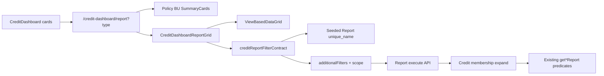

# Credit dashboard detail lists → ViewBased reports

## Locked decisions (grilling)

- Convert existing credit detail lists to ViewBased + seeded system reports (not portfolio-health, not new chart drills).
- Full conversion including mark / bulk-mark / bulk-export for `reporting` / `reported`.
- All 11 types in one delivery: `overdue`, `capacity`, `terms`, `policy_risk`, `reporting`, `reported`, `limit_warning`, `zero_limit_warning`, `top_up`, `top_up_expiring`, `no_policy_exposure`.
- Two contexts: `dashboard_credit_customers` + `dashboard_credit_invoices`; route picks context from `type`.
- Exact KPI membership parity via locked filters (reuse today’s report services).
- Keep `/credit-dashboard/report?type=…` URL, policy/BU filters, and [CreditReportSummaryCards](app/[locale]/app/credit-dashboard/report/CreditReportSummaryCards.tsx).
- Lock report switcher to the URL `type` (auto-select matching seeded report; no cross-type switching).

## Target architecture

**Grain mapping (from current list services):**

| Context | Types |
|---------|--------|
| `dashboard_credit_customers` | `overdue`, `capacity`, `policy_risk`, `limit_warning`, `zero_limit_warning`, `top_up`, `top_up_expiring`, `no_policy_exposure` |
| `dashboard_credit_invoices` | `terms`, `reporting`, `reported` |

## Implementation approach

### 1. Filter contract (client) — mirror financial/ops

Add [shared/dashboard/creditDashboardReportFilters.ts](shared/dashboard/creditDashboardReportFilters.ts) (and thin helpers if needed):

- Map `type` → `context`, `systemReportUniqueName`, base `additionalFilters`.
- Carry scope already on the page: `policyId`, `businessUnitId`, `customerId`, `includeNoPolicyExposure`, `termsBreachReason`, `termsOverdueOnly`, top-up `withinDays` / reason when present.
- Prefer expressible Report filters where they match today’s predicates (e.g. `overdue_block = true` for overdue).
- For complex membership (capacity gap, terms breach reasons, reporting countdown window, top-up cover/expiry, policy risk allocation): use **credit filter markers** expanded server-side (same idea as [shared/dashboard/dashboardActivityChartFilters.ts](shared/dashboard/dashboardActivityChartFilters.ts) + execute-scope expanders), calling into refactored membership logic from:
  - [creditInsuranceDashboardService.ts](server/services/creditInsurance/creditInsuranceDashboardService.ts) (`getOverdueBlockReport`, `getCapacityGapReport`, `getTermsBreachReport`, `getReportingCountdownOpenReport`, `getReportedInvoicesReport`, `getLimitWarningReport`, `getZeroLimitWarningReport`, `getPolicyRiskExposureReport`, `getNoPolicyExposureReport`)
  - [creditInsuranceTopUpDashboardService.ts](server/services/creditInsurance/creditInsuranceTopUpDashboardService.ts) (`getTopUpCoverReport`, `getTopUpExpiringReport`)

Refactor those services so membership `where` / ID resolution is shared by (a) legacy API if still needed briefly and (b) report-execute expansion—avoid duplicating KPI rules.

### 2. Seeded system reports

- New SQL seeds (pattern of [scripts/database/create-dashboard-customers-reports.sql](scripts/database/create-dashboard-customers-reports.sql)):
  - `scripts/database/create-dashboard-credit-customers-reports.sql`
  - `scripts/database/create-dashboard-credit-invoices-reports.sql`
- One system report per `type` with `unique_name` like `dashboard_credit_customers_overdue`, `dashboard_credit_invoices_reporting`, etc.
- `report_config.fields` / sorting aligned to today’s columns in [CreditInsuranceReportGrid.tsx](app/[locale]/app/credit-dashboard/report/CreditInsuranceReportGrid.tsx) where Report metadata supports them; first visible column ASC (or current DEFAULT_SORT) as seed `sorting`.
- Upsert for all accounts; ensure new-account copy path includes these contexts (same as other dashboard seeds / account 10013 sync).

### 3. View configs + ViewBased wiring

- Extend [shared/utils/viewConfigs.ts](shared/utils/viewConfigs.ts) with `dashboard_credit_customers` and `dashboard_credit_invoices` (linkHandlers for customer/invoice, defaultSort, fieldMappings as needed). Mark as dashboard contexts (not main Reports menu)—extend [isFinancialDashboardReportContext](shared/dashboard/dashboardInvoiceBuilderReturn.ts) / chart-details helpers **or** add a sibling `isCreditDashboardReportContext` so builder return / permissions behave correctly without listing them on the main reports menu.
- Replace grid body on [report/page.tsx](app/[locale]/app/credit-dashboard/report/page.tsx): keep header, policy/BU, summary cards; swap `CreditInsuranceReportGrid` for a new wrapper (e.g. `CreditDashboardReportViewGrid.tsx`) that:
  - Resolves system report id by `unique_name` (same pattern as [DashboardInvoiceChartDetailsGrid.tsx](app/[locale]/app/dashboard/chart-details/DashboardInvoiceChartDetailsGrid.tsx)).
  - Passes `defaultViewId`, `additionalFilters`, `businessUnitId`, search.
  - Sets `allowAddEditViews={false}` and **hides report selector** (add optional `reportSelector` prop to [ViewBasedDataGrid.tsx](shared/components/ViewBasedDataGrid/ViewBasedDataGrid.tsx); today it is hard-coded `true`).
- For `reporting` / `reported`: pass `bulkActionButton` and re-use [BulkMarkInvoicesReportedDialog.tsx](app/[locale]/app/credit-dashboard/report/BulkMarkInvoicesReportedDialog.tsx) + existing mark/bulk APIs; keep row-level mark action via custom column or toolbar if ViewBased column generator cannot host it—prefer extending column generation / row actions only where required.

### 4. Computed columns (parity risk)

Today’s grid shows KPI fields that are not always plain DB columns (e.g. capacity gap amounts, top-up days left, allocated policy risk). Plan of record:

- Prefer existing reportable Customer/Invoice fields already in report metadata.
- Where a column is computed-only, either (a) add a focused report-field formatter/handler if one already exists for that domain, or (b) keep a **narrow post-enrichment** path for those columns only—do not keep the full EndlessScroll custom grid.
- Document any unavoidable column gap in the PR description; do not silently drop mark-reported UX.

### 5. Deprecate / retire

- Stop using [pages/api/credit-insurance/report.ts](pages/api/credit-insurance/report.ts) for the detail page once ViewBased path is live (keep temporarily behind feature flag only if cutover needs it; default plan: switch page fully, leave API only if other callers exist—grep and remove or mark internal if unused).
- Delete or gut [CreditInsuranceReportGrid.tsx](app/[locale]/app/credit-dashboard/report/CreditInsuranceReportGrid.tsx) after parity; keep summary cards + dialogs.

### 6. Out of scope (unless requested)

- New drills from Policy Limits Usage / top-customer trend / health gauge.
- Portfolio health page reports.
- Migrating main report-builder menu to include these contexts.
- Translation file edits beyond keys already used (reuse existing `credit_insurance_report.*` / dashboard titles).

## Codebase scan

**Required**

- [app/[locale]/app/credit-dashboard/report/page.tsx](app/[locale]/app/credit-dashboard/report/page.tsx) — wire ViewBased wrapper.
- New: credit filter contract + execute-scope expander(s).
- [shared/utils/viewConfigs.ts](shared/utils/viewConfigs.ts) — two new contexts.
- [ViewBasedDataGrid.tsx](shared/components/ViewBasedDataGrid/ViewBasedDataGrid.tsx) — optional `reportSelector` prop.
- Seed SQL ×2 + run/upsert for accounts.
- Report execute path hooks for credit markers / BU / policy scope.
- Membership refactor touchpoints in creditInsurance* dashboard services.
- Unit tests for filter contract + membership expanders; grid wiring tests if pattern exists for invoice chart-details.

**Optional / out of scope**

- Chart-details return helpers for credit (no builder return from this page if `allowAddEditViews={false}`).
- New i18n keys if titles reuse existing ones.
- Removing `/api/credit-insurance/report` if still used by scripts/tests—clean up only after grep.

**No change needed**

- [CreditDashboardScreen.tsx](app/[locale]/app/credit-dashboard/CreditDashboardScreen.tsx) card `reportHref` URLs (same path/query).
- [CreditReportSummaryCards.tsx](app/[locale]/app/credit-dashboard/report/CreditReportSummaryCards.tsx) (keep as-is).
- Prisma schema (no new tables).

## Testing strategy

- Unit: `creditDashboardReportFilters` maps each `type` → context + unique_name; marker expansion matches legacy membership for fixture rows (at least overdue, terms, reporting, capacity, top_up).
- Unit/regression: mark-reported bulk still posts to existing APIs with selected invoice ids from ViewBased selection.
- Manual: each dashboard card → report page shows same cohort under current policy/BU; report dropdown locked; export works; summary cards unchanged.

## Suggest improvements (out of scope unless requested)

- Phase vertical-slice first (`overdue` + `reporting`) if delivery risk is high—user chose all types at once.
- Align credit contexts into `isDashboardChartDetailsReportContext` naming more generically (“dashboard report contexts”).
- Later: drill from Policy Limits Usage bars into Named/DCL customer reports.
