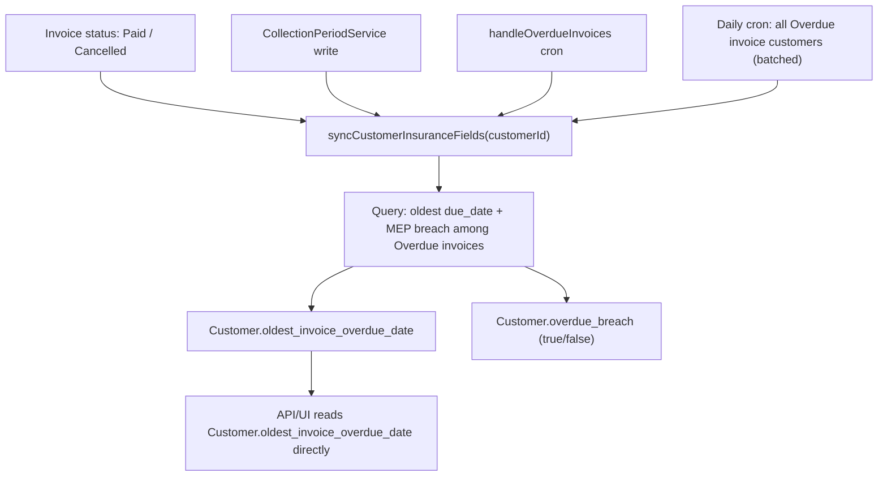
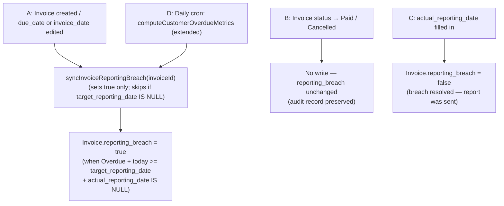

# Credit insurance: data model, UI, and jobs

## Source alignment: `data levels.xlsx`

The workbook defines three layers that map cleanly to your schema:

- **Policy level** (`[c:/Users/nilot/OneDrive/Desktop/data levels.xlsx](file:///c:/Users/nilot/OneDrive/Desktop/data%20levels.xlsx)`): policy dates, max total cover vs open AR, currency, min credit score, score validity (months), max DCL, then **regional safety floor** parameters per country (limit cap, terms cap, reporting, capacity).
- **Customer level**: policy reference, approved limit, limit source (Named vs DCL), max payment term, max MEP, reporting window, AR and gap math, MEP breach, exclusion from policy.
- **Invoice level**: target reporting date, target MEP date, payment term (credit days), reporting/MEP breach indicators, rule-engine notes (max term vs credit days, MEP vs max overdue, capacity/gap).

Note: `reporting_breach` is now a **persisted field on `Invoice`** (same pattern as `overdue_breach` on `Customer`), not a derived attribute. It is written by event hooks and a daily sweep — see section 3B.

---

## 1. Database (Prisma)

**File:** `[prisma/schema.prisma](prisma/schema.prisma)`

### New enums

- `customer_limit_type`: `DCL`, `Named` (matches workbook "Limit source").
- `invoice_reported_status`: `Reported`, `Acknowledge_Received` — spelling locked. Do not change to "Acknowledged_Received"; use `Acknowledge_Received` consistently in schema, API, import validation, and UI labels.

**Policy currency (not an enum):** Store `InsurancePolicy.currency` as a **string** (e.g. `String? @db.VarChar(3)` or slightly longer if you need non-ISO symbols), same spirit as `[Account.currency](prisma/schema.prisma)`. **Any** ISO or display currency code the account uses is allowed—validate lightly in the API (non-empty when policy is active) rather than hard-coding a closed list.

### `InsurancePolicy`

- `id`, `account_id` → `Account`, `policy_number`, `start_date`, `end_date` (`DateTime @db.Date`), `currency` (string, any currency), `max_total_cover` (`Decimal(20,4)`), `min_credit_score` (`Decimal(10,2)`), `score_validity_period_months` (`Int`), `max_dcl` (`Decimal(20,4)`).
- `**status record_status @default(Active)`** — reuses the existing enum to deactivate a policy without deleting it.
- Audit fields (matching schema convention): `created_at` (`DateTime @default(now())`), `modified_at` (`DateTime @updatedAt`), `created_by` (`String? @db.VarChar`), `modified_by` (`String? @db.VarChar`), plus `User` FK relations for both (`onDelete: NoAction, onUpdate: NoAction`).
- Relation: `Account` has many `InsurancePolicy`; optional reverse on `Customer` via `policy_id`.

Indexes: `[account_id]`, `[account_id, policy_number]` (unique if business requires unique policy numbers per account), `[created_by]`, `[modified_by]`.

### `InsurancePolicyCountry`

- `**id String @id @default(uuid()) @db.Uuid`** — surrogate primary key, consistent with other entities and required for standard Prisma CRUD and API route patterns (`entities/insurance-policy-countries/:id`).
- `insurance_policy_id` → `InsurancePolicy`, `country_id` → `Country`.
- `payment_term_cap` (`Int?`), `country_mep` (`Int?`), `reporting_days` (`Int?`), `country_max_limit` (`Decimal(20,4)?`).
- Audit fields (same convention): `created_at`, `modified_at`, `created_by` (`String? @db.VarChar`), `modified_by` (`String? @db.VarChar`), plus `User` FK relations for both.
- `@@unique([insurance_policy_id, country_id])` to enforce one row per country per policy.
- Indexes: `[insurance_policy_id]` (for efficient "all countries for this policy" queries), `[created_by]`, `[modified_by]`.

**API handlers** must set `created_by` / `modified_by` from the session user id on create/update, consistent with other entity routes.

### `Customer` extensions

- `policy_id` → `InsurancePolicy?` (nullable; validate `InsurancePolicy.account_id === Customer.account_id` in service layer).
- `approved_limit` (`Decimal(20,4)?`), `limit_type` (`customer_limit_type?`), `max_payment_term` (`Int?`), `max_allowed_mep` (`Int?`), `reporting_days` (`Int?`).
- `excluded_from_policy` (`Boolean @default(false)`), `policy_exclusion_reason` (`String?`).
- `**oldest_invoice_overdue_date` (`DateTime? @db.Timestamp(6)`)** — moved from `CustomerCollectionPeriod` (where it existed at line 865 of `[prisma/schema.prisma](prisma/schema.prisma)`) to `Customer` as the single authoritative source. The field is now derived directly from `Invoice` records (oldest `due_date` among `Overdue` invoices) rather than maintained on the collection period. `CustomerCollectionPeriod.oldest_invoice_overdue_date` is **removed** from the schema. All existing code that reads the field from the collection period is updated to read from `Customer.oldest_invoice_overdue_date` instead (see section 3 for the full list of affected files). **Type note:** The existing `CustomerCollectionPeriod.oldest_invoice_overdue_date` is already `@db.Timestamp(6)`; keeping the same type on `Customer` avoids a cast during the data migration that copies values across.
- `**overdue_breach` (`Boolean @default(false)`)** — persisted field. Set to `true` when the customer has at least one `Overdue` invoice whose `target_mep_date <= today`. Set to `false` when no such invoice remains (all are paid, cancelled, or have a future `target_mep_date`). Maintained for **all accounts** regardless of `has_credit_insurance` — the field is not gated on the credit insurance product. Updated by both the daily cron and the invoice paid/cancelled event path. See section 3 for the full update logic.
- `**total_ar`**: No DB column—computed as `(coalesce(total_due_amount,0) + coalesce(total_overdue_amount,0))`. Define as a single shared helper (e.g. `computeCustomerTotalAr(customer)`) in `[server/services/CustomerService.ts](server/services/CustomerService.ts)`; never inline ad-hoc. **Type note:** `total_due_amount` and `total_overdue_amount` are stored as `Float?` in the schema. Before computing `uninsured_amount = total_ar - approved_limit` (where `approved_limit` is `Decimal(20,4)`), cast both Float values to `Decimal` (e.g. via `new Decimal(total_due_amount ?? 0)`) to avoid floating-point drift in financial arithmetic.

`**Customer.reporting_days` auto-population rule:** When a customer is assigned (or re-assigned) to a policy via `policy_id`, the service must look up the `InsurancePolicyCountry` row matching `(policy_id, customer.country_id)` and copy its values into the customer record as initial defaults:


| `InsurancePolicyCountry` field | Copies into `Customer` field |
| ------------------------------ | ---------------------------- |
| `reporting_days`               | `reporting_days`             |
| `payment_term_cap`             | `max_payment_term`           |
| `country_mep`                  | `max_allowed_mep`            |


These fields remain **editable** on the customer after assignment; auto-population only fires on policy assignment, not on every subsequent save. If no matching `InsurancePolicyCountry` row exists for the customer's country, leave the customer fields unchanged.

### `Invoice` extensions

- `payment_term` (`Int?`, days).
- `target_reporting_date`, `actual_reporting_date`, `target_mep_date` (`DateTime? @db.Date`).
- `reported_status` (`invoice_reported_status?`).
- `**reporting_breach` (`Boolean @default(false)`)** — persisted field. Set to `true` when `status = Overdue` AND `target_reporting_date IS NOT NULL` AND `today >= target_reporting_date` AND `actual_reporting_date IS NULL`. **Once `true`, it is never automatically cleared** — it serves as a permanent audit record that the reporting deadline was missed. The only way to clear it is when `actual_reporting_date` is filled in (report was eventually sent). A Paid or Cancelled invoice retains `reporting_breach = true` if it was already set, as historical evidence that the breach occurred. Maintained by event hooks and the daily cron — see section 3B.

Add indexes used by the cron query, e.g. `[status, target_mep_date]`, `[status, target_reporting_date]`, `[customer_id, status]`.

**Migration:** After schema edits, create a migration via your normal approved process (workspace rules restrict auto-running destructive migrate commands; treat migration SQL as a review artifact).

---

## 2. Domain rules (single implementation surface)

Add a small module, e.g. `server/services/creditInsurance/invoiceInsuranceFields.ts` (or colocate helpers in `[server/services/InvoiceService.ts](server/services/InvoiceService.ts)` if you prefer fewer files), containing **pure functions**:


| Rule                                          | Definition                                                                                                                                                                                                                                                                                                                                                                    |
| --------------------------------------------- | ----------------------------------------------------------------------------------------------------------------------------------------------------------------------------------------------------------------------------------------------------------------------------------------------------------------------------------------------------------------------------- |
| `payment_term`                                | If missing on create/update: `differenceInCalendarDays(due_date, invoice_date)` (confirm calendar vs business days with product; workbook implies **credit days** from issue to due).                                                                                                                                                                                         |
| `target_reporting_date`                       | `due_date + customer.reporting_days` (calendar days).                                                                                                                                                                                                                                                                                                                         |
| `target_mep_date`                             | `due_date + customer.max_allowed_mep` (calendar days).                                                                                                                                                                                                                                                                                                                        |
| `reporting_breach` (persisted, invoice-level) | Set to `true` when `status = Overdue` AND `target_reporting_date IS NOT NULL` AND `today >= target_reporting_date` AND `actual_reporting_date IS NULL`. **Never cleared by a status change** (Paid/Cancelled invoices retain `true` as an audit record). Only cleared when `actual_reporting_date` is filled in. Maintained by `syncInvoiceReportingBreach` — see section 3B. |
| `overdue_breach` (persisted, customer-level)  | `true` when customer has at least one `Overdue` invoice where `target_mep_date <= today`. Maintained by `syncCustomerInsuranceFields` — see section 3A. Not recomputed on every API read; read directly from `Customer.overdue_breach`.                                                                                                                                       |
| `uninsured_amount` (computed, customer-level) | `total_ar - approved_limit` (handle nulls; cast `Float` fields to `Decimal` before arithmetic). Result is clamped to `0` in the UI if negative (see section 6). Derived at read time; not stored.                                                                                                                                                                             |


Call these helpers from:

- `[server/services/InvoiceService.ts](server/services/InvoiceService.ts)` — `**createMany`** path where `Invoicecreated_ata` is built (~351+), and any **single-invoice create/update** paths (import in `[pages/api/import/[...path].ts](pages/api/import/[...path].ts)` uses Prisma `invoice.create`—include the same helper).
- `[server/services/InvoiceService.ts](server/services/InvoiceService.ts)` — status transitions (existing `handleInvoiceChange` / paid flows ~1180+): when status becomes **Paid** or **Cancelled**, trigger sync of `Customer.oldest_invoice_overdue_date`.

**Invoice date edits post-creation:** If `due_date` or `invoice_date` is updated on an existing invoice (via PATCH), re-run the same date helpers to recalculate `payment_term`, `target_reporting_date`, and `target_mep_date`. Then re-evaluate `reporting_breach` via `syncInvoiceReportingBreach`. Add this re-calculation to the invoice update path in `InvoiceService` alongside the create path.

**Customer `reporting_days` / `max_allowed_mep` edits (decision locked):** If a user edits `reporting_days`, `max_payment_term`, or `max_allowed_mep` on the customer, **existing open invoices are not retroactively recalculated**. The change applies only to invoices created after the update. Document this as a business rule in the UI (tooltip or helper text on the customer fields).

**Terms breach (workbook row 49):** Optional validation: if `payment_term > customer.max_payment_term`, expose as derived "terms breach" in UI or validation—only if product wants hard blocks vs warnings.

---

## 3. Persisted breach field maintenance

Two persisted breach fields are maintained across the system: `Customer.overdue_breach` (section 3A) and `Invoice.reporting_breach` (section 3B). Both are unconditional — they are maintained for all accounts regardless of `has_credit_insurance`.

## 3A. `Customer.oldest_invoice_overdue_date` and `overdue_breach` maintenance

### Schema change: field moves from `CustomerCollectionPeriod` to `Customer`

`oldest_invoice_overdue_date` currently lives on `CustomerCollectionPeriod` (line 865 of `[prisma/schema.prisma](prisma/schema.prisma)`) and is read throughout the codebase. The field is **moved** to `Customer` as the single authoritative source. `CustomerCollectionPeriod.oldest_invoice_overdue_date` is **removed** from the schema.

**Files that must be updated to read from `Customer` instead of `CustomerCollectionPeriod`:**


| File                                                                                                                       | Current usage                                                                                                                                                         | Change                                                                                                       |
| -------------------------------------------------------------------------------------------------------------------------- | --------------------------------------------------------------------------------------------------------------------------------------------------------------------- | ------------------------------------------------------------------------------------------------------------ |
| `[pages/api/system/[...path].ts](pages/api/system/[...path].ts)`                                                           | ~3320, ~3558: read from `collectionPeriod?.oldest_invoice_overdue_date`; ~6099: sort on collection period field; ~7122/7136: `effectiveOldestOverdueDate` from period | Read from `customer.oldest_invoice_overdue_date` directly; update sort to reference `Customer` relation      |
| `[pages/api/entities/[...path].ts](pages/api/entities/[...path].ts)`                                                       | ~4104, ~4791: selected inside `CustomerCollectionPeriod` include                                                                                                      | Move selection to top-level `Customer` select                                                                |
| `[pages/api/operations/[...path].ts](pages/api/operations/[...path].ts)`                                                   | ~1468: sort on `oldest_invoice_overdue_date` inside collection period; ~1792: read from `collectionPeriod?.oldest_invoice_overdue_date`                               | Sort on `Customer.oldest_invoice_overdue_date`; read from customer directly                                  |
| `[server/cron-jobs/handleOverdueInvoices.ts](server/cron-jobs/handleOverdueInvoices.ts)`                                   | ~97: select field; ~135: read value; ~143: write `oldest_invoice_overdue_date` to `CustomerCollectionPeriod.update`                                                   | Remove select/write to collection period; write to `Customer` instead via `syncCustomerInsuranceFields`      |
| `[server/services/CollectionPeriodService.ts](server/services/CollectionPeriodService.ts)`                                 | ~483–556: select, read, and write `oldest_invoice_overdue_date` on collection period                                                                                  | Remove field from collection period read/write; call `syncCustomerInsuranceFields` after computing the value |
| `[server/services/ActivityService.ts](server/services/ActivityService.ts)`                                                 | ~5564: sets `oldest_invoice_overdue_date: null` on collection period                                                                                                  | Remove this field from the collection period update                                                          |
| `[shared/services/dashboardService.ts](shared/services/dashboardService.ts)`                                               | ~1314, ~1746, ~1772, ~1799, ~1825, ~1850: selected inside collection period includes                                                                                  | Move to select on `Customer` directly or join through `Customer` relation                                    |
| `[types/CustomerCollectionPeriod.ts](types/CustomerCollectionPeriod.ts)`                                                   | ~37: `oldest_invoice_overdue_date?: Date`                                                                                                                             | Remove from this type                                                                                        |
| `[types/Customer.ts](types/Customer.ts)`                                                                                   | ~92: `oldest_invoice_overdue_date: true` inside `CustomerCollectionPeriod` select                                                                                     | Move to top-level `Customer` select                                                                          |
| `[app/[locale]/app/customers/[customerId]/CustomerHeader.tsx](app/[locale]/app/customers/[customerId]/CustomerHeader.tsx)` | ~75: field on collection period interface; ~1729–1754: reads from `customer.CustomerCollectionPeriod[0].oldest_invoice_overdue_date`                                  | Read from `customer.oldest_invoice_overdue_date` directly                                                    |
| `[app/[locale]/app/agents/AgentList.tsx](app/[locale]/app/agents/AgentList.tsx)`                                           | ~605, ~783: `agent?.oldest_invoice_overdue_date` (already on agent/customer object)                                                                                   | Verify the field comes through on the customer payload; update if still reading via collection period        |
| `[app/[locale]/app/promise-to-pay/PromiseToPayList.tsx](app/[locale]/app/promise-to-pay/PromiseToPayList.tsx)`             | ~227: `item?.oldest_invoice_overdue_date`                                                                                                                             | Verify source; update if reading via collection period                                                       |


### Shared helper: `syncCustomerInsuranceFields(customerId)`

Add this function to `[server/services/CustomerService.ts](server/services/CustomerService.ts)`. It performs a single `prisma.customer.update` that sets both fields atomically, computing `oldest_invoice_overdue_date` directly from `Invoice` records rather than mirroring from `CustomerCollectionPeriod`:

1. Query the oldest `due_date` among all invoices with `status = Overdue` for the customer.
2. Check whether the customer has **any** invoice with `status = Overdue` where `target_mep_date <= today`.
3. Write to `Customer`:
  - `oldest_invoice_overdue_date` ← oldest `due_date` from step 1 (or `null` if no `Overdue` invoices remain).
  - `overdue_breach` ← `true` if step 2 found at least one such invoice, otherwise `false`.

Note: `Due` invoices are included in `total_ar` (via `total_due_amount`) but do **not** contribute to `oldest_invoice_overdue_date` or `overdue_breach` — those fields are driven by `Overdue` status only.

**Product flag: the helper is unconditional.** `syncCustomerInsuranceFields` is called regardless of whether the account has `has_credit_insurance` enabled. The fields `oldest_invoice_overdue_date` and `overdue_breach` live on `Customer` for all accounts; `has_credit_insurance` only controls UI visibility and policy-related API endpoints, never whether these fields are maintained. This ensures:

- Accounts with only the **collection product** still get accurate `oldest_invoice_overdue_date` (which was already being used in the collection UI — e.g. `CustomerHeader.tsx`, `AgentList.tsx`, `PromiseToPayList.tsx`).
- If an account later enables credit insurance, the fields are already populated with correct historical data.
- There is no conditional branch or guard around the helper call at any of its call sites.

Because the field is now derived directly from `Invoice`, there is no longer a dependency on `CustomerCollectionPeriod` for this value.

### A. Event-driven: invoice paid or cancelled

When an invoice status transitions to **Paid** or **Cancelled** (in `[server/services/InvoiceService.ts](server/services/InvoiceService.ts)` `handleInvoiceChange` / paid flows ~1180+), call `syncCustomerInsuranceFields(customerId)` **unconditionally** — no `has_credit_insurance` guard. The helper re-evaluates both fields from live `Invoice` data:

- `oldest_invoice_overdue_date` updates to the next oldest overdue invoice's due date (or `null` if none remain).
- `overdue_breach` clears to `false` if no remaining `Overdue` invoice has `target_mep_date <= today`, or stays `true` if another invoice still qualifies.

### B. Event-driven: `CollectionPeriodService` write

Wherever `CollectionPeriodService` currently writes `oldest_invoice_overdue_date` to the collection period (lines ~488–556), replace that write with a call to `syncCustomerInsuranceFields(customerId)` **unconditionally**. The collection period update itself no longer includes `oldest_invoice_overdue_date`.

### C. Event-driven: `handleOverdueInvoices` cron

In `[server/cron-jobs/handleOverdueInvoices.ts](server/cron-jobs/handleOverdueInvoices.ts)`, the existing `refreshOldestOverdueDateForOpenPeriods` function (~~line 86) already queries `Invoice` grouped by `customer_id` and computes the oldest `due_date`. Replace the per-period `CustomerCollectionPeriod.update` (~~line 143) with a call to `syncCustomerInsuranceFields(customerId)` for each affected customer — **unconditionally**, regardless of product flags.

### D. Daily cron (workbook "Once a day") — broad sweep

The cron runs once a day and **recomputes both fields for every customer that has at least one `Overdue` invoice**, not just those hitting the MEP boundary today. This makes both fields self-healing for **all accounts**, not just credit insurance accounts.

- Implement `server/cron-jobs/computeCustomerOverdueMetrics.ts` that:
  1. Queries distinct `customer_id` from `Invoice` where `status = Overdue` (locked open status for breach tracking; `Due` invoices are excluded from this sweep). Paginated in batches of ~500. **No filter on `has_credit_insurance`.**
  2. For each customer, calls `syncCustomerInsuranceFields(customerId)`.
  3. Logs counts: customers processed, `oldest_invoice_overdue_date` updated, `overdue_breach` flipped to true, flipped to false, skipped (already correct).

**Register** in `[server/services/cronManager.ts](server/services/cronManager.ts)` with a new `case "..."` branch (same pattern as `"Process Overdue Invoices"` ~1274).

**Seed `CronJob` row** (SQL or admin script): daily schedule, name stable for the switch case.




---

## 3B. `Invoice.reporting_breach` maintenance

### Shared helper: `syncInvoiceReportingBreach(invoiceId)` or batch variant

Add a helper in `[server/services/InvoiceService.ts](server/services/InvoiceService.ts)` (or the credit insurance module). It evaluates whether `reporting_breach` should be set to `true`:

- Set to `true` if `status = Overdue` AND `target_reporting_date IS NOT NULL` AND `today >= target_reporting_date` AND `actual_reporting_date IS NULL`.
- **Only set to `false` when `actual_reporting_date` is filled in** — a Paid or Cancelled invoice that already has `reporting_breach = true` retains that value permanently as an audit record. The helper must **never** clear `reporting_breach` based on status alone.

`**target_reporting_date IS NULL` shortcut:** If `target_reporting_date` is `null` (the customer has no `reporting_days` set, i.e. not assigned to a policy), `reporting_breach` stays `false` and no DB write is needed. The helper returns early without touching the invoice in this case.

**Product flag: unconditional** — same rule as `overdue_breach`; no `has_credit_insurance` guard at any call site.

### Triggers that write `reporting_breach`

**A. On invoice create** (in `InvoiceService.createMany` / import / single-create paths):
After computing `target_reporting_date` and `target_mep_date`, evaluate and write `reporting_breach` immediately in the same insert/update. If the invoice is imported with a past `target_reporting_date` and no `actual_reporting_date`, it may already be `true` on creation.

**B. On invoice status change to Paid or Cancelled** (in `handleInvoiceChange` ~1180+):
**Do not touch `reporting_breach`.** If it was already `true`, it remains `true` as a permanent audit record that the reporting deadline was breached before the invoice was closed. No write is needed on this path for `reporting_breach`.

**C. On `actual_reporting_date` set** (any PATCH that fills in `actual_reporting_date`):
Set `reporting_breach = false` — the report was eventually sent, so the breach is resolved. This is the **only** trigger that clears `reporting_breach`. Setting `reported_status` alone does **not** clear it; `actual_reporting_date` must be non-null.

**D. Daily cron — `computeCustomerOverdueMetrics.ts`** (extended scope):
The existing daily cron already sweeps all customers with `Overdue` invoices. **Extend it** to also re-evaluate `reporting_breach` for every `Overdue` invoice in the batch:

1. For each customer's `Overdue` invoices where `target_reporting_date IS NOT NULL` AND `actual_reporting_date IS NULL`, check if `today >= target_reporting_date`.
2. Write `reporting_breach = true` where the condition holds. Do **not** set `false` here — the cron only promotes breaches, never clears them (clearing is solely via `actual_reporting_date` being filled in).

This keeps both breach fields self-healing in a single daily job without a separate cron.




---

## 4. API layer

- Extend customer **GET** serializers used by `[CustomerDetailsCombined.tsx](app/[locale]/app/customers/[customerId]/CustomerDetailsCombined.tsx)` / `[pages/api/entities/[...path].ts](pages/api/entities/[...path].ts)` to include all new policy fields plus: `overdue_breach` and `oldest_invoice_overdue_date` (read directly from `Customer`), and **computed at serialization time**: `total_ar`, `uninsured_amount`.
- Extend invoice payloads with new columns including `reporting_breach` and `overdue_breach` — both read directly from the DB, not computed at serialization time.
- Add **CRUD** endpoints for `InsurancePolicy` and nested `InsurancePolicyCountry` (new route group or extend `entities` with clear paths). Enforce account scoping (`has_credit_insurance` flag) on all operations. Require the `**manage_insurance_policy`** permission (new permission, to be seeded alongside other permissions) on all write operations (create, update, delete) for both `InsurancePolicy` and `InsurancePolicyCountry`. Read operations (`GET`) require `view_settings` or `manage_insurance_policy`. Add `manage_insurance_policy` to the relevant admin role seeds and the permissions type definitions.
- `**account_id` cross-reference validation (required in all three write paths):** Whenever a `policy_id` is written to a `Customer` (via API PATCH, import row, or auto-population on policy assignment), the service layer must verify that `InsurancePolicy.account_id === Customer.account_id`. Reject the write with a validation error if they differ. This check must be present in: (a) the customer entity PATCH handler in `[pages/api/entities/[...path].ts](pages/api/entities/[...path].ts)`, (b) the customer import row handler in `[pages/api/import/[...path].ts](pages/api/import/[...path].ts)`, and (c) the auto-population helper that fires on policy assignment.
- No policy-scoped customer list endpoint is needed. The policy is visible and editable on the **customer page** via the `policy_id` field (Customer General tab, section 5). Users navigate from the customer record to view or change policy assignment, and manage exclusion (`excluded_from_policy`, `policy_exclusion_reason`) directly on the customer. The existing customer list (`GET /api/entities/customers`) already supports filtering—add `policy_id` as an optional filter parameter so users can filter the customer list by policy from the customer list view if needed.
- On customer **PATCH/PUT** when `policy_id` changes: run the auto-population logic for `reporting_days`, `max_payment_term`, `max_allowed_mep` (after the cross-reference check passes).

---

## 5. Import pipeline

The existing import pipeline (`[pages/api/import/[...path].ts](pages/api/import/[...path].ts)`) handles customer and invoice ingestion. The new fields require explicit decisions per entity:

### Customer import

**In scope for v1 — include in importer:**


| Field                     | Import behaviour                                                                                                                                                                                                                                                                                                               |
| ------------------------- | ------------------------------------------------------------------------------------------------------------------------------------------------------------------------------------------------------------------------------------------------------------------------------------------------------------------------------ |
| `policy_id`               | Accept `policy_number` as the import column; resolve to `InsurancePolicy.id` by looking up `(account_id, policy_number)`; only accept `Active` policies. Validate that `InsurancePolicy.account_id === Customer.account_id` (cross-reference check). If not found or account mismatch, treat as a validation error on the row. |
| `approved_limit`          | Accept as decimal; store as-is.                                                                                                                                                                                                                                                                                                |
| `limit_type`              | Accept `DCL` or `Named` (case-insensitive); reject other values.                                                                                                                                                                                                                                                               |
| `max_payment_term`        | Accept as integer (days).                                                                                                                                                                                                                                                                                                      |
| `max_allowed_mep`         | Accept as integer (days).                                                                                                                                                                                                                                                                                                      |
| `reporting_days`          | Accept as integer (days). If `policy_id` is also provided and a matching `InsurancePolicyCountry` row exists, the importer applies the same auto-population rule as the API — country defaults are pre-filled, then overridden by any explicit value in the import row.                                                        |
| `excluded_from_policy`    | Accept boolean (`true`/`false`, `1`/`0`, `yes`/`no`).                                                                                                                                                                                                                                                                          |
| `policy_exclusion_reason` | Accept as free text.                                                                                                                                                                                                                                                                                                           |


**Out of scope for v1 (import not supported):**

- `oldest_invoice_overdue_date` — always derived by `syncCustomerInsuranceFields`, never imported.
- `overdue_breach` — always derived by `syncCustomerInsuranceFields`, never imported.

After a customer import row is saved, call `syncCustomerInsuranceFields(customerId)` unconditionally (same as any other customer create/update path).

**Post-import cron trigger:** After a full import batch completes (all customer rows processed), trigger a run of `computeCustomerOverdueMetrics` to ensure `oldest_invoice_overdue_date`, `overdue_breach`, and `reporting_breach` are fully consistent for all affected customers — including any whose invoice data was imported in the same batch. This covers the case where `syncCustomerInsuranceFields` per-row is insufficient because invoice rows may be imported after customer rows in the same batch.

### Invoice import

**In scope for v1 — include in importer:**


| Field                   | Import behaviour                                                                                                                                             |
| ----------------------- | ------------------------------------------------------------------------------------------------------------------------------------------------------------ |
| `payment_term`          | Accept as integer (days). If absent or `null`, calculate as `differenceInCalendarDays(due_date, invoice_date)` using the same helper as the API create path. |
| `target_reporting_date` | Calculated server-side from `due_date + customer.reporting_days`; **not accepted as an import column** — always derived.                                     |
| `target_mep_date`       | Calculated server-side from `due_date + customer.max_allowed_mep`; **not accepted as an import column** — always derived.                                    |
| `actual_reporting_date` | Accept as a date column (allows backdating for historical imports).                                                                                          |
| `reported_status`       | Accept `Reported` or `Acknowledge_Received` (exact enum values, case-insensitive match on import); reject other values.                                      |


**Out of scope for v1:**

- `reporting_breach`, `overdue_breach` — always server-managed (persisted breach flags); never imported directly. After import, the create-path logic sets `reporting_breach` immediately if conditions are met.

The existing `InvoiceService.createMany` path is already the target for these calculations (section 2), so the import pipeline picks them up automatically once the helpers are integrated there.

---

## 6. UI

### Settings: new tab

**File:** `[app/[locale]/app/settings/page.tsx](app/[locale]/app/settings/page.tsx)`

- Add a new `tab` key (e.g. `creditInsurance`) and insert a **Tab** + `TabPanel` after existing tabs (today logical indices run through `genericFields` = 6; next would be **7**).
- Gate on (`view_settings` OR `manage_insurance_policy`) AND `has_credit_insurance` from session/account context (same pattern as customer page ~785 in `[CustomerDetailsCombined.tsx](app/[locale]/app/customers/[customerId]/CustomerDetailsCombined.tsx)`). Write actions (add/edit/delete policy or country rows) require `manage_insurance_policy`. Accounts without the credit insurance product enabled will not see the tab at all.
- New client component: list policies with status, drill-down to countries sub-grid or modal (follow patterns from `[BankAccountList.tsx](app/[locale]/app/settings/BankAccountList.tsx)` / `[BusinessUnits](app/[locale]/app/admin/accounts/[AccountId]/details/components/BusinessUnits)`).

**Translations:** Workspace rules require **explicit approval** before editing locale JSON; plan assumes new keys under `settings` / `customers` namespaces—coordinate copy with stakeholders.

### Customer: General tab

**Files:** `[app/[locale]/app/customers/[customerId]/CustomerGeneralInfo.tsx](app/[locale]/app/customers/[customerId]/CustomerGeneralInfo.tsx)` (new "Credit insurance" section), `[CustomerDetailsCombined.tsx](app/[locale]/app/customers/[customerId]/CustomerDetailsCombined.tsx)` (fetch active policies + pass as prop).

**Policy autocomplete dropdown — fetch active policies:**

In `[CustomerDetailsCombined.tsx](app/[locale]/app/customers/[customerId]/CustomerDetailsCombined.tsx)`, add a `useQuery` to fetch active policies for the account, following the same pattern as `sequenceContainers` (~~line 736) and `businessUnits` (~~line 753):

```typescript
const { data: activePoliciesData } = useQuery({
    queryKey: ["insurance-policies", customer?.account_id],
    queryFn: async () => {
        const response = await fetch(
            `/api/entities/insurance-policies?account_id=${customer?.account_id}&status=Active`
        );
        if (!response.ok) throw new Error("Failed to fetch insurance policies");
        const data = await response.json();
        return data.policies || [];
    },
    enabled: !!customer?.account_id && isCreditInsuranceAccount,
});

const activePolicies = activePoliciesData || [];
```

- Only fetched when `has_credit_insurance === true` (`isCreditInsuranceAccount` flag already derived at ~line 783 of `CustomerDetailsCombined.tsx`).
- `status=Active` filter applied server-side so expired or deactivated policies never appear in the dropdown.
- Pass `activePolicies` as a prop down to `CustomerGeneralInfo` → `CustomerFormField`, following the same prop-drilling pattern as `sequenceContainers` and `businessUnits`.

**Policy autocomplete in `[CustomerFormField.tsx](app/[locale]/app/customers/[customerId]/CustomerFormField.tsx)`:**

Add a `case "policy_id"` in the field switch, rendering an MUI `Autocomplete` with:

- `options={activePolicies}` — each option shaped as `{ id, policy_number, start_date, end_date }`.
- `getOptionLabel` showing `policy_number` (and optionally date range).
- `value` = the option matching `customer.policy_id`, or `null`.
- On change: call `onChange("policy_id", selectedPolicy?.id ?? null)` — which triggers the auto-population of `reporting_days`, `max_payment_term`, `max_allowed_mep` from the matching `InsurancePolicyCountry` row (fetched from the API on selection).

**Section fields in `CustomerGeneralInfo.tsx`:** policy selector, approved limit, limit type, max payment term, max MEP, reporting days, read-only fields: total AR, uninsured amount (display `max(0, value)` — show `0` when `approved_limit > total_ar`, i.e. customer is within limit), `oldest_invoice_overdue_date` (the raw date of the oldest overdue invoice), overdue breach indicator, exclusion checkbox + reason.

- When `policy_id` is changed in edit mode, fetch the matching `InsurancePolicyCountry` for the customer's country and pre-fill `reporting_days`, `max_payment_term`, `max_allowed_mep` in the form (user can still override before saving).
- Wire `onChange` / save to existing customer update API in `[pages/api/entities/[...path].ts](pages/api/entities/[...path].ts)`.
- Invalidate the relevant React Query keys after save so computed fields (total AR, uninsured amount, overdue breach) and persisted fields (`oldest_invoice_overdue_date`) refresh immediately.

### Invoice (optional in first slice)

If invoice detail screens exist, show new columns and read-only breach flags; otherwise API-only for imports until UI is prioritized.

---

## 7. Testing strategy (per workspace standards)


| Area                               | Tests                                                                                                                                                                                                                                                                                                                                                                                                                                                                         |
| ---------------------------------- | ----------------------------------------------------------------------------------------------------------------------------------------------------------------------------------------------------------------------------------------------------------------------------------------------------------------------------------------------------------------------------------------------------------------------------------------------------------------------------- |
| Date math                          | Unit tests: `payment_term`, `target_reporting_date`, `target_mep_date` edge cases (null due_date, DST boundaries).                                                                                                                                                                                                                                                                                                                                                            |
| Breach flags                       | Unit tests: `syncInvoiceReportingBreach` (sets `true` only; returns early when `target_reporting_date IS NULL`), `syncCustomerInsuranceFields` (`overdue_breach` and `oldest_invoice_overdue_date`) with fixed "today". Integration tests: verify `reporting_breach` is **not** cleared when invoice status → Paid/Cancelled (audit record preserved); verify it **is** cleared only when `actual_reporting_date` is set; verify it is set to `true` by the daily cron sweep. |
| `syncCustomerInsuranceFields`      | Integration: create Overdue invoices directly, call helper, assert `Customer.oldest_invoice_overdue_date` equals oldest `due_date` and `Customer.overdue_breach` is correct. Also assert `CustomerCollectionPeriod` no longer has the field.                                                                                                                                                                                                                                  |
| `overdue_breach` on paid/cancelled | Integration: customer has two Overdue invoices both past `target_mep_date`; pay one, assert `overdue_breach` stays `true`; pay the second, assert `overdue_breach` flips to `false`.                                                                                                                                                                                                                                                                                          |
| Policy assignment auto-populate    | Unit: assign policy where matching `InsurancePolicyCountry` exists and where it does not.                                                                                                                                                                                                                                                                                                                                                                                     |
| Cron job                           | Integration: seed customers with Overdue invoices (including some whose `target_mep_date` is not today), run cron, assert `Customer.oldest_invoice_overdue_date` and `Customer.overdue_breach` are updated for all of them—not just MEP-boundary ones.                                                                                                                                                                                                                        |


Use existing patterns from `[tests/integration](tests/integration)` and cron tests referencing `[server/services/cronManager.ts](server/services/cronManager.ts)`.

---

## 8. Risks and decisions to lock early

- **Open invoice statuses (locked):** `Due` and `Overdue` are the two statuses that count as "open" for insurance purposes. `Draft`, `Sent`, `Partially_Paid`, `Void`, `Under_Dispute`, `Open`, and `Cancelled` are excluded. This affects: `syncCustomerInsuranceFields` (queries `Overdue` only for `oldest_invoice_overdue_date` and `overdue_breach`), the cron sweep (targets `Overdue` invoices), `reporting_breach` (only set when `status = Overdue`), and `total_ar` (sums `total_due_amount` + `total_overdue_amount`, which corresponds to `Due` + `Overdue` invoices).
- **Timezone:** Daily job comparing `target_mep_date` to "today" should use one consistent convention (UTC vs account default).
- `**reported_status` vs `actual_reporting_date`:** Pick canonical rule: e.g. set `actual_reporting_date` when user marks Reported; keep enum in sync.
- **Country-level overrides:** Auto-population fires only on policy assignment (v1). Future enhancement could re-apply country defaults if the policy's country row is edited.
- `**score_validity_period_months`:** Stored for future credit score integration (v2). No domain rule consumes it in v1; document as future use.

