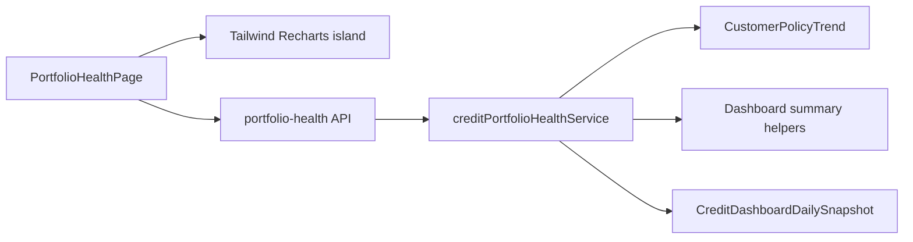

# Credit Portfolio Health Analytics Page

## Problem

Credit analysts need a period-based portfolio analytics surface (health, no coverage, utilization, cost/effectiveness). The live [`/credit-dashboard`](app/[locale]/app/credit-dashboard/page.tsx) is operational (cards, alerts, short trends) and does not expose this full KPI pack, dual Health series (with/without `Insurer declined`), or selectable from/to period math. The existing `/credit-portfolio-health` shell has Health + No Coverage on MUI/`CreditMetricCard`; Utilization/Costs are still `null`, and the page needs a premium visual redesign for demos without becoming a mock-data sales toy.

## Solution (locked decisions)

Ship (and finish) the **live** route [`/credit-portfolio-health`](app/[locale]/app/credit-portfolio-health/page.tsx) gated by `view_credit_dashboard`. **Four pill tabs** with real API data; **deductible schema deferred** (show N/A card). **Page-scoped Tailwind + Recharts island** for the dashboard body; **MUI filter toolbar** retained above tabs.

### Filters and period

- **From/to date range**, default last 30 days.
- Same three scopes as credit dashboard: **policy**, **business unit**, **include/exclude no-policy cohort**.
- **Missing days**: average only days with data; show **“N of M days available”** footnote (not an “illustrative figures” footer).
- **Percents/amounts**: mean of daily values over available days.
- **Counts**: average daily count, **1 decimal**.
- **Top-10 customers**: **as-of range end date** (reuse CPT top usage ordering by `usage_amount`).

### Cohorts (shared vocabulary)

| Name | Definition |
|------|------------|
| **Uncovered / self-underwritten** | No linked policy **OR** any exclusion reason (`isUncoveredExposureCustomer`) |
| **Approved** | Linked policy **AND** not excluded (clean DCL + Named) |
| **Health A** | Current filter scope |
| **Health B** | A minus `Insurer declined` only |
| **No Coverage KPI** | Uncovered cohort (broader than No Policy Exposure **card**) |
| **Violations** | Terms breach on **approved** only |

### Section formulas

**Portfolio Health (dual A/B for all Health metrics)**

- Daily health = `compliant / total AR × 100` via [`computeCreditDashboardHealthIndex`](server/services/creditInsurance/creditDashboardSnapshotService.ts).
- Average = mean of daily portfolio health.
- Lowest = min daily health; duration = longest consecutive streak at that exact min.
- Streak payload includes **start/end dates**; if multiple equal-length streaks, prefer the **most recent**.
- % time below 85% = days with health &lt; 85 / available days.
- Monthly chart: Total = open AR; Covered = compliant; Uncovered = at-risk (same health family); **A/B toggle** retained.
- **Coverage Halo** = Health A average; side-by-side cards for A vs B averages (and other dual metrics as designed).

**No Coverage**

- % customers + monetary amount: uncovered cohort (daily avg per D19).
- Reasons: exclusion allowlist + `no linked policy`.
- Violations: mean daily `(terms_breach_amount / approved total_receivables × 100)`; main reason by **summed breach amount** over range.

**Utilization**

- Primary series = **effective usage** (`sum usage / sum effective_approved_limit` for **approved** rows); &gt;100% = over effective limit; peak/streak same rules as Health (including start/end + most-recent tie-break).
- Omit limit-utilization for self-underwritten; show only **customer % + monetary share** (no fake self limit-% bar).
- Approved utilization = size-weighted effective usage (above).
- Top-up: size-weighted `top_up_usage` among rows with `top_up_total > 0`; avg daily `sum(active_top_up_count)`; avg daily customers with active top-up.
- Top-10 coverage as-of range end.
- Efficiency: **healthA/util** and **healthB/util**, each shown with a **×** suffix.
- **Utilization distribution** (new): as-of range **end**, among **approved** customers with **positive effective limit**; exclusive bins `0–10`, `10–20`, `20–50`, `50–75`, `≥75` (sum ~100%).

**Costs & Effectiveness**

- Period cost = sum `total_daily_cost` over days for **approved** rows (includes top-ups).
- Include **daily cost series** for in-card sparkline.
- Effective cost = period cost ÷ average daily **compliant exposure**; format in **account currency**; subunit wording (e.g. agorot) only when the currency has a named subunit (ILS → agorot).
- Self vs approved shares: uncovered vs approved (customer % + AR %) — normal cards, **no “Selling point” badge**.
- **Deductible**: no schema field — show card as **N/A / “—”** with tooltip “Not configured yet”.

### Data path

1. **Primary history**: aggregate [`CustomerPolicyTrend`](prisma/schema.prisma) on read (no new portfolio snapshot columns).
2. **No-policy / uninsured**: supplement with live helpers from [`creditInsuranceDashboardService`](server/services/creditInsurance/creditInsuranceDashboardService.ts); historical no-policy only where [`CreditDashboardDailySnapshot`](prisma/schema.prisma) `without_policy_*` exists.
3. BU scope: join Customer (CPT has no `business_unit_id`).
4. Caching deferred.

## UI redesign (locked — grill UI-D1…UI-D18)

### Stack

- **Page-scoped Tailwind + Recharts island** inside existing page shell.
- **MUI** sticky header: `PageHeader` + existing filters (BU / policy / no-policy / date range).
- Add deps: **`recharts`**, **`lucide-react`**.
- Fonts: **Space Grotesk** for Halo/stat numbers via `next/font/google` **scoped to this route**; **Inter** for labels (already global).
- Do **not** restyle global MUI theme for the whole app.

### Design tokens (light)

- Background `#F7F8FA`; card `#FFFFFF` / border `#E4E8F0`; shadow `0 1px 2px rgba(16,24,40,0.04), 0 1px 3px rgba(16,24,40,0.06)`.
- Ink `#101828`; slate `#64748B`; muted `#94A3B8`.
- Jade `#0F9D74` / tint `#E3F6EF`; copper `#C2703A` / `#FBEEE3`; critical `#DC2626` / `#FDECEC`.
- Cards `rounded-2xl`, thin 2px top accent by metric meaning; max content width ~1180px.

### Signature / motion

- **Coverage Halo** (custom SVG ring) on Portfolio Health tab; jade arc; ~1.2s ease-out; respects `prefers-reduced-motion`.
- Stat count-up ~1.1s; Recharts `animationDuration`; tab switch fade + ~6px slide ~400ms; card hover lift `translateY(-2px)` ~200ms.

### Navigation chrome

- **Pill tabs**: Portfolio Health | No Coverage | Utilization | Costs & Effectiveness.
- Optional `?tab=` deep link.
- **No** “Live portfolio feed” pulsing pill (period analytics, not a live tick feed).
- **No** sales-demo shield header replacing product chrome.

### Component tree

Keep [`CreditPortfolioHealthScreen`](app/[locale]/app/credit-portfolio-health/CreditPortfolioHealthScreen.tsx) as orchestrator (filters + loading/error). Split island under `app/[locale]/app/credit-portfolio-health/`: shared `Card`, `StatNumber`, `CoverageHalo`, `CustomTooltip`, tab section components. Replace / evolve current `PortfolioHealthSectionView` / `NoCoverageSectionView` / `PortfolioHealthMonthlyChart` into the island (Recharts stacked area instead of `TrendLineChartSvg` for the monthly composition chart).

### Charts

- Trend → stacked `AreaChart` (gradient, soft curve).
- Ranked reasons / top-10 → horizontal `BarChart`, rounded ends.
- Distribution bins → bar chart.
- Cost sparkline → thin `LineChart`, no dots, inside cost card.
- Custom tooltip matching light theme; all in `ResponsiveContainer`.

## Implementation sketch

| Piece | Action |
|-------|--------|
| [`creditPortfolioHealthService.ts`](server/services/creditInsurance/creditPortfolioHealthService.ts) | Finish utilization + costs; distribution bins; streak start/end; daily cost series; account currency on costs payload |
| [`pages/api/credit-insurance/portfolio-health.ts`](pages/api/credit-insurance/portfolio-health.ts) | Already exists; ensure new fields pass through |
| [`app/.../credit-portfolio-health/`](app/[locale]/app/credit-portfolio-health/) | Redesign island + tabs; keep MUI filters |
| `package.json` | Add `recharts`, `lucide-react` |
| [`locales/en/dashboard.json`](locales/en/dashboard.json), [`locales/he/dashboard.json`](locales/he/dashboard.json) | EN/HE strings (**permission granted**) |
| Unit tests | Extend for util/costs, bins, streak windows, tie-break, effective cost guards |

Reuse: exclusion helpers in [`shared/creditInsurance/policyExclusion.ts`](shared/creditInsurance/policyExclusion.ts), health index, CPT top-customer query, dashboard filter UI.

**Do not change** live credit-dashboard KPI semantics in this work (coexist).

## Codebase scan

**Required**

- [`creditPortfolioHealthService.ts`](server/services/creditInsurance/creditPortfolioHealthService.ts) — utilization/costs builders; streak window helper; distribution; daily cost points; response types (`utilization`/`costs` currently `null`)
- [`tests/unit/creditInsurance/creditPortfolioHealthService.test.ts`](tests/unit/creditInsurance/creditPortfolioHealthService.test.ts) — new formula coverage
- [`app/.../credit-portfolio-health/`](app/[locale]/app/credit-portfolio-health/) — `CreditPortfolioHealthScreen`, section views, monthly chart → island redesign
- [`page.tsx`](app/[locale]/app/credit-portfolio-health/page.tsx) — optional `?tab=` sync with existing query-param patterns
- [`package.json`](package.json) / lockfile — `recharts`, `lucide-react`
- [`locales/en/dashboard.json`](locales/en/dashboard.json), [`locales/he/dashboard.json`](locales/he/dashboard.json) (+ nav keys in `common` if missing)
- Route/font wiring for Space Grotesk on this page only

**Optional / out of scope**

- Deductible **schema** field + real % (UI stays N/A)
- Extending `CreditDashboardDailySnapshot` with dual health columns
- Writing CPT rows for true no-policy customers
- New permission key; caching; merging into `/credit-dashboard`
- “Live portfolio feed” / “Selling point” chrome
- Self limit-utilization grouped bar
- Hard-coded ₪/agorot for non-ILS accounts
- Global theme / app-wide Space Grotesk

**No change needed**

- `creditDashboardApiAccess` (reuse)
- CPT/snapshot crons (read existing data)
- Report mark-reported APIs
- Live credit-dashboard card definitions

## Testing strategy

| Requirement | Test unit |
|-------------|-----------|
| Dual Health A vs B | Exclude `Insurer declined` from B aggregates only |
| Trough/peak window | Longest streak at exact min/max; start/end; most-recent tie-break |
| Utilization | Size-weighted effective; &gt;100% days; peak streak |
| Distribution bins | As-of end; approved + positive limit; exclusive five bins sum ~100% |
| No coverage / self share | Uncovered = no policy OR any exclusion |
| Violations | Approved-only; amount-weighted main reason |
| Costs | Sum `total_daily_cost`; daily series; ÷ avg compliant; zero-compliant guard |
| Efficiency | A/util and B/util |
| Missing days | Denominator = available days; N/M footnote payload |
| Filters | Policy/BU/no-policy cohort wiring (service-level) |

## Decision log (product — original)

| # | Topic | Decision |
|---|-------|----------|
| D1 | Surface | New route, separate from credit dashboard |
| D2 | Period | From/to, default 30 days |
| D3 | Filters | Policy + BU + no-policy cohort toggle |
| D4 | Dual Health | A = scope; B = A − Insurer declined |
| D5 | History | Aggregate CPT on read |
| D6 | No-policy | Supplement live helpers; historical via portfolio snapshots where present |
| D7 | No Coverage | All uncovered exposure |
| D8/D8b | Self / approved | Uncovered vs clean insured |
| D9 | Self utilization | Omit limit %; share only |
| D10/D11 | Violations | Terms breach, approved only |
| D12 | Health avg/trough | Mean daily; min; longest streak |
| D13 | Utilization series | Effective usage |
| D14 | Monthly amounts | AR / compliant / at-risk |
| D15 | Deductible | Deferred (schema); UI N/A card (see UI-D15) |
| D16 | Cost | Sum total_daily_cost; ÷ avg compliant |
| D17 | Scope | All 4 sections MVP |
| D18 | Route/perm | `/credit-portfolio-health`; `view_credit_dashboard` |
| D19/D19b | Stock avgs | Daily avg; counts 1dp; top-10 as-of end |
| D20 | Avg util | Size-weighted then mean daily |
| D21 | Violation % | Mean daily breach AR / approved AR |
| D22 | Efficiency | A/util and B/util |
| D23 | Top-ups | Daily weighted util + avg counts |
| D24 | Gaps | Available days only + N/M footnote |

## Decision log (UI redesign grill — 2026-07-20)

| # | Topic | Decision | Plan impact |
|---|-------|----------|-------------|
| UI-D1 | Delivery | Restyle live page; **real API data** | No demo-only route / mock-first page |
| UI-D2 | UI stack | Tailwind + Recharts island; MUI filters | New deps; route-scoped fonts |
| UI-D3 | Util/Costs scope | Full service + UI; deductible schema deferred | Finish aggregator |
| UI-D4 | Navigation | Pill tabs; optional `?tab=` | One section visible at a time |
| UI-D5 | Halo / A/B | Halo = Health A; A/B cards; chart toggle | Dual analytics + single hero ring |
| UI-D6 | Self util chart | Keep D9 — no self limit % | Share/footprint comparison instead |
| UI-D7 | Distribution | Include; as-of end; approved + positive effective limit | New KPI |
| UI-D8 | Bins | Exclusive `0–10` / `10–20` / `20–50` / `50–75` / `≥75` | Sum ~100% |
| UI-D9 | Header | Product chrome; no “Live portfolio feed” | Honest period framing |
| UI-D10 | Sales badge | No “Selling point” badge | Normal approved-footprint card |
| UI-D11 | Cost sparkline | Yes — daily cost series | Payload + LineChart |
| UI-D12 | Typography | Space Grotesk (stats) route-only; Inter labels | `next/font/google` |
| UI-D13 | i18n | Update EN + HE in this slice | Locale files in scope |
| UI-D14 | Money copy | Account currency; subunit when applicable | No hard-coded ₪ for all tenants |
| UI-D15 | Deductible UI | N/A / “—” + tooltip | No fake % |
| UI-D16 | Efficiency UI | Two stats A & B with × | Matches D22 |
| UI-D17 | Trough/peak copy | API streak start/end + locale format | Enrich streak helper |
| UI-D18 | Streak ties | Most recent equal-length streak | Deterministic window |

## Discovery gates

| Gate | Status | Blocks |
|------|--------|--------|
| Deductible schema field | Absent | Real deductible % (UI stays N/A) |
| Full historical no-policy in CPT | Deferred | Historical no-coverage completeness |

## Out of scope / follow-ups

- Policy-level deductible field + real deductible %
- Full historical no-policy series in CPT
- Response caching
- Merging this page into live credit dashboard
- Live-feed pill / selling-point badge / illustrative footer
- Self limit-utilization % bar
- App-wide Space Grotesk

## Issues (vertical slices)

Tracer-bullet breakdown for **remaining** work published as local markdown under `.scratch/credit-portfolio-health/`. **Hard blockers** are recorded in each slice's **Blocked by** header. Implement in dependency order; start a **fresh session per issue**.

Prior foundation (shell, Health, No Coverage) already shipped via ClickUp under [Coverage performance assesment](https://app.clickup.com/t/869e2mdbc) (`869e3j5c4`, `869e3j5cf`, `869e3j5cn`).

**Overview:** `.scratch/credit-portfolio-health/OVERVIEW.md`

| # | Title | File | Waiting on | User stories |
|---|-------|------|------------|--------------|
| 1 | Streak windows and chart/font deps | `issues/01-streak-windows-and-deps.md` | — | 9, 21, 38, 42 |
| 2 | UI island: tabs, Halo, Health & No Coverage | `issues/02-ui-island-health-no-coverage.md` | 01 | 8–18, 32b, 35–37, 44 |
| 3 | Utilization tab (service + UI) | `issues/03-utilization-tab.md` | 02 | 19–29, 21b, 33–34, 42, 45 |
| 4 | Costs & Effectiveness tab (service + UI) | `issues/04-costs-effectiveness-tab.md` | 02 | 24, 30–32, 33–34, 36–37, 42 |

*Soft:* 03 and 04 may proceed in parallel after 02.

**Status:** `ready-for-agent` on all slices.
