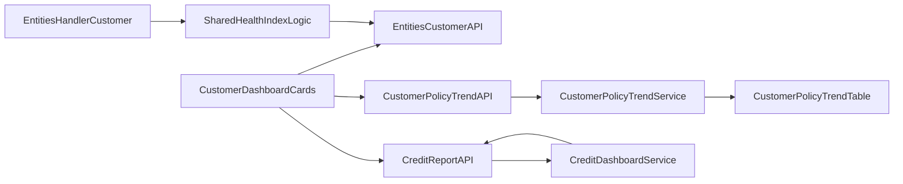

# Customer Dashboard Credit KPI Expansion

**ClickUp:** [Customer dashboard — credit KPI cards and charts](https://app.clickup.com/t/869dj3392)

## Scope
Implement all KPIs from the screenshot on the customer dashboard (credit-product context only):
- Cards: Health index, At Risk Exposure, Policy Usage, Active Policies, Terms Breach, Capacity Gap
- Charts: Risk exposure amount by policy (line, default last 90 days), Terms Breach reason (donut from report endpoint categories)
- Currency: display monetary values in account base currency
- v1 interaction rule: no drilldowns from KPI cards/charts

## Existing Architecture To Reuse
- Customer dashboard UI composition: [`app/[locale]/app/customers/[customerId]/CustomerDetailsCombined.tsx`](app/[locale]/app/customers/[customerId]/CustomerDetailsCombined.tsx), [`app/[locale]/app/customers/[customerId]/CustomerDashboardCards.tsx`](app/[locale]/app/customers/[customerId]/CustomerDashboardCards.tsx)
- View-model contract: [`app/[locale]/app/customers/[customerId]/customerDashboardCardViewModel.ts`](app/[locale]/app/customers/[customerId]/customerDashboardCardViewModel.ts)
- Existing trend endpoint/service: [`pages/api/credit-insurance/customer-policy-trend.ts`](pages/api/credit-insurance/customer-policy-trend.ts), [`server/services/creditInsurance/customerPolicyTrendService.ts`](server/services/creditInsurance/customerPolicyTrendService.ts)
- Existing health-index logic source: [`server/services/creditInsurance/creditInsuranceDashboardService.ts`](server/services/creditInsurance/creditInsuranceDashboardService.ts)
- Existing customer KPI fields source: [`pages/api/entities/[...path].ts`](pages/api/entities/[...path].ts)

## Implementation Plan
1. Lock KPI formulas and data semantics before coding
- Define and document exact formulas for `Health index`, `Policy Usage`, `At Risk Exposure`, `Capacity Gap`, and `Terms Breach`.
- Include: inputs, weights/thresholds, rounding, null/empty behavior, and base-currency conversion timing.
- Reuse current credit dashboard definitions wherever possible and avoid introducing a parallel formula variant.

2. Extend customer KPI data contract for new cards and chart payloads
- Add fields in customer dashboard view model for: `healthIndex`, `atRiskExposure`, `policyUsage`, `activePolicies`, `termsBreach`, `capacityGap`.
- Keep existing credit-product/eligibility gating (`has_credit_insurance`, policy presence).
- Normalize display shape (numeric value + optional currency/unit/label) so all cards can render as single-value cards.
- Add a typed contract for chart payloads (`riskExposureByPolicySeries`, `termsBreachReasonDistribution`) to reduce frontend stitching.

3. Reuse and adapt health-index calculation for single-customer context
- Extract/reuse the same algorithm used in credit dashboard summary and run it against one customer’s exposure/breach/capacity context.
- Add a customer-level service method (or shared helper) to avoid duplicating formula logic.
- Expose this value through existing customer fetch path (preferred) or a dedicated customer credit KPI endpoint if payload size/ownership is cleaner.

4. Provide risk-exposure line-chart data (amount only per policy, last 90 days default)
- Extend `customer-policy-trend` API/service to return policy-wise amount series (line-friendly) sourced from `CustomerPolicyTrend`.
- Ensure response is grouped by policy with stable labels and ordered dates.
- Use default `days=90` when dashboard first loads.

5. Provide Terms Breach reason donut data from report endpoint categories
- Reuse current credit report endpoint/category outputs to aggregate reason buckets for the selected customer.
- Add a compact response shape suitable for donut charts (label + count).
- Group missing/uncategorized breach records into an `Other` bucket.
- Keep query parameters aligned with existing permission/account checks.

6. Enforce base-currency normalization for KPI amounts
- Ensure all monetary card/chart values are rendered in account base currency.
- Apply normalization in backend response shaping where possible to keep frontend formatting simple and consistent.

7. Wire UI cards and charts in customer dashboard
- In `CustomerDashboardCards`, add/arrange all KPI cards as single-value cards using existing card primitives (no new styling system).
- Add line chart for policy risk exposure amount-by-policy.
- Add donut chart for Terms Breach reason.
- Preserve existing i18n usage (`customers`, `dashboard`, `common`) and add only required keys (pending separate approval if translation files must change).

8. Apply chart UX fallback rules (as agreed)
- Risk exposure line chart with no points: render a flat zero line with explanatory subtitle.
- Exactly one active policy: render one line (same chart component).
- Terms breach donut with empty categories: render donut placeholder with center text `No breaches`.
- Unknown breach category rows: aggregate into `Other`.

9. Keep v1 interactions intentionally non-drilldown
- Disable or omit KPI click-through behavior for this version.
- Keep visual affordances neutral so users do not expect drilldown navigation.

10. Add observability and performance guardrails
- Add structured server telemetry for KPI aggregation failures/slow paths (without development console logs).
- Define and validate KPI endpoint response-time target (P95) during testing.

## Data Flow (Target)

## Testing Strategy
- Business requirement: all requested KPI cards render for credit-enabled customers
  - Validate card presence/value mapping in customer dashboard component tests (or existing dashboard test harness)
  - Verify card fallback values for missing data
- Business requirement: KPI formulas are stable and documented
  - Add unit tests for formula rounding, thresholds, and null-handling edge cases
- Business requirement: health index formula matches credit dashboard logic
  - Add unit test for shared/adapted health-index function comparing known inputs/expected score
- Business requirement: risk exposure line chart uses per-policy amount for last 90 days
  - Add API/service tests for grouping by policy + date ordering + default 90-day behavior
  - Add chart-state tests for no data (zero-line fallback) and single-policy (single line)
- Business requirement: terms breach donut uses report endpoint categories
  - Add API aggregation test to verify category mapping, counts, empty-placeholder condition, and `Other` bucket behavior
- Business requirement: monetary values use base currency
  - Add tests validating conversion/normalization and display metadata consistency
- Regression checks
  - Run typecheck and lint on touched files
  - Run targeted unit tests for modified services/components

## Validation / Acceptance Criteria
- Customer dashboard shows all 8 requested KPIs for credit-product customers.
- Health index on customer dashboard follows same formula family as credit dashboard.
- Risk exposure chart defaults to last 90 days and plots amount-only lines per policy.
- Terms breach reason donut is populated from report-endpoint-derived categories.
- Monetary KPI values are presented in base currency.
- No KPI drilldowns are present in v1.
- Fallback behavior matches agreed UX rules (zero line, single-line policy, donut placeholder, `Other` bucket).
- Existing permissions/account gating and non-credit customer behavior remain unchanged.
