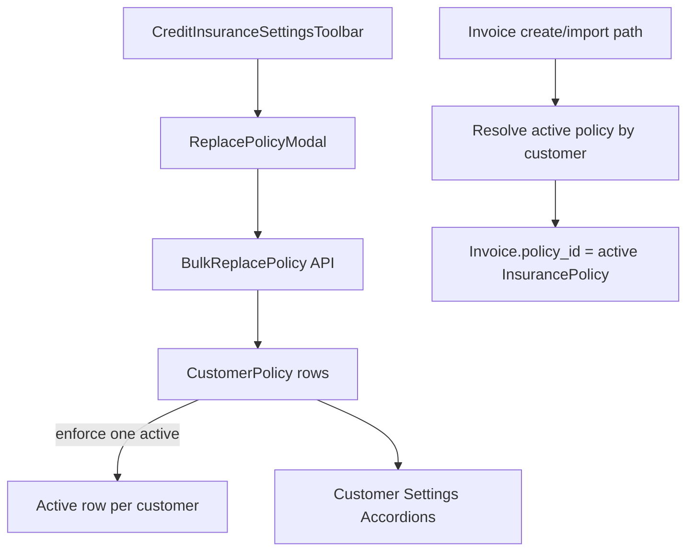

# Customer Multi-Policy Architecture Plan

## Goals
- Support multiple policies per customer with exactly one active policy.
- Add bulk policy replacement from Credit Insurance Settings (toolbar action + modal).
- Ensure invoice creation links to the customer’s current active insurance policy.
- Replace current single-policy customer settings UI with accordion history UI (active first, expanded).

## Current-State Notes (impact hotspots)
- Customer policy linkage currently lives on `Customer` (`policy_id` + policy-related columns), not on a dedicated history table: [prisma/schema.prisma](/Users/ofiramitai/Sites/archaser/archaser/prisma/schema.prisma).
- Customer settings edit flow currently writes policy fields directly on customer update: [pages/api/entities/[...path].ts](/Users/ofiramitai/Sites/archaser/archaser/pages/api/entities/[...path].ts).
- Credit Insurance settings toolbar currently has only “new policy” action: [app/[locale]/app/settings/CreditInsuranceSettingsList.tsx](/Users/ofiramitai/Sites/archaser/archaser/app/[locale]/app/settings/CreditInsuranceSettingsList.tsx).
- Invoice API create endpoint is not implemented in entities route, while import/create logic in service uses current customer policy data: [pages/api/entities/[...path].ts](/Users/ofiramitai/Sites/archaser/archaser/pages/api/entities/[...path].ts), [server/services/InvoiceService.ts](/Users/ofiramitai/Sites/archaser/archaser/server/services/InvoiceService.ts).

## Target Design


## Implementation Plan

### 1) Data Model + Migration
- Add `CustomerPolicy` model to Prisma with:
  - `customer_id`, `insurance_policy_id`, active flag (`is_active`), policy-related columns currently on customer (approved limit, limit type, terms, reporting days, exclusion fields, credit-score related fields, policy customer number, expiration dates), audit fields.
  - Constraint/index strategy to enforce one active row per customer (partial unique index in SQL migration if needed).
- Add `policy_id` FK column on `Invoice` (to `InsurancePolicy`) per your decision.
- Move policy-related fields out of `Customer` into `CustomerPolicy` as the source of truth. Keep legacy `Customer` fields only as temporary compatibility layer during migration cutover, then remove.
- Backfill migration:
  - Create one active `CustomerPolicy` row from existing customer policy fields for each customer with/without policy.
  - Populate `Invoice.policy_id` for historical rows where policy can be resolved from existing customer data at creation context (or null when unavailable).
  - Create a dedicated SQL migration script that inserts into `CustomerPolicy` directly from `Customer`, preserves audit metadata, and marks rows active.
  - Add verification SQL to compare source/target row counts and identify any customers missing migrated policy records.

### 1.1) SQL Script Requirements (Customer -> CustomerPolicy)
- Add a standalone SQL script under project migration/scripts conventions that:
  - inserts one `CustomerPolicy` row per customer that currently has policy-related data,
  - copies all policy-related columns from `Customer` to `CustomerPolicy`,
  - sets `is_active = true` for the migrated current row,
  - maps `insurance_policy_id` from current `Customer.policy_id`,
  - sets `created_at/modified_at/created_by/modified_by` using existing customer metadata where available.
- Add idempotency/safety guards:
  - avoid duplicate inserts when rerun (via `NOT EXISTS`/`ON CONFLICT` strategy),
  - run in transaction blocks for rollback safety.
- Add post-migration checks in the same script:
  - total migrated customers,
  - customers with policy fields in `Customer` but no `CustomerPolicy` row,
  - duplicate active rows per customer (must be zero).

### 1.2) Exact Field Mapping (`Customer` -> `CustomerPolicy`)
- The SQL migration must copy the following fields exactly:
  - `Customer.policy_id` -> `CustomerPolicy.insurance_policy_id`
  - `Customer.customer_number_policy` -> `CustomerPolicy.customer_number_policy`
  - `Customer.approved_limit` -> `CustomerPolicy.approved_limit`
  - `Customer.approved_limit_currency` -> `CustomerPolicy.approved_limit_currency`
  - `Customer.approved_limit_expiration_date` -> `CustomerPolicy.approved_limit_expiration_date`
  - `Customer.limit_type` -> `CustomerPolicy.limit_type`
  - `Customer.max_payment_term` -> `CustomerPolicy.max_payment_term`
  - `Customer.max_allowed_mep` -> `CustomerPolicy.max_allowed_mep`
  - `Customer.reporting_days` -> `CustomerPolicy.reporting_days`
  - `Customer.excluded_from_policy` -> `CustomerPolicy.excluded_from_policy`
  - `Customer.policy_exclusion_reason` -> `CustomerPolicy.policy_exclusion_reason`
  - `Customer.credit_score` -> `CustomerPolicy.credit_score`
  - `Customer.credit_score_input_date` -> `CustomerPolicy.credit_score_input_date`
  - `Customer.active_customer_since` -> `CustomerPolicy.active_customer_since`
  - `Customer.outdated_dcl` -> `CustomerPolicy.outdated_dcl`
- Additional migration-set fields:
  - `CustomerPolicy.customer_id` = `Customer.id`
  - `CustomerPolicy.is_active` = `true` for the migrated current row
  - `CustomerPolicy.created_at` = `COALESCE(Customer.created_at, NOW())`
  - `CustomerPolicy.modified_at` = `COALESCE(Customer.modified_at, NOW())`
  - `CustomerPolicy.created_by` = `Customer.created_by`
  - `CustomerPolicy.modified_by` = `Customer.modified_by`
- Migration source filter:
  - migrate customers that have any policy payload (not only `policy_id`), so historical/manual policy values are not dropped.
- Null-handling requirement:
  - preserve nulls as-is; do not synthesize business values during migration.

### 1.3) SQL Pseudo-Template (Insert + Validation)
```sql
-- Customer -> CustomerPolicy backfill (pseudo-template)
BEGIN;

-- 1) Insert one active policy row per customer that has policy payload
INSERT INTO "CustomerPolicy" (
    customer_id,
    insurance_policy_id,
    customer_number_policy,
    approved_limit,
    approved_limit_currency,
    approved_limit_expiration_date,
    limit_type,
    max_payment_term,
    max_allowed_mep,
    reporting_days,
    excluded_from_policy,
    policy_exclusion_reason,
    credit_score,
    credit_score_input_date,
    active_customer_since,
    outdated_dcl,
    is_active,
    created_at,
    modified_at,
    created_by,
    modified_by
)
SELECT
    c.id AS customer_id,
    c.policy_id AS insurance_policy_id,
    c.customer_number_policy,
    c.approved_limit,
    c.approved_limit_currency,
    c.approved_limit_expiration_date,
    c.limit_type,
    c.max_payment_term,
    c.max_allowed_mep,
    c.reporting_days,
    COALESCE(c.excluded_from_policy, false) AS excluded_from_policy,
    c.policy_exclusion_reason,
    c.credit_score,
    c.credit_score_input_date,
    c.active_customer_since,
    COALESCE(c.outdated_dcl, false) AS outdated_dcl,
    true AS is_active,
    COALESCE(c.created_at, NOW()) AS created_at,
    COALESCE(c.modified_at, NOW()) AS modified_at,
    c.created_by,
    c.modified_by
FROM "Customer" c
WHERE
    -- migrate any customer with policy payload (not only policy_id)
    (
        c.policy_id IS NOT NULL OR
        c.customer_number_policy IS NOT NULL OR
        c.approved_limit IS NOT NULL OR
        c.approved_limit_expiration_date IS NOT NULL OR
        c.limit_type IS NOT NULL OR
        c.max_payment_term IS NOT NULL OR
        c.max_allowed_mep IS NOT NULL OR
        c.reporting_days IS NOT NULL OR
        c.excluded_from_policy = true OR
        c.policy_exclusion_reason IS NOT NULL OR
        c.credit_score IS NOT NULL OR
        c.credit_score_input_date IS NOT NULL OR
        c.active_customer_since IS NOT NULL OR
        c.outdated_dcl = true
    )
    AND NOT EXISTS (
        SELECT 1
        FROM "CustomerPolicy" cp
        WHERE cp.customer_id = c.id
          AND cp.is_active = true
    );

-- 2) Validation: inserted active rows count
SELECT COUNT(*) AS active_customer_policy_rows
FROM "CustomerPolicy"
WHERE is_active = true;

-- 3) Validation: customers with payload but no active CustomerPolicy row
SELECT COUNT(*) AS missing_migrations
FROM "Customer" c
WHERE
    (
        c.policy_id IS NOT NULL OR
        c.customer_number_policy IS NOT NULL OR
        c.approved_limit IS NOT NULL OR
        c.approved_limit_expiration_date IS NOT NULL OR
        c.limit_type IS NOT NULL OR
        c.max_payment_term IS NOT NULL OR
        c.max_allowed_mep IS NOT NULL OR
        c.reporting_days IS NOT NULL OR
        c.excluded_from_policy = true OR
        c.policy_exclusion_reason IS NOT NULL OR
        c.credit_score IS NOT NULL OR
        c.credit_score_input_date IS NOT NULL OR
        c.active_customer_since IS NOT NULL OR
        c.outdated_dcl = true
    )
    AND NOT EXISTS (
        SELECT 1
        FROM "CustomerPolicy" cp
        WHERE cp.customer_id = c.id
          AND cp.is_active = true
    );

-- 4) Validation: duplicate active policy rows (must be zero)
SELECT customer_id, COUNT(*) AS active_rows
FROM "CustomerPolicy"
WHERE is_active = true
GROUP BY customer_id
HAVING COUNT(*) > 1;

COMMIT;
```

### 2) Backend Domain + API Layer
- Add a dedicated `CustomerPolicyService` for:
  - get active policy,
  - list policy history for customer,
  - switch active policy (with transactional deactivation/activation),
  - bulk replace old policy -> new policy across customers.
- Implement bulk replace API endpoint under entities/settings routes:
  - input: `oldPolicyId`, `newPolicyId`, optional filters,
  - transactional updates of all active rows tied to old policy,
  - replace all policy-related fields in `CustomerPolicy` from new policy defaults/country/named logic (matching existing prefill precedence behavior).
- Add single-customer policy change endpoint used by customer settings tab:
  - requires explicit confirmation flag from UI for active-policy switch.
- Preserve existing permissions model (`view_settings`/`update_insurance_policy`) and apply write checks to new endpoints.

### 3) Invoice Create/Import Integration
- Update invoice create paths in `InvoiceService` and import flow to resolve active `CustomerPolicy` and set `Invoice.policy_id` to active insurance policy.
- Reuse existing insurance computation pipeline, but source terms/reporting inputs from active `CustomerPolicy` row (fallback strategy if missing active row).
- Keep existing invoice update behavior; add targeted guardrails for policy reassignment edge cases.

### 3.1) Credit Dashboard + Report Fetch/Service Updates (Required)
- Yes, dashboard/report fetch paths must be updated for `CustomerPolicy` migration.
- Current coupling to `Customer.policy_id` is heavy in:
  - [server/services/creditInsurance/creditInsuranceDashboardService.ts](/Users/ofiramitai/Sites/archaser/archaser/server/services/creditInsurance/creditInsuranceDashboardService.ts)
  - [server/services/creditInsurance/creditDashboardSnapshotService.ts](/Users/ofiramitai/Sites/archaser/archaser/server/services/creditInsurance/creditDashboardSnapshotService.ts)
  - [app/[locale]/app/credit-dashboard/CreditDashboardPolicySelect.tsx](/Users/ofiramitai/Sites/archaser/archaser/app/[locale]/app/credit-dashboard/CreditDashboardPolicySelect.tsx)
  - [pages/api/credit-insurance/report.ts](/Users/ofiramitai/Sites/archaser/archaser/pages/api/credit-insurance/report.ts)
- Required changes:
  - Replace filtering/joins using `Customer.policy_id` with active `CustomerPolicy` join.
  - Replace `Customer -> InsurancePolicy` direct include usage in dashboard calculations with active `CustomerPolicy -> InsurancePolicy`.
  - Update policy-scoped summary/report queries to scope by active customer-policy linkage.
  - Update policy dropdown source (`assigned_only=1`) logic to derive assigned policies from active `CustomerPolicy` rows.
  - Keep API query contract (`policyId`) stable for UI pages (`credit-dashboard` and `credit-dashboard/report`) so frontend fetch callers remain unchanged.

### 3.2) Customer Header KPI Fetch Updates (Required)
- Yes, customer header KPI fetch path must be updated too.
- Current dependencies still read policy/limit fields from `Customer` in:
  - [pages/api/entities/[...path].ts](/Users/ofiramitai/Sites/archaser/archaser/pages/api/entities/[...path].ts) (customer details response computes `total_ar`, `uninsured_amount`, `capacity_gap_amount`, `risk_exposure` using `customer.policy_id` and `customer.approved_limit`)
  - [server/services/creditInsurance/invoiceInsuranceFields.ts](/Users/ofiramitai/Sites/archaser/archaser/server/services/creditInsurance/invoiceInsuranceFields.ts) (`computeUninsuredAmount` uses customer-level `approved_limit`)
  - [server/services/creditInsurance/creditInsuranceDashboardService.ts](/Users/ofiramitai/Sites/archaser/archaser/server/services/creditInsurance/creditInsuranceDashboardService.ts) (`fetchOpenReceivableForCustomer(..., policyId)` currently scopes by customer policy_id semantics)
  - [app/[locale]/app/customers/[customerId]/CustomerHeader.tsx](/Users/ofiramitai/Sites/archaser/archaser/app/[locale]/app/customers/[customerId]/CustomerHeader.tsx) (renders these KPIs from customer payload fields).
- Required migration behavior:
  - Resolve active `CustomerPolicy` row in customer-details API and compute header KPI fields from that active row.
  - Keep response shape stable (`capacity_gap_amount`, `uninsured_amount`, `total_ar`) so UI component does not need contract-breaking changes.
  - Replace any policy scoping based on `Customer.policy_id` with active `CustomerPolicy.insurance_policy_id`.
  - During transitional rollout, fallback to legacy `Customer` fields only when no active `CustomerPolicy` row exists.

### 4) Credit Insurance Settings Bulk Replace UX
- Extend toolbar in [app/[locale]/app/settings/CreditInsuranceSettingsList.tsx](/Users/ofiramitai/Sites/archaser/archaser/app/[locale]/app/settings/CreditInsuranceSettingsList.tsx) with “Replace Policy” button.
- Build modal for selecting existing policy and replacement policy.
- Submit to bulk replace endpoint and show affected-customer count success/failure states.
- Add safety validations (same policy selected, inactive policy, no affected customers).
- Implement the modal using the project modal standard in [`.cursor/rules/frontend-modals.mdc`](/Users/ofiramitai/Sites/archaser/archaser/.cursor/rules/frontend-modals.mdc):
  - Use `AppDialog` (preferred) with `drag`, `align`, `slide` behavior instead of custom dialog/slide/drag code.
  - If content is long, use `ModalScrollBox` and wire `scrollContainerId` so title/actions stay fixed and only inner content scrolls.
  - Preserve RTL/accessibility patterns (`isRTL`, `ariaLabelledBy`, `ariaDescribedBy`) and standard actions layout.

### 5) Customer Settings Multi-Policy Accordion UX
- Refactor [app/[locale]/app/customers/[customerId]/CustomerCreditInsuranceInfo.tsx](/Users/ofiramitai/Sites/archaser/archaser/app/[locale]/app/customers/[customerId]/CustomerCreditInsuranceInfo.tsx) to render policy history as accordion list.
- Follow accordion interaction pattern from [app/[locale]/app/settings/roles/[role]/RolePermissions.tsx](/Users/ofiramitai/Sites/archaser/archaser/app/[locale]/app/settings/roles/[role]/RolePermissions.tsx).
- Sorting/expansion rules:
  - active policy first,
  - active accordion expanded by default,
  - previous policies collapsed by default.
- On active policy change, show confirmation modal before save.

### 6) Compatibility + Rollout
- Read path compatibility: during transition, prefer `CustomerPolicy` as source of truth; fallback to legacy customer columns where needed.
- Write path compatibility: dual-write temporary adapter only where needed to avoid regressions in unrelated features.
- Final cleanup phase (post-validation): remove deprecated customer policy columns and fallback branches.
- Add a report-compatibility phase before cleanup so saved reports and report builder fields do not break.

### 6.1) Reporting Compatibility Workstream (Required)
- Update these backend reporting layers to support `CustomerPolicy` source:
  - [server/services/reportMetadata.ts](/Users/ofiramitai/Sites/archaser/archaser/server/services/reportMetadata.ts)
  - [server/services/ReportQueryBuilder.ts](/Users/ofiramitai/Sites/archaser/archaser/server/services/ReportQueryBuilder.ts)
  - [server/services/ReportExecutionService.ts](/Users/ofiramitai/Sites/archaser/archaser/server/services/ReportExecutionService.ts)
  - [server/utils/reportCreditInsuranceFieldUsage.ts](/Users/ofiramitai/Sites/archaser/archaser/server/utils/reportCreditInsuranceFieldUsage.ts)
- Preserve existing field names in report payloads where possible (`policy_id`, `approved_limit`, etc.) via compatibility mapping during transition.
- Validate existing saved reports and filters that reference legacy customer policy fields.

### 6.2) Cron + FX/Gap Jobs Workstream (Required)
- Migrate these jobs/services off customer-level policy fields:
  - [server/cron-jobs/computeCustomerOverdueMetrics.ts](/Users/ofiramitai/Sites/archaser/archaser/server/cron-jobs/computeCustomerOverdueMetrics.ts)
  - [server/services/currencyRateService.ts](/Users/ofiramitai/Sites/archaser/archaser/server/services/currencyRateService.ts)
  - [server/services/creditInsurance/computeGapInBaseCurrencyService.ts](/Users/ofiramitai/Sites/archaser/archaser/server/services/creditInsurance/computeGapInBaseCurrencyService.ts)
- Ensure approved-limit expiration/reset and gap computation use active `CustomerPolicy` row semantics.

### 6.3) Frontend Contract Adapter Workstream (Required)
- Add transitional frontend mapping so customer UI remains stable while backend migrates:
  - [types/Customer.ts](/Users/ofiramitai/Sites/archaser/archaser/types/Customer.ts)
  - [shared/services/customerService.ts](/Users/ofiramitai/Sites/archaser/archaser/shared/services/customerService.ts)
  - [app/[locale]/app/customers/[customerId]/CustomerDetailsCombined.tsx](/Users/ofiramitai/Sites/archaser/archaser/app/[locale]/app/customers/[customerId]/CustomerDetailsCombined.tsx)
  - [app/[locale]/app/customers/[customerId]/CustomerGeneralInfo.tsx](/Users/ofiramitai/Sites/archaser/archaser/app/[locale]/app/customers/[customerId]/CustomerGeneralInfo.tsx)
  - [app/[locale]/app/customers/[customerId]/CustomerCreditInsuranceInfo.tsx](/Users/ofiramitai/Sites/archaser/archaser/app/[locale]/app/customers/[customerId]/CustomerCreditInsuranceInfo.tsx)
- Dual-read strategy: prefer active `CustomerPolicy` values; fallback to legacy top-level `Customer` policy fields while migration is in progress.
- Save-path normalization: avoid posting the full raw customer object with legacy policy columns as the long-term contract.

## Execution Order (Phased Rollout)

### Phase 0: Foundation
- Add `CustomerPolicy` schema + `Invoice.policy_id` schema changes.
- Add SQL backfill script and validation queries (do not remove legacy customer fields yet).
- Add active-row uniqueness constraints for `CustomerPolicy`.

### Phase 1: Compatibility Layer
- Backend dual-read: resolve policy values from active `CustomerPolicy`, fallback to legacy `Customer` fields.
- Keep API response contract stable for customer pages and dashboard/report consumers.
- Introduce frontend DTO adapter to consume either source during migration.

### Phase 2: Write Path Migration
- Switch customer policy writes (single-customer change + bulk replace) to `CustomerPolicy` as source of truth.
- Add confirmation flow for policy replacement/change.
- Keep temporary compatibility writes only where required for non-migrated consumers.

### Phase 3: Domain/Computation Migration
- Update invoice create/import/refresh logic to read active `CustomerPolicy`.
- Update dashboard/report services to active `CustomerPolicy` joins.
- Update customer-header KPI computations (`capacity_gap_amount`, `uninsured_amount`) to active `CustomerPolicy`.

### Phase 4: Jobs + Reporting Stack
- Migrate cron + FX/gap jobs to active `CustomerPolicy`.
- Migrate report metadata/query/execution mapping; verify saved reports remain functional.
- Run reconciliation checks between legacy and new computed outputs.

### Phase 5: UI Completion
- Ship customer settings accordion history UI (active first, expanded).
- Ship settings toolbar bulk-replace modal.
- Ensure policy-scoped dashboard/report UX still behaves identically from user perspective.

### Phase 6: Cleanup
- Remove legacy customer policy fields and fallback logic after validation window.
- Remove temporary dual-write/compatibility branches.
- Finalize tests and migration runbooks for production rollout/recovery.

## Testing Strategy
- Unit tests:
  - active policy uniqueness enforcement,
  - bulk replace field-replacement mapping correctness,
  - active-policy resolver for invoice creation.
- Integration tests:
  - customer policy switch with confirmation path,
  - bulk replace endpoint updates all target customers and keeps one active row each,
  - invoice import/create sets `Invoice.policy_id` from active policy.
- UI tests:
  - toolbar replace-policy modal flow,
  - customer settings accordion ordering/expanded state,
  - policy-change confirmation modal behavior.
- Regression checks:
  - existing credit-insurance calculations continue using expected terms/reporting fields,
  - customer detail save and invoice flows remain stable for accounts without active policy.

## Key Files Expected to Change
- [prisma/schema.prisma](/Users/ofiramitai/Sites/archaser/archaser/prisma/schema.prisma)
- [pages/api/entities/[...path].ts](/Users/ofiramitai/Sites/archaser/archaser/pages/api/entities/[...path].ts)
- [pages/api/entities/insurancePolicyHandlers.ts](/Users/ofiramitai/Sites/archaser/archaser/pages/api/entities/insurancePolicyHandlers.ts)
- [server/services/InsurancePolicyService.ts](/Users/ofiramitai/Sites/archaser/archaser/server/services/InsurancePolicyService.ts)
- [server/services/InvoiceService.ts](/Users/ofiramitai/Sites/archaser/archaser/server/services/InvoiceService.ts)
- [app/[locale]/app/settings/CreditInsuranceSettingsList.tsx](/Users/ofiramitai/Sites/archaser/archaser/app/[locale]/app/settings/CreditInsuranceSettingsList.tsx)
- [app/[locale]/app/customers/[customerId]/CustomerCreditInsuranceInfo.tsx](/Users/ofiramitai/Sites/archaser/archaser/app/[locale]/app/customers/[customerId]/CustomerCreditInsuranceInfo.tsx)
- [app/[locale]/app/customers/[customerId]/CustomerDetailsCombined.tsx](/Users/ofiramitai/Sites/archaser/archaser/app/[locale]/app/customers/[customerId]/CustomerDetailsCombined.tsx)