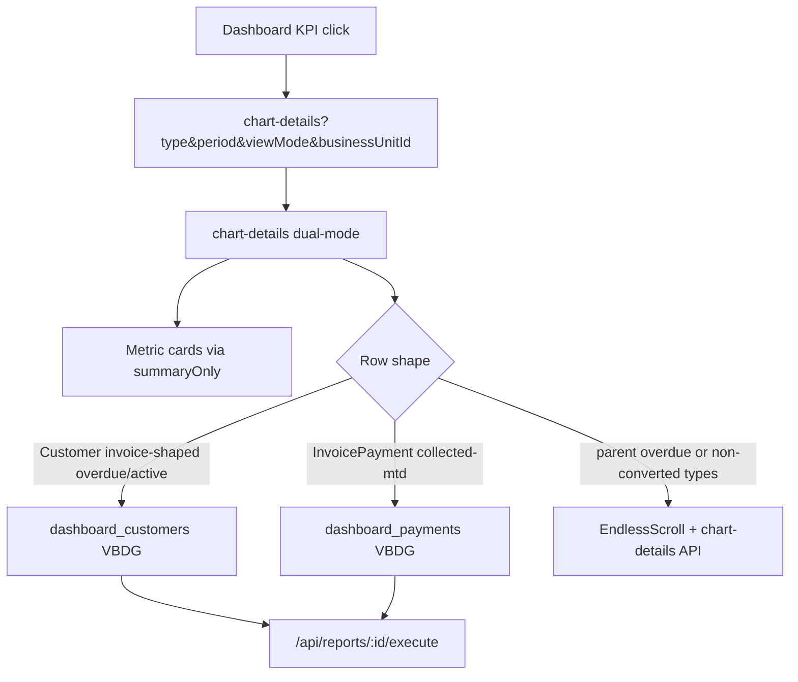

# Financial Dashboard: Customers + Payments Report Lists

## Goal

Extend the invoice chart-details → report-list pattern to the remaining KPI cards the user sees today without reports:

- **Customers (implement first):** `overdue-customers`, `overdue-amount`, `active-customers`
- **Payments (implement second):** `collected-mtd` (and legacy alias `collected-vs-promise`)

Reuse the established seams from slices 1–6: locked `additionalFilters`, thin `summaryOnly`, `view_financial_dashboard` execute/list permission, URL `businessUnitId` + owner scope where legacy applies, system reports by family, builder return to chart-details.

## Decisions (locked for this plan)

| Decision | Choice |
|----------|--------|
| Target UX | `ViewBasedDataGrid` + saved views on chart-details (same as invoices) |
| Contexts | `dashboard_customers` (Customer rows); `dashboard_payments` (InvoicePayment rows) |
| KPI parity | Exact match to current chart-details / card semantics |
| Metric cards | Keep; thin summary sharing the filter contract |
| Permissions | Execute/list/default for these contexts with `view_financial_dashboard` **or** `view_reports`; create/edit stay on report perms |
| Main Reports menu | Chart-details only (not `MAIN_REPORTS_MENU_CONTEXT`) |
| Customer parent `viewMode` | **Defer to legacy EndlessScroll** when `viewMode=parent` (same as maturity parent for invoices) |
| Collected MTD owner/BU | **Do not apply** owner/BU on list or summary (matches card + current chart-details) |
| Payments foundation | **Add `InvoicePayment` as a first-class report table** (metadata + QueryBuilder mapping). Do **not** approximate with legacy `Payment` |
| `collected-vs-promise` | Treat as alias of `collected-mtd` (identical membership today) |
| Implementation order | Customers end-to-end first → then payments |



Closest patterns to copy: invoice filter contract + [`DashboardInvoiceChartDetailsGrid.tsx`](app/[locale]/app/dashboard/chart-details/DashboardInvoiceChartDetailsGrid.tsx), [`dashboardInvoiceChartFilters.ts`](shared/dashboard/dashboardInvoiceChartFilters.ts), [`dashboardInvoiceReportAccess.ts`](shared/dashboard/dashboardInvoiceReportAccess.ts), [`create-dashboard-invoices-reports.sql`](scripts/database/create-dashboard-invoices-reports.sql).

---

## Part A — `dashboard_customers` (implement first)

### Membership (exact legacy)

**`overdue-amount` / `overdue-customers`** (same membership via `getOverdueAmountData` in [`dashboardService.ts`](shared/services/dashboardService.ts)):

- Child mode: Customer + owner + BU; open collection period with `total_outstanding_amount > 0`
- Parent mode: keep EndlessScroll (aggregation not expressible as flat Customer report filters)
- Period required by API but ignored for membership

**`active-customers`** (handler inline in [`pages/api/system/[...path].ts`](pages/api/system/[...path].ts) ~2431–2623 — **not** `getActiveCustomersData`):

- Entered: `collection_status=Active` + `created_at` in period month + owner + BU
- Exited: `collection_status=Inactive` + `modified_at` in period month + owner (**no BU** — preserve asymmetry)
- `viewMode` unused
- Period is load-bearing (future month → year−1 adjustment)

### Deliverables

1. Register `dashboard_customers` in [`viewConfigs.ts`](shared/utils/viewConfigs.ts) — mirror `customers` (Customer table, links, client-sort fields).
2. Filter contract: `shared/dashboard/dashboardCustomerChartFilters.ts` + `shouldUseDashboardCustomerReportList`.
3. Extend report access helper to treat `dashboard_customers` like `dashboard_invoices` for execute/list/GET.
4. Execute scope: reuse owner + URL BU for this context (same as invoices); skip for types that don’t use them only via empty owner when admin / view-as.
5. Thin summary: extend `summaryOnly` path (or sibling service) using the customer filter contract.
6. Seed system reports (SQL for all accounts + copy preserves `unique_name`):
   - `dashboard_customers_overdue` — default for overdue-amount / overdue-customers (columns: name, outstanding, overdue invoice count / category as available on Customer)
   - `dashboard_customers_active_dynamics` — for active-customers (name, collection_status, dates as available)
7. Chart-details dual-mode branch (alongside invoice branch) + grid component analogous to invoice grid.
8. Builder return: extend [`dashboardInvoiceBuilderReturn.ts`](shared/dashboard/dashboardInvoiceBuilderReturn.ts) (or rename to shared dashboard builder return) for `dashboard_customers`.
9. Unit tests: mapper families, `shouldUse*`, summary gating, permission context allowlist.

### Note on overdue-amount vs overdue-customers

Same locked membership; two chart types auto-select the **same** overdue system report (different historic UI labels/columns were close). Optional later: two system reports if product wants distinct defaults — **out of scope unless requested**.

---

## Part B — `dashboard_payments` (implement second)

### Foundation (required before UI)

Add **`InvoicePayment`** to the report stack (do not use legacy `Payment`):

- [`server/services/reportMetadata.ts`](server/services/reportMetadata.ts) — entity + fields used by MTD drill (`id`, `amount`, `customer_amount`, `payment_date`, `payment_method`, `reference`, `invoice_number`, `customer_currency`, relations to Customer / Invoice as supported)
- [`ReportExecutionService.constants.ts`](server/services/ReportExecutionService.constants.ts) `MODEL_NAME_MAP` + date-field lists
- [`ReportQueryBuilder.ts`](server/services/ReportQueryBuilder.ts) — account_id, Customer join for search/BU **when** BU is applied (collected MTD will pass empty BU/owner to match card)
- Virtual fields / Customer.name if needed for list columns

### Membership

- `account_id` + `payment_date` in period month + `invoice_id not null` (`linkedInvoicePaymentWhere`)
- No owner/BU filters (parity with card)
- `viewMode` unused

### Deliverables

1. `dashboard_payments` viewConfig (`tableName: "InvoicePayment"`, currency columns for amount / customer_amount).
2. Filter contract: `dashboardPaymentChartFilters.ts` (period → `payment_date` between; linked invoice constraint).
3. Permission allowlist includes `dashboard_payments`.
4. System report `dashboard_payments_collected_mtd` (columns matching legacy: payment date, amounts, invoice #, customer, invoice status).
5. Chart-details dual-mode + builder return + thin summary.
6. Unit tests for period window + linked-invoice lock.

---

## Shared chart-details wiring

Extend [`chart-details/page.tsx`](app/[locale]/app/dashboard/chart-details/page.tsx):

```ts
useInvoiceReportList || useCustomerReportList || usePaymentReportList
```

Keep EndlessScroll for: collection efforts, parent overdue, maturity parent/overview, and any type not yet converted.

Generalize execute permission from a single-context check to a small allowlist:

`dashboard_invoices | dashboard_customers | dashboard_payments`

Same for list/GET report and builder Location options (admin freeSolo list).

---

## Codebase scan

### Required

| Area | Why |
|------|-----|
| `viewConfigs.ts` | New contexts |
| New filter contracts + access allowlist | KPI locks + perms |
| `pages/api/reports/[id]/execute.ts`, `index.ts`, `[id].ts` | Context allowlist |
| `ReportQueryBuilder` + `reportMetadata` (+ constants) | InvoicePayment for payments |
| Chart-details page + new grid components | Dual-mode UI |
| Thin summary services / `summaryOnly` | Metric cards |
| SQL seeds under `scripts/database/` | System reports |
| Builder redirect helper + Location options | Create/edit return |
| Unit tests + fixtures | Mapper / perms / InvoicePayment wiring |

### Optional / out of scope unless requested

| Area | Why |
|------|-----|
| `dashboard_collection_efforts` | Separate follow-up |
| Unify overdue-amount vs overdue-customers column sets into two system reports | Nice-to-have |
| Apply BU to collected MTD card + list together | Product change; breaks current card parity |
| Fix active-customers exited-path missing BU | Preserve legacy unless asked |
| Locale files | Needs translation permission |
| New styling | Needs approval |
| Retire legacy chart-details customer/payment row branches | After summary is sole consumer |

### No change needed

| Area | Why |
|------|-----|
| Main `/app/reports` menu | Still `MAIN_REPORTS_MENU_CONTEXT` only |
| Existing `customers` / `invoices` contexts | Reference only |
| Prisma schema for InvoicePayment | Table already exists |

### Easy-to-miss

1. `active-customers` chart-details ≠ dashboard card helper `getActiveCustomersData`
2. Overdue parent mapping differs slightly between amount vs customers cards — membership still shared
3. InvoicePayment vs Payment name collision in metadata / QueryBuilder
4. Report execute currently applies Customer BU for `"Payment"` — InvoicePayment needs explicit behavior; collected MTD must pass **empty** BU/owner
5. Synthetic camelCase chart columns vs report field names
6. System report `unique_name` + copy-to-new-account (already fixed for invoices)
7. Export must pass same locked filters (+ period for payments/active)

---

## Suggested ClickUp vertical slices

**Parent:** extend or create under Financial Dashboard Chart-Details → Report Lists

| # | Title | Depends on |
|---|-------|------------|
| C1 | Prefactor: `dashboard_customers` filter contract + execute parity + seeds | — |
| C2 | Overdue customers/amount chart-details as report list | C1 |
| C3 | Active-customers chart-details as report list | C1 |
| C4 | Create/edit `dashboard_customers` + builder return | C2 |
| P0 | Prefactor: InvoicePayment report metadata + QueryBuilder | — |
| P1 | Prefactor: `dashboard_payments` filter contract + execute + seed | P0 |
| P2 | Collected MTD chart-details as report list + builder return | P1 |

Implement **C1→C4 first**, then **P0→P2**.

## Testing strategy

- Unit: customer mapper (overdue child, active entered/exited period windows); payment mapper (month + linked invoice); permission allowlist; `shouldUse*` including parent deferral
- Summary parity smoke for golden fixtures per type
- Manual: each of the four KPI cards; overdue parent still legacy; Collected MTD totals match card; create/edit return; `/app/reports` unchanged

## Translations / styling

- English system report names in SQL initially
- No new styles; reuse ViewBasedDataGrid / chart-details layout
