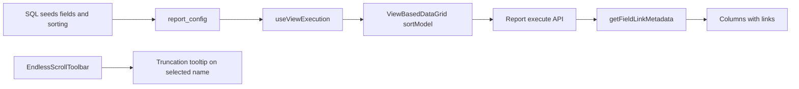

# Dashboard chart report UX fixes

## Decisions (grilled)

- **Scope:** Financial + operational dashboard chart-detail system reports only (`dashboard_*` / operation-dashboard details), not main Reports menu or all list pages.
- **Default sort:** Match [ReportViewer](components/reports/ReportViewer.tsx): each seed’s `report_config.sorting` = first visible column ASC; [ViewBasedDataGrid](shared/components/ViewBasedDataGrid/ViewBasedDataGrid.tsx) applies `report_config.sorting` when a report is selected.
- **Tooltips:** Selected Autocomplete value only, and only when the label is truncated.
- **Links:** Invoice # → invoice detail (`/customers/invoices/:id`); customer/name → customer page (existing `viewConfigs` handlers).
- **Rollout:** Update the 6 `create-dashboard-*-reports.sql` scripts and re-upsert so all accounts get the new config.

## Codebase scan

**Required**
- [shared/layout-components/grid/EndlessScrollToolbar.tsx](shared/layout-components/grid/EndlessScrollToolbar.tsx) — wrap selected Autocomplete input with truncation-aware Tooltip (reuse [endlessScrollToolbarTooltip.ts](shared/layout-components/grid/endlessScrollToolbarTooltip.ts) props).
- [shared/components/ViewBasedDataGrid/ViewBasedDataGrid.tsx](shared/components/ViewBasedDataGrid/ViewBasedDataGrid.tsx) — on `viewConfig` / report change, set `sortModel` from `viewConfig.sorting[0]` (map ASC/DESC → asc/desc); fall back to `config.defaultSort` when sorting empty; preserve manual user sort until report changes (same pattern as ReportViewer).
- [shared/utils/viewConfigs.ts](shared/utils/viewConfigs.ts) — align `dashboard_*` / operation `defaultSort` fallbacks to first visible column ASC for contexts that still use context default before a report loads.
- [server/services/ReportExecutionService.ts](server/services/ReportExecutionService.ts) `getFieldLinkMetadata` — add `invoice_number` → `{ type: "invoice", id }` using row `id` when primary is Invoice, or `invoice_id` / `Invoice.id` for payments; keep existing customer-name linking.
- Six SQL seeds under [scripts/database/](scripts/database/): remove primary `id` field entries; set `sorting` to first remaining (visible) field ASC:
  - `create-dashboard-customers-reports.sql`
  - `create-dashboard-invoices-reports.sql`
  - `create-dashboard-payments-reports.sql`
  - `create-dashboard-activities-reports.sql`
  - `create-dashboard-disputes-reports.sql`
  - `create-dashboard-promises-reports.sql`
- Re-run upserts against DB (or document/run existing sync path) so all accounts pick up seed changes.

**Optional / out of scope**
- Main Reports builder (`ReportService` first-field = `id` when sorting empty) — out of scope unless we later skip hidden `id` globally.
- Tooltip on every dropdown option — declined.
- Full audit of every possible missing `__link_` beyond invoice # + name — declined.
- Changing non-dashboard `VIEW_CONFIGS` (customers/invoices main lists) — out of scope.

**No change needed**
- [viewColumnGenerator.tsx](shared/components/ViewBasedDataGrid/viewColumnGenerator.tsx) link rendering — already consumes `__link_*` + `linkHandlers`.
- QueryBuilder always selecting primary `id` internally for row identity — already does; removing `id` from `fields` is safe.
- Export stripping id columns — already strips.

## Implementation notes

- After removing `id`, first visible field is typically `name` / `invoice_number` / `Customer.name` / activity title / dispute_number / promise date — use that for `sorting`.
- Keep Prisma/`entityIdField: "id"` in viewConfigs; identity still comes from query layer, not from visible columns.
- Unit tests: link metadata for invoice_number; ViewBasedDataGrid or ReportViewer-style sort init from `sorting` (extend existing report tests if present).

## Testing strategy

- Truncated long report name in dashboard overdue-customers dropdown shows tooltip; short name does not.
- Open overdue customers / invoice chart details: grid sorts by first visible column ASC; switching reports applies that report’s sorting.
- Invoice # and customer name are clickable to the correct routes.
- After SQL upsert, report_config no longer lists `id` in fields; Total Records still matches loaded rows.
- `npx tsc --noEmit` and relevant unit tests.