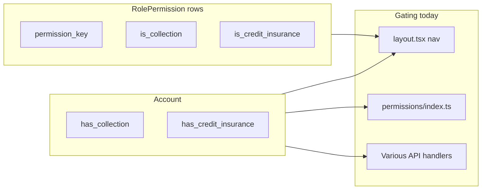

# Dynamic modules for Collection vs Credit Insurance

## What you have today (three layers)

1. **Account product switches** ([`prisma/migrations/20260412_credit_insurance_product.sql`](prisma/migrations/20260412_credit_insurance_product.sql), Prisma `Account`)
   - `has_collection` (default true), `has_credit_insurance` (default false).
   - Admin / account APIs can flip these (e.g. [`pages/api/entities/[...path].ts`](pages/api/entities/[...path].ts) account updates).

2. **Permission applicability** (`RolePermission`: `is_collection`, `is_credit_insurance`)
   - Used when cloning permissions between accounts ([`server/services/PermissionService.ts`](server/services/PermissionService.ts) `cloneRolePermissions`) so only permissions that apply to enabled products are copied.
   - Role UI can reflect product-specific toggles (alongside custom labels in [`app/[locale]/app/settings/roles/[role]/RolePermissions.tsx`](app/[locale]/app/settings/roles/[role]/RolePermissions.tsx)).

3. **Ad-hoc gating** (duplicated logic)
   - **Nav**: [`app/[locale]/app/layout.tsx`](app/[locale]/app/layout.tsx) — `hasCreditInsuranceProduct`, `isCreditOnlyAccount`, permission checks, and inline spread for Credit Dashboard vs hiding collection items.
   - **Permission catalog API**: [`pages/api/permissions/index.ts`](pages/api/permissions/index.ts) — hardcoded sets like `creditInsuranceOnlyPermissions`, `restrictedKeys`, `isCreditOnlyAccount` branches.
   - **First route after login**: [`shared/utils/navigation.ts`](shared/utils/navigation.ts) `getFirstAccessiblePage`.
   - **Feature APIs**: e.g. credit-insurance routes check `has_credit_insurance`; reports filter by product ([`server/services/ReportService.ts`](server/services/ReportService.ts), [`pages/api/permissions/index.ts`](pages/api/permissions/index.ts)).

## Goal

**One definition per “module”** (e.g. `collection`, `credit_insurance`, or finer slices like `credit_dashboard`) that drives:

- Which **permissions** appear in the catalog for an account.
- Which **nav items** render (and in what order).
- Optional: a shared **server assert** for APIs/routes.

## Recommended approach (incremental, fits this codebase)

### 1. Introduce a module registry (code-first, single source of truth)

Add something like [`server/config/productModules.ts`](server/config/productModules.ts) (or `shared/config/`) defining each module:

- `id` (stable string).
- `accountFlag`: e.g. `has_credit_insurance` / `has_collection` (or a small predicate `(account) => boolean`).
- `permissionKeys`: optional list of permissions that belong only to this module (replaces hardcoded sets in [`pages/api/permissions/index.ts`](pages/api/permissions/index.ts)).
- `navContributors`: optional descriptors consumed by layout (label i18n key, `href`, required permission, `hideWhen` e.g. credit-only).

**Filter rule**: For a given `Account` row, compute `enabledModuleIds`, then:

- **Catalog**: start from `PermissionService.getPermissionsByCategory()`, remove any permission whose owning module is disabled (instead of maintaining parallel Sets in the API handler).
- **Nav**: replace long conditional spreads in [`app/[locale]/app/layout.tsx`](app/[locale]/app/layout.tsx) with `buildNavItems(enabledModules, userPermissions)` that reads the same registry.

### 2. Align `RolePermission` metadata with the registry

- Ensure every permission that is “credit-only” or “collection-only” is tagged consistently in DB seeds / master templates (`is_credit_insurance`, `is_collection`) so clone behavior in [`PermissionService.cloneRolePermissions`](server/services/PermissionService.ts) stays correct.
- Optionally extend **static** metadata in [`PermissionService`](server/services/PermissionService.ts) (e.g. `permissionProductTags: Record<string, ModuleId[]>`) if you want filtering without scanning DB for catalog endpoints.

### 3. Centralize “credit-only account” rules

Today `isCreditOnlyAccount` logic and `restrictedForCreditOnly`-style lists live in both [`pages/api/permissions/index.ts`](pages/api/permissions/index.ts) and [`PermissionService.cloneRolePermissions`](server/services/PermissionService.ts).

- Move the **list of collection-only permissions / sections** next to the module registry (or derive from module `id === 'collection'`).
- Expose one helper: `getEffectivePermissionCatalog(account, baseCatalog)` used by the permissions API (and optionally by tests).

### 4. API route pattern

For new modules, use a small helper used at the top of route handlers:

- `requireAccountModule(accountId, 'credit_insurance')` → loads `Account` flags, throws 403 with stable error code (you already use patterns like `CREDIT_INSURANCE_DISABLED` in [`pages/api/entities/insurancePolicyHandlers.ts`](pages/api/entities/insurancePolicyHandlers.ts)).

## Heavier option (only if you need ops toggles without deploy)

- New tables: `ModuleDefinition` (key, label) and `AccountModule` (`account_id`, `module_key`, `enabled`) with admin UI.
- **Account flags** become defaults; `AccountModule` overrides for pilots / gradual rollout.
- Still keep the **registry** in code for routes, permissions, and nav wiring—DB only stores overrides.

## What not to do

- Avoid adding a third parallel place for “is this permission credit?” (keep registry + `RolePermission` flags in sync, or derive one from the other).

## Out of scope unless you ask

- i18n-only renames (already separate from module mechanics).
- Changing Prisma enums for new products (would be a migration + full audit of `has_*` columns).
