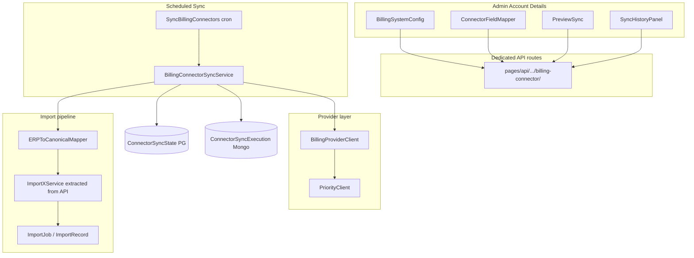
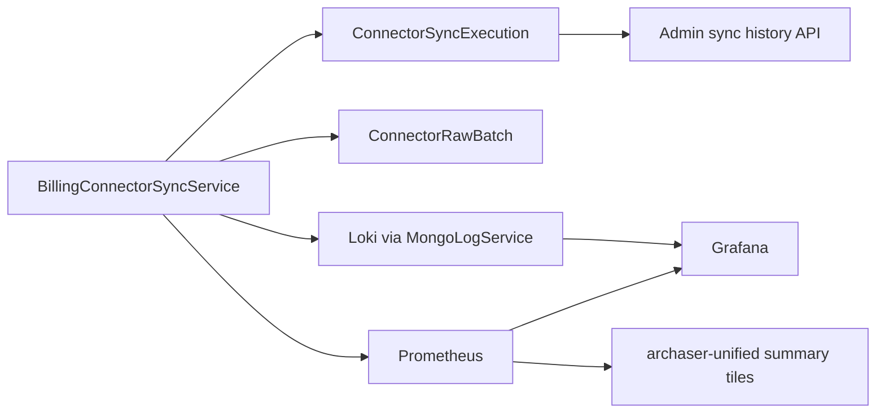
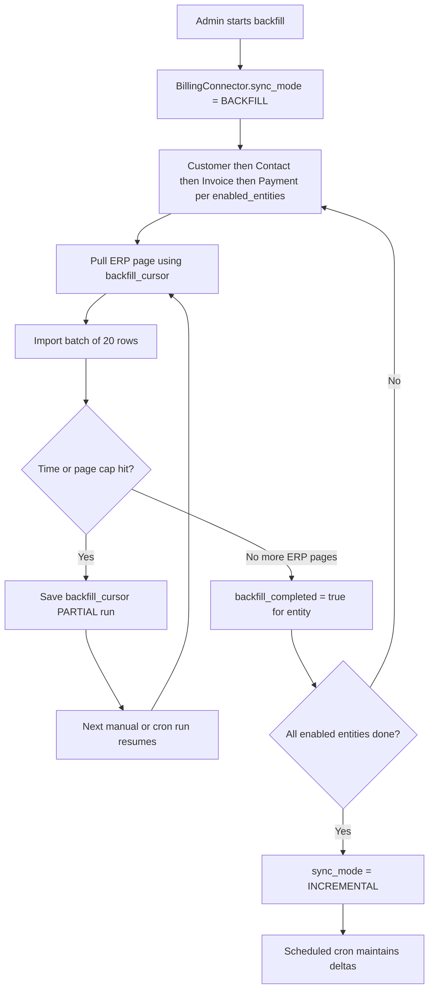
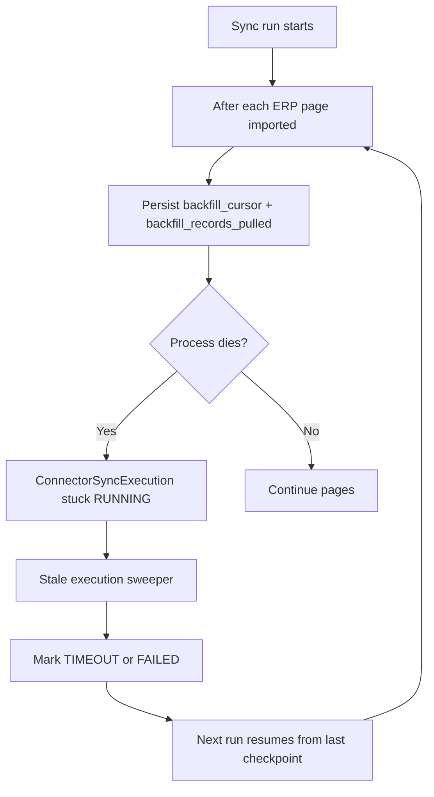
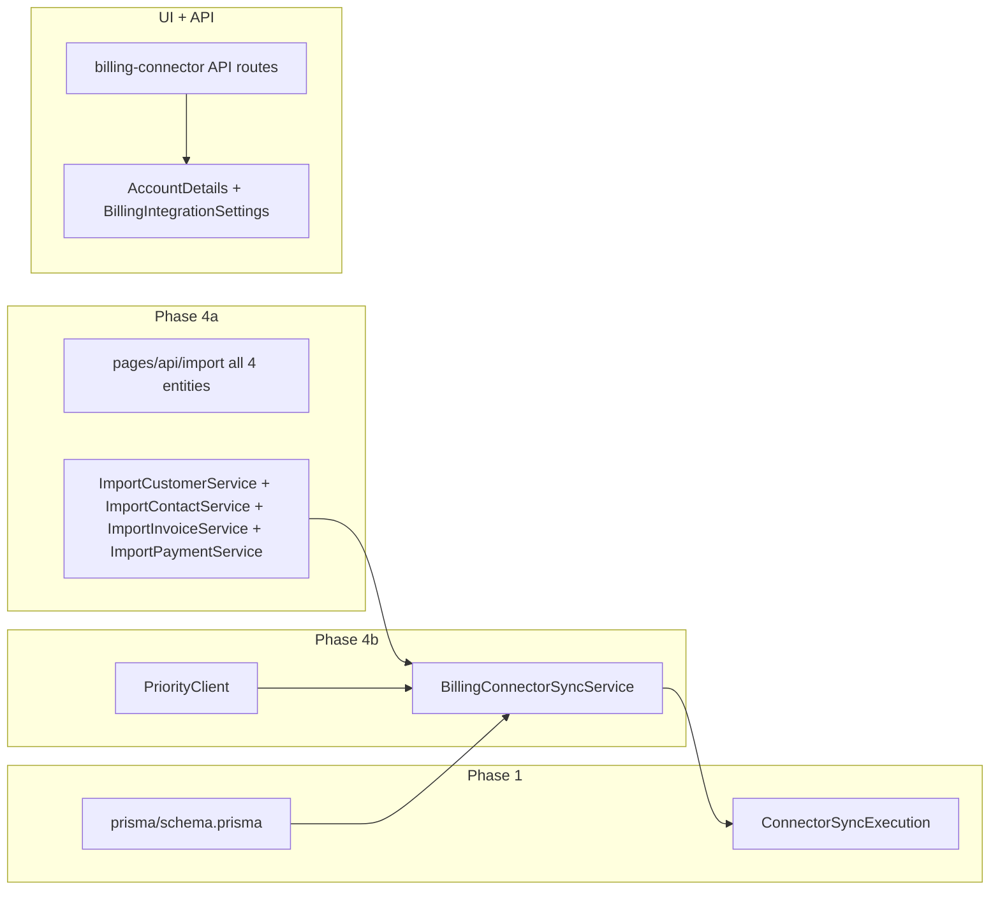

# ERP Billing Connector (Priority MVP)

## Context

Archaser already has mature **file import** flows with field mapping ([`FieldMapper.tsx`](shared/layout-components/import/FieldMapper.tsx)), saved mappings ([`UserImportMappings`](prisma/schema.prisma)), import execution ([`pages/api/import/*/index.ts`](pages/api/import/customer/index.ts)), and job tracking ([`ImportJobService`](server/services/ImportJobService.ts)). Cron infrastructure is **pull-based** via [`cronManager.ts`](server/services/cronManager.ts) + `GET /api/system/cron`.

There is **no live ERP integration today**. **Supersedes** [`.cursor/plans/inbound_connector_platform_676dd90a.plan.md`](.cursor/plans/inbound_connector_platform_676dd90a.plan.md) — intentional deltas: Mongo sync logs, backfill/crash recovery, four-entity MVP without separate Credit Note entity (credits via Invoice + `credit_for_invoice_number` per D4), dedicated API routes, observability split (pilot-minimal vs pre-prod full).

## MVP scope (pilot-first)

| In MVP | Deferred to post-pilot |
|--------|------------------------|
| Priority provider only | SAP Business One (stub in UI) |
| **Customer + Contact + Invoice + Payment** sync | — |
| Manual sync + scheduled cron | Minimal `archaser-billing-connector` dashboard + P0 alerts (unified tiles P1) |
| Mongo sync logs + Loki errors | — |
| Preview/dry-run sync | — |

All four import entities ship in MVP. Per-entity toggles in `enabled_entities` let pilots disable individual entities if needed, but the default is all four enabled.

## Decision log

Decisions locked via plan review (update if product changes):

| # | Topic | Decision | Rationale / plan impact |
|---|-------|----------|-------------------------|
| D1 | MVP entity scope | All four entities in pilot | Contact + Payment idempotency required before Phase 4b |
| D2 | Contact idempotency | `erp_contact_id` on Contact | Map Priority PK; extend `ImportContactService` + `ContactService` |
| D3 | Payment re-sync | Skip if exists — amount/date immutable | No upsert; lookup `(account_id, customer_id, reference)` |
| D4 | Credit notes | Negative invoices via Invoice + `credit_for_invoice_number` | Phase 0 must confirm; no fifth entity in MVP |
| D5 | `last_sync_date` | Cron-only scheduled INCREMENTAL success | Remove from file import; AppHeader copy is pilot P0 |
| D6 | Pre–Phase 0 work | Phase 0 ∥ Phase 4a only | Schema/UI/ERP wait on `priorityApiContract.ts` |
| D7 | Pilot observability | Minimal — Loki + 2 alerts (auth, connectors in error) + in-app sync history | Full Grafana dashboard + alerts 3–6 pre-prod |
| D8 | Backfill recompute | Once per ERP page (deduped `customer_id` set) | Not per 20-row batch |
| D9 | `erp_contact_id` scope | Per company — `@@unique([company_id, erp_contact_id])` where not null | Matches company-scoped contacts |
| D10 | Payment skip behavior | Skip silently; `entity_stats.skipped++`; DEBUG log only | Overlap re-pulls must not flood Loki |
| D11 | Partial scheduled failure | Strict — `last_sync_date` only when **all** enabled entities succeed | Per-entity `last_successful_run_at` in Billing tab (D15) |
| D12 | Phase 4a merge order | Customer → Invoice → Payment → Contact | Contact last pending `erp_contact_id` migration |
| D13 | Permissions (pilot) | `manage_billing_connector` → **archaser_admin only** | Credentials high-risk; customer Admin deferred post-pilot |
| D14 | Pilot accounts | **10013** internal dogfood first, then real Priority customer | Permission clone pattern uses 10013 as master |
| D15 | Per-entity sync UI | Billing tab: per-entity `last_successful_run_at` + backfill progress; AppHeader: account-level `last_sync_date` | Header stale on partial failure; tab shows entity truth |
| D16 | Feature flag UI | `billing_connector_enabled` toggle on General Information — **archaser_admin only** | Same pattern as `has_credit_insurance` |

## Architecture



## Key design decisions

| Decision | Choice | Rationale |
|----------|--------|-----------|
| Config UI location | **Admin Account Details** — "Billing integration" tab | Per user selection |
| Mapping scope | **Account-scoped** (`ConnectorFieldMapping`) | Cron runs without user context |
| Idempotency keys | **ERP primary key = Archaser natural key** | `customer_number` is the ERP primary key; maps 1:1 to existing import upsert (`@@unique([account_id, customer_number])`). Same pattern for `invoice_number`, etc. |
| Incremental sync | Overlap window + max ERP `updated_at` watermark | Avoid missed records during in-flight updates; idempotent upserts handle overlap duplicates |
| Sync logs | **MongoDB** `ConnectorSyncExecution` | Matches `CronJobExecution` pattern; Grafana via Prometheus + Loki |
| Import path | **Extracted import services** (Phase 4a before 4b) | De-risk refactor before ERP wiring |
| Provider extensibility | `BillingProviderClient` interface | Priority MVP; SAP B1 plugs in later |
| API routes | **Dedicated route tree** | Avoid extending large `[...path].ts` catch-all |
| Feature gating | `Account.billing_connector_enabled` + permissions | Safe pilot rollout |
| Grafana labels | **No `account_id` on Prometheus** | Prevent cardinality explosion; `account_id` in Loki only |
| **`Account.last_sync_date`** | **Only scheduled ERP connector sync** (`trigger=scheduled`) | AppHeader "last synced" reflects automated billing-system pull, not manual file import or admin "Run sync now" |
| **Initial backfill** | **`BACKFILL` mode** with `backfill_cursor` + per-entity `backfill_completed` | Large first import is resumable; `PARTIAL` runs expected; `INCREMENTAL` only after all entities backfilled |

---

## `last_sync_date` semantics

`Account.last_sync_date` (shown in [`AppHeader.tsx`](components/AppHeader.tsx)) answers: **when did the billing system last successfully sync on schedule?**

| Action | Updates `last_sync_date`? |
|--------|---------------------------|
| Manual **file import** (CSV/Excel via `/app/import`) | **No** — remove existing updates from import API routes |
| ERP connector **preview sync** (`mode=preview`) | **No** |
| ERP connector **manual sync** ("Run sync now", `trigger=manual`) | **No** |
| ERP connector **scheduled cron sync** (`trigger=scheduled`) | **Yes** — only when all enabled entities succeed on **INCREMENTAL** run (D11 strict) |

**Implementation:** Only `BillingConnectorSyncService` calls `updateAccountLastSyncDate()` and only when `trigger === 'scheduled'`, `sync_mode=INCREMENTAL`, and **all enabled entities** succeed (D11). File import refactor (Phase 4a) must **remove** all `prisma.account.update({ last_sync_date })` calls from [`pages/api/import/customer/index.ts`](pages/api/import/customer/index.ts), invoice, contact, payment, and [`pages/api/import/job/complete.ts`](pages/api/import/job/complete.ts). This is an intentional behavior change from today's codebase.

**Per-entity freshness (D15):** Billing integration tab shows `ConnectorSyncState.last_successful_run_at` per entity. AppHeader `last_sync_date` remains account-level cron success only; optional tooltip clarifies it excludes file import and manual sync.

**Note:** `ConnectorSyncState.last_max_updated_at` (incremental watermark) still advances on any successful ERP sync (manual or scheduled) so manual "Run sync now" can still pull deltas; only the user-visible `last_sync_date` is cron-exclusive.

---

## Idempotency and natural keys

Archaser imports already upsert by natural business keys. The ERP connector maps ERP primary keys directly:

| Entity | ERP primary key | Archaser field | Existing constraint |
|--------|-----------------|----------------|---------------------|
| Customer | ERP customer ID | `customer_number` | `@@unique([account_id, customer_number])` |
| Contact | ERP contact ID | `erp_contact_id` (new column) + `customer_number` linkage | `@@unique([company_id, erp_contact_id])` where not null (D9) |
| Invoice | ERP invoice ID | `invoice_number` | Per-account uniqueness in import logic; credit notes via `credit_for_invoice_number` (D4) |
| Payment | ERP payment reference | `reference` + `customer_number` + `invoice_number` | `@@unique([account_id, customer_id, reference])` — **skip if exists** (D3/D10), do not insert duplicate |

**Mapping requirement:** `customer_number` mapping is mandatory for Customer entity and must map to the ERP primary key field. Phase 0 confirms the Priority field name (e.g. `CUSTNAME`). Contact mapping must include ERP PK → `erp_contact_id`.

**Payment skip (D10):** `ImportPaymentService` looks up existing `InvoicePayment` by `(account_id, customer_id, reference)`. If found → success with `skipped` count; DEBUG log only. Payments are immutable — no amount/date update path.

**Overlap safety:** Re-pulling the same ERP record during overlap window hits existing upsert paths (Customer, Invoice, Contact) or skip path (Payment) — no duplicates.

---

## Invoice import ordering (credit insurance)

Credit insurance **capacity gap** and **terms breach** use FIFO allocation by invoice age ([`syncInvoiceCapacityGapFlags.ts`](server/services/creditInsurance/syncInvoiceCapacityGapFlags.ts) — "FIFO by invoice_date"). Importing invoices out of order can assign `in_capacity_gap` / breach flags incorrectly before post-import recomputation runs.

**Requirement:** All invoice imports must process rows in deterministic order:

1. `invoice_date` **ascending** (oldest first)
2. `invoice_number` **ascending** when `invoice_date` is equal (stable string sort)

Applies to:

| Path | Where to sort |
|------|----------------|
| **File import** | [`pages/api/import/invoice/index.ts`](pages/api/import/invoice/index.ts) → `ImportInvoiceService` (Phase 4a), before `InvoiceService.createMany` |
| **ERP connector sync** | `BillingConnectorSyncService` / `ERPToCanonicalMapper`, after mapping, before `ImportInvoiceService` |
| **Preview sync** | Same sort (validates order user will get on full sync) |

**Implementation:**

- **New shared helper:** `server/services/import/sortInvoicesForImport.ts` — pure function, unit-tested; normalizes dates before compare
- **Single call site** in `ImportInvoiceService` so file + connector paths cannot diverge
- Sort **per customer** when batch contains multiple customers (group by `customer_number`, sort within each group, process groups in stable customer order)
- Preserve original row `index` in `ImportRecord` metadata for result-page display after reorder

**Post-import:** Continue calling [`postImportOverdueMetrics`](server/services/creditInsurance/postImportOverdueMetrics.ts) + [`syncInvoiceCapacityGapFlagsForCustomer`](server/services/creditInsurance/syncInvoiceCapacityGapFlags.ts) after import — ordering reduces transient wrong flags during import, not a substitute for recompute.

**Follow-up alignment (optional):** [`syncInvoiceCapacityGapFlagsForCustomer`](server/services/creditInsurance/syncInvoiceCapacityGapFlags.ts) currently uses `orderBy: [{ invoice_date: "asc" }, { id: "asc" }]`. Consider changing tiebreaker to `invoice_number` asc for consistency with import order (separate small PR if needed).

---

## Phase 0 — Priority API discovery spike (blocking)

Before schema/UI work ships to production:

- Confirm Priority auth mechanism: `api_key` (static token in header) | `oauth2_client_credentials` (client_id + client_secret → bearer token) | `basic` (username + password) — determines `auth_type` value and `credentials_encrypted` structure (see schema)
- Confirm base URL pattern, token header name, token expiry
- Document endpoints + pagination for: customers, contacts, invoices, payments
- Confirm **incremental filter** field per entity (`UPDATEDATE`, change log, etc.)
- Confirm **ERP primary key field names** per entity (validate `customer_number` = Priority customer PK)
- Confirm **delete semantics** (does Priority expose deleted records? — see gate below)
- Confirm **timezone** on date fields vs account locale
- Confirm **rate limits**, `Retry-After` header behavior, and recommended batch size
- Confirm **backoff interval:** does Priority send `Retry-After`? If not, default to exponential 5/15/30s
- Confirm **token lifetime** and whether token refresh is possible mid-session (see token expiry gate below)
- Confirm **Priority sandbox / test environment** — required for PriorityClient integration tests without hitting production
- **Overlap window test:** change a record, re-pull with 5-minute overlap, verify upsert not duplicate
- Confirm whether any endpoint returns **total record count** (`X-Total-Count`, first-page metadata, or dedicated count endpoint) — determines if `backfill_total_records` progress bar is possible in admin UI
- Capture 2–3 sample payloads per entity for mapping UI + unit tests
- **Produce a minimal mock server** (e.g. `scripts/testing/priority-mock-server.ts` using `msw` or a simple Express server) from the sample payloads, so developers can run and test `PriorityClient` locally without a real Priority instance
- Output: `server/integrations/priority/priorityApiContract.ts` (types + endpoint config)

**Phase 0 outcome gates (blocking Phase 4b):**

| Gate | If Yes | If No |
|------|--------|-------|
| Priority exposes deleted records | Must decide: soft-delete in Archaser / ignore + alert / flag only; implement before Phase 4b ships | Document as known gap; no delete sync in MVP |
| Token has short lifetime (< 1h) and no refresh API | Implement token refresh flow in `PriorityClient`; add `credentials_encrypted` refresh fields | Treat expiry as `auth` error → circuit breaker after 3 runs |
| No Priority sandbox exists | All PriorityClient integration tests must use recorded fixtures (VCR pattern) | Use sandbox directly in CI |

---

## Phase 1 — Data model (PostgreSQL + MongoDB split)

Sync **configuration and watermarks** stay in PostgreSQL. **Sync run logs** go to **MongoDB**.

### PostgreSQL (Prisma) — [`prisma/schema.prisma`](prisma/schema.prisma)

#### `Account` (add field)
- `billing_connector_enabled` (Boolean, default `false`) — feature flag per account; toggled on **General Information** by **archaser_admin only** (D16)

#### `Contact` (add field — D2/D9)
- `erp_contact_id` (String?, VarChar) — Priority contact PK; mapped from connector field mapping
- `@@unique([company_id, erp_contact_id])` where `erp_contact_id` is not null

#### Enums

- `BillingProvider`: `PRIORITY`, `SAP_BUSINESS_ONE` (stub)
- `ConnectorSyncMode`: `BACKFILL`, `INCREMENTAL` — connector-level mode (see Phase 4c)
- `ConnectorAuthType`: `API_KEY`, `OAUTH2_CLIENT_CREDENTIALS`, `BASIC` — determines `credentials_encrypted` shape; Phase 0 confirms which Priority uses

#### `BillingConnector` (1 per account)
- `account_id` (unique), `provider` (`BillingProvider`), `status` (`Active` / `Disabled` / `Error`)
- `base_url`, `auth_type` (`ConnectorAuthType` enum: `API_KEY` | `OAUTH2_CLIENT_CREDENTIALS` | `BASIC`)
- `credentials_encrypted` (JSON blob — AES-encrypted; never return raw values in GET; shape per `auth_type`):
  - `API_KEY`: `{ token: string }`
  - `OAUTH2_CLIENT_CREDENTIALS`: `{ client_id: string, client_secret: string, token_endpoint: string, access_token?: string, access_token_expires_at?: string, refresh_token?: string }`
  - `BASIC`: `{ username: string, password: string }`
- `sync_enabled`, `sync_cron_expression` (default e.g. `0 */6 * * *`)
- `sync_mode` (`ConnectorSyncMode`, default `BACKFILL`) — `INCREMENTAL` only when all **enabled** entities have `backfill_completed = true`
- `enabled_entities` (Json array of `ImportType`) — default MVP: `[Customer, Contact, Invoice, Payment]`
- `sync_overlap_minutes` (Int, default `5`) — used in `INCREMENTAL` only; **0 during `BACKFILL`**
- `backfill_max_pages_per_run` (Int, default `50`) — ERP pages per entity per run
- `backfill_max_duration_seconds` (Int, default `600`) — per-run time cap
- `backfill_import_batch_size` (Int, default `20`) — rows per `ImportJob` batch (matches file import)
- `consecutive_auth_failures` (Int, default `0`) — circuit breaker counter
- `backfill_started_at` (DateTime?) — set on first backfill run
- `last_connection_test_at`, `last_connection_error`
- Audit: `created_by`, `modified_by`, timestamps
- **Soft-delete only:** no hard delete in MVP — use `status=Disabled` or `status=Error`; if a connector must be removed, archive via API (status + `sync_enabled=false`). Mongo `ConnectorSyncExecution` history is retained and queryable by `connector_id`. Hard delete cascades `ConnectorSyncState` (Postgres FK) but orphans Mongo history — document this in the `backfill/reset` API and any future delete endpoint.

#### `ConnectorFieldMapping`
- `connector_id`, `import_type` (`ImportType`)
- `mapping` (Json) — typed as `MappingRule[]` where `MappingRule = { archaserField: string, erpField: string, transform?: 'date' | 'boolean' | 'trim' | 'currency_code' }` — validated on PUT, not just stored as raw JSON
- `is_complete` (Boolean)
- `modified_by`, `modified_at` — auditable; included in `SettingsAuditLogService` on every save
- Unique `(connector_id, import_type)`

**Nested JSON paths:** `erpField` supports dot notation (e.g. `CUSTOMERS.CUSTNAME`). Mapper resolves nested paths.

#### `ConnectorSyncState` (per-entity sync progress — backfill + incremental)
- `connector_id`, `entity_type` (`ImportType`)
- **Backfill (per entity):**
  - `backfill_completed` (Boolean, default `false`)
  - `backfill_completed_at` (DateTime?)
  - `backfill_cursor` (String? / Json?) — ERP pagination token; resume next run; cleared when `backfill_completed`
  - `backfill_records_pulled` (Int, default `0`) — progress counter for admin UI
  - `backfill_last_checkpoint_at` (DateTime?) — updated on each per-page checkpoint; drives stale-backfill alert
  - `backfill_window_end` (DateTime?) — optional date-window chunking (Phase 0); null = full history pull
  - `backfill_total_records` (Int?) — set from `PullPage.totalCount` if `supportsFeature(TOTAL_COUNT)`; enables progress bar in UI; null = counter only
- **Incremental (after backfill):**
  - `last_max_updated_at` (DateTime?) — max ERP `updated_at` from last successful incremental batch; null until backfill completes; determines next pull window (`last_max_updated_at - sync_overlap_minutes`)
  - `last_successful_run_at` (DateTime?) — wall-clock time of last run where this entity produced at least one success; used for UI "last synced" display and `stale_incremental` gauge
- **Shared:**
  - `last_attempt_at`, `last_error` (short summary)
- Unique `(connector_id, entity_type)`

**Watermark rule:** Do **not** set `last_max_updated_at` during `BACKFILL` until `backfill_completed = true` for that entity. Mid-backfill `PARTIAL` runs only advance `backfill_cursor` and `backfill_records_pulled`.

**`ConnectorSyncState` initialization:** rows are created by `BillingConnectorService.create()` immediately after the `BillingConnector` row is saved — one row per entity in `enabled_entities` at time of creation. When `enabled_entities` changes (PUT config), `BillingConnectorService` upserts missing `ConnectorSyncState` rows. Lazy creation on first sync run is **not** used — the UI always has state rows to display. If a `ConnectorSyncState` row is missing at sync time, treat it as a hard error (misconfiguration), not a silent init.

### MongoDB — `ConnectorSyncExecution` (sync run logs)

Model: `models/ConnectorSyncExecution.ts`. Service: `server/services/ConnectorSyncExecutionService.ts`. Mirror [`CronJobExecution`](models/CronJobExecution.ts).

| Field | Purpose |
|-------|---------|
| `connector_id`, `account_id`, `provider` | Identity (`account_id` for Loki/API, not Prometheus labels) |
| `trigger` | `scheduled` \| `manual` \| `preview` \| `backfill` |
| `sync_mode` | `BACKFILL` \| `INCREMENTAL` — mode at run start |
| `status` | `RUNNING` \| `SUCCESS` \| `FAILED` \| `PARTIAL` \| `TIMEOUT` |
| `started_at`, `completed_at`, `duration_seconds` | Run timing |
| `correlation_id` | Links to `CronJobExecution` |
| `entity_stats` | `{ [entity: string]: { pulled: number, success: number, failed: number, skipped: number } }` — typed shape, not raw object |
| `mapping_snapshot_hash` | MD5 of each entity's `ConnectorFieldMapping.mapping` JSON at run start — `{ [entity: string]: string }`; enables post-hoc investigation of "what mapping produced this data" |
| `import_job_ids` | Entity → `ImportJob.id` drill-down (see ImportJob granularity below) |
| `error_message`, `error_type` | Top-level failure |
| `error_details` | Per-step/per-entity errors |
| `performance_metrics` | Pages fetched, API latency, capped reason |

**ImportJob granularity:** one `ImportJob` is created **per entity per sync run** (not per page, not per batch). A full MVP backfill run creates up to 4 `ImportJob` rows (Customer, Contact, Invoice, Payment). `import_job_ids` maps `{ customer: <id>, contact: <id>, invoice: <id>, payment: <id> }` for enabled entities. Each `ImportJob` accumulates `ImportRecord` rows across all batches in that run. If a run is capped (status `PARTIAL`), the `ImportJob` is marked `Partial` (not `Completed`) so the admin can see progress without a new job per resume. On the next run, a new `ImportJob` is created for entities still in backfill — the old one is not extended across runs.

**TTL:** 90 days.

**Required indexes:**

| Index | Fields | Purpose |
|-------|--------|---------|
| Primary query | `{ connector_id: 1, started_at: -1 }` | Sync history panel, sweeper lookup |
| Account history | `{ account_id: 1, started_at: -1 }` | Admin API, Loki correlation |
| Status sweep | `{ status: 1, started_at: 1 }` | `findStaleRunning` query |
| TTL | `{ started_at: 1 }` with `expireAfterSeconds: 7776000` (90 days) | Automatic cleanup |

### MongoDB — `ConnectorRawBatch` (optional debug/replay)

- `sync_execution_id`, `entity_type`, `page_index`, `payload` (raw ERP page — see PII policy below)
- **TTL:** 14 days
- Enables mapping debug without re-calling Priority
- **Disabled by default in all environments** — enabled only when `BILLING_CONNECTOR_RAW_BATCH_ENABLED=true`; never enabled in production without explicit sign-off

**PII / data retention policy:** Raw ERP customer/invoice pages contain names, addresses, credit limits, and potentially national IDs (TIN/VAT). Before storing `payload`:
1. Strip fields identified as PII in `priorityApiContract.ts` (defined per entity post-Phase 0)
2. Keep only structural fields needed for mapping debug: field names + sample non-PII values
3. If stripping is not feasible for a payload shape, do **not** store — log a warning and skip `ConnectorRawBatch` for that page
4. Treat stored batches as sensitive data: access restricted to `manage_billing_connector` permission

**Security:** AES encryption for credentials (`BILLING_CONNECTOR_ENCRYPTION_KEY` env).

---

## Required environment variables

| Variable | Required | Purpose |
|----------|----------|---------|
| `BILLING_CONNECTOR_ENCRYPTION_KEY` | Yes | AES-256 key for `credentials_encrypted`; rotate requires re-encrypt all connectors |
| `BILLING_CONNECTOR_METRICS_CACHE_TTL_SECONDS` | No (default `60`) | How long `metricsUpdater` caches Postgres/Mongo aggregates between Prometheus scrapes |
| `BILLING_CONNECTOR_MAX_CONNECTORS_PER_RUN` | No (default `5`) | Max connectors processed per cron run |
| `BILLING_CONNECTOR_BACKFILL_RATE_LIMIT_BACKOFF_MS` | No (default `5000`) | Base backoff on rate limit hit (doubles per retry; max 30s) |

Add to `.env.example` and infra secrets manager (same pattern as existing `ENCRYPTION_KEY` / `MONGO_URI` etc.).

---

## Observability overview (Prometheus + Loki + MongoDB)



MongoDB is **not** a Grafana datasource — run history is exposed via admin API; metrics and logs feed Grafana.

### Prometheus — [`lib/metrics.ts`](lib/metrics.ts)

**Low-cardinality labels only:** `provider`, `entity_type`, `status`, `error_type`, `sync_mode` — **not** `account_id`.

| Metric | Type | Labels |
|--------|------|--------|
| `archaser_billing_connector_sync_total` | Counter | `provider`, `status`, `sync_mode`, `trigger` |
| `archaser_billing_connector_sync_duration_seconds` | Histogram | `provider`, `sync_mode` |
| `archaser_billing_connector_errors_total` | Counter | `provider`, `error_type`, `sync_mode` |
| `archaser_billing_connector_records_processed_total` | Counter | `provider`, `entity_type`, `result` |
| `archaser_billing_connector_connectors_in_error` | Gauge | `provider` |
| `archaser_billing_connector_last_checkpoint_timestamp` | Gauge | `provider` — max checkpoint age across connectors (from [`metricsUpdater.ts`](lib/metricsUpdater.ts)) |
| `archaser_import_jobs_stuck` | Gauge (existing) | add `source` label: `billing_connector` \| `file` |

Refresh gauges in [`lib/metricsUpdater.ts`](lib/metricsUpdater.ts) on each `/api/metrics` scrape (query Postgres `BillingConnector` + Mongo `ConnectorSyncExecution` aggregates).

**Performance note:** Prometheus scrapes every 15–30s. Querying both Postgres and Mongo on every scrape is expensive. `metricsUpdater` must cache results with TTL `BILLING_CONNECTOR_METRICS_CACHE_TTL_SECONDS` (default 60s) using the same in-memory cache pattern as other gauges in that file. Stale gauges by up to 60s are acceptable for these alert expressions (all use `for: 5m+` windows).

### Loki — [`MongoLogService`](server/services/MongoLogService.ts)

`source: "billing_connector.sync"`. **Required JSON fields** on every log line (flattened in details):

`account_id`, `connector_id`, `provider`, `sync_mode`, `trigger`, `status`, `error_type`, `correlation_id`, `sync_execution_id`, `entity_type`

LogQL examples:

```logql
# Errors for one account
{source="billing_connector.sync"} |= "ERROR" | json | account_id="12345"

# Incremental failures only (exclude expected backfill partials)
{source="billing_connector.sync"} | json | sync_mode="INCREMENTAL" | status=~"FAILED|TIMEOUT"

# Auth failures
{source="billing_connector.sync"} | json | error_type="auth"
```

Route alerts via existing [`sns-alerts`](grafana/provisioning/alerting/contact-points.yaml) contact point (same as cron/comms alerts).

---

## Observability dashboard strategy

Follow the existing **domain-split** pattern ([`archaser-cron`](grafana/provisioning/dashboards/production/archaser-cron-production.json), [`archaser-communications`](grafana/provisioning/dashboards/production/archaser-communications-production.json), [`archaser-unified`](grafana/provisioning/dashboards/production/archaser-unified-production.json)).

### Dedicated dashboard: `archaser-billing-connector-{env}.json` (yes — build this)

**Do not** merge billing connector into the cron dashboard. Cron shows the parent job `Sync Billing Connectors`; billing connector shows **per-connector / per-provider** health, backfill progress, and ERP-specific errors.

**Do not** create one mega “Import” dashboard mixing file upload + ERP sync — different triggers, audiences, and signals.

| Dashboard | Scope |
|-----------|--------|
| **`archaser-billing-connector`** (new) | ERP scheduled sync, backfill, circuit breaker, Priority errors, mapping failures |
| **`archaser-cron`** (existing) | Parent cron job health only |
| **`archaser-unified`** (existing) | 2–3 summary stat tiles + link to billing-connector dashboard |
| **Manual file import** | No dedicated dashboard; optional 1 panel on unified using existing `archaser_import_jobs_stuck{source="file"}` |

### MVP dashboard panels (minimum viable — ship with pilot, not deferred)

| Panel | Datasource | Purpose |
|-------|------------|---------|
| Connectors in error | Prometheus | `archaser_billing_connector_connectors_in_error` |
| Sync failures 24h | Prometheus | `increase(archaser_billing_connector_sync_total{status=~"FAILED|TIMEOUT"}[24h])` |
| Errors by `error_type` | Prometheus | `increase(archaser_billing_connector_errors_total[24h])` by `error_type` |
| Recent errors | Loki | `{source="billing_connector.sync"} \|= "ERROR"` |
| Incremental vs backfill runs | Prometheus | `increase(archaser_billing_connector_sync_total[24h])` by `sync_mode`, `status` |
| Checkpoint age | Prometheus | `time() - archaser_billing_connector_last_checkpoint_timestamp` |

### Post-MVP dashboard additions (P1)

- Backfill progress (connectors in `BACKFILL` vs `INCREMENTAL`)
- Duration p95 by `provider`
- Per-entity record counts (`entity_stats` summarized to metrics)
- Drill-down link template: Loki query with `$account_id` variable
- Row on [`archaser-alert-drilldown-{env}.json`](grafana/provisioning/dashboards/production/archaser-alert-drilldown-production.json) for connector failures

### In-app monitoring (complements Grafana)

| Surface | Purpose |
|---------|---------|
| [`app/.../admin/cron-jobs/page.tsx`](app/[locale]/app/admin/cron-jobs/page.tsx) | Cross-account connector summary row |
| Account Details → Billing integration | Per-account sync history, circuit breaker banner |
| `GET /api/admin/billing-connectors/health` (P1) | Global health for ops without Grafana |

---

## Observability & alerting (detailed)

### Alert design principles

1. **Mode-aware:** `PARTIAL` during `BACKFILL` is expected — do **not** page on-call. Alert on `PARTIAL`/`FAILED` when `sync_mode=INCREMENTAL`.
2. **Low-cardinality Prometheus** for paging; use **Loki** for per-account investigation (`account_id` in logs only).
3. **Severity:** `critical` = auth/circuit breaker/data stopped; `high` = incremental sync failing; `warning` = backfill stalled, elevated validation errors.
4. **Annotations:** include runbook hint and link to `archaser-billing-connector` dashboard.
5. **Staging parity:** duplicate rules in [`rules-staging.yaml`](grafana/provisioning/alerting/rules-staging.yaml) with `instance="Staging"`.

### Alert rule sketches (Grafana provisioning)

Add to [`grafana/provisioning/alerting/rules-production.yaml`](grafana/provisioning/alerting/rules-production.yaml):

#### P0 — Critical

**1. Billing connector auth failures**

```yaml
# uid: billing-connector-auth-failures-prod
title: Billing Connector Auth Failures
expr: increase(archaser_billing_connector_errors_total{instance="Production", error_type="auth"}[1h]) > 3
for: 5m
labels: { severity: critical, type: billing_connector }
annotations:
  summary: Repeated ERP authentication failures
  description: "Priority/auth errors exceeded threshold. Circuit breaker may trip. Check credentials on affected accounts."
```

**2. Connectors in error state**

```yaml
# uid: billing-connector-in-error-prod
title: Billing Connectors In Error State
expr: archaser_billing_connector_connectors_in_error{instance="Production"} > 0
for: 10m
labels: { severity: critical, type: billing_connector }
annotations:
  summary: One or more billing connectors in Error status
  description: "Connector circuit breaker or connection failure. Admin Account Details → Billing integration."
```

#### P0 — High

**3. No successful incremental sync in 24h (active connectors)**

Requires gauge from `metricsUpdater` counting connectors where `sync_enabled=true`, `sync_mode=INCREMENTAL`, and no `SUCCESS` scheduled run in 24h:

```yaml
# uid: billing-connector-no-success-24h-prod
title: Billing Connector No Incremental Success 24h
expr: archaser_billing_connector_stale_incremental_count{instance="Production"} > 0
for: 30m
labels: { severity: high, type: billing_connector }
```

**4. Incremental sync failed or timed out**

```yaml
# uid: billing-connector-incremental-failed-prod
title: Billing Connector Incremental Sync Failed
expr: increase(archaser_billing_connector_sync_total{instance="Production", sync_mode="INCREMENTAL", status=~"FAILED|TIMEOUT"}[1h]) > 0
for: 5m
labels: { severity: high, type: billing_connector }
```

**Loki-based (optional P0 if Prometheus labels insufficient):**

```logql
count_over_time({source="billing_connector.sync"} | json | sync_mode="INCREMENTAL" | status="FAILED" [1h]) > 0
```

#### P0 — Warning (backfill-specific)

**5. Backfill checkpoint stale 24h**

```yaml
# uid: billing-connector-backfill-stale-prod
title: Billing Connector Backfill Stalled
expr: (time() - archaser_billing_connector_last_checkpoint_timestamp{instance="Production"}) > 86400
for: 1h
labels: { severity: warning, type: billing_connector }
annotations:
  summary: Backfill cursor unchanged for 24h
  description: "Expected during long runs; alert if sync_enabled and no progress. Check Priority connectivity and logs."
```

**6. Stale RUNNING execution (sweeper should fire — alert if sweeper misses)**

```yaml
# uid: billing-connector-stale-running-prod
title: Billing Connector Stale RUNNING Execution
expr: archaser_billing_connector_stale_running_count{instance="Production"} > 0
for: 15m
labels: { severity: warning, type: billing_connector }
```

#### P1 — Medium

**7. Incremental PARTIAL (not backfill)**

```yaml
expr: increase(archaser_billing_connector_sync_total{instance="Production", sync_mode="INCREMENTAL", status="PARTIAL"}[6h]) > 2
for: 15m
labels: { severity: warning, type: billing_connector }
```

**8. Sustained rate limit / 5xx from Priority**

```yaml
expr: increase(archaser_billing_connector_errors_total{instance="Production", error_type=~"rate_limit|5xx"}[1h]) > 10
for: 10m
labels: { severity: warning, type: billing_connector }
```

**9. Import validation error spike**

```yaml
expr: increase(archaser_billing_connector_errors_total{instance="Production", error_type="import_validation"}[1h]) > 50
for: 15m
labels: { severity: warning, type: billing_connector }
```

**10. Billing connector import jobs stuck**

```yaml
expr: archaser_import_jobs_stuck{instance="Production", source="billing_connector"} > 0
for: 30m
labels: { severity: warning, type: billing_connector }
```

**11. Mapping incomplete but sync enabled** (gauge from `metricsUpdater`)

```yaml
expr: archaser_billing_connector_sync_enabled_unmapped_count{instance="Production"} > 0
for: 1h
labels: { severity: warning, type: billing_connector }
```

### New metrics required for alerts (add in P0 implementation)

| Metric | Source |
|--------|--------|
| `archaser_billing_connector_stale_incremental_count` | Postgres: enabled + INCREMENTAL + no scheduled SUCCESS in 24h |
| `archaser_billing_connector_stale_running_count` | Mongo: `RUNNING` older than timeout |
| `archaser_billing_connector_last_checkpoint_timestamp` | Max `backfill_last_checkpoint_at` or `last_attempt_at` per connector |
| `archaser_billing_connector_sync_enabled_unmapped_count` | Postgres: `sync_enabled` + incomplete mapping |
| `archaser_import_jobs_stuck{source}` | Extend existing stuck-job query with `metadata.source` filter |

### P0 / P1 implementation todos

#### P0 (before pilot production)

| ID | Task |
|----|------|
| P0-1 | Implement all `archaser_billing_connector_*` counters/gauges in [`lib/metrics.ts`](lib/metrics.ts) with `sync_mode`, `error_type` labels |
| P0-2 | Implement [`lib/metricsUpdater.ts`](lib/metricsUpdater.ts) aggregation from Postgres + Mongo |
| P0-3 | Emit structured Loki logs with required JSON fields on every sync step |
| P0-4 | Create minimal [`archaser-billing-connector-{env}.json`](grafana/provisioning/dashboards/production/archaser-billing-connector-production.json) (6 MVP panels above) |
| P0-5 | Add alert rules 1–6 to `rules-production.yaml` and `rules-staging.yaml`; route to `sns-alerts` |
| P0-6 | Cron admin summary row on [`cron-jobs/page.tsx`](app/[locale]/app/admin/cron-jobs/page.tsx) |
| P0-7 | Document runbook snippets in alert annotations (auth reset, resume backfill, check Loki by `account_id`) |

#### P1 (soon after pilot)

| ID | Task |
|----|------|
| P1-1 | Add 2–3 summary tiles to [`archaser-unified-{env}.json`](grafana/provisioning/dashboards/production/archaser-unified-production.json) linking to billing-connector dashboard |
| P1-2 | `GET /api/admin/billing-connectors/health` — global connector list with status, last run, sync_mode |
| P1-3 | Extend [`SystemMonitoringService.ts`](server/services/SystemMonitoringService.ts) or system-health page with connector failure check |
| P1-4 | Alert rules 7–11 (PARTIAL incremental, rate limit, validation spike, stuck import jobs, unmapped sync) |
| P1-5 | Drill-down panels in [`archaser-alert-drilldown-{env}.json`](grafana/provisioning/dashboards/production/archaser-alert-drilldown-production.json) |
| P1-6 | Optional: `archaser_import_jobs_stuck{source="file"}` panel on unified for manual import visibility |

### What existing alerts already cover

| Alert | Covers billing connector? |
|-------|---------------------------|
| `archaser_cron_jobs_overdue` | Parent job only — not per-account |
| `archaser_cron_jobs_not_run_24h` | Parent job only |
| `archaser_errors_1h` | Generic — noisy for connector-specific triage |
| MongoDB disconnected | Sync logs affected — indirect |

Billing connector needs **its own alert group** (`type: billing_connector`) as sketched above.

---

## Phase 2 — Admin UI (Account Details)

New tab in [`AccountDetails.tsx`](app/[locale]/app/admin/accounts/[AccountId]/details/AccountDetails.tsx): **Billing integration**. Gated by `billing_connector_enabled` + permissions.

### Section A — Connection
- Provider dropdown (Priority active; SAP B1 disabled / "Coming soon")
- Base URL, token (write-only on edit)
- Test connection
- Sync enabled toggle + cron schedule
- **Per-entity enable checkboxes** (Customer, Contact, Invoice, Payment)

### Section B — Field mapping
- [`ConnectorFieldMapper`](shared/layout-components/import/ConnectorFieldMapper.tsx) — nested paths, transforms, auto-map
- Discover fields API → dot-path `rawHeaders` + example values
- **`customer_number` mapping highlighted as required** (ERP primary key)
- Completeness indicator per entity

### Section C — Sync actions and history
- **Preview sync** (`mode=preview`) — pull + map + validate, no DB writes; show sample rows + errors
- **Start initial backfill** (`mode=backfill`) — kicks off resumable `BACKFILL`; show per-entity progress (`backfill_records_pulled` / `backfill_total_records` if available, cursor page, `backfill_completed`)
- **Run incremental sync now** (manual, only when `sync_mode=INCREMENTAL`) — optional catch-up without waiting for cron
- **Pause backfill** — `sync_enabled=false`; preserves `backfill_cursor` (no data loss)
- **Disable connector** — explicit action with confirmation dialog; sets `sync_enabled=false` + `status=Disabled`; preserves all history; clearly distinct from "Pause backfill"
- Sync history table from MongoDB `ConnectorSyncExecution`; `PARTIAL` during backfill is expected, not an error; show `mapping_snapshot_hash` mismatch warning if mapping changed since that run
- Drill-down to `ImportJob` per entity
- **Circuit breaker banner** when `status=Error` — show `last_connection_error`, prompt to fix credentials and re-enable
- **Sync in progress indicator** — when a non-stale `RUNNING` execution exists, disable all sync trigger buttons and show "Sync in progress since [time]". Applies to both cron-triggered and manually triggered runs. UI polls `GET /sync-runs` every 15s while indicator is active.

---

## Phase 3 — API routes (dedicated)

Use dedicated route tree (not `[...path].ts`):

```
pages/api/entities/accounts/[accountId]/billing-connector/
  index.ts              GET/PUT config
  test.ts               POST test connection
  sync.ts               POST sync (query: mode=preview|backfill|incremental)
  backfill/reset.ts     POST reset entity backfill state (admin, confirm)
  sync-runs.ts          GET paginated history
  mappings/[importType].ts   GET/PUT
  discover-fields/[importType].ts   POST
```

Audit via [`SettingsAuditLogService`](server/services/SettingsAuditLogService.ts). Credentials redacted via [`sanitizeDataForLogging`](server/utils/auditLogHelpers.ts).

**Pre-conditions enforced by API:**

| Route | Pre-condition | Error if missing |
|-------|--------------|-----------------|
| `POST discover-fields/[importType]` | `BillingConnector` row exists + `credentials_encrypted` set | `400 CONNECTOR_NOT_CONFIGURED` |
| `POST test` | `base_url` + `credentials_encrypted` in request body or existing connector | `400` |
| `POST sync?mode=backfill` | Mapping for each enabled entity marked `is_complete=true` | `422 MAPPING_INCOMPLETE` |
| `POST sync?mode=incremental` | `sync_mode=INCREMENTAL` (all entities `backfill_completed`) | `409 BACKFILL_NOT_COMPLETE` |
| `POST sync` (any mode) | No non-stale `RUNNING` execution exists for this connector | `409 SYNC_ALREADY_RUNNING` |
| `POST sync` (any mode) | Last completed run finished > 2 minutes ago (anti-spam) | `429 TOO_MANY_REQUESTS` with `Retry-After` |
| `PUT index.ts` (cron schedule) | `sync_cron_expression` is valid cron syntax + minimum interval ≥ 30 minutes | `400 INVALID_CRON_EXPRESSION` |

UI enforces the same flow: credentials → test connection → discover fields → map → preview → backfill.

**`sync_cron_expression` validation:** use a cron parser (e.g. `cron-parser`) to validate syntax on PUT. Reject expressions that resolve to intervals < 30 minutes. Show the resolved schedule ("every 6 hours") in the UI after save. Warn (but allow) if schedule is more frequent than Priority's recommended poll interval (Phase 0 output).

---

## Phase 4a — Import refactor (before ERP)

Extract callable services from import APIs — **no ERP code in this phase**. Merge order (D12): **four PRs** — Customer → Invoice → Payment → Contact (Contact last: depends on `erp_contact_id` migration).

- `server/services/import/ImportCustomerService.ts` — PR 1
- `server/services/import/ImportInvoiceService.ts` — PR 2; calls `sortInvoicesForImport`
- `server/services/import/ImportPaymentService.ts` — PR 3; **skip if exists** by `(account_id, customer_id, reference)` (D3/D10)
- `server/services/import/ImportContactService.ts` — PR 4; upsert by `(company_id, erp_contact_id)` (D2/D9)

Thin wrappers remain in `pages/api/import/*/index.ts`. **Regression tests** prove file import unchanged.

**Test-first approach (mandatory):** Before touching any import code, write the regression test suite against the existing `pages/api/import/*` handlers. Tests must cover current happy-path behavior (customer upsert, contact upsert, invoice upsert, payment upsert, field normalization, error handling). Only then perform the Phase 4a extraction. The same tests must pass against the new extracted services — if they don't, the refactor is incomplete. This ensures the tests are a true baseline, not a post-hoc description of the refactored code.

**Note:** Today's contact import creates new rows every time ([`pages/api/import/contact/index.ts`](pages/api/import/contact/index.ts) — "no deduplication"). Phase 4a PR 4 changes connector-ready behavior; file import may adopt `erp_contact_id` when column is mapped, or continue create-only until connector ships — decide in PR 4 implementation.

---

## Phase 4b — Sync engine

### Provider interface

```typescript
// server/integrations/billing/BillingProviderClient.ts

enum ConnectorFeature {
  DELETED_RECORDS = 'DELETED_RECORDS',       // provider exposes deleted/archived records
  TOTAL_COUNT     = 'TOTAL_COUNT',           // first-page or count endpoint returns total rows
  DATE_WINDOW     = 'DATE_WINDOW',           // pull() accepts a date-range filter
  TOKEN_REFRESH   = 'TOKEN_REFRESH',         // token can be refreshed mid-session
}

interface PullPage {
  records:     unknown[];        // raw ERP objects; schema defined per provider in priorityApiContract.ts
  nextCursor:  string | null;    // null = no more pages
  hasMore:     boolean;
  totalCount?: number;           // present only if supportsFeature(TOTAL_COUNT) = true
}

interface BillingProviderClient {
  testConnection():                                          Promise<void>;
  discoverFields(entity: ImportType):                       Promise<SourceField[]>;
  pull(entity: ImportType, since: Date | null, cursor?: string): Promise<PullPage>;
  getDeletedRecords?(entity: ImportType, since: Date):      Promise<string[]>; // ERP PKs; only if DELETED_RECORDS
  supportsFeature(feature: ConnectorFeature):               boolean;
}
```

`PriorityClient` implements this. `BillingConnectorSyncService` depends only on the interface. Using `supportsFeature()` instead of `instanceof` keeps the orchestrator provider-agnostic as SAP B1 is added.

### Services

```
server/integrations/
  billing/
    BillingProviderClient.ts
    BillingConnectorService.ts
    BillingConnectorSyncService.ts
    ERPToCanonicalMapper.ts      # nested paths + transforms
    connectorErrorClassification.ts
  priority/
    PriorityClient.ts
    priorityApiContract.ts
```

### Sync orchestration

For each active connector (`billing_connector_enabled`, `sync_enabled`, `status=Active`):

1. Resolve `sync_mode` from `BillingConnector.sync_mode` (`BACKFILL` until all enabled entities have `backfill_completed`)
2. Create `ConnectorSyncExecution` (`RUNNING`, `sync_mode`); log to Loki + Prometheus
3. Process **enabled entities** in order: Customer → Contact → Invoice → Payment — **skip entity if `backfill_completed=true` when `sync_mode=BACKFILL`** (entity already done in a prior run; do not re-backfill); in `INCREMENTAL` mode, process all enabled entities every run
4. Per entity (see **Phase 4c** for backfill details):
   - **BACKFILL:** pull with `backfill_cursor`, no `since` filter (or date window via `backfill_window_end`); cap pages/duration; import in batches of `backfill_import_batch_size`
   - **INCREMENTAL:** `since = last_max_updated_at - sync_overlap_minutes`
   - Map → `ImportXService` (invoices sorted per credit-insurance rules)
   - **Error classification** (see below)
   - **BACKFILL:** on run cap → save `backfill_cursor`, increment `backfill_records_pulled`, mark run `PARTIAL`; on ERP exhausted → `backfill_completed=true`, set `last_max_updated_at`, clear `backfill_cursor`
   - **INCREMENTAL:** on success advance `last_max_updated_at`; on failure no advance
5. When all enabled entities `backfill_completed`: set `BillingConnector.sync_mode = INCREMENTAL`
6. If `trigger === 'scheduled'` and `sync_mode=INCREMENTAL` and all enabled entities succeed: update `Account.last_sync_date`
7. Call `postImportOverdueMetrics` per affected customer after each ERP **page** of invoices (D8): dedupe `customer_id`s imported on that page, then recompute once per customer — not per 20-row batch, not once at entity end. During `INCREMENTAL`, call once per run per customer that received updated invoices. Skip on preview.
8. Finalize `ConnectorSyncExecution`; update metrics

### Error classification and retry

Mirror [`emailErrorClassification.ts`](server/utils/emailErrorClassification.ts) pattern:

| `error_type` | Retry in-run? | Advance watermark? | Circuit breaker? |
|--------------|---------------|--------------------|------------------|
| `auth` | No | No | Yes — increment `consecutive_auth_failures`; at 3 → `status=Error`, `sync_enabled=false` |
| `token_expired` | Yes — attempt refresh once (if Priority supports refresh per Phase 0 gate); if refresh fails → treat as `auth` | No | Only if refresh also fails |
| `mapping_config` | No | No | No |
| `rate_limit` | Yes — exponential backoff 5/15/30s (or `Retry-After` header value); max 3 attempts | No if all retries fail | No |
| `timeout`, `5xx` | Yes — exponential backoff 5/15/30s; max 3 attempts | No if all retries fail | No |
| `import_validation` | No | Yes for successful rows in batch | No |

**Token expiry mid-run:** If Phase 0 confirms Priority tokens can expire during a 600-second run:
- `PriorityClient` detects 401 → attempts one token refresh before returning `token_expired`
- If refresh succeeds: resume the current page (no cursor advance, no circuit breaker increment)
- If refresh fails: treat as `auth` error, increment `consecutive_auth_failures`, abort run
- `credentials_encrypted` must store enough data for refresh (e.g. refresh token or client secret); Phase 0 confirms the exact fields needed

### Preview sync

`mode=preview`: steps 1–3 through map + validate only; `ConnectorSyncExecution.trigger=preview`, no `ImportJob` writes, no watermark advance.

---

## Phase 4c — Initial backfill (large first import)

First ERP pull is typically **large** (full customer, contact, invoice, and payment history). Treat it as a **resumable backfill**, not a single sync run.



### Schema fields (summary)

| Location | Field | Purpose |
|----------|-------|---------|
| `BillingConnector` | `sync_mode` | `BACKFILL` \| `INCREMENTAL` |
| `BillingConnector` | `backfill_started_at` | When initial load began |
| `BillingConnector` | `backfill_max_pages_per_run` | Cap ERP pages per run |
| `BillingConnector` | `backfill_max_duration_seconds` | Cap wall-clock per run |
| `BillingConnector` | `backfill_import_batch_size` | Rows per import batch (default 20) |
| `ConnectorSyncState` | `backfill_completed` | Per-entity completion flag |
| `ConnectorSyncState` | `backfill_completed_at` | When entity backfill finished |
| `ConnectorSyncState` | `backfill_cursor` | ERP pagination resume token |
| `ConnectorSyncState` | `backfill_records_pulled` | Progress counter for UI |
| `ConnectorSyncState` | `backfill_window_end` | Optional date-window chunk (Phase 0) |

### Backfill pull rules

- **No overlap window** during `BACKFILL` (`sync_overlap_minutes` ignored)
- **Do not advance `last_max_updated_at`** until `backfill_completed = true` for that entity
- **`PARTIAL` runs are expected** — not a failure; cron/manual resumes from `backfill_cursor`
- **Entity order enforced:** Customer backfill before Contact and Invoice (contacts and invoices reference `customer_number`); Invoice backfill before Payment (payments reference `invoice_number` + `customer_number`)
- **Invoice batches:** sort by `invoice_date` asc, `invoice_number` asc; group by customer when batching
- **`postImportOverdueMetrics`:** once per ERP page per deduped affected customer (D8), not per batch or end of entity

### Run caps (defaults)

| Cap | Default | On hit |
|-----|---------|--------|
| `backfill_max_pages_per_run` | 50 | Save `backfill_cursor`, status `PARTIAL` |
| `backfill_max_duration_seconds` | 600 | Same |
| `backfill_import_batch_size` | 20 | Next batch in same run until page/duration cap |

### Adding entities mid-backfill / mid-INCREMENTAL

| Scenario | Rule |
|----------|------|
| Add entity to `enabled_entities` while `sync_mode=BACKFILL` | Entity gets `backfill_completed=false` + no cursor (starts from scratch); already-running backfill for other entities is not affected |
| Add entity to `enabled_entities` while `sync_mode=INCREMENTAL` | **`sync_mode` reverts to `BACKFILL`**; the new entity needs full backfill; existing entities retain their `backfill_completed=true` and `last_max_updated_at`, but **do not process as INCREMENTAL** until the connector returns to `sync_mode=INCREMENTAL` | 
| Remove entity from `enabled_entities` | Set `sync_enabled=false` for that entity type; do not delete `ConnectorSyncState`; `sync_mode` unchanged |

**Not supported in MVP:** removing an entity while its backfill is in progress (partial `backfill_cursor` present). Admin should pause backfill, update entities, then resume.

### Transition to incremental

When entity ERP pull returns no more pages:

1. Set `ConnectorSyncState.backfill_completed = true`, `backfill_completed_at = now()`
2. Clear `backfill_cursor`
3. Set `last_max_updated_at` from max ERP `updated_at` seen across backfill
4. When **all** enabled entities complete → `BillingConnector.sync_mode = INCREMENTAL`
5. First **scheduled** incremental success updates `Account.last_sync_date` (manual backfill does not)

### Optional: date-window chunking

If Phase 0 confirms Priority supports date-range filters on `invoice_date` / `UPDATEDATE`:

- Walk history in windows (e.g. by year) using `backfill_window_end`
- Reduces memory and makes UI progress meaningful (“Invoices 2022: complete”)

### Cron during backfill

- Cron **may** run backfill for connectors in `BACKFILL` mode (resume cursor) — same job as incremental, mode-aware
- Do **not** alert on `PARTIAL` during `BACKFILL`; alert if `backfill_cursor` unchanged for 24h with `sync_enabled=true`

### Admin API

- `POST .../billing-connector/sync?mode=backfill` — start/resume backfill
- `GET .../billing-connector` — include `sync_mode`, per-entity `backfill_completed`, `backfill_records_pulled`, `backfill_cursor` present (not value)
- `POST .../billing-connector/backfill/reset` — admin-only reset (with confirmation)

### Crash recovery (unintentional stop)

Unintentional stops include: process crash, deploy mid-run, cron **timeout**, unhandled exception, Priority network drop, or OOM. Goal: **no silent data loss**, **no false “caught up”**, **resume without admin intervention** when possible.



#### 1. Cursor checkpoint frequency

**Checkpoint after every successfully imported ERP page** (not only at run end):

| When | Persist to `ConnectorSyncState` |
|------|-----------------------------------|
| ERP page fetched + all rows in page imported | `backfill_cursor` = next page token |
| Same moment | `backfill_records_pulled` += page row count |
| Same moment | `last_attempt_at`, clear `last_error` |

If crash happens **during** import of a page, cursor still points at **start of that page** — safe to re-pull and re-import (see idempotency below).

`backfill_last_checkpoint_at` on `ConnectorSyncState` is updated on each checkpoint (required — drives alert rule #5).

**Incremental mode:** checkpoint `last_max_updated_at` only after a **full successful run** (unchanged). On crash mid-incremental run, watermark does not advance; overlap on next run covers the gap.

#### 2. Stale `RUNNING` execution sweeper

Before starting a new sync for a connector, `BillingConnectorSyncService` (or cron preamble) must:

1. Find `ConnectorSyncExecution` with `status=RUNNING` for this `connector_id`
2. If `started_at` older than `backfill_max_duration_seconds + 120s` buffer (or connector-specific timeout):
   - Mark execution `TIMEOUT` (or `FAILED` if `error_message` present)
   - Log ERROR to Loki with `error_type=timeout`, `sync_execution_id`
   - **Do not** clear `backfill_cursor` or set `backfill_completed`
3. Allow new run to start — resumes from last checkpoint

Cron job rule (Phase 5): **skip** connector only while a non-stale `RUNNING` exists; stale runs are swept first.

Admin UI: show “Interrupted — will resume on next run” when latest execution is `TIMEOUT`/`FAILED` and `backfill_completed=false`.

#### 3. Idempotent re-import of last page

Re-pulling the same ERP page after crash must not create duplicates:

- **Customers:** upsert by `(account_id, customer_number)` — ERP PK = `customer_number`
- **Invoices:** upsert by `(account_id, invoice_number)` (+ customer linkage)
- **Contacts / payments:** same natural-key upsert paths as file import

**Import batch transaction boundary:** each `backfill_import_batch_size` batch (20 rows) should commit independently. If a batch fails halfway:

- Successful rows within batch remain committed (if per-row upsert)
- Failed rows logged on `ImportRecord` with `processing_errors`
- Cursor stays at **page start** until entire page’s batches complete — then advance cursor

**Invoice ordering on re-import:** always re-sort page rows before import (`invoice_date` asc, `invoice_number` asc) so credit-insurance FIFO stays correct even on retry.

#### 4. What is *not* lost vs what needs retry

| State | After crash |
|-------|-------------|
| Rows already committed to DB | **Kept** |
| `backfill_cursor` at last checkpoint | **Resume point** |
| `backfill_completed` | Stays `false` |
| `last_max_updated_at` | Unchanged during `BACKFILL` |
| `BillingConnector.sync_mode` | Stays `BACKFILL` |
| In-flight ERP page (not checkpointed) | **Re-imported** on resume (idempotent) |
| `ImportJob` for interrupted run | May stay `Processing` — mark `Failed` or complete with partial counts in sweeper |
| Credit insurance flags | May be stale until next `postImportOverdueMetrics` for affected customers |

#### 5. Recovery actions (admin)

| Situation | Action |
|-----------|--------|
| Normal interrupt / timeout | None — next cron or “Start backfill” resumes |
| Cursor stuck 24h (alert) | Check Priority connectivity, logs; fix and resume |
| Repeated failures on same page | Inspect `ImportRecord` errors; fix mapping; resume |
| Corrupt cursor / need full re-walk | `POST .../backfill/reset` for entity (confirm dialog) — re-pulls from start; upserts prevent duplicates |

#### 6. Implementation files

| File | Role |
|------|------|
| `BillingConnectorSyncService.ts` | Checkpoint after each page; call sweeper on start |
| `server/integrations/billing/staleSyncExecutionSweeper.ts` | **New** — mark stale `RUNNING` → `TIMEOUT` |
| `ConnectorSyncExecutionService.ts` | `findStaleRunning(connectorId, olderThan)` |
| `syncBillingConnectors.ts` | Invoke sweeper before processing connectors |

#### 7. Tests

- Crash after page 3 of 10: cursor at page 4 start; resume imports pages 4–10; no duplicate customers/invoices
- Stale `RUNNING` older than timeout: sweeper marks `TIMEOUT`; new run starts
- Crash mid-batch within page: cursor unchanged; re-import page; idempotent upsert
- Incremental crash: `last_max_updated_at` unchanged; overlap re-pull succeeds

---

## Phase 5 — Cron job

1. SQL seed: `scripts/database/add-billing-connector-sync-cron-job.sql` — `Sync Billing Connectors`, every 15 min
2. `server/cron-jobs/syncBillingConnectors.ts` — register in [`cronManager.ts`](server/services/cronManager.ts)

**Time budget and caps** (cron runs one job at a time with timeout):

- `max_connectors_per_run` (default 5, configurable via `BILLING_CONNECTOR_MAX_CONNECTORS_PER_RUN`)
- Use `BillingConnector.backfill_max_pages_per_run` / `backfill_max_duration_seconds` in `BACKFILL`; resume via `backfill_cursor`
- In `INCREMENTAL`, standard page/duration caps; resume without advancing watermark on cap
- Run **stale execution sweeper** before each connector (see Phase 4c crash recovery); skip only non-stale `RUNNING`
- Per-connector schedule via `sync_cron_expression` vs latest `ConnectorSyncExecution`

**Connector processing order within a run:**

1. Connectors in `BACKFILL` mode with `sync_enabled=true` — ordered by `last_attempt_at` ASC (oldest first, ensures no connector starves)
2. Connectors in `INCREMENTAL` mode with `sync_enabled=true` — ordered by `last_attempt_at` ASC
3. Skip: `status=Error`, `sync_enabled=false`, non-stale `RUNNING` exists

Rationale: BACKFILL connectors get priority so the initial large import completes before incremental maintenance competes for slots.

---

## Phase 6 — SAP Business One (deferred)

Implement `SapBusinessOneClient` as `BillingProviderClient`. Enable in UI. No orchestrator changes.

---

## File impact analysis (codebase scan)

Scanned against current repo. **~45 existing files to modify**, **~25 new files**, **~15 reference-only**.

### Phase 0 — Discovery (new only)

| File | Action |
|------|--------|
| `server/integrations/priority/priorityApiContract.ts` | **New** — API types, endpoints, PK field names |

### Phase 1 — Schema and data model

| File | Action |
|------|--------|
| [`prisma/schema.prisma`](prisma/schema.prisma) | **Modify** — `Account.billing_connector_enabled`; `BillingConnector` (`sync_mode`, backfill caps); `ConnectorSyncState` (`backfill_cursor`, `backfill_completed`); enums |
| `scripts/database/add-billing-connector-tables.sql` (or Prisma migration) | **New** — PG schema |
| `models/ConnectorSyncExecution.ts` | **New** — Mongo sync run logs (mirror [`models/CronJobExecution.ts`](models/CronJobExecution.ts)) |
| `models/ConnectorRawBatch.ts` | **New** — optional raw ERP page storage |
| `server/services/ConnectorSyncExecutionService.ts` | **New** — Mongo CRUD/query |
| `server/utils/billingConnectorCrypto.ts` | **New** — credential encrypt/decrypt |
| [`types/Account.ts`](types/Account.ts) | **Modify** — add `billing_connector_enabled` to frontend type |

### Phase 2 — Admin UI

| File | Action |
|------|--------|
| [`app/[locale]/app/admin/accounts/[AccountId]/details/AccountDetails.tsx`](app/[locale]/app/admin/accounts/[AccountId]/details/AccountDetails.tsx) | **Modify** — new Billing integration tab, tab index routing |
| `app/.../details/components/BillingIntegrationSettings.tsx` | **New** — connection, entity toggles, mapping, preview sync, history |
| [`app/.../details/types.ts`](app/[locale]/app/admin/accounts/[AccountId]/details/types.ts) | **Modify** — connector form/display types |
| [`app/.../details/components/GeneralInformation.tsx`](app/[locale]/app/admin/accounts/[AccountId]/details/components/GeneralInformation.tsx) | **Modify (optional)** — `billing_connector_enabled` toggle (same pattern as `has_credit_insurance`) |
| [`app/[locale]/app/admin/accounts/AccountList.tsx`](app/[locale]/app/admin/accounts/AccountList.tsx) | **Modify (optional)** — connector status column |
| [`shared/layout-components/import/FieldMapper.tsx`](shared/layout-components/import/FieldMapper.tsx) | **Modify** — extract shared mapping table logic |
| `shared/layout-components/import/ConnectorFieldMapper.tsx` | **New** — ERP source fields, nested paths, transforms |
| `shared/constants/importEntityFields.ts` | **New (recommended)** — shared field catalogs from Processors |
| [`app/[locale]/app/import/customer/CustomerProcessor.tsx`](app/[locale]/app/import/customer/CustomerProcessor.tsx) | **Modify** — consume shared field catalog |
| [`app/[locale]/app/import/invoice/InvoiceProcessor.tsx`](app/[locale]/app/import/invoice/InvoiceProcessor.tsx) | **Modify** — consume shared field catalog |
| [`app/[locale]/app/import/contact/ContactProcessor.tsx`](app/[locale]/app/import/contact/ContactProcessor.tsx) | **Modify** — consume shared field catalog |
| [`app/[locale]/app/import/payment/PaymentProcessor.tsx`](app/[locale]/app/import/payment/PaymentProcessor.tsx) | **Modify** — consume shared field catalog |
| `shared/services/billingConnectorService.ts` | **New** — client for billing-connector API |
| [`locales/en/accounts.json`](locales/en/accounts.json) | **Modify** — tab/section strings (requires approval) |
| [`locales/he/accounts.json`](locales/he/accounts.json) | **Modify** — Hebrew strings (requires approval) |

### Phase 3 — API routes

| File | Action |
|------|--------|
| `pages/api/entities/accounts/[accountId]/billing-connector/index.ts` | **New** — GET/PUT config |
| `pages/api/entities/accounts/[accountId]/billing-connector/test.ts` | **New** — POST test connection |
| `pages/api/entities/accounts/[accountId]/billing-connector/sync.ts` | **New** — POST sync (`mode=preview\|backfill\|incremental`) |
| `pages/api/entities/accounts/[accountId]/billing-connector/backfill/reset.ts` | **New** — POST reset backfill cursor/completion for entity |
| `pages/api/entities/accounts/[accountId]/billing-connector/sync-runs.ts` | **New** — GET Mongo sync history |
| `pages/api/entities/accounts/[accountId]/billing-connector/mappings/[importType].ts` | **New** — GET/PUT mappings |
| `pages/api/entities/accounts/[accountId]/billing-connector/discover-fields/[importType].ts` | **New** — POST field discovery |
| [`pages/api/entities/[...path].ts`](pages/api/entities/[...path].ts) | **Modify** — `handleAccountsGET/PUT` for `billing_connector_enabled`; reference only for `import-mappings` pattern (~lines 9621+) |
| [`server/services/AccessControlService.ts`](server/services/AccessControlService.ts) | **Modify** — enforce `view_billing_connector` / `manage_billing_connector` |
| [`server/services/SettingsAuditLogService.ts`](server/services/SettingsAuditLogService.ts) | **Modify** — audit connector config/mapping changes |
| [`server/utils/auditLogHelpers.ts`](server/utils/auditLogHelpers.ts) | **Modify** — redact `credentials_encrypted` |

### Phase 4a — Import refactor (before ERP)

| File | Action |
|------|--------|
| [`pages/api/import/customer/index.ts`](pages/api/import/customer/index.ts) | **Modify** — thin wrapper; extract upsert logic; **remove** `last_sync_date` update; keep `triggerPostImportOverdueMetrics` |
| [`pages/api/import/invoice/index.ts`](pages/api/import/invoice/index.ts) | **Modify** — thin wrapper; **remove** `last_sync_date` update |
| [`pages/api/import/contact/index.ts`](pages/api/import/contact/index.ts) | **Modify** — thin wrapper; **remove** `last_sync_date` update |
| [`pages/api/import/payment/index.ts`](pages/api/import/payment/index.ts) | **Modify** — thin wrapper; **remove** `last_sync_date` update |
| [`pages/api/import/job/complete.ts`](pages/api/import/job/complete.ts) | **Modify** — **remove** `last_sync_date` update; keep `triggerPostImportOverdueMetrics` only |
| [`pages/api/import/job/create.ts`](pages/api/import/job/create.ts) | **Modify** — support `metadata.source = "billing_connector"` |
| [`pages/api/import/job/[jobId]/index.ts`](pages/api/import/job/[jobId]/index.ts) | **Modify (minor)** — expose `metadata.source` for sync-history drill-down |
| [`server/services/ImportService.ts`](server/services/ImportService.ts) | **Modify** — reuse types/normalization from extracted services |
| [`server/services/ImportJobService.ts`](server/services/ImportJobService.ts) | **Modify** — connector job metadata helpers |
| `server/services/import/ImportCustomerService.ts` | **New** |
| `server/services/import/ImportInvoiceService.ts` | **New** — calls `sortInvoicesForImport` before `InvoiceService.createMany` |
| `server/services/import/sortInvoicesForImport.ts` | **New** — `invoice_date` asc, `invoice_number` asc; per-customer grouping |
| `server/services/import/ImportContactService.ts` | **New** |
| `server/services/import/ImportPaymentService.ts` | **New** |
| `server/services/import/updateAccountLastSyncDate.ts` | **New** — single named export; co-located with import pipeline; alternatively a private method on `BillingConnectorSyncService` if no other caller needs it — decide at implementation time |

### Phase 4b — Sync engine and integrations

| File | Action |
|------|--------|
| `server/integrations/billing/BillingProviderClient.ts` | **New** — provider interface |
| `server/integrations/billing/BillingConnectorService.ts` | **New** — CRUD, test connection, circuit breaker |
| `server/integrations/billing/BillingConnectorSyncService.ts` | **New** — orchestration; BACKFILL/INCREMENTAL modes; calls `postImportOverdueMetrics` |
| `server/integrations/billing/backfillSync.ts` | **New** — backfill pull/import loop; complex enough to warrant its own file from day 1 rather than being embedded in `BillingConnectorSyncService` |
| `server/integrations/billing/staleSyncExecutionSweeper.ts` | **New** — mark stale `RUNNING` executions `TIMEOUT`; enable resume |
| `server/integrations/billing/ERPToCanonicalMapper.ts` | **New** — nested paths + transforms |
| `server/integrations/billing/connectorErrorClassification.ts` | **New** — mirror [`server/utils/emailErrorClassification.ts`](server/utils/emailErrorClassification.ts) |
| `server/integrations/priority/PriorityClient.ts` | **New** |
| [`server/services/creditInsurance/postImportOverdueMetrics.ts`](server/services/creditInsurance/postImportOverdueMetrics.ts) | **Reference** — call from sync service after invoice batches (Customer/Contact/Payment do not trigger credit-insurance recompute) |
| [`utils/genericFieldUtils.ts`](utils/genericFieldUtils.ts) | **Reference** — contact generic fields in mapping |

### Phase 5 — Cron and scheduling

| File | Action |
|------|--------|
| `server/cron-jobs/syncBillingConnectors.ts` | **New** — cron handler |
| [`server/services/cronManager.ts`](server/services/cronManager.ts) | **Modify** — import + `case "Sync Billing Connectors":` in switch |
| `scripts/database/add-billing-connector-sync-cron-job.sql` | **New** — seed `CronJob` row |
| [`pages/api/system/[...path].ts`](pages/api/system/[...path].ts) | **Reference** — cron trigger path (no change if job registered) |
| [`app/[locale]/app/admin/cron-jobs/page.tsx`](app/[locale]/app/admin/cron-jobs/page.tsx) | **Modify** — connector sync health summary row |
| [`pages/api/admin/cron-jobs/stats.ts`](pages/api/admin/cron-jobs/stats.ts) | **Modify (optional)** — include connector stats |

### Observability

| File | Action |
|------|--------|
| [`lib/metrics.ts`](lib/metrics.ts) | **Modify** — `archaser_billing_connector_*` + alert support gauges; `import_jobs_stuck{source}` |
| [`lib/metricsUpdater.ts`](lib/metricsUpdater.ts) | **Modify** — P0: aggregate connectors in error, stale incremental, stale RUNNING, checkpoint timestamp |
| [`pages/api/metrics.ts`](pages/api/metrics.ts) | **Reference** — unchanged |
| [`server/services/MongoLogService.ts`](server/services/MongoLogService.ts) | **Reference** — structured logs `source: billing_connector.sync` |
| `grafana/provisioning/dashboards/production/archaser-billing-connector-production.json` | **New** — P0 minimal dashboard |
| `grafana/provisioning/dashboards/staging/archaser-billing-connector-staging.json` | **New** |
| [`grafana/provisioning/alerting/rules-production.yaml`](grafana/provisioning/alerting/rules-production.yaml) | **Modify** — P0 alerts 1–6; P1 alerts 7–11 |
| [`grafana/provisioning/alerting/rules-staging.yaml`](grafana/provisioning/alerting/rules-staging.yaml) | **Modify** — staging parity |
| [`grafana/provisioning/dashboards/production/archaser-unified-production.json`](grafana/provisioning/dashboards/production/archaser-unified-production.json) | **Modify (P1)** — summary tiles + link |
| [`grafana/provisioning/dashboards/production/archaser-alert-drilldown-production.json`](grafana/provisioning/dashboards/production/archaser-alert-drilldown-production.json) | **Modify (P1)** — connector drill-down |
| `pages/api/admin/billing-connectors/health.ts` | **New (P1)** — global connector health |
| [`server/services/SystemMonitoringService.ts`](server/services/SystemMonitoringService.ts) | **Modify (P1)** — optional connector check |
| [`grafana/provisioning/dashboards/production/archaser-cron-production.json`](grafana/provisioning/dashboards/production/archaser-cron-production.json) | **Auto** — parent cron job only |

### Permissions and account seeding

| File | Action |
|------|--------|
| [`server/services/PermissionService.ts`](server/services/PermissionService.ts) | **Modify** — add `view_billing_connector`, `manage_billing_connector` keys |
| [`server/services/AccountService.ts`](server/services/AccountService.ts) | **Modify** — optional product gating in `cloneRolePermissions` |
| `scripts/database/grant-billing-connector-permission.sql` | **New** — grant **archaser_admin only** on account **10013** first (D13/D14); clone to pilot accounts when enabled — **do not** clone to all roles globally during pilot |
| [`scripts/database/grant-role-permissions.sql`](scripts/database/grant-role-permissions.sql) | **Reference** — clone template |
| [`shared/utility/permissionDependencies.ts`](shared/utility/permissionDependencies.ts) | **Modify (optional)** — permission deps |
| [`locales/en/security_roles.json`](locales/en/security_roles.json) | **Modify** — permission labels (requires approval) |
| [`locales/he/security_roles.json`](locales/he/security_roles.json) | **Modify** — permission labels (requires approval) |
| [`app/[locale]/app/settings/roles/[role]/RolePermissions.tsx`](app/[locale]/app/settings/roles/[role]/RolePermissions.tsx) | **Auto** — picks up new keys from API |

### Display and side effects (minor)

| File | Action |
|------|--------|
| [`components/AppHeader.tsx`](components/AppHeader.tsx) | **Modify (minor)** — display `last_sync_date` as scheduled ERP sync time only; optional copy/tooltip clarifying it excludes file import |
| [`shared/services/importMappingService.ts`](shared/services/importMappingService.ts) | **No change** — user-scoped file import mappings remain separate |
| [`app/[locale]/app/import/page.tsx`](app/[locale]/app/import/page.tsx) | **No change** — file import entry |
| [`shared/hooks/useFileParser.ts`](shared/hooks/useFileParser.ts) | **No change** — file-only |

### Tests

| File | Action |
|------|--------|
| `tests/unit/services/import/ImportCustomerService.test.ts` | **New** — regression vs current API |
| `tests/unit/services/import/ImportContactService.test.ts` | **New** — regression vs current API |
| `tests/unit/services/import/ImportInvoiceService.test.ts` | **New** |
| `tests/unit/services/import/ImportPaymentService.test.ts` | **New** — regression vs current API |
| `tests/unit/integrations/billing/BillingConnectorSyncService.test.ts` | **New** |
| `tests/unit/integrations/billing/ERPToCanonicalMapper.test.ts` | **New** |
| `tests/unit/integrations/priority/PriorityClient.test.ts` | **New** |
| [`tests/unit/services/import/ImportJobService.test.ts`](tests/unit/services/import/ImportJobService.test.ts) | **Modify** — billing metadata cases |
| [`tests/unit/services/business/PermissionService.test.ts`](tests/unit/services/business/PermissionService.test.ts) | **Modify** — new permission keys |
| [`tests/unit/scheduling/fixtures/mocks.ts`](tests/unit/scheduling/fixtures/mocks.ts) | **Modify (optional)** — connector cron mocks |
| [`scripts/testing/import-job-runner.ts`](scripts/testing/import-job-runner.ts) | **Modify (optional)** — connector test jobs |

### Critical path (minimum files for pilot)



1. [`prisma/schema.prisma`](prisma/schema.prisma) + Mongo models
2. Phase 4a import extraction (customer, contact, invoice, payment)
3. `BillingConnectorSyncService` + `PriorityClient`
4. Billing-connector API routes + `BillingIntegrationSettings.tsx`
5. [`cronManager.ts`](server/services/cronManager.ts) + cron seed
6. Metrics + Loki logging

### Files explicitly unchanged

- [`shared/services/importMappingService.ts`](shared/services/importMappingService.ts) — user file-import presets
- [`pages/api/import/[...path].ts`](pages/api/import/[...path].ts) — legacy router; verify no regression only
- Other Account Details tabs (PortalSettings, SSOSettings, AutomationSettings, etc.)
- [`grafana-datasources.yml`](grafana-datasources.yml) — no new datasource needed

---

## Testing strategy

| Test unit | Covers |
|-----------|--------|
| **Import refactor (4a)** | File import API unchanged; extracted services match prior behavior for all four entities |
| **PriorityClient** | Auth, pagination, incremental filter, rate-limit retry |
| **ERPToCanonicalMapper** | Nested paths, transforms, `customer_number` = ERP PK; contact/payment natural-key mapping |
| **sortInvoicesForImport** | Date asc, invoice_number asc; per-customer batches; stable tiebreaker; edge cases: empty array, all same date, null `invoice_date`, null `invoice_number`, non-ISO date strings, mixed date formats |
| **ImportCustomerService** | Customer upsert by `(account_id, customer_number)` |
| **ImportContactService** | Contact upsert by natural key; `customer_number` linkage required |
| **ImportInvoiceService** | Sorts before createMany; file + connector share same path |
| **ImportPaymentService** | Payment upsert by reference/composite key; invoice + customer linkage |
| **Watermark + overlap** | Advance on max `updated_at` only; overlap re-pull upserts not duplicates |
| **Error classification** | Auth → circuit breaker; 5xx → retry; validation → partial |
| **Preview sync** | No DB writes, no watermark advance |
| **Initial backfill** | Resumes via `backfill_cursor`; `PARTIAL` expected; watermark only after `backfill_completed` |
| **Crash recovery** | Per-page cursor checkpoints; stale `RUNNING` sweeper; idempotent page re-import |
| **Cron caps** | Resumes via cursor; respects time budget; mode-aware BACKFILL vs INCREMENTAL |
| **Observability** | Prometheus incremented; metricsUpdater gauges; P0 alert rules fire on auth failure / stale backfill |
| **Alert mode-awareness** | BACKFILL PARTIAL does not page; INCREMENTAL FAILED does |
| **API security** | Cross-account denied; secrets redacted |
| **`last_sync_date`** | File import does not update it; scheduled connector sync does; manual connector sync does not |
| **Regression** | Manual file import behavior unchanged except `last_sync_date` no longer touched |

Integration test: mock Priority → scheduled sync for all four enabled entities → verify upsert + `last_max_updated_at` + `last_sync_date`; file import → verify `last_sync_date` unchanged; manual connector sync → watermark advances but `last_sync_date` unchanged.

---

## Rollout

1. Deploy behind `billing_connector_enabled=false` globally
2. Enable **account 10013** (internal dogfood, D14) → configure Priority + map all four entities
3. After 10013 go/no-go, enable **real Priority pilot account(s)**
4. Preview sync → verify mapped rows against **go/no-go criteria** (see below)
5. Click **"Start initial backfill"** in Account Details → Billing integration; monitor per-entity `backfill_records_pulled`, `last_successful_run_at`, and `sync_mode` until `INCREMENTAL` (D15)
6. Enable cron for incremental pilot
7. Monitor Loki errors + pilot alerts (auth + connectors in error, D7); full Grafana pre-prod

**Go/no-go criteria (step 3 → step 4):**

| Check | Threshold | How to verify |
|-------|-----------|---------------|
| Mapping errors on preview | 0 validation errors for required fields (`customer_number`, contact key fields, `invoice_number`, `invoice_date`, payment reference fields) | Preview result panel |
| Customer match rate | ≥ 95% of Priority customers have a `customer_number` that maps correctly | Spot-check preview result vs DB |
| Spot-check contacts | 3+ contacts spot-checked: linked `customer_number` and key fields match source ERP data | Manual check |
| Spot-check invoices | 3+ invoices spot-checked: amount, date, and customer match source ERP data | Manual check |
| Spot-check payments | 3+ payments spot-checked: amount, invoice/customer linkage, and reference match source ERP data | Manual check |
| No auth errors | Test connection succeeds + preview run returns no `auth` or `token_expired` errors | Sync history / logs |
| Credit insurance sanity | At least 1 customer with capacity gap: flags match expected after a preview-level sort order check | Manual check with credit insurance team |

If any check fails: fix mapping → re-run preview → re-check before proceeding to backfill.

## Risks and mitigations

| Risk | Mitigation |
|------|------------|
| Missed records during sync | Overlap window + idempotent upsert by ERP PK |
| Import refactor breaks file import | Phase 4a isolated with regression tests before 4b |
| Large initial backfill | Phase 4c: `BACKFILL` mode, `backfill_cursor`, per-entity `backfill_completed`, run caps; `PARTIAL` expected |
| Unintentional stop mid-backfill | Per-page checkpoints; stale `RUNNING` sweeper; idempotent re-import; cursor stuck 24h alert |
| Cron timeout on many accounts | Per-run caps; `backfill_cursor` / incremental resume; `max_connectors_per_run` |
| Bad token hammers Priority | Circuit breaker after 3 auth failures |
| Prometheus cardinality | No `account_id` label; use Loki for per-account drill-down |
| Priority deployment variance | Phase 0 spike + configurable base URL/entity paths |
| Mapping changes mid-sync | Watermark tied to ERP `updated_at`, not mapping version; preview sync to validate changes |
| Token exposure | Encrypt at rest; write-only API; audit sanitization |
