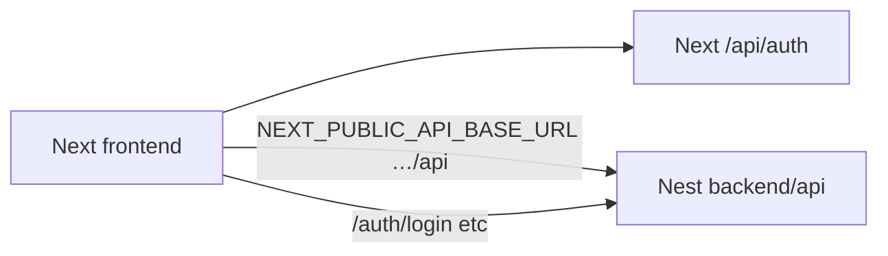

# FE↔BE API reconnect after split

## Goal

Every **live** frontend product API call either hits a real Nest route or is removed. The UI must not fail because a path is missing, misnamed, or mis-wired to Next instead of Nest.

## Locked decisions

| # | Topic | Decision | Rationale / plan impact |
|---|-------|----------|-------------------------|
| D1 | Definition of done | Full inventory + every live FE call has a Nest route **or** the FE call is removed | Zero FE-only paths |
| D2 | Same feature, different path | **Change the FE** to the Nest path — do not keep old URL aliases | Inventory needs FE→Nest remap column |
| D3 | No Nest equivalent | **Implement real Nest behavior** (no stubs, no hide-until-later) | Ports required for gaps |
| D4 | Behavior source | Port from [`archaser-support/archaser`](https://github.com/archaser-support/archaser) **`staging`** `pages/api` (+ related server code) | See recovery ref below |
| D5 | Contract when porting | **Nest-idiomatic DTOs**; update FE in the same change | Paired BE/FE work per gap |
| D6 | Live FE calls | **Every FE source call site**; if nothing imports it → **remove** (do not implement Nest for orphans) | Full scrape + reachability for remove |
| D7 | Non-route failures | **Include env/proxy/auth wiring** so FE can call Nest successfully | Amplify base URL, rewrite, CORS, Bearer/DualAuth |
| D8 | Stay green | Script + **CI fails** if FE call path/method missing from Nest OpenAPI | After inventory is green |
| D9 | Check ownership | **Frontend CI** with committed/synced Nest `openapi.json` | FE PRs catch new dead calls |
| D10 | OpenAPI sync | **BE GitHub Action opens a PR to FE** when OpenAPI changes | Neither repo has workflows today — add them |
| D11 | Parity allowlist | Fixed: NextAuth `/api/auth/*`, Nest `/auth/*` (separate), absolute external URLs, `test/` / scripts | Avoid false failures |
| D12 | Sequence | **Fix all gaps first**; add CI gate only when inventory already green | No long-lived known-gap allowlist |
| D13 | Ship shape | One **mega** reconnect change set | Large review; inventory is the checklist |
| D14 | Mega contents | Nest ports + FE retargets/removals + **wiring**; CI gate is a **follow-up** | |
| D15 | Cross-repo | **Paired BE + FE PRs** merged as one release unit | Cannot be a single GitHub PR |
| D16 | Test bar | Nest **HTTP tests** per new/changed route + FE **unit tests** where calls/types change + **manual smoke** of affected screens | Before paired merge |

## Recovery ref (D4)

| Key | Value |
|-----|-------|
| Repo | `https://github.com/archaser-support/archaser` |
| Branch | `staging` |
| Local clone (dev machine) | `/Users/ofiramitai/Sites/archaser/archaser` |
| SHA at plan time | `cebab3a48189c382415939e2b705009029d4d7f2` (`origin/staging` after fetch) |
| Primary sources | `pages/api/**`, especially `pages/api/system/[...path].ts`, dedicated leaves under `customers/`, `business-units/`, `invoices/`, `communication-intelligence/` |

**Note:** `staging` was force-updated during grilling. Re-fetch and re-pin SHA at implementation start. Some FE-called paths (e.g. CI `analytics`) may not exist as standalone files on current tip — search catch-alls and git history if needed.

## Current architecture (post-split)

- FE clients: `frontend/app/api.ts`, `frontend/utils/apiFetch.ts`, `frontend/utils/amplifyMode.ts`, `frontend/utils/nestAuth.ts`
- Nest product routes under `/api/*`; auth under `/auth/*`; OpenAPI at `backend/api/openapi.json` (`npm run openapi:export`)
- FE middleware 404s same-origin `/api/*` (except NextAuth) unless rewrite/env points at Nest

## Phase plan

### Phase A — Inventory (blocking checklist for mega PRs)

1. Scrape FE for `api.(get|post|put|patch|delete)(` and `apiFetch(` (exclude `test/`, stories, scripts per D11).
2. Normalize: ensure `/api` prefix where product; strip query; template `{id}` / UUID segments; capture HTTP method.
3. Diff against Nest `openapi.json` paths + methods.
4. Classify each row:
   - **Implement** — no Nest equivalent → port from staging (D3/D4/D5)
   - **Retarget** — Nest equivalent under different path → change FE only (D2)
   - **Remove** — no importers / dead call site (D6)
   - **Allowlisted** — NextAuth / Nest `/auth/*` / external (D11)
5. Produce inventory artifact in the paired PRs (table or generated markdown under an agreed path — prefer script output committed only if useful for review; otherwise PR description + CI later).

**Seed gaps already observed (not exhaustive — inventory may find more):**

| FE call (examples) | Likely staging source | Likely action |
|--------------------|----------------------|---------------|
| `/api/system/admin/system-health`, cron dashboard/trigger/logs | `pages/api/system/[...path].ts` | Implement Nest |
| `/api/system/company` | system catch-all / company handlers | Implement Nest |
| `/api/business-units/validate-access` | `pages/api/business-units/validate-access.ts` | Implement Nest |
| `/api/customers/validate-business-unit-access` | `pages/api/customers/validate-business-unit-access.ts` | Implement Nest |
| `/api/communication-intelligence/analytics` | may be missing on current staging tip; check history / learning-data | Implement or retarget after discovery |
| `/api/customers/aggregated-data`, `/search`, `/add-comment` | staging customer leaves | Implement or retarget |
| `/api/invoices/update` | vs Nest entities invoices / `update-last-payment-date` | Retarget FE (D2) if equivalent exists |
| `/api/entities/customer` (singular) | Nest plural entities | Retarget FE |

### Phase B — Reconnect mega (paired BE + FE PRs)

**Backend PR**

- For each **Implement** row: Nest controller + DTO + service via `DatabaseService` / existing domain services; DualAuth like peer routes; export OpenAPI.
- Prefer Nest URL conventions already used by sibling modules; FE will be updated to match (D5) — do **not** add long-lived aliases for old FE paths (D2).
- Nest HTTP tests for each new/changed route (D16).

**Frontend PR** (merge with BE as one unit — D15)

- Retarget / remove / adapt callers to Nest DTOs.
- Wiring (D7): `NEXT_PUBLIC_API_BASE_URL` / `NEXT_PUBLIC_NEST_API_BASE_URL`, rewrite (`USE_NEST_API_REWRITE`), CORS on Nest (`NEST_CORS_ORIGINS` / `NEXT_PUBLIC_BASE_URL`), Bearer vs DualAuth cookie paths, SSE URL helpers if affected.
- FE unit tests where types/calls change; manual smoke list from inventory (D16).

**Out of this mega:** parity CI script and BE→FE OpenAPI sync Action (Phase C).

### Phase C — Parity gate (follow-up after green)

1. Commit/sync Nest `openapi.json` into FE (initial copy).
2. FE script: scrape call sites → diff OpenAPI (method+path templates) → fail on missing; apply D11 allowlist.
3. FE CI workflow running that script (repos currently lack `.github/workflows` — add).
4. BE GitHub Action: on OpenAPI change, open PR to FE updating vendored `openapi.json` (D10).

## Testing strategy

| Requirement | Maps to | How |
|-------------|---------|-----|
| New Nest routes behave | D3, D16 | Nest HTTP tests (authz + happy path) |
| FE contracts match Nest DTOs | D5, D16 | FE unit tests on services/hooks touched |
| Screens work end-to-end | D7, D16 | Manual smoke from inventory (system health, import validate-access, CI analytics, company, retargeted invoice/customer calls) |
| Inventory complete before gate | D1, D12 | Local scrape reports zero non-allowlisted gaps before Phase C |
| Stay green | D8–D11 | Phase C CI |

## Codebase scan

### Required

| Area | Paths / notes |
|------|----------------|
| FE API clients | `frontend/app/api.ts`, `utils/apiFetch.ts`, `utils/amplifyMode.ts`, `utils/nestAuth.ts`, `middleware.ts`, `nest-api-rewrite.cjs`, `next.config.js` |
| FE callers | All `api` / `apiFetch` under `app/`, `shared/`, `components/`, `lib/` (full scrape) |
| Nest bootstrap / CORS | `backend/api/src/main.ts`, DualAuth guard |
| Nest OpenAPI | `backend/api/openapi.json`, `npm run openapi:export`, route modules under `backend/api/src/**` |
| Staging recovery | Monorepo `pages/api/**` at pinned SHA |
| Deploy wiring | `backend/nginx/archaser-*.conf`, Amplify env docs/scripts (`scripts/run-amplify-build.js`) |
| CI (Phase C) | New `.github/workflows` in FE and BE |

### Optional / out of scope unless requested

| Area | Reason |
|------|--------|
| Dead Nest-only OpenAPI paths (no FE caller) | D1 is FE→Nest coverage, not BE surface minimization |
| Playwright full suite as merge gate | D16 chose Nest HTTP + FE unit + manual smoke |
| Translation file changes | Only if new user-visible error strings; needs explicit permission |
| New styling | Not required for API reconnect |
| Continuing full Nest cutover plan slices unrelated to FE-called gaps | Only inventory-driven gaps |

### No change needed

| Area | Reason |
|------|--------|
| NextAuth `pages/api/auth/[...nextauth].ts` | Stays on Next; allowlisted |
| Prisma schema (unless a ported handler needs a missing field) | Prefer existing schema; verify per gap |
| Report builder / credit product features | Unrelated unless inventory flags their paths |

## Plan improvements / easy-to-miss

- **Path normalization:** FE mixes `/api/...` and `/entities/...` (axios base already ends with `/api`). Inventory must normalize before OpenAPI compare.
- **Method matters:** same path GET vs POST can be different Nest handlers — parity check is method+path.
- **Catch-all staging:** many system admin routes live only in `pages/api/system/[...path].ts` — port by route string, not by filename.
- **Staging drift:** force-push risk — pin SHA per reconnect and re-verify analytics/company leaves.
- **Cross-repo merge order:** prefer BE deploy first within the release window only if new Nest routes are additive; FE DTO changes must not hit production before matching Nest is live (coordinate paired merge/deploy).
- **Rewrite top-level list:** `frontend/nest-api-rewrite.cjs` must include any new Nest top-level segments used locally.

## Discovery gates

| Gate | Blocking? | If Yes | If No |
|------|-----------|--------|-------|
| Full FE scrape vs OpenAPI diff complete | **Blocking** Phase B checklist | Mega PRs have exhaustive Implement/Retarget/Remove lists | Do not merge “reconnect” claiming done |
| Staging SHA re-fetched; handlers located for each Implement row | **Blocking** per gap | Port from found source | Search `staging-old` / history; if truly gone, re-spec with product owner (exception to D4) |
| Amplify + local env actually point at Nest | **Blocking** D7 | Wiring fixes in FE mega PR | Document failing env keys in PR |
| FE/BE GitHub Actions available | **Blocking** Phase C only | Add workflows | Defer gate until Actions exist; keep local script |

## Implementation progress (2026-08-02)

### Done

**Nest ports**
- `GET/POST/PUT /api/system/company` (+ `PUT /api/system/company/:id`)
- `GET /api/system/admin/dashboard`, `system-health`, `POST …/cron-jobs/trigger`, `GET …/cron-jobs/logs/:executionId`
- `POST /api/business-units/validate-access` → `{ items }`
- `GET /api/customers/search`, `POST /api/customers/validate-business-unit-access`, `GET /api/customers/aggregated-data/:id`
- `POST /api/entities/customers/:id/comments`
- `GET /api/communication-intelligence/analytics`
- Invoice extras: `status`, `available-for-credit/:customerId`, `assign-credit`
- Users/accounts extras: `view-as`, `change-password`, `system-administrator-check`, `gdpr-report`, `restore`
- Nested `GET/POST /api/entities/business-unit-banks/:businessUnitId`, `DELETE …/:businessUnitId/:junctionId`
- `GET /api/operations/legal-cases/stats` → FE `LegalCasesResponse` shape (D5)

**FE retargets / DTO adapts**
- Comment → entities comments; singular customer → plural; import/customers → import/customer; invoices/update → entities PUT
- LogActivity → entities customers paths
- company/search/validate-access/available-for-credit/system-health/cron monitor consumers updated for Nest shapes
- Insurance country/named CRUD → flat `insurance-policy-countries` / `insurance-policy-named-policies` (+ Nest POST/DELETE upsert)
- Nest `GET …/insurance-policies/:id/customer-prefill` and `POST …/bulk-replace`

**Tooling / tests / Phase C**
- `backend/scripts/inventory-fe-nest-routes.cjs` — inventory **missing: 0**
- `api/test/fe-be-reconnect.http.test.ts` (9 tests)
- Fixed `scripts/openapi/export-nest-openapi.ts` import paths post-split
- FE vendored `openapi/openapi.json` + `npm run check:api-parity`
- FE CI: `.github/workflows/api-parity.yml`
- BE Action: `.github/workflows/sync-openapi-to-frontend.yml` (needs `FRONTEND_REPO` + `CROSS_REPO_PAT` secrets)

### Remaining

- Configure BE repo secrets so OpenAPI sync PRs actually open
- Paired BE+FE mega PR merge (D15) when ready to ship
