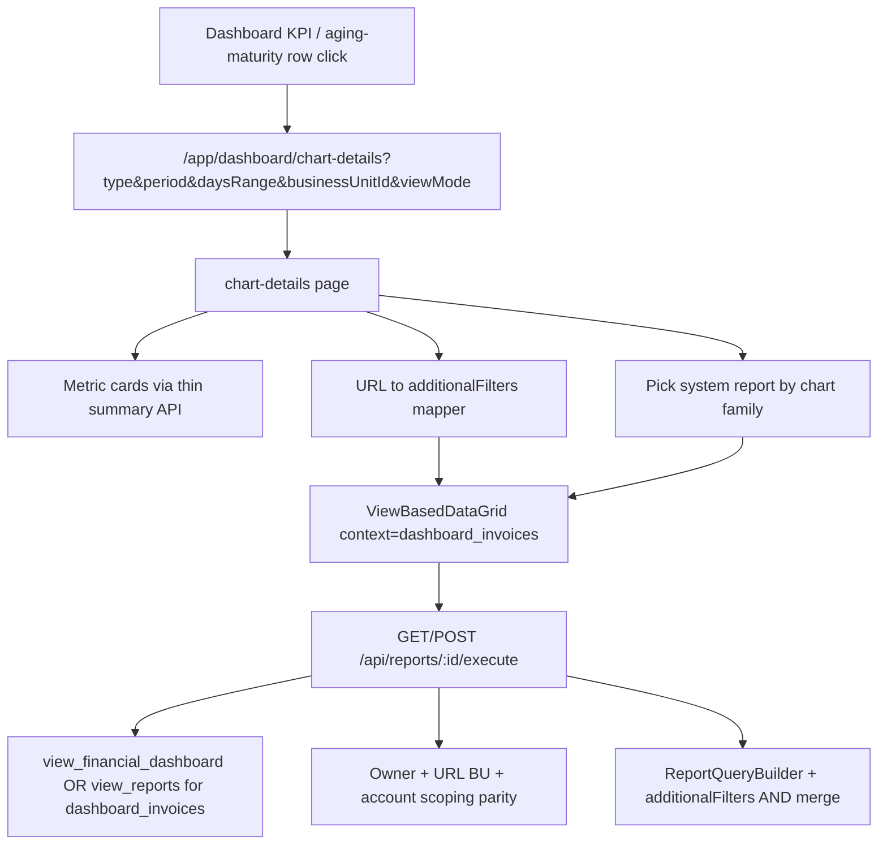

# Financial Dashboard Chart-Details → Report Lists

## Goal

Convert financial dashboard **chart-details** from custom `EndlessScrollDataGrid` + `handleDashboardChartDetails` row payloads into **report-backed lists** (`ViewBasedDataGrid` + saved views), starting with **invoice-shaped** chart types. Later slices cover customers, payments, and collection efforts. Other detail pages (e.g. operation dashboard) are planned separately after this.

## Decisions (grilled)

| Decision | Choice |
|----------|--------|
| Target UX | `ViewBasedDataGrid` + saved views (not plain EndlessScroll, not main `/app/reports` redirect) |
| Context model | New contexts **by row shape**; first: `dashboard_invoices` |
| Chart constraints | Locked as `additionalFilters` from URL (`type`, `daysRange`, `viewMode`, `businessUnitId`, …) |
| KPI parity | **Exact** match with current dashboard / chart-details semantics |
| Metric cards | **Keep** (thin summary fetch still needed) |
| Rollout within financial | Invoice-shaped first → customers → payments → collection efforts |
| User reports | Create/edit allowed (`create_report` / `edit_report`); seed system defaults |
| System defaults | **One system report per chart family**, auto-selected by URL `type` |
| Reports menu | **Chart-details only** (like `customer_unpaid_invoices`) |
| Field catalog | Reuse same **Invoice** metadata as `invoices` |
| Permissions | Execute `dashboard_invoices` allowed with `view_financial_dashboard`; create/edit still use report perms |

## Scope — Slice 1 (this plan)

### In scope (invoice-shaped `type` values)

- `overdue-invoices`
- `aging-portfolio` (+ optional `daysRange`: `0_7` … `365_2000`)
- `total-due`, `due-today`, `due-this-week`, `due-this-month`, `due-next-month`
- `receivables-maturity-schedule` (+ optional maturity `daysRange`)

### Out of scope (later financial slices)

- Payments: `collected-mtd`, `collected-vs-promise`
- Customers: `active-customers`, `overdue-amount`, `overdue-customers`
- Collection efforts: `collection-efforts`, `automated-phase-split`
- Main dashboard Aging/Maturity **MUI summary tables** (bucket cards) — stay as-is; they only navigate to chart-details
- Other detail pages (operation dashboard, admin tables, etc.)

### Dual-mode page behavior

`chart-details/page.tsx` stays dual-mode during rollout:

- Invoice `type`s → `ViewBasedDataGrid` + `dashboard_invoices`
- All other `type`s → existing `EndlessScrollDataGrid` + chart-details API (unchanged until later slices)

---

## Architecture

Closest pattern to copy: **`UnpaidInvoiceList`** (`context="customer_unpaid_invoices"` + `additionalFilters` + SQL system seeds).

---

## Implementation plan

### 1. Register `dashboard_invoices` context

**File:** `shared/utils/viewConfigs.ts`

- Add `dashboard_invoices` with `tableName: "Invoice"`, entity id/name fields, invoice link handlers, `currencyColumns` (mirror `customer_unpaid_invoices` / `invoices` as appropriate), default sort (e.g. `due_date` asc for due families, overdue age for overdue/aging).

No new `reportMetadata` table section — Invoice field catalog is already shared by table name.

### 2. URL → locked `additionalFilters` mapper (exact parity)

**New util** (e.g. `shared/dashboard/dashboardInvoiceChartFilters.ts`) that maps chart URL params → report filter array.

Must port current `handleDashboardChartDetails` semantics, including:

| Family | Locked constraints (non-exhaustive; verify against API) |
|--------|-----------------------------------------------------------|
| Overdue / aging | Unpaid statuses (`notIn` Paid/Void/Cancelled), `due_date < today`, Customer `collection_status: Active`, optional aging day buckets from `daysRange` |
| Due / total-due | Current due windows (`due-today` / week / month / next-month / total-due), status/`outstanding` rules matching today’s API, Customer Active **or** Inactive where API allows |
| Maturity | Future due buckets from maturity `daysRange`; handle overview-without-`daysRange` (today can show bucket summary — decide: require invoice-level drill only when `daysRange` present, or map overview separately) |

Also encode:

- **Owner filter** equivalent to chart-details `getOwnerFilter` (report execute today does **not** apply owner — see §3)
- **URL `businessUnitId`** via dashboard BU resolver (report execute today uses session BU only — see §3)
- **`viewMode` parent/child** — define explicit parity strategy (filter-only vs defer parent aggregation if not expressible)

Prefer date `between` / presets already supported by `ReportExecutionService` so timezone/`@db.Date` behavior matches QueryBuilder.

Shared base filters that never change can live on the **system report** config; URL-variable locks go in `additionalFilters` (AND-merged).

### 3. Report execute parity + permission

**Files:** `pages/api/reports/[id]/execute.ts`, possibly `ReportExecutionService` / thin wrapper

1. **Permission:** For reports with `context === "dashboard_invoices"`, allow execute when user has `view_financial_dashboard` **or** `view_reports`. Create/edit/delete remain on existing report permissions.
2. **Owner scoping:** Apply the same owner filter chart-details uses (or inject as locked Customer filters from a server-side helper — do not trust the client alone for security-sensitive owner scope).
3. **URL BU:** Accept dashboard `businessUnitId` the same way chart-details does (`resolveDashboardBusinessUnitFilterFromRequest`), not only session BU — required for exact KPI parity when the dashboard BU filter is set.

List/default report APIs (`/api/reports?context=`, user-default) must remain usable for users who only have financial dashboard access (or chart-details must load system report ids without requiring `view_reports` for listing defaults). Confirm and adjust list endpoints if needed for the selector.

### 4. Thin summary API for metric cards

Keep 2–3 `CreditMetricCard`s.

Options (prefer A):

- **A.** Slim chart-details (or dedicated) summary endpoint that **reuses the same filter helper** as §2 and returns `{ totalRecords, totalAmount, … }` without full row materialization.
- **B.** Aggregate from report execute (heavier / harder for amount cards).

Do **not** load full invoice rows solely for cards.

### 5. Seed four system reports

**Script pattern:** `scripts/database/create-customer-unpaid-invoices-reports.sql`

Create SQL seed for all accounts, `context = 'dashboard_invoices'`, `is_system = true`, unique names e.g.:

| unique_name | Chart family | Default columns (match today’s UI) |
|-------------|--------------|-------------------------------------|
| `dashboard_invoices_overdue` | `overdue-invoices` | invoice #, customer, outstanding, days overdue |
| `dashboard_invoices_aging` | `aging-portfolio` | invoice #, customer, invoice amount, overdue amount, days overdue |
| `dashboard_invoices_due` | `total-due` / `due-*` | invoice #, customer, due amount, days until due |
| `dashboard_invoices_maturity` | `receivables-maturity-schedule` | invoice #, customer, due amount, days until due, original amount |

Page maps `type` → `defaultViewId` / preferred system report. User may switch reports; locked URL filters still apply.

Also ensure `ReportService.copySystemReportsToNewAccount` (or equivalent) includes this context for new accounts.

### 6. Wire chart-details UI for invoice types

**File:** `app/[locale]/app/dashboard/chart-details/page.tsx`

- Branch on invoice-shaped `type`
- `ViewBasedDataGrid` with `context="dashboard_invoices"`, `additionalFilters`, `defaultViewId` by family, search, export via grid default execute path
- Keep `PageHeader` + metric cards
- Preserve URL params used by cards (`type`, `period`, `daysRange`, `businessUnitId`, `viewMode`)
- Optional: persist `viewId` / `reportId` in URL like CustomerList (nice-to-have)

**Builder redirect:** `app/[locale]/app/reports/builder/page.tsx` — add `dashboard_invoices` → chart-details (with required `type` or a safe default family) so create/edit does not dump users on the wrong page.

### 7. Leave non-invoice paths intact

- `columnDefinitions.tsx` — still used by non-invoice types
- `handleDashboardChartDetails` invoice cases — keep until summary helper fully replaces them; then delete invoice row branches only
- Dashboard cards — no change beyond verifying query params still drive the mapper

### 8. Testing strategy

| Requirement | Test unit |
|-------------|-----------|
| Mapper: each invoice `type` (+ `daysRange` variants) produces expected filters | Unit tests on `dashboardInvoiceChartFilters` |
| Execute permission: financial-dashboard-only user can execute `dashboard_invoices`, not other contexts | API/unit test on execute permission branch |
| Owner + URL BU applied on execute for this context | Unit/integration around filter merge / execute options |
| `additionalFilters` AND-merged with system report filters | Extend `useViewExecution` / ViewBasedDataGrid report tests + fixtures |
| Metric summary counts/amounts match prior chart-details for golden fixtures (per type) | Unit or service-level parity tests with shared helper |
| Builder redirect for `dashboard_invoices` | Lightweight unit/route map test if one exists; else manual |

Manual QA checklist:

- Click each invoice KPI / aging bucket / maturity bucket → list columns match family default; totals match cards
- Switch saved report → columns change; dataset still restricted to chart slice
- Create/edit report (with perms) → returns to chart-details
- User without `view_reports` but with `view_financial_dashboard` can open and scroll the list
- BU filter on dashboard still scopes drill-down
- Non-invoice chart types unchanged

### 9. Translations / styling

- **Translations:** New system report names/descriptions may need EN/HE keys — **do not edit locale files without explicit permission**; English SQL names acceptable initially if product agrees.
- **Styling:** Reuse existing `ViewBasedDataGrid` / chart-details layout; **no new styles** without approval.

---

## Codebase scan

### Required

| Area | Why |
|------|-----|
| `app/.../dashboard/chart-details/page.tsx` | Dual-mode: ViewBased for invoice types; keep cards |
| `shared/utils/viewConfigs.ts` | Register `dashboard_invoices` |
| New filter mapper util | Exact KPI → `additionalFilters` |
| New SQL seed script under `scripts/database/` | Four system reports for all accounts |
| `pages/api/reports/[id]/execute.ts` (+ list/default if needed) | Permission exception + owner/URL BU parity |
| `ReportService` new-account system copy | Include `dashboard_invoices` |
| `app/.../reports/builder/page.tsx` | Context → chart-details redirect |
| `ViewBasedDataGrid` / `useViewExecution` | Consume context + filters (pattern already exists) |
| Unit tests + `tests/fixtures/reports.ts` | New context / filters / perms |
| Dashboard invoice cards (verify params only) | Ensure URL still encodes locks |

### Optional / out of scope unless requested

| Area | Why |
|------|-----|
| `columnDefinitions.tsx` | Still needed for non-invoice types |
| Retire invoice branches in `handleDashboardChartDetails` | After summary helper is sole consumer |
| `dashboardService` card aggregations | Still power main dashboard cards |
| `.cursor/rules/frontend-reports.mdc` / chart-details docs | Docs only |
| `export-system-reports-to-sql.ts` | Ops after seeding admin account |
| Later contexts (customers / payments / efforts) | Separate slices |
| Locale files | Needs translation permission |

### No change needed

| Area | Why |
|------|-----|
| `reportMetadata.ts` Invoice fields | Reuse shared catalog |
| Main `/app/reports` menu (`MAIN_REPORTS_MENU_CONTEXT`) | Chart-details only |
| Existing `invoices` / `customer_unpaid_invoices` configs | Reference only |
| Prisma Report schema | Already supports context + system flags |
| Non-invoice chart-details cases | Later slices |

### Easy-to-miss touchpoints (called out in grill + scan)

1. Owner filter missing on report execute today  
2. URL `businessUnitId` vs session BU  
3. Aging vs maturity `daysRange` encoding differs  
4. Due vs overdue customer Active/Inactive rules differ  
5. `viewMode` parent/child may not map cleanly to flat invoice reports  
6. Maturity overview without `daysRange` may be bucket rows, not invoices  
7. `view_reports` vs `view_financial_dashboard` (resolved: option 1)  
8. Export goes through execute — must pass same locked filters + currency config  
9. System report `unique_name` / `ON CONFLICT` / copy-to-new-account  
10. Sort field names change from camelCase chart fields to Invoice report fields  

---

## Issues (vertical slices)

Tracer-bullet breakdown published to ClickUp default list (see `.cursorrules`). **Hard blockers** are wired as ClickUp **Relationships** (`Waiting on`) — read them from the task UI, not from description markdown. Implement in dependency order; start a **fresh session per issue**.

**Parent:** [Financial Dashboard Chart-Details → Report Lists](https://app.clickup.com/t/869e3hmku)

| # | Title | ClickUp | Waiting on | User stories |
|---|-------|---------|------------|--------------|
| 1 | Prefactor: dashboard_invoices filter contract + execute parity | [869e3hmm6](https://app.clickup.com/t/869e3hmm6) | — | 14–16, 22–23, 28–29 |
| 2 | Overdue invoices chart-details as report list | [869e3hmm7](https://app.clickup.com/t/869e3hmm7) | 1 | 1–3, 8–10, 18–20, 26 |
| 3 | Aging portfolio chart-details as report list | [869e3hmm8](https://app.clickup.com/t/869e3hmm8) | 1 | 11 |
| 4 | Due window KPIs chart-details as report list | [869e3hmmc](https://app.clickup.com/t/869e3hmmc) | 1 | 12 |
| 5 | Maturity schedule chart-details as report list | [869e3hmmf](https://app.clickup.com/t/869e3hmmf) | 1 | 13, 25 |
| 6 | Create/edit dashboard invoice reports + builder return | [869e3hmme](https://app.clickup.com/t/869e3hmme) | 2 | 4–7, 17, 24, 27 |

**Assignee / status:** Nilotpal Bose; Selected for Development

**PRD:** `.cursor/plans/financial-dashboard-chart-details-to-lists.prd.md`

*Soft ordering:* slices 3–5 can run in parallel after #1; #6 after first UI (#2).

## Follow-up slices (not this PR)

1. **`dashboard_customers`** — overdue-amount, overdue-customers, active-customers  
2. **`dashboard_payments`** — collected-mtd, collected-vs-promise  
3. **`dashboard_collection_efforts`** — collection-efforts, automated-phase-split  
4. Next **non-financial** detail page (grill separately): e.g. operation-dashboard details / agent stats  

---

## Open implementation notes (resolved at build time, not product forks)

- Prefer translating aging day buckets to `due_date` ranges **or** a shared days-overdue helper used by both summary and filters — whichever preserves exact bucket membership including timezone edge days.
- Server-side owner/BU application must not rely solely on client-supplied `additionalFilters` for authorization.
- Confirm whether `period` affects any invoice-shaped KPI (often unused for “current” overdue/due); only include in filters if current API uses it.
