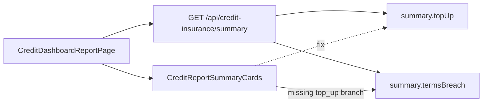

# Fix top-up report summary cards

## Root cause

[`CreditReportSummaryCards.tsx`](w:\Cloudial\archaser-rest\fe\app\[locale]\app\credit-dashboard\report\CreditReportSummaryCards.tsx) has branches for `overdue`, `capacity`, `reporting`, etc., but **no branch for `top_up` (or `top_up_expiring`)**. Those types fall through to the final `// terms` default and render:

- Label: `summary_invoices_terms_breach` → "Invoices in terms breach"
- Values: `summary.termsBreach.invoiceCount` / `summary.termsBreach.totalAmount`

That matches the screenshot (154 / ₪3,548,774).

Correct numbers already come from the same summary API the report page loads (`GET /api/credit-insurance/summary`):

- Count: `summary.topUp.customersWithActiveCount` (expected 6)
- Amount: `summary.topUp.activeCoverTotal` (expected 12,491,200)

The main dashboard card already uses these fields; the report page does not. **Backend needs no change.**

## Implementation

### 1. Add `top_up` (and companion `top_up_expiring`) branches

In [`CreditReportSummaryCards.tsx`](w:\Cloudial\archaser-rest\fe\app\[locale]\app\credit-dashboard\report\CreditReportSummaryCards.tsx), insert before the `// terms` default (after `no_policy_exposure`), following the same two-card layout as `overdue` / `no_policy_exposure`:

**`type === "top_up"`**
- Left: `summary.topUp?.customersWithActiveCount ?? 0` — GroupIcon
- Right: `fmt(summary.topUp?.activeCoverTotal ?? 0)` — AccountBalanceIcon

**`type === "top_up_expiring"`** (same fallthrough bug; fix in same change)
- Left: `summary.topUp?.expiringWithinDays.customerCount ?? 0`
- Right: `fmt(summary.topUp?.expiringWithinDays.totalAmount ?? 0)`

Null-safe: when `summary.topUp` is `null` (account has no top-up feature), show zeros.

### 2. Add EN + HE translation keys

In [`locales/en/dashboard.json`](w:\Cloudial\archaser-rest\fe\locales\en\dashboard.json) and [`locales/he/dashboard.json`](w:\Cloudial\archaser-rest\fe\locales\he\dashboard.json) under `credit_insurance_report`:

| Key | EN | HE |
|-----|----|----|
| `summary_customers_with_top_up` | Customers with top-up | לקוחות עם השלמה |
| `summary_top_up_amount` | Top-up amount | סכום השלמה |
| `summary_customers_top_up_expiring` | Customers with top-up expiring | לקוחות עם השלמה שפוגה |
| `summary_top_up_expiring_amount` | Expiring top-up amount | סכום השלמה שפוגה |

Reuse existing `summary_total_amount` only if we want generic wording; specific keys match the user’s expected meaning and avoid the wrong terms-breach label.

### 3. Verify manually

Open `/en/app/credit-dashboard/report?type=top_up` — cards should show **6** and **₪12,491,200** (or account currency formatting), with top-up labels, not “Invoices in terms breach”.

## Codebase scan

### Required
- [`CreditReportSummaryCards.tsx`](w:\Cloudial\archaser-rest\fe\app\[locale]\app\credit-dashboard\report\CreditReportSummaryCards.tsx) — add branches
- [`locales/en/dashboard.json`](w:\Cloudial\archaser-rest\fe\locales\en\dashboard.json) — new summary keys
- [`locales/he/dashboard.json`](w:\Cloudial\archaser-rest\fe\locales\he\dashboard.json) — new summary keys (parity)

### No change needed
- Backend `getCreditDashboardSummary` / `computeTopUpDashboardMetrics` — already returns correct `topUp` block
- [`CreditDashboardReportPage.tsx`](w:\Cloudial\archaser-rest\fe\app\[locale]\app\credit-dashboard\report\CreditDashboardReportPage.tsx) — already mounts cards for `top_up` and fetches summary
- [`CreditDashboardScreen.tsx`](w:\Cloudial\archaser-rest\fe\app\[locale]\app\credit-dashboard\CreditDashboardScreen.tsx) — dashboard metric card already correct
- Report grid / `getTopUpCoverReport` — row data is separate from summary cards
- Types in [`types/creditInsurance.ts`](w:\Cloudial\archaser-rest\fe\types\creditInsurance.ts) — `TopUpDashboardBlock` already has needed fields
- Styling — reuse existing card layout; no new styles

### Out of scope unless requested
- Unit tests for `CreditReportSummaryCards` (project rule: no tests unless asked)
- Changing dashboard footnote copy or report grid columns

## Testing strategy

| Requirement | How to verify |
|-------------|----------------|
| Top-up report cards show customer count + top-up total | Manual: `type=top_up` cards match dashboard top-up metrics |
| Labels are top-up-specific (EN + HE) | Switch locale; confirm no “Invoices in terms breach” |
| Expiring report not broken by same fallthrough | Manual: `type=top_up_expiring` shows expiring count/amount |
| Terms report still works | Manual: `type=terms` still shows terms-breach KPIs |

## Cross-cutting flags
- Translations: EN+HE required in same change
- Styling: none new (reuse existing card pattern)
- Migrations: none
