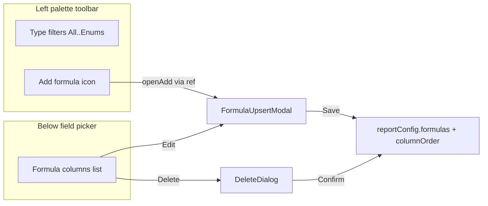

# Report Builder — Formula Modal UX (Step 2)

## Problem

On wizard step 2 (`2. Select Tables & Fields`), formula create/edit renders as an **inline bordered panel** below the field picker in [`FormulaColumnEditor.tsx`](components/reports/FormulaColumnEditor.tsx). The **Add formula** button sits in that section header, separate from the left-palette **type filter** toolbar in [`DragDropFieldSelector.tsx`](components/reports/DragDropFieldSelector.tsx). This is inconsistent with other upsert flows (contacts, viewer filters) that use `AppDialog` + `ModalScrollBox`.

## Decision log

| # | Topic | Decision | Rationale / plan impact |
|---|-------|----------|-------------------------|
| D1 | On-page formula UI | Compact list stays; form in modal | Contacts-like visibility |
| D2 | Add formula placement | Text button below selected-fields list (right panel) | Moved from left filter toolbar |
| D3 | Add control chrome | Icon button + tooltip “Add formula” | Matches filter toolbar |
| D4 | Formula list location | “Formula columns” under field picker (list only) | Remove Add from section header |
| D5 | At 10 formulas | Disable Add icon; tooltip explains limit | Prevent dead-end click |
| D6 | Toolbar → modal wiring | `FormulaColumnEditor` owns modal; builder wires ref/callback to Add | Minimal prop drilling |
| D7 | Unsaved close | Discard silently (no confirm) | Matches current Cancel behavior |
| D8 | Empty list | Always show header + empty helper text | Discoverability without Add in header |
| D9 | Delete | Confirm before delete | Use existing `DeleteDialog` |
| D10 | Modal shell | `AppDialog` + `ModalScrollBox`; Save/Cancel footer; resizable ~420px | Same as filters modal |
| D11 | Component split | New `FormulaUpsertModal.tsx`; editor keeps list + wiring | Mirrors `UpsertContactModal` |
| D12 | Field insert UI | Object + field dropdowns + Insert above expression | No operator buttons |
| D13 | Formula operand scope | Any numeric field on report **tables**, not only selected columns | UI lists table fields; execution merges operands into query |
| D14 | Currency source | Auto: first amount/currency field in expression; no manual dropdown | Removed Currency source field from modal |
| D15 | Which save validates | Formula modal Save **and** final report Save | Builder currently skips formula checks |
| D16 | Validation seam | Shared client helper in `shared/reportFormula/` | Modal + builder stay in sync |
| D17 | Report Save failure UX | Jump to step 2; inline error on formula row | Like filter errors on step 3 |
| D18 | Semantic validity | Expression must reference ≥1 report-table field | Reject constants-only (`100/2`) |
| D19 | Stale formulas | Catch on modal/report Save only | Do **not** wire `blockFieldRemovalForFormulas` now |
| D20 | Error copy | Map `FormulaParseError` codes → friendly `t()` keys | Use `defaultValue`; locale JSON only with approval |

## Target UX



## Codebase scan

### Required changes

| File | Change |
|------|--------|
| [`components/reports/FormulaUpsertModal.tsx`](components/reports/FormulaUpsertModal.tsx) | **New** — modal form extracted from current inline editor (label, **expression toolbar**, expression field, format, currency source, aggregation, validation, Save/Cancel in `AppDialog` actions) |
| [`components/reports/FormulaColumnEditor.tsx`](components/reports/FormulaColumnEditor.tsx) | Keep list + orchestration; remove inline form; host `FormulaUpsertModal` + `DeleteDialog`; expose `openAdd()` via `forwardRef` |
| [`components/reports/DragDropFieldSelector.tsx`](components/reports/DragDropFieldSelector.tsx) | Add optional props `onAddFormula`, `addFormulaDisabled`, `addFormulaDisabledReason`; render Functions `IconButton` after enum filter in existing `endless-scroll-toolbar` row |
| [`app/[locale]/app/reports/builder/page.tsx`](app/[locale]/app/reports/builder/page.tsx) | Wire `useRef<FormulaColumnEditorHandle>()` → `onAddFormula`; pass disabled state from `reportConfig.formulas.length >= MAX_FORMULAS_PER_REPORT` |

### No change needed

| File | Reason |
|------|--------|
| Formula engine / server validation (`shared/reportFormula/*`, `ReportService`) | UX-only; save payload unchanged |
| Export / viewer / execution paths | No formula UI change |
| [`shared/layout-components/modal/AppDialog.tsx`](shared/layout-components/modal/AppDialog.tsx) | Reuse as-is |
| [`shared/layout-components/modal/DeleteDialog.tsx`](shared/layout-components/modal/DeleteDialog.tsx) | Reuse as-is |
| Translation JSON files | Use existing `t(..., { defaultValue })` pattern for any new copy; **do not edit locale files without explicit user approval** |

### Optional / out of scope

| Item | Reason |
|------|--------|
| Integrate formulas into right-side selected-columns panel | Rejected in D1 |
| Wire `blockFieldRemovalForFormulas` into field removal | Explicitly deferred in D19 |
| New automated UI tests | No existing `FormulaColumnEditor` tests; manual QA sufficient unless requested |
| Cursor-aware token insertion / inline expression autocomplete | Deferred; v1 uses toolbar append + dropdown |

## Implementation details

### 1. `FormulaUpsertModal.tsx` (new)

- Mirror [`ReportViewerFiltersModal.tsx`](components/reports/ReportViewerFiltersModal.tsx) shell:
  - `AppDialog` with `drag`, `align`, `slide`, `resize`
  - `resizeOptions`: `initialWidth: 420`, `heightFraction: 0.65`, `minWidth: 360`, `maxWidth: 600`
  - `ModalScrollBox` with dedicated scroll container id
  - Footer: Cancel (`cancel-button`) + Save (`save-button`, `variant="contained"`)
- Props: `open`, `mode: "add" | "edit"`, `initialDraft` (or individual fields), `operandOptions`, `isGrouped`, `existingFormulas`, `onClose`, `onSave(formula: ReportFormula)`
- Move validation logic from current `validateDraft` / `saveDraft` into modal-local state; reset draft when `open` becomes true (same pattern as filters modal re-init on open)
- Title: Add → `formulas.add` + Functions icon; Edit → `formulas.edit` (new defaultValue) + Functions icon
- On Save success: call `onSave`, close modal
- On Cancel / X / backdrop: discard draft silently (D7)

#### Expression toolbar (D12)

Place a compact toolbar **directly above** the expression `TextField` (below Label). Carry forward and improve the existing **Insert field** autocomplete from [`FormulaColumnEditor.tsx`](components/reports/FormulaColumnEditor.tsx) (lines ~373–391).

Layout (single row, wraps on narrow modal width):

```
[ + ] [ − ] [ × ] [ ÷ ] [ ( ] [ ) ]  |  [ Insert field ▼ Autocomplete — flex grow ]
────────────────────────────────────────────────────────────────────
| Expression (multiline)                                              |
```

- **Operator buttons**: small `IconButton`s or `Button`s with `className="toolbar-button"` inside a `Box` with `className="endless-scroll-toolbar"` (same pattern as field-filter toolbar). Each click appends the token to the expression using the same append-with-space behavior as today's `insertOperand` (e.g. `prev ? \`${prev} +\` : '+'`).
- **Insert field autocomplete**: MUI `Autocomplete` over `operandOptions` (`getOptionLabel`: `` `${label} (${reference})` ``). On select, insert canonical `[Table.field]` via existing `buildCanonicalFieldReference` / `insertOperand` logic. Use `size="small"`, `sx={{ flex: 1, minWidth: 160 }}` so it shares the toolbar row.
- Hide autocomplete when `operandOptions.length === 0`; show helper text on expression field explaining operands must be selected numeric fields first.
- Tooltips on operator buttons (e.g. “Add”, “Subtract”) using existing `getRTLTooltipProps` where applicable.
- **Out of scope**: cursor-aware insertion, type-to-complete inside the expression textarea, or autocomplete inside the textarea itself (v1 keeps separate dropdown + manual typing).

Extract shared insert helpers (`insertExpressionToken`, `insertOperand`) into the modal file or a tiny local util within `FormulaUpsertModal.tsx` — no new shared module unless reuse is needed.

### 2. `FormulaColumnEditor.tsx` (refactor)

- Convert to `forwardRef` and export:

```ts
export interface FormulaColumnEditorHandle {
  openAdd: () => void;
}
```

- Remove header Add button and inline bordered form block
- Keep section header (“Formula columns” + Functions icon)
- List rows: label + Edit + Delete (unchanged actions, Edit opens modal in edit mode)
- Empty state: helper text under header when `formulas.length === 0` (D8), e.g. `formulas.empty_helper` defaultValue “No formula columns yet. Use Add formula in the field toolbar.”
- State: `modalOpen`, `editingFormula: ReportFormula | null` (or `editingId` retained)
- `openAdd()` (via ref): guard max formulas internally as fallback; primary disable is toolbar-side (D5)
- Delete flow (D9): clicking Delete sets `formulaPendingDelete`; render `DeleteDialog` with formula label in description; on confirm call existing `removeFormula`

### 3. `DragDropFieldSelector.tsx`

- Extend props:

```ts
onAddFormula?: () => void;
addFormulaDisabled?: boolean;
addFormulaDisabledReason?: string;
```

- After the enum filter `IconButton`, append Add formula control:
  - `Functions` icon (already imported)
  - `className="toolbar-button"`, `size="small"`, `color="primary"`
  - Tooltip: disabled reason when disabled, else `formulas.add`
  - `disabled={addFormulaDisabled}`; `onClick={onAddFormula}`
- Only render when `onAddFormula` is provided (keeps component usable elsewhere without formula feature)

### 4. Builder page wiring

In step 2 component block (~line 1514):

```tsx
const formulaEditorRef = useRef<FormulaColumnEditorHandle>(null);
const formulaCount = reportConfig.formulas?.length ?? 0;
const atFormulaLimit = formulaCount >= MAX_FORMULAS_PER_REPORT;

<DragDropFieldSelector
  ...
  onAddFormula={() => formulaEditorRef.current?.openAdd()}
  addFormulaDisabled={atFormulaLimit}
  addFormulaDisabledReason={t("formulas.max_reached", { max: MAX_FORMULAS_PER_REPORT, ... })}
/>
<FormulaColumnEditor
  ref={formulaEditorRef}
  reportConfig={reportConfig}
  tablesMetadata={...}
  onConfigChange={...}
/>
```

Import `MAX_FORMULAS_PER_REPORT` from `@/shared/reportFormula/types`.

## Expression validation on save (D15–D20)

### Current state

| Layer | What runs today | Gap |
|-------|-----------------|-----|
| Formula modal Save | `normalizeFormulaExpression` + `parseFormulaExpression` + ref/format checks in `validateDraft` | Raw `e.message`; not shared |
| Report builder Save | Filters/columns only — **no** `reportConfig.formulas` check | User can reach step 5 with stale invalid formula |
| API / `ReportService` | `validateReportFormulas` → `validateFormulaDefinition` + `parseFormulaExpression` | Server authority; no field-ref minimum; no normalize |

### Shared client helper (D16)

Add [`shared/reportFormula/validateFormulaDraft.ts`](shared/reportFormula/validateFormulaDraft.ts):

```ts
export type ValidateFormulaDraftInput = {
  draft: Partial<ReportFormula> & { expression: string; label: string; format: ... };
  locale: string;
  reportTableNames: string[];
  tablesMetadata: ...;
  existingFormulas: ReportFormula[];
  editingId: string | null;
  isGrouped: boolean;
};

export type ValidateFormulaDraftResult =
  | { ok: true; formula: ReportFormula; normalizedExpression: string }
  | { ok: false; errorCode: string; messageKey: string; defaultMessage: string };
```

**Rules (single source for modal + builder):**

1. Label non-empty, unique (case-insensitive)
2. `normalizeFormulaExpression` then `parseFormulaExpression` (grammar, length, depth, prohibited tokens)
3. **≥1 field reference** on report tables (D18) via `extractFieldReferences`
4. Each ref ∈ `getFormulaOperandReferencesFromTables(reportTableNames, metadata)`
5. Format / aggregation / currency rules (auto `currencySource` from expression when format is currency)
6. Map `FormulaParseError.code` → `formulas.errors.<code>` with friendly `defaultValue` (D20)

Refactor [`FormulaUpsertModal.tsx`](components/reports/FormulaUpsertModal.tsx) to call this helper in `handleSave`.

### Report builder final Save (D15, D17)

In [`app/[locale]/app/reports/builder/page.tsx`](app/[locale]/app/reports/builder/page.tsx) `handleSave`, before `fetch`:

- Loop `reportConfig.formulas`; run shared validator for each (pass `editingId: formula.id`)
- On first failure: `setFormulaValidationErrors({ [formulaId]: message })`, `setActiveStep(1)` (step 2)
- Pass errors into [`FormulaColumnEditor.tsx`](components/reports/FormulaColumnEditor.tsx) — show `Typography color="error"` under the matching formula row (mirror filter error pattern)

### Server parity (recommended, not client-only)

Update [`server/services/reportFormulaEngine.ts`](server/services/reportFormulaEngine.ts) / [`validateReportFormulas`](server/services/reportFormulaExecution.ts):

- After `parseFormulaExpression`, require ≥1 field ref in expression
- Optionally normalize expression before parse on API payloads (locale unknown → expect already normalized from client)

Extend [`tests/unit/reports/ReportService.test.ts`](tests/unit/reports/ReportService.test.ts): reject constants-only formula; accept valid expression.

### Manual QA (validation)

1. Modal: empty expression → friendly error, modal stays open
2. Modal: `100 / 2` → “must reference a field” (or equivalent)
3. Modal: `[Invoice.amount] +` → syntax error with friendly copy
4. Save formula, remove Customer table, final report Save → jumps to step 2, inline error on formula row
5. Fix formula, final Save succeeds

## Styling constraints

- Reuse existing classes: `endless-scroll-toolbar`, `toolbar-button`, `cancel-button`, `save-button`
- No new global theme blocks or feature-specific CSS hooks
- Minimal layout `sx` only where already used in sibling modals

## Testing strategy

### Manual QA (required)

1. Open report builder → step 2
2. Confirm Add formula icon appears in left toolbar after Enums; tooltip works
3. Click Add → modal opens with default label; save adds formula to list and closes modal
4. In modal: use **Insert field** autocomplete to add `[Table.field]` tokens; use operator toolbar buttons to add `+`, `-`, `*`, `/`, `(`, `)`; saved expression validates
5. Edit from list → modal pre-filled; save updates label/expression
6. Cancel / X / backdrop with dirty form → closes without saving (D7)
7. Add 10 formulas → Add icon disabled; tooltip shows limit message
8. Delete → confirm dialog → formula removed from list and column order
9. Grouped vs ungrouped report: aggregation field shown/hidden correctly in modal (existing behavior)
10. Verify EN and HE layout (RTL title/actions, toolbar wrap) matches other modals

### Static analysis

- `npx tsc --noEmit`
- `npm run lint` on touched files

## Plan doc sync

After approval, add a **UI decisions** subsection to [`.cursor/plans/report-builder-formula-fields.prd.md`](.cursor/plans/report-builder-formula-fields.prd.md) referencing this modal UX.
