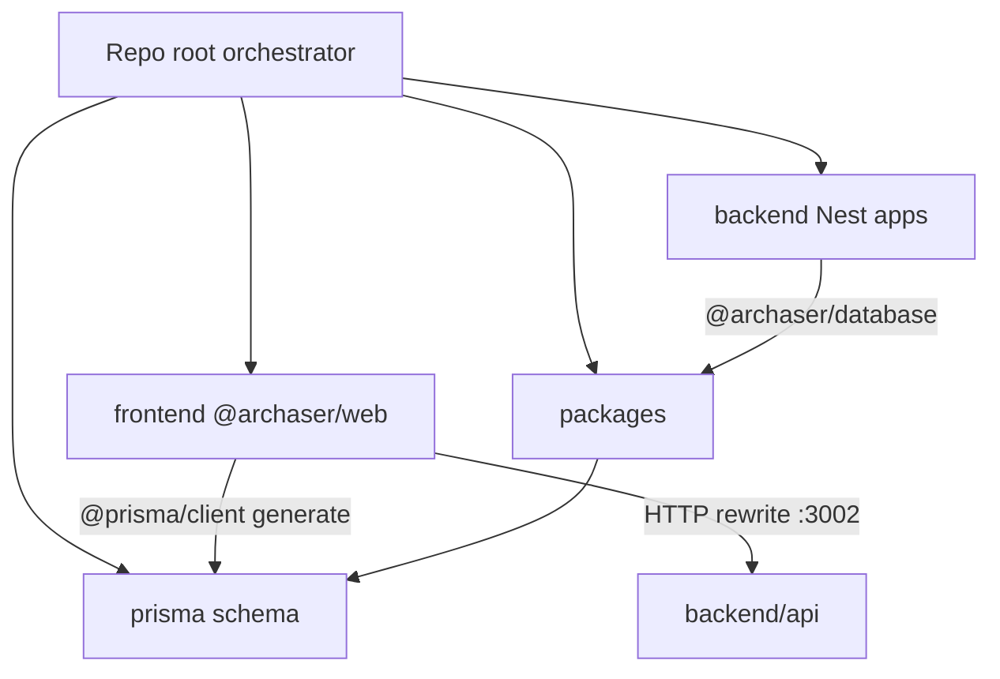

# Frontend / backend folder split

## Locked decisions

- Top-level **`frontend/`** for the Next.js app
- Top-level **`backend/`** for all current Nest workspaces: `api`, `worker`, `sms`, `connectors`, `reports`, `e2e`
- Keep **`packages/`** and **`prisma/`** at repo root (shared SoT; Nest already depends on `@archaser/database` + root Prisma)
- Root remains the npm workspaces orchestrator (thin `package.json` scripts); do not split into two separate git repos

## Target layout

```text
archaser/
  frontend/                 # @archaser/web — Next.js app
    app/ pages/ components/ shared/ server/ public/ …
    next.config.js, middleware.ts, i18nConfig.ts, …
    package.json
  backend/
    api/                    # @archaser/api (was apps/api)
    worker/ sms/ connectors/ reports/ e2e/
  packages/ database/ openapi-client/
  prisma/                   # unchanged location
  scripts/ tests/ docs/ …   # root tooling (paths updated)
  package.json              # workspaces + delegate scripts
  .env                      # stays at root
```



## Phase 1 — Move Nest apps to `backend/` (low risk)

1. `git mv apps/api apps/worker apps/sms apps/connectors apps/reports apps/e2e` into `backend/` (remove empty `apps/`).
2. Update root [`package.json`](package.json) `workspaces` from `apps/*` → `backend/*`.
3. Update path refs:
   - [`.gitignore`](.gitignore) `apps/api/dist/` → `backend/api/dist/`
   - [`tsconfig.json`](tsconfig.json) exclude `apps/**` → `backend/**`
   - [`scripts/openapi/export-nest-openapi.ts`](scripts/openapi/export-nest-openapi.ts) imports/output → `backend/api`
   - [`packages/openapi-client/src/index.ts`](packages/openapi-client/src/index.ts) comment path
   - [`apps/api/scripts/port-ci-domain.js`](apps/api/scripts/port-ci-domain.js) (after move: `backend/api/scripts/...`) DEST + run-from-root comment
4. Nest `envFilePath: ["../../.env"]` and Jest `../../packages/database` stay valid (same depth).
5. `npm install` to refresh lockfile workspace paths.
6. Smoke: `npm run build:api`, `npm run test:api`, `npm run openapi:export`.

Root scripts that use `-w @archaser/api` etc. need **no** command changes.

## Phase 2 — Extract Next.js into `frontend/` (higher risk)

1. Create [`frontend/package.json`](frontend/package.json) as `@archaser/web` with Next runtime scripts (`dev`, `build`, `start`, `lint`) and move Next-related `dependencies` / `devDependencies` from root into this package (leave root with workspace tooling: prisma CLI, playwright/vitest orchestration, husky, typescript shared as needed).
2. `git mv` Next app tree into `frontend/`:
   - Directories: `app`, `pages`, `components`, `shared`, `hooks`, `lib`, `locales`, `models`, `types`, `utils`, `public`, `server`
   - Entrypoints/configs: `middleware.ts`, `i18nConfig.ts`, `instrumentation.ts`, `next.config.js`, `next-env.d.ts`, `postcss.config.js`, `tailwind.config.ts`, `nest-api-rewrite.cjs`
3. Add `frontend` to root `workspaces`; root scripts become delegates, e.g.:
   - `dev` → `npm run dev -w @archaser/web`
   - `build` / `build:*` → build via `@archaser/web` then keep [`scripts/deployment/fix-routes-manifest.js`](scripts/deployment/fix-routes-manifest.js) (update paths to `frontend/build` if needed)
   - `start` / `lint` → workspace delegates
4. Point aliases at the new app root:
   - `frontend/tsconfig.json`: `"paths": { "@/*": ["./*"] }`
   - Webpack alias in `frontend/next.config.js`: `@` → `frontend` dir
   - Root [`tsconfig.json`](tsconfig.json) either becomes a thin project-references/orchestrator or points `@/*` → `frontend/*` for any remaining root tooling
5. **Env loading:** keep `.env` at repo root. At top of `frontend/next.config.js`, load `../.env` (and `.env.local`) via `dotenv` so Next still sees `DATABASE_URL`, Nest rewrite flags, etc. Nest continues using `../../.env` from `backend/*`.
6. Update consumers that assume Next lives at repo root:
   - [`ecosystem.config.js`](ecosystem.config.js) / Ansible [`ansible/playbooks/deploy.yml`](ansible/playbooks/deploy.yml) — `cwd` or script for Next build/start
   - [`.amplifyignore`](.amplifyignore) paths if they list root `app/`, `pages/`, …
   - Vitest configs (`vitest.config.mjs`, etc.) and [`playwright.config.ts`](playwright.config.ts) — resolve `@/` and app paths under `frontend/`
   - [`scripts/deployment/*`](scripts/deployment/) that run `next build` / expect `build/`
   - Root `.gitignore` Next artifacts (`/build`, `/.next`) → also `frontend/build`, `frontend/.next`
7. `npm install`; smoke: `npm run dev` (Next), `npm run build`, `npm run test:unit` (subset), Nest rewrite still proxies to `:3002`.

## Codebase scan

**Required**
- Root [`package.json`](package.json) workspaces + scripts
- Move `apps/*` → `backend/*`
- Create `frontend/` Next workspace + move Next source/configs
- [`.gitignore`](.gitignore), root [`tsconfig.json`](tsconfig.json)
- [`scripts/openapi/export-nest-openapi.ts`](scripts/openapi/export-nest-openapi.ts), openapi-client comment, `port-ci-domain.js`
- `frontend/next.config.js` + `nest-api-rewrite.cjs` (env + `@` alias + `distDir`)
- Vitest / Playwright / deploy scripts / `ecosystem.config.js` / Ansible Next build task
- `package-lock.json` via `npm install`

**Optional / out of scope unless requested**
- Rewriting historical [`.cursor/plans/`](.cursor/plans/) path strings
- Moving `prisma/` into `packages/database` (already deferred in package description)
- Moving `tests/` physically into `frontend/tests` (prefer path updates first; relocate later if desired)
- Splitting root `scripts/` into frontend vs backend folders
- CI workflow YAML changes beyond what breaks (`e2e-tests.yml` uses `npm run build` — must keep working via root delegate)

**No change needed**
- Nest package names (`@archaser/api`, …) and most `-w` scripts
- Nest relative `../../.env` / `../../packages/database` depth
- HTTP strangler coupling (rewrite / CORS) — not filesystem paths
- `docker-compose.redis.yml` / logging compose (no app paths)

## Risks and mitigations

| Risk | Mitigation |
|------|------------|
| Next no longer reads root `.env` | Explicit dotenv load in `frontend/next.config.js` from `../.env` |
| Missed absolute path in deploy/PM2 | Grep for `next build`, `distDir`, `/build`, `pages/`, `app/` after move; fix Ansible + ecosystem |
| Broken `@/` imports in tests | Point vitest/tsconfig-vitest aliases at `frontend/` |
| Huge single PR | Land Phase 1 first if needed; Phase 2 as follow-up commit on same branch |
| Windows `git mv` / long paths | Prefer `git mv`; fall back to move + `git add` |

## Testing strategy

- Phase 1: `npm run build:api`, `npm run test:api`, `npm run openapi:export`
- Phase 2: `npm run build` (Next), start `dev` + `dev:api`, hit login + one proxied `/api/*` route, `npm run test:unit` (or a focused smoke set), confirm Prisma `postinstall` still generates from root

## Suggest plan improvements

- Easy to miss: `fix-routes-manifest.js` and Amplify `build:amplify` expecting root `build/`
- Incorrect assumption to avoid: “workspaces rename alone moves Next” — Next is currently **not** under `apps/`
- Follow-up (out of scope): relocate `tests/` under `frontend/`; extract Prisma into `packages/database`
