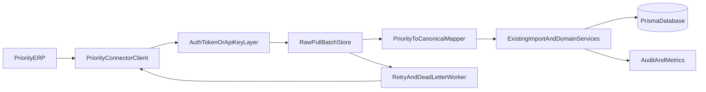

# Priority ERP Connector Plan

## Goal

Build an inbound connector that fetches data from Priority ERP into Archaser for Customers, Contacts, Invoices, Payments, and Credit Notes, while reusing current import pipelines and maintaining tenant-safe, idempotent sync.

## Recommended Architecture

## Phase 0: Priority API Discovery Spike (Required)

- Confirm Priority ERP integration method in production: OAuth2/token flow vs API key/basic auth.
- Document endpoint contracts for all MVP objects: customers, contacts, invoices, payments, credit notes.
- Validate operational details: pagination, incremental filter support (`updated_at`/change log), and rate limits.
- Produce an integration contract doc in code comments/config schema and lock a single auth strategy for implementation.

## Phase 1: Connector Foundation (MVP)

- Add account-scoped Priority connector configuration and credential storage.
- Add pull-sync state tracking per entity (`lastSuccessfulCursor`, `lastAttemptAt`, `errorState`).
- Build a Priority connector client service with:
  - authenticated request wrapper,
  - pagination support,
  - normalized transport error handling and retry hints.
- Reuse existing import normalization/validation paths instead of writing new persistence logic from scratch.

Primary files to extend:

- [pages/api/import/customer/index.ts](pages/api/import/customer/index.ts)
- [pages/api/import/invoice/index.ts](pages/api/import/invoice/index.ts)
- [pages/api/import/contact/index.ts](pages/api/import/contact/index.ts)
- [pages/api/import/payment/index.ts](pages/api/import/payment/index.ts)
- [server/services/ImportService.ts](server/services/ImportService.ts)
- [utils/webhookValidator.ts](utils/webhookValidator.ts)
- [server/services/AccessControlService.ts](server/services/AccessControlService.ts)
- [prisma/schema.prisma](prisma/schema.prisma)

## Phase 2: Priority Mapping + Processing Pipeline

- Implement entity pull processors in this order:
  1. Customers
  2. Contacts
  3. Invoices
  4. Payments
  5. Credit Notes
- Implement canonical DTO mapping layer:
  - Priority payload -> canonical Archaser import model -> existing import/service call.
- Reuse import mappings pattern where field-level mapping flexibility is needed.
- Add deterministic idempotency keys per record (e.g., Priority primary key + account + entity type).

Potential integration points:

- [pages/api/entities/[...path].ts](pages/api/entities/[...path].ts) (existing import mappings operations)
- [shared/services/importMappingService.ts](shared/services/importMappingService.ts)

## Phase 3: Reliability and Operations

- Add retry policy + dead-letter flow for transient failures.
- Add connector run logs and dashboard metrics (processed, failed, retried, latency).
- Add replay endpoint for failed events (admin-only).
- Add safe pull controls (max pages/run, max run duration, circuit-breaker on repeated auth failure).

Existing patterns to reuse:

- [server/services/cronManager.ts](server/services/cronManager.ts)
- [utils/apiRateLimiter.ts](utils/apiRateLimiter.ts)
- [utils/errorHandler.ts](utils/errorHandler.ts)

## Data Model Additions (Prisma)

Add connector-focused models:

- `Connector` (account-scoped): provider=`PRIORITY`, status, auth type, encrypted credential reference, settings.
- `ConnectorSyncState`: entity name, cursor/watermark, last success/failure timestamps.
- `ConnectorPullBatch`: immutable raw fetch batch with request metadata + payload hash.
- `ConnectorPullAttempt`: processing attempts, error details, next retry timestamp.
- Optional `ConnectorMapping` if not reusing existing mapping tables directly.

Important constraints:

- Unique idempotency index on `(connector_id, entity_type, external_record_id)`.
- Unique pull-batch dedupe index on `(connector_id, entity_type, payload_hash, fetched_window_start, fetched_window_end)`.

## Security and Access Control

- Never use user/view-as context for connector sync account resolution.
- Validate connector is active and bound to one account before processing.
- Encrypt connector credentials/secrets and avoid exposing raw secrets in logs or API responses.
- Apply strict validation and sanitization to Priority payloads before mapping/import.

## Incremental Delivery Order

1. Discovery spike and auth method decision.
2. Customer end-to-end pull sync (pilot account).
3. Add contacts + invoices.
4. Add payments + credit notes.
5. Add operational dashboard and replay tooling.

## Testing Strategy

- **Unit tests (mapping/business rules)**
  - Validate Priority->canonical mapping for customers, contacts, invoices, payments, and credit notes.
  - Verify currency/date normalization and missing-field fallbacks.
  - Verify idempotency for duplicate pulls and repeated records.
- **Connector API tests (security + config)**
  - Invalid credentials/auth refresh failure scenarios.
  - Disabled connector and cross-account access rejection.
  - Pull limit and guardrail behavior.
- **Integration tests (end-to-end ingestion)**
  - Priority pull -> raw batch store -> mapper -> import endpoint -> DB write.
  - Retry and dead-letter behavior under transient and permanent failures.
- **Regression tests (existing imports unaffected)**
  - Ensure direct import endpoints continue functioning unchanged for internal/manual imports.

## Acceptance Criteria

- Priority connector successfully syncs all MVP entities for at least one pilot account.
- Re-running the same pull window does not create duplicate business records.
- Failed pulls and failed records are visible, retryable, and auditable.
- Connector processing is strictly account-scoped and does not leak across tenants.
- Existing manual/internal import behavior remains backward-compatible.

