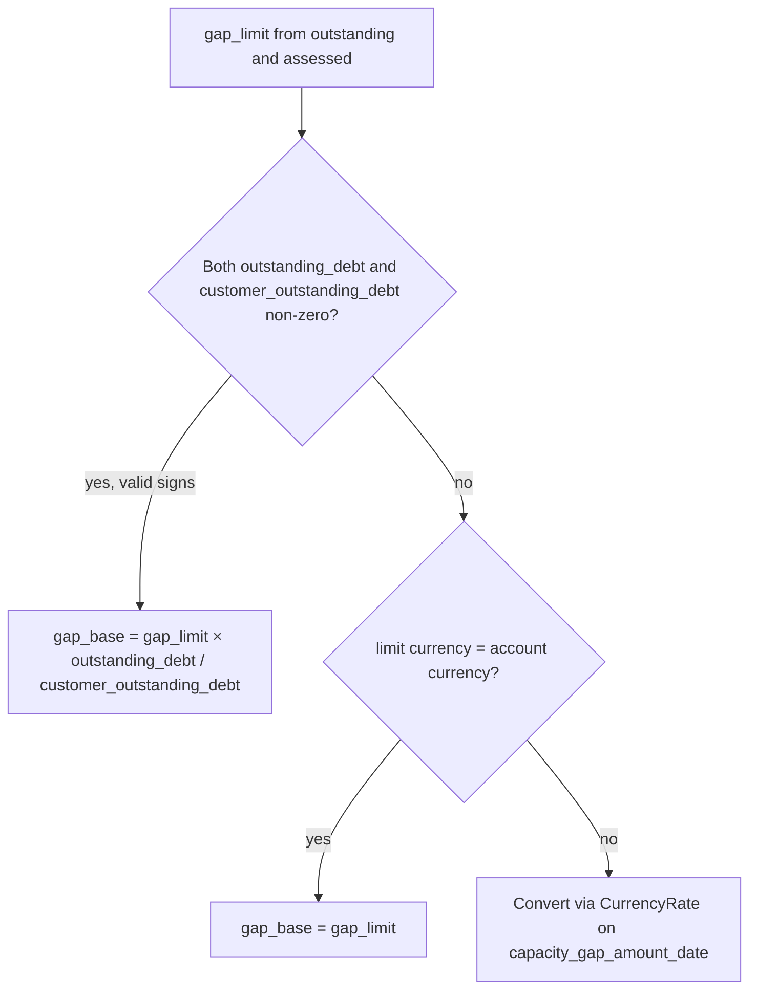
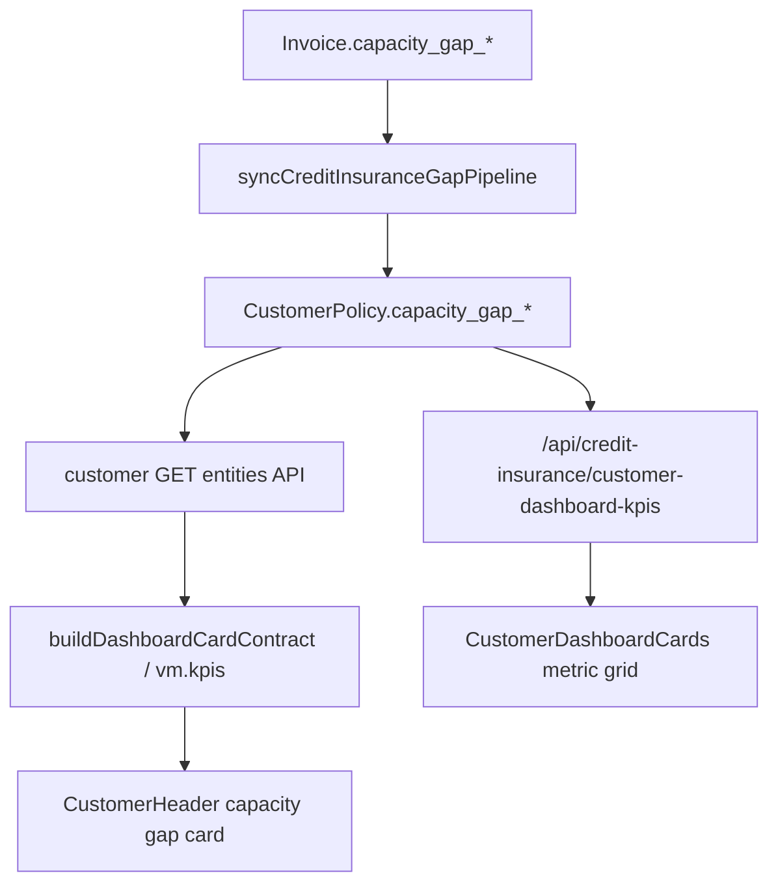
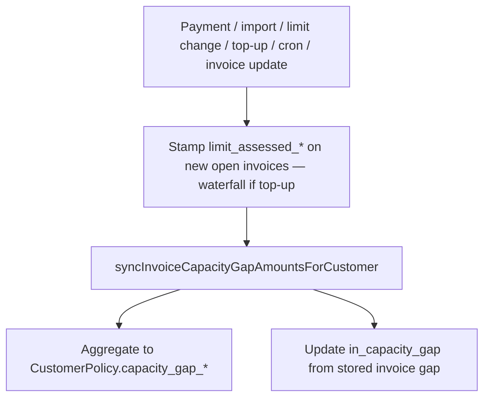
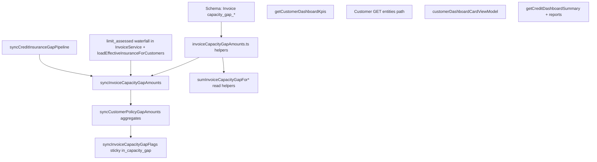

# Invoice capacity gap — dual-currency storage + invoice FX preference

> **Structure:** Product rules, [Decision log](#decision-log), and [Acceptance criteria](#acceptance-criteria) are canonical. Known half-migrated code paths are in [Appendix A](#appendix-a--current-partial-implementation-bugs-to-fix). Excel row scenarios live in test fixtures (see [Testing Strategy](#testing-strategy)).

## Problem

Today capacity gap is **derived at read time**, not stored on invoices:

| Layer | What exists | Gap math |
|-------|-------------|----------|
| Invoice | `limit_assessed_amount` (+ currency), `in_capacity_gap` boolean | Contribution = `max(0, outstanding − assessed)` computed in memory |
| CustomerPolicy | `capacity_gap_amount` (base), `capacity_gap_amount1` + currency (limit) | Written by `syncCustomerPolicyGapAmounts` from AR buckets + `CurrencyRate` |
| Dashboard / header | Often reads `CustomerPolicy` or converts with **latest** `CurrencyRate` | Drifts from ERP-booked amounts; header tied to policy cache |
| Dashboard tab KPI API | Primary partly invoice-computed; **secondary from `capacity_gap_amount1` or FX** | Limit-currency gap wrong vs invoice sum |
| Portfolio credit dashboard | Live invoice compute + **`convertPolicyLimitToAccount` (latest FX)**; fallback `CustomerPolicy` | Capacity gap card + at-risk + reports drift from invoice embedded rates |

**Gaps when approved limit currency ≠ account base currency:**

1. Dashboard converts limit-currency gap with **today’s rate**, not the rate embedded in the invoice (`outstanding_debt` / `customer_outstanding_debt`).
2. `syncInvoiceCapacityGapFlags` uses a **workaround** for cross-currency FIFO (`allocationLimit = openAr − policy.capacity_gap_amount`).
3. **Inconsistent outstanding preference**: `invoiceOutstandingLeft` prefers `customer_outstanding_debt`; `lineOutstandingForCapacityGap` prefers `outstanding_debt` — **fix:** remove `lineOutstandingForCapacityGap`; delegate to `invoiceOutstandingLeft` in flags sync.
4. **Payment on within-limit invoice** can implicitly reshuffle gap under FIFO — product requires **sticky gap on the invoice that created it**.
5. **Top-up** treated as flat effective limit — product requires **policy fills first**, top-up second, existing gap not cleared by top-up.
6. **Dashboard tab `topUpUsagePct`** implements effective usage (`AR / (limit+top)`), not top-up slice usage (`(AR−limit) / top`).

**Reference spreadsheet:** `Calcultions.xlsx` (sheet **Capacity Gap**, sheet **topups**).

**Builds on:** [invoice-level capacity gap plan](.cursor/plans/invoice-level_capacity_gap_1cd83735.plan.md). **Coordinates with:** [credit insurance top-up plan](.cursor/plans/credit-insurance-top-up.plan.md).

See [Appendix A](#appendix-a--current-partial-implementation-bugs-to-fix) for file-level bugs in today's half-migrated paths.

---

## Goal

1. **Persist** per-invoice capacity gap in **both** currencies on `Invoice`.
2. **Invoice FX preference:** when both `customer_outstanding_debt` and `outstanding_debt` are present (valid signs), `gap_base = gap_limit × (outstanding_debt / customer_outstanding_debt)`.
3. **Sticky gap:** payments reduce gap **only** on invoices that currently have gap; no customer-wide FIFO reshuffle on payment.
4. **Top-up waterfall:** policy limit consumed first (usage capped at 100%); top-up used for AR above policy; gap only above **policy + top-up**; top-up **does not** clear existing gap.
5. **Customer header + Dashboard tab + Policies tab:** display gap from **`CustomerPolicy.capacity_gap_*`** (base + limit currency) — values are **`SUM(invoice gaps)`** written by the pipeline; no bucket/FX gap math on the policy row.
6. **Invoice** = source of truth per open line; **`CustomerPolicy`** = denormalized per-policy aggregate (updated every pipeline run); **portfolio account rollup** = **`SUM(CustomerPolicy.capacity_gap_amount)`** on active rows (not a direct invoice SUM at read time).
7. **Usage KPIs** on customer Dashboard tab (when top-up enabled): Policy / Top / Effective per sheet **topups** — fix current mislabeled `topUpUsagePct`; scope top-up pool **per primary** when multiple active top-ups or primaries exist (D10).
8. **Portfolio credit dashboard:** `capacityGap.totalAmount` and dependent at-risk/health from **`SUM(CustomerPolicy.capacity_gap_amount)`** (account base); **no UI change** on gap card.

---

## Decision log

Decisions locked for implementation (update if product changes):

| # | Topic | Decision | Rationale |
|---|-------|----------|-----------|
| D1 | Risk exposure trend chart (`getCustomerRiskExposureAmountTrendByPolicy`) | Use **`CustomerPolicy.capacity_gap_amount`** (synced) at read time, not `usageAmount − approvedLimit` on snapshots | Aligns with D7/D9 |
| D2 | Portfolio `overLimitCustomerCount` / trend over-limit | Customers with **`CustomerPolicy.capacity_gap_amount1 > 0`** (synced; equivalent to invoice gap > 0) | Matches capacity gap card; read policy not invoices (D9) |
| D3 | Policies tab (`CustomerCreditInsuranceInfo`) | Read **`CustomerPolicy.capacity_gap_amount`** + **`capacity_gap_amount1`** / **`capacity_gap_currency1`** (same as header) | Policy row is invoice SUM after pipeline |
| D4 | Dashboard tab `effectiveUsagePct` | **Fix `topUpUsagePct` formula first**; add `effectiveUsagePct` to KPI API type but **no new card** until translations approved | Avoid mislabeled UI; API ready for follow-up |
| D5 | Paid/closed invoice gap fields | Store **`0`** (not null) when cleared | Stable `SUM()` in SQL rollups |
| D6 | Gap amount DB type | **`Decimal(20,4)`** on invoice (match `limit_assessed_amount`) | Avoid float drift in reconciliation |
| D7 | Customer-facing gap **read path** | **Always read `CustomerPolicy`** after pipeline; never re-SUM invoices on GET/KPI for display | Performance; policy guaranteed = invoice SUM when sync + reconciliation pass |
| D8 | Policy gap **write path** | **`syncCustomerPolicyGapAmounts` copies invoice SUMs only** — no AR-bucket gap, no latest-FX gap conversion | Keeps policy row equal to `sumInvoiceCapacityGapForCustomerPolicy` |
| D9 | Portfolio / account gap **read path** | **`SUM(CustomerPolicy.capacity_gap_amount)`** on active rows (optional `policyId` filter) — **not** direct `SUM(Invoice.capacity_gap_amount)` at read time | Same pattern as D7; policy already holds invoice SUM after pipeline |
| D10 | **Multiple active top-ups** — pool scope for gap + stamping | Every TopUp `InsurancePolicy` **must** have non-null `parent_insurance_policy_id` → customer's **Primary** policy. For invoices on primary **P**, waterfall + usage KPIs use **`approved_limit` of P's `CustomerPolicy`** + **sum of resolved active top-ups** where `parent_insurance_policy_id = P` (multiple concurrent rows on the same TopUp policy **sum** when `allow_concurrent_top_ups`; multiple TopUp policies with the same parent **sum** into one pool). **No account-wide top-ups** (`parent_insurance_policy_id` null) in gap/stamping/KPI paths — reject at TopUp policy create if parent missing (align [credit-insurance-top-up plan](.cursor/plans/credit-insurance-top-up.plan.md) validation with this for gap rollout). | One headroom pool per primary; matches invoice `policy_id`; avoids double-counting customer-wide top-up across primaries |

### Gap data flow (read vs write)

```text
WRITE (every gap event):
  Invoice.capacity_gap_*  ← compute per open line (sticky, dual currency)
       ↓ pipeline step 2
  CustomerPolicy.capacity_gap_*  ← SUM(invoices) only (D8)
       ↓ pipeline step 3
  Invoice.in_capacity_gap  ← flags from stored invoice gap

READ (customer UI — header, Dashboard tab, Policies tab):
  CustomerPolicy.capacity_gap_amount      (base)
  CustomerPolicy.capacity_gap_amount1     (limit currency)
  CustomerPolicy.capacity_gap_currency1

READ (portfolio dashboard, reports, snapshots — D9):
  SUM(CustomerPolicy.capacity_gap_amount) on active rows [+ policyId filter]
  Per-customer / per-policy maps from CustomerPolicy fields

WRITE / RECONCILE (not hot read paths):
  sumInvoiceCapacityGapForCustomerPolicy  ← writer input; must match policy row after pipeline
  reconcile script: invoice SUM vs policy SUM per customer+policy
```

**Prerequisite for D7 / D9:** reads use `CustomerPolicy` only **after** pipeline has run (or cron caught up). Mutating APIs must await `syncCreditInsuranceGapPipelineForCustomer` before returning customer or dashboard payloads that include gap.

---

## Reference model (Calcultions.xlsx)

### Sheet 1 — Capacity Gap

**Setup:** Policy limit 12,000 GBP; top-up 8,000 GBP; effective cover 20,000 GBP.

| Event | AR (GBP) | Customer gap (GBP) | Customer gap (base) | Notes |
|-------|----------|--------------------|---------------------|-------|
| Inv 1–2 (10k AR) | 10,000 | 0 | 0 | Within policy |
| Inv 3 (+5k) | 15,000 | 3,000 | 12,000 | `4 × 3k` (invoice 3 rate) |
| Pay 1k on **inv 1** | 14,000 | **3,000** | **12,000** | Non-gap invoice — gap unchanged |
| Pay 1k on **inv 3** | 13,000 | **2,000** | **8,000** | Gap invoice — gap reduced |
| Top-up to 20k effective | 13,000 | **2,000** | **8,000** | Top-up does **not** clear gap |
| Inv 4 (+8k) | 21,000 | **3,000** | **11,500** | +1k GBP new gap; base `L23 + J29` at inv4 rate 3.5 |

**Formulas:**

- `gap_limit` per invoice = `max(0, outstanding_policy_ccy − limit_assessed_amount)`
- `gap_base` = `(amount_base / amount_policy) × gap_limit` (**invoice embedded rate**)
- Customer `gap_limit` = **SUM** of invoice `gap_limit` (only gap-creating invoices contribute)
- Customer `gap_base` = **SUM** of invoice `gap_base` (each invoice may use a different rate)

### Sheet 2 — topups (usage)

All in policy/invoice currency:

```text
policy_usage =
  if top_up > 0 and AR > limit:
    min(1, AR / limit)          // capped at 100%
  else:
    AR / limit                  // can exceed 100% when no top-up

top_up_usage =
  if AR > limit and top_up > 0:
    (AR - limit) / top_up
  else:
    0

effective_usage =
  AR / (limit + top_up)
```

| Limit | Top | AR | Policy | Top | Effective |
|-------|-----|-----|--------|-----|-----------|
| 10k | 0 | 11k | 110% | 0% | 110% |
| 10k | 5k | 11k | **100%** | **20%** (1k/5k) | **73.3%** |
| 10k | 5k | 5k | 50% | **0%** | 33.3% |

**Usage vs gap:** Usage measures consumption of policy / top-up / combined cover. **Gap** is uninsured exposure that top-up does not retroactively absorb.

---

## Product rules

### Snapshot basis (`limit_assessed_amount`)

- Stamped **once** when invoice becomes **open**; never updated on limit change, top-up, or payment.
- For **new** open invoices when top-up is active, headroom uses **waterfall** (not flat effective limit):

```text
1. Allocate open AR before this invoice against policy limit (up to approved_limit).
2. Allocate any AR above policy against active top-up pool (up to top-up total).
3. limit_assessed_amount = min(invoice_outstanding, remaining_policy + remaining_topup).
4. If no headroom left → 0 (new exposure → full outstanding becomes gap).
```

- Limit **decrease** does not change existing snapshots.
- Limit **increase** does not trigger immediate gap reassessment on old invoices.

### Sticky per-invoice gap

- `gap_limit = max(0, outstanding_limit_currency − limit_assessed_amount)` on each open invoice.
- `outstanding_limit_currency` via `invoiceOutstandingLeft` (`customer_outstanding_debt` preferred).
- **On payment:** recompute gap **only for invoice(s) that received payment** — do **not** reallocate gap across other invoices.
- Paying a within-limit invoice **does not** reduce another invoice’s gap (Excel: pay inv1 → gap stays 3,000).
- Store gap **uncapped** on invoice; apply `min(gapSum, openAr)` at **customer level after SUM** via `resolveCapacityGapForAtRisk` (not per-invoice cap before SUM).

### Top-up and gap

- Top-up is used for AR **only after** policy limit reaches **100%** (usage KPIs).
- Adding top-up **does not** reduce existing `capacity_gap_*` on invoices or customer totals.
- **New** gap appears only when total AR exceeds **policy + active top-up**.
- New invoice gap slice at **that invoice’s** embedded rate; customer base gap = **sum of slices**.

### Multiple active top-ups per customer (D10)

Product allows **more than one** active `CustomerTopUp` row per customer. Gap math treats them as a **single aggregated pool per primary policy**, not separate gap buckets.

| Scenario | Behavior |
|----------|----------|
| **Several concurrent rows** on the same TopUp policy (`allow_concurrent_top_ups === true`) | Resolver **sums** resolved monetary amounts into one `topUpTotal` for that TopUp policy; all count toward the same parent's pool (see [credit-insurance-top-up plan](.cursor/plans/credit-insurance-top-up.plan.md) §1a). |
| **Multiple TopUp policies** with the same `parent_insurance_policy_id` | Subtotals **sum** into one `topUpTotal` for primary **P** (FX into P's limit currency). |
| **Multi-primary customer** (multiple active `CustomerPolicy` rows) | Gap SUM, waterfall stamping, and usage KPIs are **per primary P** — use only top-ups with `parent_insurance_policy_id = P`. Never apply P₂'s top-up pool to invoices on P₁. |
| **Percentage top-ups** | Resolved amount uses **current** `approved_limit` at stamp/recompute time; existing `limit_assessed_*` snapshots stay frozen; only **new** opens see updated pool. |
| **Parent required** | TopUp policy without `parent_insurance_policy_id` is **invalid** for gap/stamping (stricter than optional account-wide in top-up plan §1a — enforce non-null parent for gap rollout). |

**Resolver contract (extend existing helper):**

```ts
resolveEffectiveApprovedLimit(customerId, {
  baseApprovedLimit,
  baseApprovedLimitCurrency,
  parentPrimaryPolicyId: P,  // NEW — filter top-ups to parent === P only
  asOfDate?,
  dbClient?,
})
// → topUpTotalInLimitCurrency = sum of active top-ups for P (all concurrent rows)
```

**Waterfall stamping (extend `computeLimitAssessedAmountForNewOpenInvoice`):**

```ts
computeLimitAssessedAmountForNewOpenInvoice({
  approvedLimit,           // P's approved_limit
  topUpTotal,              // from resolver scoped to P — NOT flat effectiveApprovedLimit
  openArOnPolicyBeforeInvoice, // FIFO open AR on same invoice.policy_id before this line
}): number
```

Steps unchanged from snapshot basis: consume policy headroom first, then top-up pool, then `min(outstanding, remaining_policy + remaining_topup)`.

**Usage KPIs:** One resolver call **per scoped `(customerId, primaryPolicyId)`** when `policyId` filter set; when account-wide KPI view, **sum metrics per primary** — do **not** loop `CustomerPolicy` rows and re-add the same customer-wide `topUpTotal` each iteration (today's double-count bug in [`customerDashboardKpisService.ts`](server/services/creditInsurance/customerDashboardKpisService.ts) ~L537–564).

### `in_capacity_gap` boolean

- Set from **stored** `capacity_gap_amount_limit > 0` after sync (sticky with invoice gap).
- Used for terms-breach / at-risk deduplication; must align with gap-owning invoices.

---

## Edge cases

| Case | Behavior |
|------|----------|
| **Credit note / negative outstanding** | `gap_limit = max(0, outstanding − limit_assessed)` — never negative. No implicit FX ratio when signs differ → fall through to table rate or `missingRate`. |
| **Partial payment on gap invoice** | Recompute from **new** outstanding after payment: `gap_limit = max(0, newOutstanding − limit_assessed_amount)`; base via same invoice's embedded rate at recompute time. |
| **Payment on non-gap invoice** | Recompute **only that invoice**; gap stays 0; other invoices unchanged (Excel inv1 rule). |
| **Open invoice, `limit_assessed_amount` null** | Migration: skip stored gap; read path uses runtime fallback (`hasMissingSnapshots`). Post-backfill: treat as sync bug; cron should stamp + sync. |
| **`outdated_dcl === true`** | Invoice gaps **still computed and stored**; at-risk/near-limit **exclude** gap path (terms breach). Policy cache writer may zero gap display fields — invoice fields remain audit source. |
| **Multi-policy customer** | Sum **per `(customer_id, policy_id)`**; never sum `capacity_gap_amount_limit` across policies with different limit currencies without explicit conversion. Top-up pool and usage KPIs scoped per primary (D10). |
| **Multiple active top-ups on one primary** | Single summed `topUpTotal` per primary; waterfall uses aggregate pool; concurrent rows do not get individual gap buckets. |
| **Invoice without `policy_id`** | Excluded from capacity gap SUM and sync; `in_capacity_gap = false`. |
| **Paid / closed / Written off** | Set `capacity_gap_amount = 0`, `capacity_gap_amount_limit = 0`, `in_capacity_gap = false`. |
| **ERP import changes outstanding (no payment row)** | `postImportOverdueMetrics` → **full customer** pipeline (not payment-scoped). |
| **Cap at read time** | Invoice stores **uncapped** gap; `resolveCapacityGapForAtRisk` applies `min(customerGapSum, openAr)` **after** SUM at customer level. |

### Waterfall vs sticky gap (key insight)

Top-up affects **new** invoices only via **`limit_assessed_amount`** stamping. Gap formula is always:

```text
gap_limit = max(0, outstanding_limit_currency − limit_assessed_amount)
```

No second "effective limit" term in the gap formula — waterfall is fully encoded in `limit_assessed_amount`.

---

## FX conversion rules

### Priority when computing `gap_base` from `gap_limit`



| Priority | Condition | `gap_base` | `capacity_gap_amount_date` |
|----------|-----------|------------|----------------------------|
| 1 | Both outstanding non-zero, same sign | `gap_limit × (outstanding_debt / customer_outstanding_debt)` | `null` |
| 2 | Limit currency = account currency | `gap_limit` | `null` |
| 3 | Cross-currency, single-sided outstanding | Table / latest rate for `rateDate` | rate date used |
| 4 | No rate | `null` on base; `missingRate` on sync | — |

Reuse ratio pattern from [`InvoiceService.calculateTotalPaidFromRatio`](server/services/InvoiceService.ts).

**Shared module** `server/services/creditInsurance/invoiceCapacityGapAmounts.ts`:

```ts
invoiceImplicitBasePerCustomerUnit(row): number | null

computeInvoiceCapacityGapDualCurrency(args): {
  gapLimit: number;
  gapBase: number | null;
  rateDate: Date | null;
  usedImplicitRate: boolean;
}

sumInvoiceCapacityGapForCustomerPolicy(
  accountId, customerId, policyId
): { gapBase: number; gapLimit: number; limitCurrency: string | null }
```

---

## Data model

### Naming glossary

| Column | Plain name | Currency |
|--------|------------|----------|
| `capacity_gap_amount` | Base gap | Account base (`Account.currency`) |
| `capacity_gap_amount_limit` | Policy/invoice gap | `limit_assessed_currency` (same as policy limit currency) |
| `capacity_gap_amount_date` | FX date | Set when table rate used; `null` when implicit invoice rate |

TypeScript helpers may use `gapBase` / `gapLimitCurrencyAmount` in return types; DB names stay as above for parity with `CustomerPolicy.capacity_gap_amount1`.

### Currency invariant

For credit-insured open invoices: **`limit_assessed_currency` = policy `approved_limit_currency`**. `customer_currency` should match; if import violates this, sync logs a warning and uses `limit_assessed_currency` as gap limit currency (no separate `capacity_gap_limit_currency` column in v1).

### `Invoice` — new columns

| Field | Type | Notes |
|-------|------|--------|
| `capacity_gap_amount` | `Decimal?` `@db.Decimal(20, 4)` | Gap in **account base** currency |
| `capacity_gap_amount_limit` | `Decimal?` `@db.Decimal(20, 4)` | Gap in **approved limit / invoice** currency |
| `capacity_gap_amount_date` | `Date?` `@db.Date` | Set when `CurrencyRate` used; `null` when implicit invoice rate |

Migration: `prisma/migrations/*_invoice_capacity_gap_amounts.sql` — nullable add.

### Index (rollup performance)

Add composite index for open invoice gap rollups:

```prisma
@@index([account_id, customer_id, policy_id, status], map: "idx_invoice_gap_rollup")
```

Filter in queries: `status IN (Due, Overdue)`, `policy_id IS NOT NULL`.

Existing: `limit_assessed_amount`, `limit_assessed_currency`, `in_capacity_gap` unchanged.

### `CustomerPolicy` — per-policy aggregate (read source for customer UI + portfolio)

After pipeline step 2, policy row holds dual-currency gap **copied from invoice SUMs** (D7–D8):

| Policy field | Written as |
|--------------|------------|
| `capacity_gap_amount` | `SUM(invoice.capacity_gap_amount)` — account base |
| `capacity_gap_amount1` | `SUM(invoice.capacity_gap_amount_limit)` — limit/invoice currency |
| `capacity_gap_currency1` | `approved_limit_currency` (when limit gaps summed) |

**No** AR-bucket gap formula, **no** latest-`CurrencyRate` gap conversion on write. Uninsured bucket fields unchanged (separate concern).

**Read rules (D7, D9):** Customer GET, KPI API, header vm, Policies tab, and **portfolio dashboard / reports** read **`CustomerPolicy.capacity_gap_*`** — account total = **`SUM(capacity_gap_amount)`** on active rows. `sumInvoiceCapacityGapForCustomerPolicy` is **writer + reconciliation only** — not portfolio hot path.

**Invariant (post-pipeline):** `CustomerPolicy.capacity_gap_*` = `sumInvoiceCapacityGapForCustomerPolicy(...)` for that customer+policy. Reconciliation script asserts this per account.

---

## Customer UI — gap & usage (two code paths today)

Gap and usage on the customer page are fed from **different sources**. Gap display reads **synced `CustomerPolicy`**; usage uses sheet 2 formulas.



### A. Customer **Dashboard tab** — metric cards

[`CustomerDashboardCards.tsx`](app/[locale]/app/customers/[customerId]/CustomerDashboardCards.tsx) loads **`/api/credit-insurance/customer-dashboard-kpis`** and binds **all** credit metric cards to `creditKpis` from that response. It does **not** use `vm.kpis` for the metric grid (only policy filter + charts use `vm`).

| Card | Field today | Problem | Fix in |
|------|-------------|---------|--------|
| **Capacity gap** | `creditKpis.capacityGapAmount` + `capacityGapAmountSecondary` | Mixed runtime invoice compute + **wrong secondary** (FX / old policy buckets) | Read **`CustomerPolicy`** after pipeline (D7) |
| **At-risk exposure** | Derived from `capacityGapAmount` | Follows gap source | Same service |
| **Health index** | Derived from at-risk | Indirect | Same service |
| **Policy usage %** | `computePortfolioUsagePct` = AR / approved_limit only | Can exceed 100% when top-up exists; should **cap at 100%** when top-up active | Same service + `computeTopUpUsageMetrics` |
| **Top-up usage %** | `topUpUsagePct = totalAr / totalEffectiveLimit` | This is **Effective** usage (sheet 2 col N), **not** Top usage (col M) | Same service — return correct `topUpUsagePct` and optionally `effectiveUsagePct` |
| **Top-up total** | `topUpTotal` | Display OK | — |
| **Terms breach** | Live invoice sum | No gap-field change | — |
| **Active policies** | Count | No change | — |

**UI component:** [`CustomerDashboardCards.tsx`](app/[locale]/app/customers/[customerId]/CustomerDashboardCards.tsx) — **no layout change required** for capacity gap dual currency if API returns correct `capacityGapAmount` + `capacityGapAmountSecondary`. Optional follow-up: add **Effective usage** card or relabel “Top-up usage” after backend fix (may need translation approval).

**Required backend changes** in `getCustomerDashboardKpis` (D7 — read policy row, not re-SUM invoices):

```ts
// After pipeline: policy row holds invoice SUMs in both currencies
const policyRow = ...; // active CustomerPolicy for scoped policyId
capacityGapAmount = Number(policyRow.capacity_gap_amount ?? 0);
capacityGapAmountSecondary = Number(policyRow.capacity_gap_amount1 ?? 0);
capacityGapLimitCurrency = policyRow.capacity_gap_currency1 ?? policyRow.approved_limit_currency;

// Multi-policy (no policyId filter): sum capacity_gap_amount / capacity_gap_amount1 across active policy rows
```

```ts
const usage = computeTopUpUsageMetrics({ ar, approvedLimit, topUpTotal });
policyUsagePct = usage.policyUsage * 100;
topUpUsagePct = usage.topUpUsage * 100;
```

Remove `resolveCapacityGapForPolicies`, runtime invoice gap SUM, `storedCapacityGapInCurrency`, and FX fallback for gap on this API.

### B. Customer **header** — capacity gap card

[`CustomerHeader.tsx`](app/[locale]/app/customers/[customerId]/CustomerHeader.tsx) uses **`creditVm.kpis`** from customer GET → **`CustomerPolicy.capacity_gap_*`** (D7).

| Display line | Read from policy row | Currency |
|--------------|----------------------|----------|
| Primary | `capacity_gap_amount` | Account base |
| Secondary | `capacity_gap_amount1` | `capacity_gap_currency1` / `approved_limit_currency` |

### Secondary currency display matrix

Header/dashboard secondary line uses `resolveCustomerCreditInsuranceSecondaryCurrency` (from customer overdue/due buckets). Limit-currency gap uses `approved_limit_currency`. Matrix:

| Secondary bucket (UI) | Limit currency | Secondary line shows |
|-----------------------|----------------|----------------------|
| Same as limit (e.g. GBP) | GBP | `capacity_gap_amount1` from policy row |
| Same as account base | ILS | Omit secondary line for gap (primary already shows base); do **not** duplicate primary |
| Different from both (e.g. EUR) | GBP | Show limit-currency gap with **limit currency code** (e.g. "3,000 GBP"), not EUR bucket — gap is not converted to EUR |
| No secondary bucket | — | Primary (base) only |

KPI API: return `capacityGapAmountSecondary` + `capacityGapLimitCurrency` (or equivalent) so the client knows which code to display. Remove all paths that FX-convert base gap to secondary bucket currency for gap display.

**API:** [`pages/api/entities/[...path].ts`](pages/api/entities/[...path].ts) customer GET — `capacity_gap_amount` / `capacity_gap_secondary` from **synced `CustomerPolicy`** (D7).

**Bug to fix:** remove runtime invoice gap SUM and FX secondary on GET; remove ~L5582 logic that mixes **stale** policy values with live invoice compute — after pipeline, **policy row alone** is authoritative for display. Ensure customer GET runs after pipeline on mutating paths (payment/import) or reads policy updated in same request.

**View model:** [`customerDashboardCardViewModel.ts`](app/[locale]/app/customers/[customerId]/customerDashboardCardViewModel.ts):

- `readCapacityGapFromPolicyRow` — keep for display but values must come from **pipeline-synced** policy fields only (no AR−limit fallback for gap).
- `vm.kpis.capacityGapAmountSecondary` — `capacity_gap_amount1` + `capacity_gap_currency1` from policy row.

[`CustomerCreditInsuranceInfo`](app/[locale]/app/customers/[customerId]/CustomerCreditInsuranceInfo.tsx) **Policies tab** — same policy fields (D3).

### Consumer summary

| Consumer | Gap source | Usage source |
|----------|------------|--------------|
| Dashboard tab capacity gap card | `CustomerPolicy` via KPI API (D7) | — |
| Customer header capacity gap card | `CustomerPolicy` via customer GET → vm (D7) | — |
| Dashboard tab policy / top-up usage cards | — | `computeTopUpUsageMetrics` via KPI API |
| Portfolio credit dashboard (gap card, at-risk, health) | **`SUM(CustomerPolicy.capacity_gap_amount)`** via `getCreditDashboardSummary` (D9) | Insurer max-cover chart — **unchanged** (see top-up plan for 3rd bar) |
| Portfolio credit reports | Synced **`CustomerPolicy`** gap per customer row (D9) | — |
| Policies tab detail | `CustomerPolicy` dual-currency gap (D3) | — |

---

## Portfolio credit dashboard (account-level)

[`CreditDashboardScreen`](app/[locale]/app/credit-dashboard/CreditDashboardScreen.tsx) displays [`getCreditDashboardSummary`](server/services/creditInsurance/creditInsuranceDashboardService.ts). **No UI changes** required for this plan’s gap work — the capacity gap card already shows a **single account-currency** total (`s.capacityGap.totalAmount`).

### What needs updating (backend only)

| Surface | File / function | Today | Target |
|---------|-----------------|-------|--------|
| **Capacity gap card** | `getCreditDashboardSummary` ~L1361–1548 | Live invoice compute + latest FX; or stale `dashboardCapacityGapFromStored` | **`SUM(CustomerPolicy.capacity_gap_amount)`** on active rows (D9) |
| **Customer over-limit count** | Same rollup | Customers with any invoice gap > 0 | Customers with **`CustomerPolicy.capacity_gap_amount_limit > 0`** (or `capacity_gap_amount1 > 0`) after sync — equivalent to D2 |
| **Per-policy gap map** | `policyCapacityGapById`, `invoiceGapByCustomerPolicy` | Live invoice compute in account ccy | **`SUM(CustomerPolicy.capacity_gap_amount)`** grouped by `insurance_policy_id` / `customer_id:policy_id` |
| **At-risk / health / compliant** | `capacityGapForCustomerAtRisk` ~L1575+ | Mixed invoice/policy compute | **`CustomerPolicy.capacity_gap_amount`** per customer (synced); cap with `resolveCapacityGapForAtRisk` |
| **Policy risk report** | `getPolicyRiskExposureReport` | `capacityGap` from old patterns | **`CustomerPolicy.capacity_gap_amount`** per customer row (D9) |
| **Capacity / limit reports** | Report row builders using gap | Mixed stored / computed | **`CustomerPolicy`** synced gap per customer |
| **Limit warning report** | `getLimitWarningReport` / `isNearLimitForWarning` | `gapAmountForCustomer` = AR − limit | Synced policy gap > 0 for near-limit exclusion |
| **Daily snapshots** | [`creditDashboardSnapshotService.ts`](server/services/creditInsurance/creditDashboardSnapshotService.ts) | Persists `capacity_gap_total_amount` from summary | Must snapshot new rollup for month-over-month deltas |

### What does **not** change in this plan

| Surface | Reason |
|---------|--------|
| [`CreditDashboardScreen.tsx`](app/[locale]/app/credit-dashboard/CreditDashboardScreen.tsx) layout / gap card | Backend-only; same props contract |
| [`CreditPolicyUsageChart`](app/[locale]/app/credit-dashboard/CreditPolicyUsageChart.tsx) | **Insurer max total cover** vs receivables — not customer Policy/Top/Effective % (Excel sheet 2). Third top-up bar → [credit-insurance-top-up plan](.cursor/plans/credit-insurance-top-up.plan.md) |
| Dual-currency display on portfolio gap card | Portfolio KPI is account base only; limit currency is customer-page UX |
| `computeTopUpUsageMetrics` on portfolio | Customer Dashboard tab KPI API only |

### Portfolio rollup helper (D9)

Account-scoped reader — **SUM `CustomerPolicy`**, not invoices:

```ts
sumCustomerPolicyCapacityGapForAccount(
  accountId,
  options?: { policyId?: number }
): {
  gapBaseTotal: number;                    // SUM(capacity_gap_amount) active CustomerPolicy rows
  customerOverLimitCount: number;          // distinct customers with capacity_gap_amount1 > 0
  gapByPolicyId: Map<number, number>;    // SUM by insurance_policy_id
  gapByCustomerPolicy: Map<string, number>; // `${customerId}:${policyId}` → capacity_gap_amount
}
```

Use in `getCreditDashboardSummary` instead of the loop at ~L1404–1435 (`convertPolicyLimitToAccount` per invoice). Remove `sumCustomerPolicyInvoiceCapacityGap` from portfolio hot path.

### Reconciliation (account base)

After deploy, for each account (reconciliation **validates** writer; portfolio **reads** policy):

```text
SUM(CustomerPolicy.capacity_gap_amount)     [active rows, account scoped]  ← portfolio read (D9)
  = CreditDashboardSummary.capacityGap.totalAmount
  = SUM per-customer header / dashboard tab gap (primary line)
  ≈ SUM(Invoice.capacity_gap_amount)        [reconcile only — must match policy after pipeline]
```

### Reports & API wrappers (no logic if service fixed)

| File | Role |
|------|------|
| [`pages/api/credit-insurance/report.ts`](pages/api/credit-insurance/report.ts) | Routes to `getCapacityGapReport`, `getPolicyRiskExposureReport`, etc. |
| [`pages/api/credit-insurance/summary.ts`](pages/api/credit-insurance/summary.ts) | Thin wrapper → `getCreditDashboardSummary` |
| [`pages/api/credit-insurance/summary-history.ts`](pages/api/credit-insurance/summary-history.ts) | Historical snapshots from `creditDashboardSnapshotService` |
| [`app/.../CreditInsuranceReportGrid.tsx`](app/[locale]/app/credit-dashboard/report/CreditInsuranceReportGrid.tsx) | `capacityGap` column — consumes API |
| [`app/.../CreditReportSummaryCards.tsx`](app/[locale]/app/credit-dashboard/report/CreditReportSummaryCards.tsx) | Summary cards — consumes API |

---

## Trends & portfolio analytics

Per [Decision log](#decision-log) D1–D2:

| File | Today | Target |
|------|-------|--------|
| [`customerPolicyTrendService.ts`](server/services/creditInsurance/customerPolicyTrendService.ts) `getCustomerRiskExposureAmountTrendByPolicy` | `gapFromLimit = usageAmount − approvedLimit` on snapshots | **D1:** invoice-sum gap at read time (stored fields) |
| [`customerPolicyTrendService.ts`](server/services/creditInsurance/customerPolicyTrendService.ts) `getCustomerPolicyPortfolioTrend` | `over_limit_count` from `usage_pct >= 100` or `usage > limit` | **D2:** customers with **`CustomerPolicy.capacity_gap_amount1 > 0`** |
| [`takeCustomerPolicyTrendSnapshots.ts`](server/cron-jobs/takeCustomerPolicyTrendSnapshots.ts) | No gap columns on `CustomerPolicyTrend` | No change unless product adds historical gap to snapshots |
| [`CreditPolicyLimitUsageTrendChart.tsx`](app/[locale]/app/credit-dashboard/CreditPolicyLimitUsageTrendChart.tsx) | Consumes portfolio trend API | Inherits D2 over-limit definition change |

---

## Sync architecture



### Single pipeline entry point

Do **not** duplicate orchestration at each call site. Add one module function:

```ts
// server/services/creditInsurance/syncCreditInsuranceGapPipeline.ts (new)

syncCreditInsuranceGapPipelineForCustomer(
  customerId: number,
  options?: {
    invoiceIds?: number[];  // payment-scoped: only recompute these invoices' gaps
    dbClient?: DbClient;
    skipPolicyAggregate?: boolean;
    skipFlags?: boolean;
  }
): Promise<{ missingRate: boolean }>
```

**Internal order (always):**

```text
1. syncInvoiceCapacityGapAmountsForCustomer  (scoped to invoiceIds when set)
2. syncCustomerPolicyGapAmountsForCustomer   (aggregate cache; skip if skipPolicyAggregate)
3. syncInvoiceCapacityGapFlagsForCustomer    (skip if skipFlags)
```

**Call sites become thin wrappers** — they only invoke `syncCreditInsuranceGapPipelineForCustomer`:

| Trigger | Scope |
|---------|--------|
| `PaymentService.createInvoicePayment` | `{ invoiceIds: [paidInvoiceId] }` |
| `postImportOverdueMetrics` (per customer) | full customer |
| `syncCustomerInsuranceFields` (follow-up) | full customer |
| `CustomerPolicyService` limit change | full customer (re-aggregate only; invoice gaps unchanged) |
| `CustomerTopUpService` save | full customer (no gap clear on existing invoices) |
| `computeGapInBaseCurrency` cron | batch all customers |
| `InvoiceService.createMany` (post-commit) | affected `customerIds` |
| `InvoiceService.refreshInsuranceFieldsForInvoiceId` | `{ invoiceIds: [invoiceId] }` or full customer |

**Circular call fix:** Today `syncInvoiceCapacityGapFlagsForCustomer` calls `syncCustomerPolicyGapAmountsForCustomer` first (`skipInvoiceFlags: true`). Remove that — **only the pipeline** owns order; flags module must not call policy gap writer.

### Corrections & call-site gaps

| Item | Action |
|------|--------|
| **`InvoiceService.createMany`** | Post-commit must call `syncCreditInsuranceGapPipelineForCustomer` for each affected `customerId` (same as import complete). |
| **`syncInvoiceCapacityGapFlags` → `syncCustomerPolicyGapAmounts`** | Remove nested policy sync; pipeline owns order. |
| **`resolveCapacityGapForAtRisk` cap** | Apply `min(gapSum, openAr)` on **customer total after SUM**, not per invoice before SUM. |
| **Uninsured amounts** | **Out of scope for this plan** — `computePolicyGapAmounts` uninsured bucket logic unchanged; only **gap** path moves to invoice SUM. Document in `computePolicyGapAmounts.ts`. |
| **`sumCustomerPolicyInvoiceCapacityGap`** | Remove from portfolio/customer display paths. Writer uses `sumInvoiceCapacityGapForCustomerPolicy`; portfolio uses `sumCustomerPolicyCapacityGapForAccount` (D9). |
| **`lineOutstandingForCapacityGap`** | **Remove** from [`syncInvoiceCapacityGapFlags.ts`](server/services/creditInsurance/syncInvoiceCapacityGapFlags.ts); delegate to `invoiceOutstandingLeft`. Update [`syncInvoiceCapacityGapFlags.test.ts`](tests/unit/creditInsurance/syncInvoiceCapacityGapFlags.test.ts). |

### Dependency diagram (implementation blocks)



### `syncInvoiceCapacityGapAmountsForCustomer`

For each open `Due`/`Overdue` invoice on customer + policy:

1. If payment event: recompute **only affected invoice(s)**; others unchanged.
2. `computeInvoiceCapacityGapDualCurrency` → persist `capacity_gap_amount`, `capacity_gap_amount_limit`, `capacity_gap_amount_date`.
3. Closed/paid: set gap fields to **`0`** (decision D5).

### `syncCustomerPolicyGapAmountsForCustomer`

Runs **after** invoice sync; writes policy row by **copying invoice SUMs only** (D8):

- `capacity_gap_amount` = `SUM(invoice.capacity_gap_amount)`
- `capacity_gap_amount1` = `SUM(invoice.capacity_gap_amount_limit)`
- `capacity_gap_currency1` = `approved_limit_currency`

Implementation: call `sumInvoiceCapacityGapForCustomerPolicy` internally, persist result on `CustomerPolicy`. **No** `computePolicyGapAmounts` gap buckets, **no** latest-FX gap math.

Migration-only fallback: if invoices lack stored gaps, writer may defer policy update until backfill; display reads policy (may be stale until backfill completes).

### `syncInvoiceCapacityGapFlagsForCustomer`

- Remove cross-currency `allocationLimit` workaround.
- **Remove `lineOutstandingForCapacityGap`** — use `invoiceOutstandingLeft` everywhere.
- `in_capacity_gap = (capacity_gap_amount_limit ?? 0) > 0`.
- Must **not** call `syncCustomerPolicyGapAmountsForCustomer` — pipeline owns order.

### Top-up usage KPIs (coordinate with top-up plan)

Helper in `invoiceCapacityGapAmounts.ts` or dedicated `topUpUsageMetrics.ts`:

```ts
computeTopUpUsageMetrics({ ar, approvedLimit, topUpTotal }): {
  policyUsage: number;    // 0–1+ ; capped at 1 when topUpTotal > 0 and ar > limit
  topUpUsage: number;     // 0–1 ; (ar - limit) / topUp when ar > limit
  effectiveUsage: number; // 0–1 ; ar / (limit + topUp)
}
```

**Current bug** in [`customerDashboardKpisService.ts`](server/services/creditInsurance/customerDashboardKpisService.ts) (~L566): `topUpUsagePct = totalAr / totalEffectiveLimit` maps to **Effective** usage, not **Top** usage. Dashboard tab card label says “Top-up usage” but shows wrong metric.

**Wire into KPI API response** (`CustomerDashboardKpiCards`):

| Field | Meaning when top-up active |
|-------|---------------------------|
| `policyUsagePct` | `policyUsage × 100` (cap 100% if top-up exists) |
| `topUpUsagePct` | `topUpUsage × 100` — slice above policy ÷ top-up pool |
| `effectiveUsagePct` (new, optional) | `effectiveUsage × 100` — only if product adds a card or tooltip |

When `topUpTotal === 0`, keep today’s `policyUsagePct = AR / limit` (may exceed 100%).

**D10 wiring:** `topUpTotal` and `approvedLimit` passed to `computeTopUpUsageMetrics` must come from **one** `resolveEffectiveApprovedLimit(..., { parentPrimaryPolicyId: P })` call for the KPI's primary scope. `AR` for usage = open AR on invoices with `policy_id = P` (same scope as gap SUM for that policy).

| Area | File | D10 change |
|------|------|------------|
| Resolver | [`resolveEffectiveApprovedLimit.ts`](server/services/creditInsurance/resolveEffectiveApprovedLimit.ts) | Add `parentPrimaryPolicyId` filter; exclude rows where parent ≠ P or parent is null |
| Stamping | [`invoiceInsuranceFields.ts`](server/services/creditInsurance/invoiceInsuranceFields.ts) | Extend `computeLimitAssessedAmountForNewOpenInvoice` with `topUpTotal` waterfall |
| Stamping context | [`loadEffectiveInsuranceForCustomers.ts`](server/services/creditInsurance/loadEffectiveInsuranceForCustomers.ts) | Expose scoped `topUpTotal` per primary (not only flat `effectiveApprovedLimit`) |
| KPIs | [`customerDashboardKpisService.ts`](server/services/creditInsurance/customerDashboardKpisService.ts) | Per-primary resolver + AR scope; fix multi-`CustomerPolicy` loop double-count |

---

## Files to modify

### Critical — schema, domain, sync, events

| Area | File | Change |
|------|------|--------|
| Schema | [`prisma/schema.prisma`](prisma/schema.prisma) | Invoice: `capacity_gap_amount`, `capacity_gap_amount_limit` as `Decimal(20,4)`; `capacity_gap_amount_date`; index `idx_invoice_gap_rollup` |
| Migration | `prisma/migrations/*_invoice_capacity_gap_amounts.sql` | Nullable add + index |
| Pipeline | `server/services/creditInsurance/syncCreditInsuranceGapPipeline.ts` (**new**) | Single entry point `syncCreditInsuranceGapPipelineForCustomer` |
| Domain | `server/services/creditInsurance/invoiceCapacityGapAmounts.ts` (**new**) | `computeInvoiceCapacityGapDualCurrency`, `sumInvoiceCapacityGapForCustomerPolicy` (writer), `sumCustomerPolicyCapacityGapForAccount` (D9 portfolio read), `computeTopUpUsageMetrics` |
| Domain | [`invoiceInsuranceFields.ts`](server/services/creditInsurance/invoiceInsuranceFields.ts) | `sumInvoiceCapacityGapContributions` reads **stored** fields after migration; delegate compute to new module |
| Domain | [`computePolicyGapAmounts.ts`](server/services/creditInsurance/computePolicyGapAmounts.ts) | Gap path deprecated — aggregate from invoices; retain uninsured bucket logic if still needed |
| Domain | [`policyGapAmounts.ts`](server/services/creditInsurance/policyGapAmounts.ts) | `readCapacityGapForDisplay` / `storedCapacityGapInCurrency` = **cached fallback only**, not customer-facing display |
| Sync | `server/services/creditInsurance/syncInvoiceCapacityGapAmounts.ts` (**new**) | Per-invoice writer; payment-scoped recompute |
| Sync | [`syncCustomerPolicyGapAmounts.ts`](server/services/creditInsurance/syncCustomerPolicyGapAmounts.ts) | **D8:** persist `sumInvoiceCapacityGapForCustomerPolicy` on policy row; remove AR-bucket / FX gap formula |
| Sync | [`syncInvoiceCapacityGapFlags.ts`](server/services/creditInsurance/syncInvoiceCapacityGapFlags.ts) | Sticky `in_capacity_gap`; remove `lineOutstandingForCapacityGap` + cross-currency workaround; **no nested policy sync** |
| Sync | [`syncCustomerInsuranceFields.ts`](server/services/creditInsurance/syncCustomerInsuranceFields.ts) | Follow-up calls `syncCreditInsuranceGapPipelineForCustomer` |
| Events | [`PaymentService.ts`](server/services/PaymentService.ts) | Calls pipeline with `{ invoiceIds: [paidInvoiceId] }` |
| Events | [`InvoiceService.ts`](server/services/InvoiceService.ts) | Waterfall `limit_assessed_*` on create (~L626) + refresh (~L1653); **`createMany` post-commit** → pipeline per affected customer |
| Events | [`loadEffectiveInsuranceForCustomers.ts`](server/services/creditInsurance/loadEffectiveInsuranceForCustomers.ts) | Scoped `topUpTotal` + `approvedLimit` per primary for waterfall stamping (D10) |
| Resolver | [`resolveEffectiveApprovedLimit.ts`](server/services/creditInsurance/resolveEffectiveApprovedLimit.ts) | `parentPrimaryPolicyId` filter for gap/stamping/KPI paths (D10) |
| Events | [`CustomerPolicyService.ts`](server/services/creditInsurance/CustomerPolicyService.ts) | Limit change → re-aggregate only (no snapshot reshuffle) |
| Events | [`CustomerTopUpService.ts`](server/services/creditInsurance/CustomerTopUpService.ts) | Top-up save → does not clear invoice gaps; trigger pipeline |
| Events | [`postImportOverdueMetrics.ts`](server/services/creditInsurance/postImportOverdueMetrics.ts) | Calls pipeline per customer (full scope) |
| Import | [`pages/api/import/job/complete.ts`](pages/api/import/job/complete.ts), [`pages/api/import/customer/index.ts`](pages/api/import/customer/index.ts) | No change if `postImportOverdueMetrics` fixed |
| Mark reported | [`mark-reported.ts`](pages/api/credit-insurance/mark-reported.ts), [`mark-reported-bulk.ts`](pages/api/credit-insurance/mark-reported-bulk.ts) | Inherit from `refreshInsuranceFieldsForInvoiceId` |
| Entities invoice PATCH | [`pages/api/entities/[...path].ts`](pages/api/entities/[...path].ts) (~L9492) | Already calls `refreshInsuranceFieldsForInvoiceId` — inherits InvoiceService fix |

### High — customer read paths & portfolio

| Area | File | Change |
|------|------|--------|
| Read | [`creditInsuranceDashboardService.ts`](server/services/creditInsurance/creditInsuranceDashboardService.ts) | Live invoice compute + latest FX in `getCreditDashboardSummary` | **`sumCustomerPolicyCapacityGapForAccount` (D9)**; reports/at-risk read synced `CustomerPolicy`; remove ~L1404 invoice loop |
| Read | [`customerDashboardKpisService.ts`](server/services/creditInsurance/customerDashboardKpisService.ts) | Gap from **synced `CustomerPolicy`** (D7); fix `topUpUsagePct`; per-primary top-up scope (D10); remove runtime invoice SUM / FX secondary |
| Read | [`pages/api/entities/[...path].ts`](pages/api/entities/[...path].ts) (~L5399+) | Customer GET gap from **synced `CustomerPolicy`** (D7); remove runtime invoice SUM + FX secondary (~L5582 hybrid) |
| Read | [`pages/api/credit-insurance/customer-dashboard-kpis.ts`](pages/api/credit-insurance/customer-dashboard-kpis.ts) | Pass-through; extend `CustomerDashboardKpiCards` if `effectiveUsagePct` added |
| Read | [`customerDashboardCardViewModel.ts`](app/[locale]/app/customers/[customerId]/customerDashboardCardViewModel.ts) | Header from GET policy fields; synced values only in `readCapacityGapFromPolicyRow` |
| Read | [`creditDashboardSnapshotService.ts`](server/services/creditInsurance/creditDashboardSnapshotService.ts) | Snapshot `capacity_gap_total_amount` from fixed summary rollup |
| Cron | [`computeGapInBaseCurrency.ts`](server/cron-jobs/computeGapInBaseCurrency.ts) | Batch: invoice sync then policy aggregate |
| Cron | [`cronManager.ts`](server/services/cronManager.ts) | No change unless job signature changes |

### Medium — enrichment, types, trends, reports UI

| Area | File | Change |
|------|------|--------|
| Enrichment | [`enrichCustomersWithActivePolicy.ts`](server/services/creditInsurance/enrichCustomersWithActivePolicy.ts) | Enriched `capacity_gap_*` from policy row is correct **after D8** — same as display source |
| Types | [`types/Customer.ts`](types/Customer.ts), [`customerPolicyTypes.ts`](server/services/creditInsurance/customerPolicyTypes.ts), [`resolveActiveCustomerPolicy.ts`](server/services/creditInsurance/resolveActiveCustomerPolicy.ts), [`shared/customerPolicyAdapter.ts`](shared/customerPolicyAdapter.ts) | Document invoice-sum source for `capacity_gap_secondary` on GET; adapter gap field semantics |
| Trends | [`customerPolicyTrendService.ts`](server/services/creditInsurance/customerPolicyTrendService.ts) | Risk exposure trend gap source — see Trends section |
| Report fields | [`server/utils/reportCreditInsuranceFieldUsage.ts`](server/utils/reportCreditInsuranceFieldUsage.ts) | Add invoice `capacity_gap_amount`, `capacity_gap_amount_limit` if report builder should expose them (**v1 optional**) |
| API wrappers | [`pages/api/credit-insurance/report.ts`](pages/api/credit-insurance/report.ts), [`summary.ts`](pages/api/credit-insurance/summary.ts), [`summary-history.ts`](pages/api/credit-insurance/summary-history.ts) | No logic change if service fixed |
| Report UI | [`CreditInsuranceReportGrid.tsx`](app/[locale]/app/credit-dashboard/report/CreditInsuranceReportGrid.tsx), [`CreditReportSummaryCards.tsx`](app/[locale]/app/credit-dashboard/report/CreditReportSummaryCards.tsx) | Consume fixed API |

### UI — minimal or no change

| Area | File | Change |
|------|------|--------|
| UI | [`CustomerDashboardCards.tsx`](app/[locale]/app/customers/[customerId]/CustomerDashboardCards.tsx) | No gap change if KPI API fixed; optional effective usage card / relabel |
| UI | [`CustomerHeader.tsx`](app/[locale]/app/customers/[customerId]/CustomerHeader.tsx) | Consumes fixed `creditVm.kpis` — no logic if vm fed from GET |
| UI | [`CreditDashboardScreen.tsx`](app/[locale]/app/credit-dashboard/CreditDashboardScreen.tsx) | **No gap card change**; review tooltip copy |
| UI | [`CustomerCreditInsuranceInfo.tsx`](app/[locale]/app/customers/[customerId]/CustomerCreditInsuranceInfo.tsx) | Read synced `CustomerPolicy` gap fields (D3) |
| UI | [`CreditPolicyLimitUsageTrendChart.tsx`](app/[locale]/app/credit-dashboard/CreditPolicyLimitUsageTrendChart.tsx) | No change unless trend definition changes |

### Backfill, scripts, deprecated

| Area | File | Change |
|------|------|--------|
| Backfill | `scripts/backfill-invoice-capacity-gap-amounts.ts` (**new**) | Open invoices with `limit_assessed_amount` |
| Backfill | `scripts/reconcile-invoice-policy-gap-amounts.ts` (**new**) | Per-account delta report: invoice SUM vs policy cache |
| Backfill | [`scripts/backfill-invoice-limit-assessment.ts`](scripts/backfill-invoice-limit-assessment.ts) | Waterfall effective limit for historical stamps |
| Backfill | [`scripts/recalculate-customer-policy-gap-amounts.ts`](scripts/recalculate-customer-policy-gap-amounts.ts), [`scripts/database/recalculate-all-gaps.ts`](scripts/database/recalculate-all-gaps.ts) | Run invoice backfill **first**, then policy aggregate |
| Datafix | [`scripts/datafixes/recalculate_capacity_gap.sql`](scripts/datafixes/recalculate_capacity_gap.sql) | **Deprecate** — old AR-bucket/rate logic; replace with invoice-sum approach |
| Shim | [`computeGapInBaseCurrencyService.ts`](server/services/creditInsurance/computeGapInBaseCurrencyService.ts) | Deprecated re-export — no functional change |

### Tests — see Testing Strategy

**Out of scope (v1):** Translation changes unless tooltips wrong; per-invoice gap columns in invoice grid report; portfolio **Policy usage chart** third bar / `CreditDashboardSummary.topUp` ([credit-insurance-top-up plan](.cursor/plans/credit-insurance-top-up.plan.md)); storing gap on `CustomerPolicyTrend` snapshots unless product requests it.

## Backfill and rollout

1. Deploy migration (nullable columns).
2. `scripts/backfill-invoice-limit-assessment.ts` — re-stamp with top-up waterfall where needed (optional pass; only if historical `limit_assessed_*` wrong under top-up).
3. `scripts/backfill-invoice-capacity-gap-amounts.ts` — compute and persist gap on open invoices with `limit_assessed_amount`.
4. `scripts/recalculate-customer-policy-gap-amounts.ts` or `scripts/database/recalculate-all-gaps.ts` — policy aggregate from invoice SUMs.
5. Verify reconciliation:
   - Header gap = dashboard tab gap = **same `CustomerPolicy` fields** (D7)
   - `CustomerPolicy.capacity_gap_*` = `sumInvoiceCapacityGapForCustomerPolicy` (reconcile script)
   - Portfolio `capacityGap.totalAmount` = **`SUM(CustomerPolicy.capacity_gap_amount)`** (D9)
   - Credit report capacity column totals match
6. Monitor `missingRate` for single-sided cross-currency outstanding.
7. Deprecate [`scripts/datafixes/recalculate_capacity_gap.sql`](scripts/datafixes/recalculate_capacity_gap.sql) — do not run against new model.

## Testing Strategy

### Unit — `tests/unit/creditInsurance/syncCreditInsuranceGapPipeline.test.ts` (new)

| Test case | Business requirement |
|-----------|---------------------|
| Calls invoice sync → policy aggregate → flags in order | Single entry point |
| `invoiceIds` scope skips recompute on other invoices | Payment-scoped sync |
| Flags module does not invoke policy writer when called from pipeline | No circular calls |

### Unit — `tests/unit/creditInsurance/invoiceCapacityGapAmounts.test.ts` (new)

| Test case | Business requirement |
|-----------|---------------------|
| Implicit rate: 800 EUR / 3136 ILS, gap 300 EUR → 1176 ILS base | Invoice FX preference |
| Same currency: gap_limit = gap_base | No conversion |
| Payment on gap invoice only reduces that invoice’s gap | Sticky gap |
| Payment on non-gap invoice leaves other gaps unchanged | Excel row 22 rule |
| Opposite signs: no implicit ratio | Credit note safety |

### Unit — `tests/unit/creditInsurance/invoiceCapacityGapExcelScenario.test.ts` (new)

Full sheet 1 scenario: 3 invoices → pay inv1 (gap unchanged) → pay inv3 → top-up (gap unchanged) → inv4 (+1k policy, base sum −11.5k).

### Unit — `tests/unit/creditInsurance/topUpUsageMetrics.test.ts` (new)

Sheet 2 three rows: 10k/0/11k; 10k/5k/11k; 10k/5k/5k — Policy / Top / Effective percentages.

### Unit — `tests/unit/creditInsurance/multiTopUpCapacityGap.test.ts` (new, D10)

| Test case | Business requirement |
|-----------|---------------------|
| Two concurrent fixed top-ups (5k + 3k) on same TopUp policy, same parent | `topUpTotal = 8k`; new invoice gap only above policy + 8k |
| Two TopUp policies (4k + 2k) with same `parent_insurance_policy_id` | Pool = 6k for waterfall on that primary |
| Multi-primary customer: top-up on P₁ does not affect `limit_assessed_*` on P₂ invoice | Per-primary pool isolation |
| `resolveEffectiveApprovedLimit` with `parentPrimaryPolicyId` ignores top-ups for other primaries | Resolver filter |
| Percentage top-up: limit decrease reduces resolved pool for **new** opens only | Frozen snapshots on old invoices |
| KPI loop with two active `CustomerPolicy` rows does not double `topUpTotal` | Fix ~L537–564 double-count |

### Unit — `tests/unit/creditInsurance/syncInvoiceCapacityGapAmounts.test.ts` (new)

| Test case | Business requirement |
|-----------|---------------------|
| Policy cache matches invoice SUM after sync | CustomerPolicy writer |
| Top-up added does not change existing invoice gap fields | Top-up rule |

### Unit — `tests/unit/creditInsurance/customerDashboardKpisService.test.ts` (new or extend)

| Test case | Business requirement |
|-----------|---------------------|
| `capacityGapAmount` + `capacityGapAmountSecondary` from **synced `CustomerPolicy`** | Dashboard tab gap card (D7) |
| Secondary uses `capacity_gap_amount1` + `capacity_gap_currency1` (not FX convert of base) | Limit currency from policy row |
| `topUpUsagePct` = (AR−limit)/top when AR > limit (sheet 2 row 10 → 20%) | Fix mislabeled metric |
| `policyUsagePct` capped at 100% when top-up active and AR > limit | Sheet 2 row 10 |
| At-risk / health change when invoice-sum gap changes | Dependent KPIs |

### Unit — API / header / dashboard tab

| Test case | Business requirement |
|-----------|---------------------|
| Customer GET `capacity_gap_amount` equals **synced** `CustomerPolicy.capacity_gap_amount` | Header path (D7) |
| KPI API `cards.capacityGapAmount` equals policy row for same customer+policy | Dashboard tab path (D7) |
| Header and KPI API return same gap when same policy scope | Two paths aligned |
| `customerDashboardCardViewModel` uses GET policy gap fields | Synced policy only |
| After pipeline, `CustomerPolicy.capacity_gap_*` = `sumInvoiceCapacityGapForCustomerPolicy` | Writer invariant (D8) |

### Unit — `tests/unit/creditInsurance/creditInsuranceDashboardService.gap.test.ts` (new or extend)

| Test case | Business requirement |
|-----------|---------------------|
| `getCreditDashboardSummary.capacityGap.totalAmount` = **SUM(`CustomerPolicy.capacity_gap_amount`)** on active rows | Portfolio gap card (D9) |
| Does not SUM invoices directly in `getCreditDashboardSummary` hot path | Policy read only |
| `customerOverLimitCount` from **`CustomerPolicy.capacity_gap_amount1 > 0`** | Over-limit subtitle (D2) |
| At-risk exposure uses **`CustomerPolicy.capacity_gap_amount`** per customer | Health index consistency |
| Fallback to policy stored gap when invoice snapshots / stored gaps missing | Migration window |

### Unit — extend existing

| File | Change |
|------|--------|
| [`invoiceCapacityGapScenario.test.ts`](tests/unit/creditInsurance/invoiceCapacityGapScenario.test.ts) | Extend for sticky payment, dual currency, Excel sheet 1 |
| [`invoiceInsuranceFields.test.ts`](tests/unit/creditInsurance/invoiceInsuranceFields.test.ts) | `sumInvoiceCapacityGapContributions` reads stored fields |
| [`customerDashboardKpis.test.ts`](tests/unit/creditInsurance/customerDashboardKpis.test.ts) | `computePortfolioUsagePct`, secondary gap, `topUpUsagePct` fix |
| [`customerPolicyTrendService.test.ts`](tests/unit/creditInsurance/customerPolicyTrendService.test.ts) | Risk exposure trend gap source (if changed) |
| [`policyGapAmounts.test.ts`](tests/unit/creditInsurance/policyGapAmounts.test.ts) | Display vs fallback semantics |
| [`enrichCustomersWithActivePolicy.test.ts`](tests/unit/creditInsurance/enrichCustomersWithActivePolicy.test.ts) | Enrichment gap source if reports change |
| [`customerDashboardCardViewModel.test.ts`](tests/unit/app/customers/customerDashboardCardViewModel.test.ts) | Header KPIs from GET invoice-sum fields |
| [`InvoiceService.createMany.test.ts`](tests/unit/services/business/InvoiceService.createMany.test.ts) | Waterfall stamp + gap sync hooks |
| [`syncInvoiceCapacityGapFlags.test.ts`](tests/unit/creditInsurance/syncInvoiceCapacityGapFlags.test.ts) | Sticky `in_capacity_gap`; remove `lineOutstandingForCapacityGap` tests |
| [`computePolicyGapAmounts.test.ts`](tests/unit/creditInsurance/computePolicyGapAmounts.test.ts) | Aggregate-from-invoices vs deprecated bucket gap |
| [`shared/customerPolicyAdapter.test.ts`](tests/unit/shared/customerPolicyAdapter.test.ts) | Gap field mapping if semantics change |

### Unit — PaymentService (new)

| Test case | Business requirement |
|-----------|---------------------|
| Payment on gap invoice reduces stored gap on that invoice only | Sticky gap |
| Payment on non-gap invoice leaves other invoice gaps unchanged | Excel row 22 |
| Pipeline order: invoice gap → policy aggregate → flags | Orchestration via `syncCreditInsuranceGapPipelineForCustomer` |

### Integration-style test unit (import/payment flow)

Per [test-unit-creation-process](.cursor/rules/test-unit-creation-process.mdc): import 3 open invoices → pay non-gap invoice → pay gap invoice → assert customer GET, KPI API, and `getCreditDashboardSummary` gap totals match.

### Golden fixture

Commit `tests/fixtures/capacity-gap-excel-sheet1.json` derived from `Calcultions.xlsx` (sheet Capacity Gap + sheet topups). Unit tests import fixture — no dependency on local Downloads path.

### Property / reconciliation tests

| Test | Assert |
|------|--------|
| SUM(invoice `capacity_gap_amount_limit`) ≤ open AR in limit currency (after customer-level cap) | No over-count |
| Multi-policy customer, two limit currencies | Secondary line shows correct policy-scoped sum; no cross-currency limit gap SUM |
| `syncCreditInsuranceGapPipelineForCustomer` | Invoice → policy → flags call order; payment scope updates one invoice only |

### Post-backfill reconciliation

Script `scripts/reconcile-invoice-policy-gap-amounts.ts` (or test harness): per account `|SUM(invoice.capacity_gap_amount) − SUM(policy.capacity_gap_amount)| < ε` for active policies.

### Validation

- `npx tsc --noEmit`
- `npm run test:unit`
- `npm run lint`

---

## Acceptance criteria

1. Dual-currency invoice: `gap_base` uses **invoice embedded rate**, not latest `CurrencyRate`.
2. Customer **header** and **Dashboard tab** capacity gap = **`CustomerPolicy.capacity_gap_*`** after pipeline (equals invoice SUM; D7).
3. Dashboard tab **secondary gap** = `capacity_gap_amount1` / `capacity_gap_currency1` — **no** FX conversion of base gap.
4. Payment on non-gap invoice does **not** change displayed customer gap (header or dashboard tab).
5. Payment on gap invoice reduces gap by payment amount (limit ccy), base via that invoice’s rate.
6. Top-up added does **not** reduce existing gap.
7. Dashboard tab **policy usage** ≤ 100% when top-up active; **top-up usage** = `(AR − limit) / top_up` (not `AR / effective`).
8. New invoice gap only above **policy + top-up**; customer base gap = sum of per-invoice base gaps.
9. Excel sheet 1 + sheet 2 scenarios pass in unit tests.
10. Portfolio **`capacityGap.totalAmount`** = **`SUM(CustomerPolicy.capacity_gap_amount)`** on active rows (D9); at-risk/health use same policy source; snapshots match.
11. Import + payment triggers **ordered pipeline** on affected invoices only (invoice gap → policy aggregate → flags).
12. Portfolio gap card UI unchanged; no dual-currency line at account level.
13. Customer GET/KPI read **synced `CustomerPolicy` only** for gap — no runtime invoice SUM on display paths (D7).
14. `sumInvoiceCapacityGapForCustomerPolicy` used by **writer + reconciliation only**; portfolio uses **`sumCustomerPolicyCapacityGapForAccount`** (D9).
15. `syncCustomerPolicyGapAmounts` **copies invoice SUMs only** (D8) — no AR buckets + latest FX for gap.
16. Reconciliation: `|policy.capacity_gap_* − sumInvoiceCapacityGapForCustomerPolicy| < ε` per active policy.
17. All gap triggers use **`syncCreditInsuranceGapPipelineForCustomer`** — invoice → policy → flags.
18. **`lineOutstandingForCapacityGap` removed**; flags sync uses `invoiceOutstandingLeft` only.
19. Gap columns use **`Decimal(20,4)`**; cleared invoices store **`0`**, not null.
20. **D10:** Multiple active top-ups **sum into one pool per primary**; top-up `parent_insurance_policy_id` **required** (non-null); waterfall and usage KPIs scoped to invoice primary `policy_id`; no customer-wide top-up double-count in KPI loop.

---

## Risks and mitigations

| Risk | Mitigation |
|------|------------|
| Stale policy row if pipeline skipped | Every mutating path calls pipeline; reconciliation cron; tests assert policy = invoice SUM |
| Header vs dashboard tab mismatch | Both read same `CustomerPolicy` fields (D7) |
| Dashboard `topUpUsagePct` label vs formula | Fix formula first; relabel or add effective card with translation approval |
| Mixed invoice currencies on one customer | Per-policy `capacity_gap_amount1` only; multi-policy = sum policy rows |
| ERP updates only one outstanding field | Table rate fallback on invoice; policy refreshed on pipeline |
| Top-up + waterfall complexity | Pure helpers + Excel golden tests + D10 multi-top-up unit tests |
| Multi-primary customer + multiple top-ups | D10 per-primary pool; `parentPrimaryPolicyId` on resolver; KPI one call per scope |
| Top-up without parent primary | Reject at policy/top-up create; gap paths assume non-null parent |

---

## Implementation order

1. Schema + `invoiceCapacityGapAmounts` helpers + unit tests (FX, sticky payment, Excel sheet 1 + sheet 2 usage); golden fixture.
2. `syncInvoiceCapacityGapAmounts` + payment-scoped recompute.
3. **`syncCreditInsuranceGapPipelineForCustomer`** — wire all triggers; remove circular calls in flags sync.
4. Policy aggregate writer (`syncCustomerPolicyGapAmounts`) + D10 scoped resolver + top-up waterfall for new `limit_assessed_*` stamps (`InvoiceService`, `loadEffectiveInsuranceForCustomers`, `resolveEffectiveApprovedLimit`, `backfill-invoice-limit-assessment`).
5. **`sumCustomerPolicyCapacityGapForAccount`** (D9) + writer helper `sumInvoiceCapacityGapForCustomerPolicy`; remove portfolio invoice SUM hot path.
6. **`customerDashboardKpisService`** — read gap from **synced `CustomerPolicy`** (D7); usage metrics fix.
7. **Customer GET + `customerDashboardCardViewModel` + `CustomerCreditInsuranceInfo`** — policy fields only; remove runtime invoice SUM on GET.
8. **`creditInsuranceDashboardService` + snapshots + reports** — portfolio credit dashboard rollup.
9. **`in_capacity_gap` sticky flags** — remove `lineOutstandingForCapacityGap`.
10. **Trends / enrichment** — D1/D2 in `customerPolicyTrendService`, `enrichCustomersWithActivePolicy`.
11. Backfill + `reconcile-invoice-policy-gap-amounts.ts` (header = dashboard tab = portfolio = **same `CustomerPolicy` fields**).
12. Integration flow test + deprecate `recalculate_capacity_gap.sql`.

---

## Appendix A — Current partial implementation (bugs to fix)

Several paths are **half-migrated** today — they call invoice-sum helpers but still prefer policy rows or recompute at read time:

| Area | Current behavior | Problem |
|------|------------------|---------|
| [`sumCustomerPolicyInvoiceCapacityGap`](server/services/creditInsurance/creditInsuranceDashboardService.ts) | `sumInvoiceCapacityGapContributions` → runtime `computeInvoiceCapacityGapContribution` | Does not read stored `capacity_gap_amount` / `capacity_gap_amount_limit` |
| [`customerDashboardKpisService`](server/services/creditInsurance/customerDashboardKpisService.ts) primary gap | `resolveCapacityGapForPolicies` → invoice sum with policy fallback | OK direction; secondary still wrong |
| [`customerDashboardKpisService`](server/services/creditInsurance/customerDashboardKpisService.ts) secondary gap | `storedCapacityGapInCurrency` or FX convert of base | Must SUM `capacity_gap_amount_limit` |
| [`pages/api/entities/[...path].ts`](pages/api/entities/[...path].ts) customer GET | Hybrid: runtime invoice SUM + **stale** policy `rowGap` (~L5582); FX secondary | Read **synced `CustomerPolicy` only** (D7); remove invoice SUM on GET |
| [`customerDashboardCardViewModel.ts`](app/[locale]/app/customers/[customerId]/customerDashboardCardViewModel.ts) | `readCapacityGapFromPolicyRow` on **old** policy formula | Same helper; policy values from D8 writer |
| [`customerDashboardKpisService`](server/services/creditInsurance/customerDashboardKpisService.ts) secondary gap | `storedCapacityGapInCurrency` or FX convert of base | `capacity_gap_amount1` from policy row |
| [`syncCustomerPolicyGapAmounts`](server/services/creditInsurance/syncCustomerPolicyGapAmounts.ts) | `computePolicyGapAmounts` from AR buckets + latest `CurrencyRate` | Writer must aggregate from invoice fields |
| [`syncCustomerInsuranceFields`](server/services/creditInsurance/syncCustomerInsuranceFields.ts) | Ends with `syncInvoiceCapacityGapFlagsForCustomer` only | Missing invoice gap amount sync + ordered pipeline |
| [`PaymentService`](server/services/PaymentService.ts) | `syncCustomerInsuranceFields` after payment | No payment-scoped invoice gap recompute |
| [`postImportOverdueMetrics`](server/services/creditInsurance/postImportOverdueMetrics.ts) | `syncCustomerPolicyGapAmountsForCustomer` only | Missing invoice gap sync on import |
| [`InvoiceService`](server/services/InvoiceService.ts) limit stamping | `computeLimitAssessedAmountForNewOpenInvoice` with base `approved_limit` | No top-up waterfall; no gap amount persist after stamp |
| [`InvoiceService.createMany`](server/services/InvoiceService.ts) | No gap pipeline post-commit | Must call pipeline per affected customer |
| [`loadEffectiveInsuranceForCustomers`](server/services/creditInsurance/loadEffectiveInsuranceForCustomers.ts) | Feeds stamping context | Must expose scoped `topUpTotal` per primary for waterfall (D10), not flat effective limit only |
| [`resolveEffectiveApprovedLimit`](server/services/creditInsurance/resolveEffectiveApprovedLimit.ts) | Loads all customer top-ups | No `parentPrimaryPolicyId` filter — risk wrong pool on multi-primary |
| [`customerDashboardKpisService`](server/services/creditInsurance/customerDashboardKpisService.ts) top-up KPI loop | Calls resolver per `CustomerPolicy` row, sums `topUpTotal` each time | **Double-counts** top-up when customer has multiple active primaries (D10) |
| [`getCreditDashboardSummary`](server/services/creditInsurance/creditInsuranceDashboardService.ts) | Live compute + `convertPolicyLimitToAccount`; fallback `dashboardCapacityGapFromStored` | Latest FX; not stored invoice base gaps |
| [`getCapacityGapReport`](server/services/creditInsurance/creditInsuranceDashboardService.ts) / [`getPolicyRiskExposureReport`](server/services/creditInsurance/creditInsuranceDashboardService.ts) | `dashboardCapacityGapFromStored` on **old** policy gap | Synced **`CustomerPolicy.capacity_gap_amount`** (D9) |
| [`customerPolicyTrendService`](server/services/creditInsurance/customerPolicyTrendService.ts) risk chart | `gapFromLimit = usageAmount − approvedLimit` on snapshots (~L582) | Fixed by D1 |
| [`enrichCustomersWithActivePolicy`](server/services/creditInsurance/enrichCustomersWithActivePolicy.ts) | Copies policy `capacity_gap_*` from **old** formula | Correct after D8 writer |
| [`getLimitWarningReport`](server/services/creditInsurance/creditInsuranceDashboardService.ts) | `isNearLimitForWarning` uses `gapAmountForCustomer` (AR − limit) | Use synced policy / invoice-sum gap > 0 |
| [`syncInvoiceCapacityGapFlags`](server/services/creditInsurance/syncInvoiceCapacityGapFlags.ts) | Calls `syncCustomerPolicyGapAmounts` before flags; `lineOutstandingForCapacityGap` prefers base currency | Circular orchestration; wrong outstanding preference |
