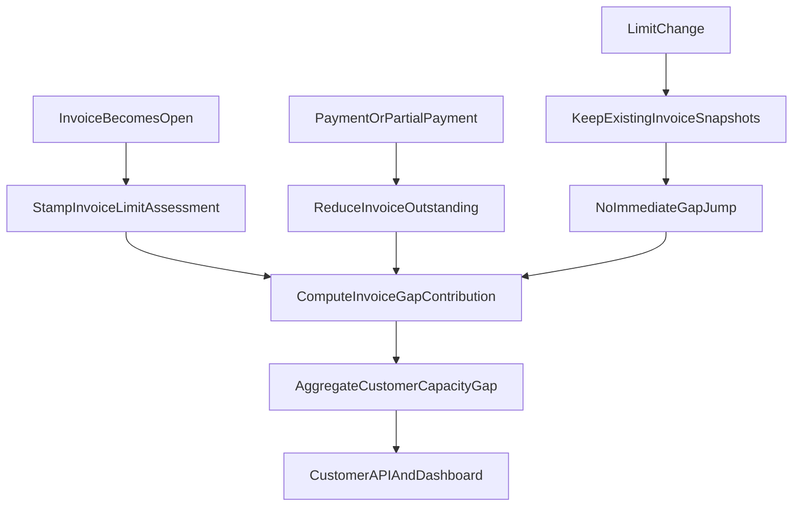

# Invoice-Level Capacity Gap Implementation Plan

## Goal
Implement capacity gap using invoice-level assessment snapshots so:
- Existing open invoices keep their original limit basis after limit changes.
- New invoices after a limit decrease add their outstanding amount left into capacity gap.
- Payments update gap by reducing invoice outstanding, without changing that invoice’s snapshot basis.
- Limit increases do not trigger immediate gap reassessment.

## Scope and Behavior Rules
- Keep current open-AR invoice scope (`Due`/`Overdue`) unchanged.
- On invoice becoming open, capture `limit_assessed_amount` from current effective approved limit and persist it on that invoice.
- On customer limit changes, do not update existing invoice snapshot basis.
- For invoices created after a limit decrease, capacity gap uses the invoice’s outstanding amount left (not original invoice amount).
- Capacity gap total is invoice-summed and updates on invoice create/status/payment events.
- Explicit per-invoice contribution rules:
  - **Legacy invoice** (opened before latest limit decrease): `max(0, outstanding_left - limit_assessed_amount)`.
  - **New-exposure invoice** (opened after a limit decrease): `outstanding_left`.
  - Payments never change `limit_assessed_amount`; they only reduce `outstanding_left`.
  - Limit increase/decrease alone does not change any invoice contribution until invoice outstanding changes.

## Data Model Changes
- Add invoice-level fields in [prisma/schema.prisma](/Users/ofiramitai/Sites/archaser/archaser/prisma/schema.prisma):
  - `limit_assessed_amount` (Decimal)
  - `limit_assessed_at` (DateTime)
  - `limit_assessed_currency` (optional, if needed for cross-currency consistency with existing account-currency display logic)
- Create migration SQL under `prisma/migrations/*` with non-destructive defaults and backfill-safe nullable rollout.

## Core Service Logic
- Introduce a shared invoice-gap helper in [server/services/creditInsurance/invoiceInsuranceFields.ts](/Users/ofiramitai/Sites/archaser/archaser/server/services/creditInsurance/invoiceInsuranceFields.ts):
  - Compute per-invoice capacity contribution from invoice outstanding left + invoice snapshot basis + invoice exposure class (`legacy` vs `new-exposure`).
  - Keep old-invoice basis fixed across payments.
- Update dashboard aggregation in [server/services/creditInsurance/creditInsuranceDashboardService.ts](/Users/ofiramitai/Sites/archaser/archaser/server/services/creditInsurance/creditInsuranceDashboardService.ts):
  - Replace customer-level `AR - approved_limit` gap math with invoice-summed contributions.
- Update customer header/API response in [pages/api/entities/[...path].ts](/Users/ofiramitai/Sites/archaser/archaser/pages/api/entities/[...path].ts):
  - Source `capacity_gap_amount` from invoice-level aggregation logic so API/UI matches dashboard.

## Event Integration
- In invoice write paths in [server/services/InvoiceService.ts](/Users/ofiramitai/Sites/archaser/archaser/server/services/InvoiceService.ts):
  - On invoice create / import / transition to open status, stamp `limit_assessed_amount` and `limit_assessed_at`.
  - On payment / partial payment, do not change invoice snapshot basis; recalc totals from reduced outstanding left.
- In customer limit update flow in [pages/api/entities/[...path].ts](/Users/ofiramitai/Sites/archaser/archaser/pages/api/entities/[...path].ts):
  - Preserve existing invoices’ snapshot values.
  - Ensure no immediate global gap recomputation by replacing basis values on old invoices.

## API/UI Contract Alignment
- Keep API field names stable (`capacity_gap_amount`) in [types/Customer.ts](/Users/ofiramitai/Sites/archaser/archaser/types/Customer.ts) and consumer components:
  - [app/[locale]/app/customers/[customerId]/CustomerHeader.tsx](/Users/ofiramitai/Sites/archaser/archaser/app/[locale]/app/customers/[customerId]/CustomerHeader.tsx)
- Verify copy/tooltips in locale files only if behavior text becomes inaccurate:
  - [locales/en/dashboard.json](/Users/ofiramitai/Sites/archaser/archaser/locales/en/dashboard.json)
  - [locales/he/dashboard.json](/Users/ofiramitai/Sites/archaser/archaser/locales/he/dashboard.json)
  - [locales/en/customers.json](/Users/ofiramitai/Sites/archaser/archaser/locales/en/customers.json)
  - [locales/he/customers.json](/Users/ofiramitai/Sites/archaser/archaser/locales/he/customers.json)

## Backfill and Rollout
- Backfill `limit_assessed_amount` for currently open invoices using each invoice’s historical effective limit at open-time where available; otherwise use a deterministic fallback (documented and one-time).
- Guard rollout behind backward-compatible reads:
  - If invoice snapshot fields are missing, temporarily fallback to existing computation path during migration window.

## Testing Strategy
- Unit tests (business rules):
  - `limit decrease only` keeps old invoice basis and no immediate jump.
  - `payment on old invoice` reduces legacy contribution only via lower outstanding-left (snapshot unchanged).
  - `new invoice after limit decrease` contributes outstanding amount left as new-exposure.
  - `limit increase` has no immediate reassessment.
- Integration tests (service/API parity):
  - [pages/api/entities/[...path].ts](/Users/ofiramitai/Sites/archaser/archaser/pages/api/entities/[...path].ts) header values match [server/services/creditInsurance/creditInsuranceDashboardService.ts](/Users/ofiramitai/Sites/archaser/archaser/server/services/creditInsurance/creditInsuranceDashboardService.ts).
  - Same-day multi-payment scenario across multiple invoices yields expected total.
  - Scenario acceptance (must pass exact expected totals):
    - Start `AR=20k`, limit `19k` => gap `1,000`.
    - Limit `18k` => gap `1,000`.
    - Pay `500` on legacy invoice => gap `500`.
    - New invoice `3,000` => gap `3,500`.
    - Limit `17k` + new invoice `1,000` => gap `4,500`.
    - Pay `1,000` on Inv-1 and `1,000` on Inv-2 same day => gap `3,000`.
    - Limit increase `22k` only => gap remains `3,000`.
- Regression checks:
  - Cross-currency customers still follow existing display rules.
  - Existing terms/risk metrics remain unchanged except where they intentionally depend on capacity gap.

## Validation Commands
- `npx tsc --noEmit`
- `npm run test:unit`
- `npm run lint`

## Execution Flow

