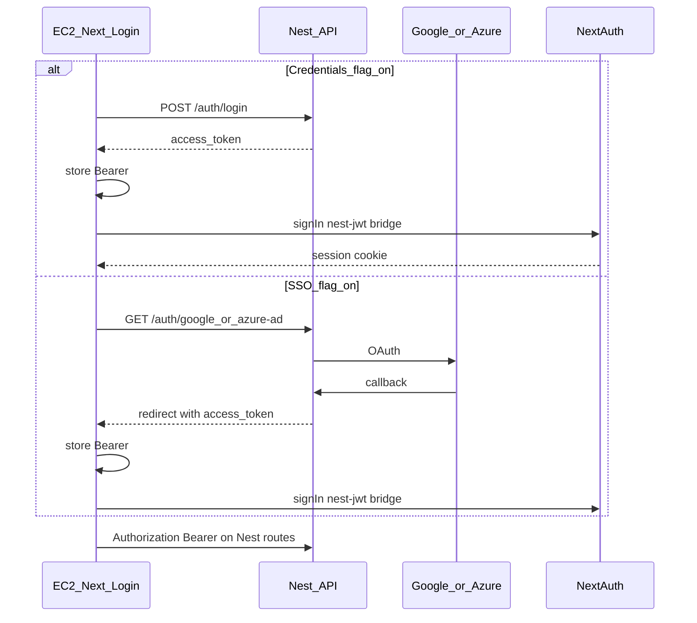

# Nest owns auth (JWT + SSO parity)

## Locked decisions

- **SSO:** Nest hosts OAuth redirect (`GET /auth/google`, `GET /auth/azure-ad` → provider → Nest callback → redirect to UI with Nest JWT). Same gates as NextAuth: pre-provisioned email match, `deactivated_at`, freeze, Inactive, Account `sso_enabled`, `sso_providers` includes `google` | `microsoft` (`azure-ad` → `microsoft`).
- **EC2 UI:** Feature flag `NEXT_PUBLIC_USE_NEST_AUTH=true`. When on, login talks to Nest and stores Bearer; a short NextAuth **nest-jwt bridge** still establishes the existing cookie session so Pages API keep working. Flag off = today’s NextAuth-only path (reversible without redeploying Nest).
- **Proxy fallback:** Document Apache/`ProxyPass` (or equivalent) for Nest auth routes with a one-line rollback to Next `/api/auth`.

## Target auth flows

## Nest public HTTP contract (`apps/api`)

Extend existing spike in [`apps/api/src/auth/`](apps/api/src/auth/):

| Method | Path | Auth | Behavior |
|--------|------|------|----------|
| POST | `/auth/login` | public | Credentials parity → JWT |
| GET | `/auth/me` | Bearer | Profile from JWT claims |
| GET | `/auth/account-by-subdomain` | public | Same shape as [`pages/api/auth/account-by-subdomain.ts`](pages/api/auth/account-by-subdomain.ts) |
| GET | `/auth/google` | public | Start Google OAuth (404/disabled if env missing) |
| GET | `/auth/google/callback` | public | Validate gates → JWT → redirect UI |
| GET | `/auth/azure-ad` | public | Start Azure AD OAuth |
| GET | `/auth/azure-ad/callback` | public | Same; map provider to `microsoft` |
| GET | `/auth/scope-probe` | Bearer | `?account_id=` → 200 if JWT `account_id` matches, else 403 (proves Account scoping) |

**JWT claims** (expand Stage 0 payload): `sub`, `username`, `email`, `account_id`, `role`, `name` (optional display). Signed with `JWT_SECRET` / fallback `NEXTAUTH_SECRET` (same as today). Expiry stays configurable (`JWT_EXPIRES_IN`, default `8h`).

**Credentials parity** vs [`server/auth/authOptions.ts`](server/auth/authOptions.ts): username + `deactivated_at: null`; reject missing password; freeze; bcrypt; failed attempts + freeze at ≥5 (reset on success); reject `Inactive`. Skip AdminNotificationService email on freeze for this slice (parity gap noted in issue deliverable).

**SSO error redirects** to UI login query (match NextAuth): `AccessDenied`, `AccountFrozen`, `Inactive`, `SSONotEnabled`, `Configuration`.

**Success redirect:** `{NEST_AUTH_SUCCESS_REDIRECT|/login}?nest_token=<jwt>` (or locale-aware path the login page already uses). UI reads token once, stores, strips from URL.

**CORS:** enable in [`apps/api/src/main.ts`](apps/api/src/main.ts) for `NEXT_PUBLIC_BASE_URL` / configured origins so browser can `POST /auth/login` and call Nest with Bearer.

**Deps:** `passport-google-oauth20`, `@nestjs/passport` already present; add Azure strategy (`passport-azure-ad` or OpenID equivalent matching current scopes `openid profile email User.Read`). Env: existing Google/Microsoft client id/secret/tenant + `NEST_PUBLIC_URL` (callback base) + `NEST_AUTH_SUCCESS_REDIRECT`.

## EC2 Next UI + NextAuth bridge

- Flag: `NEXT_PUBLIC_USE_NEST_AUTH`.
- Client helper (e.g. `utils/nestAuth.ts`): get/set/clear Nest access token (sessionStorage preferred so `localStorage.clear()` on login does not wipe mid-flow incorrectly — store token *after* clear, or use a dedicated key re-set after clear).
- [`app/[locale]/(auth)/login/page.tsx`](app/[locale]/(auth)/login/page.tsx): when flag on — credentials `fetch` Nest `/auth/login`, store token, then `signIn("credentials", { nestAccessToken })` bridge; SSO buttons `window.location` to Nest start URLs; on load if `nest_token` query — store + bridge; SSO discovery can call Nest `account-by-subdomain` (or keep Next endpoint — prefer Nest when flag on).
- [`server/auth/authOptions.ts`](server/auth/authOptions.ts): extend Credentials `authorize` to accept `nestAccessToken`, verify with same secret (`jose`/`jsonwebtoken`), load user by `sub`, return same session user shape. No Google/Azure removal from NextAuth yet (flag-off path).
- Thin Nest API client for auth-related calls attaching `Authorization: Bearer` (reuse or small wrapper near [`app/api.ts`](app/api.ts) — do not migrate product APIs).

## Ops / fallback doc

Update living roadmap + slice notes (not a new README): how Apache (or similar) routes e.g. `/nest/auth/*` → `127.0.0.1:3002/auth/*`, and how to remove that route to fall back to Next `/api/auth`. Register Nest callback URLs in Google/Azure consoles when enabling SSO against Nest.

## Testing strategy (HTTP contract — primary seam)

Extend/replace spike coverage in [`apps/api/test/`](apps/api/test/) (Vitest/Jest as already used for foundation):

1. Credentials login → Bearer JWT; `/auth/me` includes `account_id` + `role`.
2. Bad password / frozen / inactive → 401 with distinct outcomes where asserted today.
3. `/auth/me` rejects missing, forged, expired tokens (401).
4. `/auth/scope-probe` 200 for matching `account_id`, 403 for other account.
5. SSO gates (strategy mocked): SSO off → `SSONotEnabled`; provider not allowed → `AccessDenied`; success path issues JWT redirect.
6. `account-by-subdomain` public shape matches current API.
7. OpenAPI includes new auth paths.

TDD: vertical slices — one behavior test → minimal impl → next (credentials claims first, then rejection/expiry, then scope-probe, then SSO gates, then subdomain, then UI flag + bridge).

## Codebase scan

**Required**
- [`apps/api/src/auth/*`](apps/api/src/auth/) — service, controller, module, JWT strategy/payload/DTOs, new OAuth strategies/guards
- [`apps/api/src/main.ts`](apps/api/src/main.ts) — CORS, OpenAPI description
- [`apps/api/package.json`](apps/api/package.json) — OAuth passport deps + types
- [`apps/api/test/foundation.http.test.ts`](apps/api/test/foundation.http.test.ts) (or split `auth.http.test.ts`)
- [`app/[locale]/(auth)/login/page.tsx`](app/[locale]/(auth)/login/page.tsx) — flag paths
- New `utils/nestAuth.ts` (or equivalent)
- [`server/auth/authOptions.ts`](server/auth/authOptions.ts) — nest JWT bridge in Credentials
- [`.scratch/nest-microservice-migration/issues/02-nest-auth-ownership.md`](.scratch/nest-microservice-migration/issues/02-nest-auth-ownership.md) + [`OVERVIEW.md`](.scratch/nest-microservice-migration/OVERVIEW.md) + [`.cursor/plans/nest_microservice_migration_a9cacddc.plan.md`](.cursor/plans/nest_microservice_migration_a9cacddc.plan.md) — status / next / fallback note
- [`.cursor/plans/nest-microservice-migration.prd.md`](.cursor/plans/nest-microservice-migration.prd.md) issues status line if present

**Optional / out of scope unless requested**
- Admin freeze email via `AdminNotificationService`
- `session_version` invalidation on Nest JWT
- Full NextAuth provider removal / Amplify cutover
- Migrating product Pages API to Bearer
- New i18n keys (map Nest errors to existing `messages.*`)
- New login styles

**No change needed**
- Prisma schema (`sso_enabled` / `sso_providers` already exist)
- SSO admin UI [`SSOSettings.tsx`](app/[locale]/app/admin/accounts/[AccountId]/details/components/SSOSettings.tsx)
- Core AR handlers / middleware cookie auth for non-flag traffic
- Worker / Amplify / OpenAPI codegen for web (later slices)

## Suggest plan improvements (noted)

- Easy to miss: Azure profile email fallbacks (`email` | `preferred_username` | `upn` | `mail`) already in NextAuth — replicate in Nest strategy.
- Dual secret risk: bridge + Nest must share `JWT_SECRET`/`NEXTAUTH_SECRET`.
- OAuth callback URLs must be added in IdP consoles before staging SSO green.
- After `localStorage.clear()` on successful login, Nest token must be written again.

## Done when

Acceptance criteria in [`issues/02-nest-auth-ownership.md`](.scratch/nest-microservice-migration/issues/02-nest-auth-ownership.md) are met; HTTP tests green; living roadmap Next action → slice 03.