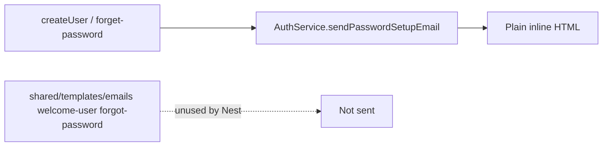

=# Nest branded email templates (from staging)

## Decisions (grilled)

- **Scope:** Port staging system mail stack for Nest-sent mail — welcome + forgot-password now; report-shared **helpers only** (no send-on-share).
- **Source of truth:** [`archaser-support/archaser` `staging`](https://github.com/archaser-support/archaser) — HTML files already match frontend copies; Nest must **load and send** them (today Nest uses plain inline HTML in [`auth.service.ts`](backend/api/src/auth/auth.service.ts)).
- **Logging:** Port staging Mongo welcome-email logging into Nest (`MongoLogService` + deps), including Loki fire-and-forget as staging does.
- **Out of scope:** Dispute-assignment, customer activity SMTP/SES, credit notification delivery, changing report-share behavior.

## Problem

Staging used `EmailService.sentWelcomeUserEmail` / `sentResetPasswordEmail` → `getEmailTemplate` → branded HTML. Nest never loaded those files.

## Approach

### 1. Nest email assets + loader

Copy from staging into Nest (canonical for API runtime):

- `backend/api/src/email/assets/emails/{welcome-user,forgot-password,report-shared}/{en,he}.html`
- `backend/api/src/email/email-templates.ts` — TypeScript port of staging [`shared/templates/email-templates.js`](frontend/shared/templates/email-templates.js) resolving paths via `__dirname` / `path.join` so they work from `dist/`

Register HTML as Nest compile assets in [`nest-cli.json`](backend/api/nest-cli.json) (`compilerOptions.assets`) so `dist/email/assets/**` is present in prod.

Keep frontend `shared/templates/emails/*` as-is (no translation file edits). Nest owns runtime copies.

### 2. Port `SystemEmailService` (staging EmailService)

Add Nest providers under [`backend/api/src/email/`](backend/api/src/email/):

| Staging | Nest |
|---------|------|
| `sentWelcomeUserEmail` + `buildWelcomeContentVars` | `SystemEmailService.sendWelcomeUserEmail(...)` |
| `sentResetPasswordEmail` | `SystemEmailService.sendResetPasswordEmail(...)` |
| `getEmailTemplate(REPORT_SHARED)` helper | `SystemEmailService.renderReportSharedEmail(...)` + optional `sendReportSharedEmail` **unused by reports yet** |
| `sendEmailWithSenderName` / class `sendEmail` | Shared SMTP send via existing `EMAIL_SERVER_*` + `EMAIL_FROM` (nodemailer already added) |
| Subject env prefix (`addEnvironmentPrefixToEmailSubject`) | Port small helper from staging `domainUtils` |

Inject `ConfigService` + `DatabaseService` for language lookup (`getUserLanguage`) and account product flags (`has_collection` / `has_credit_insurance`) for welcome feature copy — same as staging.

Wire:

- [`auth.service.ts`](backend/api/src/auth/auth.service.ts) `requestPasswordReset` → branded forgot-password template (replace plain `sendPasswordSetupEmail` body for `kind: "reset"`).
- [`account-admin-entities.service.ts`](backend/api/src/account-admin/account-admin-entities.service.ts) user create → `sendWelcomeUserEmail` (replace plain welcome kind).

### 3. Port Mongo welcome-email logging (per decision)

Staging stack (minimal port for `logMessage` used by welcome events):

- `lib/mongoose` → `backend/api/src/logging/mongoose.connection.ts`
- `models/Log` + `types/MongoLog` → `backend/api/src/logging/`
- `MongoLogService` → Nest injectable (preserve: Loki fire-and-forget, **skip Mongo write when `NODE_ENV=development`** — matches staging + existing [`main.ts`](backend/api/src/main.ts) force-dev comment)
- Slim `LokiTransportService` port for the dual-write path staging already has

Add `mongoose` dependency to `@archaser/api`. Use existing `MONGODB_URI` / `MONGODB_DATABASE` from backend `.env`.

`logWelcomeEmailEvent` stays with the email module and calls `MongoLogService.logMessage` (fire-and-forget; never fail user create/reset).

### 4. Module wiring

Extend [`email.module.ts`](backend/api/src/email/email.module.ts): export `SystemEmailService` (+ logging providers). Import into `AuthModule` / `AccountAdminEntitiesModule` (or make EmailModule global if cleaner).

Do **not** change [`reports.service.ts`](backend/api/src/reports/reports.service.ts) share path in this pass.

### 5. Testing

- Unit: template loader substitutes `${user_name}`, `${reset_link}`, welcome product vars; he/en fallback.
- HTTP/integration (extend [`user-create-welcome-email.http.test.ts`](backend/api/test/user-create-welcome-email.http.test.ts) + auth forget-password): assert `sendWelcomeUserEmail` / reset path invoked with HTML containing branded markers (e.g. `email-container` / `Welcome to ARchaser`), not the current one-line plain body.
- Mock MongoLogService in tests (no live Atlas).

## Codebase scan

**Required**

- [`backend/api/src/auth/auth.service.ts`](backend/api/src/auth/auth.service.ts) — use branded reset template
- [`backend/api/src/account-admin/account-admin-entities.service.ts`](backend/api/src/account-admin/account-admin-entities.service.ts) — use branded welcome send
- [`backend/api/src/email/`](backend/api/src/email/) — assets, loader, SystemEmailService, module exports
- [`backend/api/src/logging/`](backend/api/src/logging/) — mongoose + MongoLog + Loki slim port
- [`backend/api/nest-cli.json`](backend/api/nest-cli.json) — copy HTML assets
- [`backend/api/package.json`](backend/api/package.json) — `mongoose` (+ types)
- Tests under `backend/api/test/`

**Optional / out of scope unless requested**

- Wire `sendReportSharedEmail` into report share upsert
- Dispute `InternalEmailTemplate` send + `utils/email-template.ts` fallback
- Activity workflow / `sendEmailActivity` real SMTP
- Credit notification email delivery
- Delete or dedupe frontend `shared/templates/emails` (leave for now)

**No change needed**

- Prisma schema
- Frontend UserDetails create payload
- Translation files
- Email tracking controller (inbound SES webhook only)

## Plan improvements / risks

- **Dist path:** Without nest-cli assets, templates disappear in production builds — must configure assets.
- **Dev logging:** Welcome Mongo events will be skipped locally (`NODE_ENV=development`); Loki may still receive if ported — document that.
- **Subject prefix:** Staging prefixes non-prod subjects — port for parity so staging/prod are distinguishable.
- Easy to miss: welcome vars `feature_1`–`feature_5` / product flags for credit-only accounts (same account as recent user-create work).
