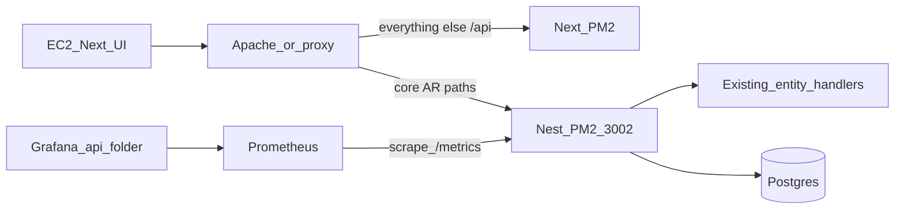

# EC2 strangler + core AR APIs on Nest (slice 03)

## Locked decisions

- **Migration shape:** Nest serves the **same HTTP paths** the UI already calls and **adapts** existing Next handlers (`pages/api/entities/handlers/*`, operations disputes, payment import) — no domain rewrite in this slice.
- **Auth:** Dual acceptance — Nest `Authorization: Bearer` (slice 02 JWT) **or** existing NextAuth session cookie (via `getToken` / same `NEXTAUTH_SECRET`). Handlers keep using cookie/`getToken` when the browser hits Nest through the proxy; Bearer-only clients still pass Nest JWT guard.
- **UI:** No product redesign; cutover is reverse-proxy only. Websockets stay on Next.

## Architecture



## Nest HTTP surface (match UI contracts)

Mount under Nest (no path rewrite at the app layer):

| Area | Paths Nest will own when proxied |
|------|----------------------------------|
| Customers (+ nested activity/disputes ops already on entities) | `/api/entities/customers`, `/api/entities/customers/:id`, `/api/entities/customers/:id/...` |
| Invoices | `/api/entities/invoices`, `/api/entities/invoices/:id`, invoice ops already on handler |
| Contacts | `/api/entities/contacts`, `/api/entities/contacts/:id`, … |
| Collection periods | `/api/entities/customer-collection-period/:id` (PUT + existing ops) |
| Disputes (ops list/mutate) | `/api/operations/disputes`, `/api/operations/dispute-reasons` (subset used by AR UI) |
| Payments | `/api/import/payment` and `/api/import/payments` (import catch-all payment type) — no fictitious entity CRUD |

Leave non–core-AR entity types (accounts, users, insurance, banks, …) on Next until later slices.

### Adapter pattern

1. **`NextCompatAdapter`** in `apps/api` — wrap Express `Request`/`Response` into a `NextApiRequest`/`NextApiResponse`-shaped object (query.path array, cookies, body already parsed by Nest).
2. **`EntitiesStranglerController`** — catch-all under `@Controller('api/entities')` that parses path segments, restricts to allowlisted entity types (`customers`, `invoices`, `contacts`, `customer-collection-period`), then calls existing [`entityDispatch.ts`](pages/api/entities/entityDispatch.ts) `handleGET|POST|PUT|DELETE`.
3. **`OperationsStranglerController`** — allowlisted `disputes` / `dispute-reasons` via existing operations dispatch.
4. **`ImportStranglerController`** — payment import paths only.
5. Wire tsconfig/paths so Nest can import `@/pages/api/entities/...` and `@/server/...` from the monorepo (path aliases + shared deps Nest needs that handlers pull in). If full Next handler import is too heavy for Nest’s compile graph, extract a thin **`packages/` or `apps/api/src/strangler/` re-export** that imports handlers via relative path from repo root — prefer workspace path alias first.

**Auth middleware order:** Dual JWT guard runs first (401 if neither Bearer nor valid session cookie). Cookie passthrough remains so `entityShared.validateUserAuth` / `AccessControlService.getUserInfo` continue to work for browser traffic.

## Ops: reversible proxy + PM2

- Nest already in [`ecosystem.config.js`](ecosystem.config.js) as `archaser-api` on `3002`.
- Document Apache (or equivalent) snippets in issue 03 **Delivered** (same style as slice 02):

```apache
# Example — flip individual prefixes to Nest; comment to fall back to Next
ProxyPass        /api/entities/customers http://127.0.0.1:3002/api/entities/customers
ProxyPassReverse /api/entities/customers http://127.0.0.1:3002/api/entities/customers
# … invoices, contacts, customer-collection-period, operations/disputes, import/payment …
```

Rollback = remove those `ProxyPass` lines and reload Apache (UI unchanged).

## Metrics + Grafana

- Add Nest `/metrics` with `prom-client` (default process metrics + HTTP request counter/histogram labeled `service=archaser-api`).
- Extend [`prometheus.yml`](prometheus.yml) with a scrape job for Nest `:3002/metrics`.
- Add Grafana dashboard JSON under `grafana/provisioning/dashboards/{staging,production}/` titled for folder **`api`** (basic: up, request rate, latency, error rate) following existing dashboard file patterns. Wire provider folder if the repo’s Grafana layout requires a separate folder entry; otherwise tag/folder field on the dashboard JSON consistent with “one Grafana, per-service folders.”

## Testing (HTTP seam — TDD vertical slices)

New `apps/api/test/core-ar.http.test.ts` (handlers/DB mocked at the dispatch boundary or DatabaseService + stubbed handler modules):

1. Unauthenticated `GET /api/entities/customers` → 401.
2. Cookie or Bearer auth → 200 list shape `{ customers, totalRecords, … }` (stub).
3. Same for invoices/contacts happy-path list (or parameterized).
4. Collection-period PUT allowlisted path reaches adapter (200/404 stub).
5. Disputes ops path 401 without auth; 200 stub with auth.
6. Payment import path registered; 401 without auth.
7. OpenAPI includes migrated `/api/entities/*` (and ops/import) paths.
8. `GET /metrics` returns Prometheus text with Nest process metrics.

Tracer order: dual-auth guard → entities customers GET → remaining entity types → operations/import → metrics → docs/proxy notes.

## Codebase scan

**Required**
- [`apps/api/src/`](apps/api/src/) — strangler modules, dual auth, metrics, `main.ts` (global pipes already; ensure body parser + cookie parser)
- [`apps/api/tsconfig.json`](apps/api/tsconfig.json) / package deps — path aliases, `cookie-parser`, `prom-client`, types for Next API if needed
- [`pages/api/entities/entityDispatch.ts`](pages/api/entities/entityDispatch.ts) + handlers (imported, not rewritten)
- [`pages/api/operations/[...path].ts`](pages/api/operations/[...path].ts) (disputes allowlist)
- [`pages/api/import/`](pages/api/import/) payment routes
- [`ecosystem.config.js`](ecosystem.config.js) — confirm Nest env has `NEXTAUTH_SECRET` / `DATABASE_URL`
- [`prometheus.yml`](prometheus.yml) + Grafana dashboard JSON under [`grafana/provisioning/dashboards/`](grafana/provisioning/dashboards/)
- Issue/roadmap: [`issues/03-ec2-strangler-core-ar.md`](.scratch/nest-microservice-migration/issues/03-ec2-strangler-core-ar.md), [`OVERVIEW.md`](.scratch/nest-microservice-migration/OVERVIEW.md), [`.cursor/plans/nest_microservice_migration_a9cacddc.plan.md`](.cursor/plans/nest_microservice_migration_a9cacddc.plan.md), PRD status line

**Optional / out of scope unless requested**
- Full Nest rewrite of CustomerService / Prisma queries
- Migrating accounts/users/insurance/banks/activity sequences
- Portal UUID routes; websocket peel
- UI OpenAPI codegen / Amplify
- Admin freeze email parity (slice 02 gap)

**No change needed**
- Prisma schema
- Login UI (slice 02 flag already)
- Next Pages handlers remaining for non-proxied paths

## Risks / improvements noted

- Handler imports pull Next/formidable/server graph — fix Nest `tsconfig` + dependency hoisting early; if blocked, strangler can dynamic-`require` compiled Next paths only as last resort (prefer alias).
- Dual auth must map Nest Bearer `sub`/`account_id` into a shape `getToken` consumers understand **or** short-circuit `validateUserAuth` when Nest guard already set `req.user` — prefer extending a Nest-aware branch in a thin wrapper around auth validation used by the adapter so cookie-less Bearer works.
- Apache path-prefix ProxyPass must not strip `/api` incorrectly; test one path on staging first (customers list).

## Done when

Acceptance criteria in issue 03 are met; HTTP tests green; living roadmap Next action → slice 04.