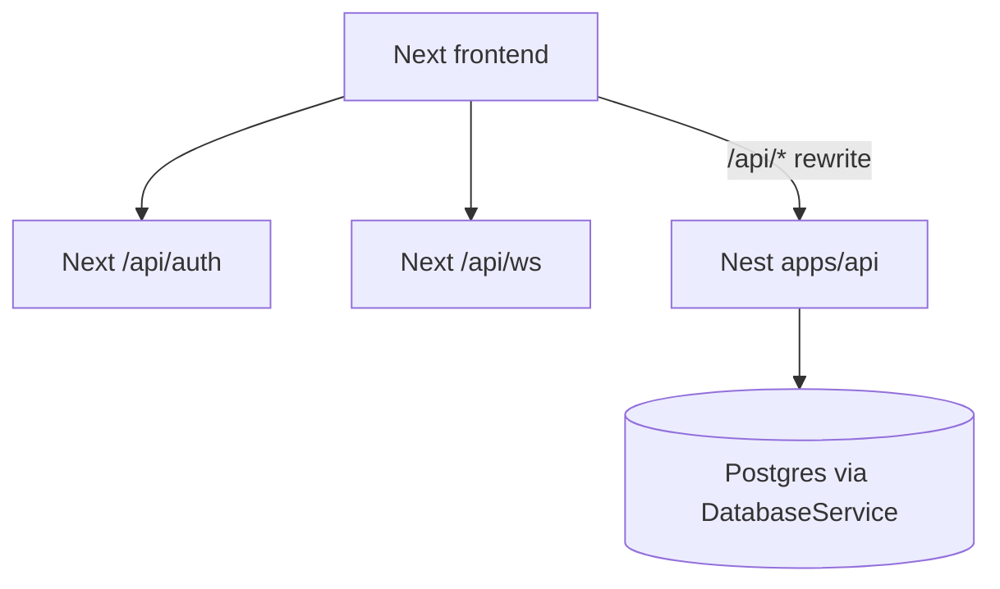

# Nest-native full backend cutover (option 2)

## Locked decisions

- **Parity approach:** Nest-native rewrite against [`DatabaseService`](apps/api/src/database/database.service.ts) only. Do **not** import `@/server/services` or keep esbuild pages bundles as the long-term path.
- **Next leftovers (D2=A):** keep [`pages/api/auth/[...nextauth].ts`](pages/api/auth/[...nextauth].ts) and [`pages/api/ws/*`](pages/api/ws/) on Next forever in this program. Everything else leaves Next.
- **Contract:** stable `/api/...` URLs + existing UI JSON shapes (DualAuth cookie/Bearer unchanged).
- **Delivery:** vertical slices with Nest tests + local rewrite smoke per domain; no single mega-PR.
- **End state:** `ALLOW_PAGES_BUNDLE=false` and `ALLOW_ENTITY_HANDLERS_BUNDLE=false` permanently; delete product `pages/api/**` (except `auth`, `ws`); Next = UI + rewrites; Nest = HTTP API.

## Current gap (honest)

Phase C CRUD modules exist (customers/invoices/contacts/account-admin/operations/import/portal/CI/permissions/me/agents dismiss). Product grids/dashboard still need **pages bundles** for:

- [`pages/api/reports/**`](pages/api/reports/) — every `ViewBasedDataGrid`
- [`pages/api/system/[...path].ts`](pages/api/system/[...path].ts) (~8k LOC) — dashboard, agents list, control-center, …
- activities / sequences / templates / search / roles / permissions matrix / SMS / nested accounts / platform leftovers

[`DomainCatchAllService`](apps/api/src/domain/domain-catch-all.service.ts) currently claims nothing; [`LegacyBridgeService`](apps/api/src/strangler/legacy-bridge.service.ts) serves the long-tail via bundles (default on).

## Per-slice definition of done

For each domain slice:

1. Nest **DTOs** (class-validator) for query/body.
2. Nest **controller** with explicit verbs/paths (no `@All` → bundle).
3. Nest **service** using `DatabaseService` + [`AccessScopeService`](apps/api/src/auth/access-scope.service.ts).
4. HTTP/unit tests for happy path + authz edge cases that the UI depends on.
5. Add top-level to `DEDICATED_TOP_LEVEL` in [`pages-api-catchall.controller.ts`](apps/api/src/strangler/pages-api-catchall.controller.ts) so catch-all cannot steal routes.
6. Smoke: local rewrite, page that uses the domain shows real data.
7. Only then stop using the matching pages bundle entry.

## Slice order (after existing Nest CRUD)

| # | Slice | Nest home | Legacy source | Done when |
|---|--------|-----------|---------------|-----------|
| A | **Reports core** | `apps/api/src/reports/` | `pages/api/reports/index.ts`, `[id].ts`, `[id]/execute.ts`, `metadata.ts`, `user-default.ts` | Grids load via Nest execute; list/default/metadata Nest-native |
| B | **Reports extras** | same | `export`, `share`, `schedule`, `sync-system` | Full reports HTTP Nest-native |
| C | **System dashboard** | `apps/api/src/system/` | `system/[...path].ts` dashboard + chart-details | Dashboard KPIs Nest-native |
| D | **System ops surfaces** | same | control-center, operation-dashboard, agents list/follow-up, promise-to-pay | Agent/ops pages Nest-native |
| E | **System admin/cron/cache** | same | cron-jobs, cache-invalidation, shared-stats | Admin system tools Nest-native |
| F | **Activities cluster** | `apps/api/src/activities/` | `activities/[...path].ts`, activitySequences, sequenceContainers, activity-attachments, internalEmailTemplates | Timeline + template settings Nest-native |
| G | **Search + roles + permissions matrix** | extend `permissions/`, add `search/`, `roles/` | `search/global.ts`, `roles/*`, `permissions/index.ts` + `[role].ts` | Role editor + global search Nest-native (fix `/permissions/:role` stolen by `/me`-only module) |
| H | **Accounts nested** | `apps/api/src/accounts-nested/` | `accounts/*`, entities nested billing-connector, notification-rule-sets, gdpr-report, check-username | Settings nested routes Nest-native; entity bundle unused for depth>2 |
| I | **SMS** | `apps/api/src/sms/` | `pages/api/sms/**` | Blocking + vendors + Twilio webhook Nest-native |
| J | **Platform** | `errors/`, `logs/`, `upload/`, `settings/`, `user-preferences/` | matching pages/api | Deepen errors beyond ack; S3 upload; logs; currency-rates; tooltips |
| K | **Admin / email tracking / CI learning / leftovers** | `admin/`, `email/`, reference data | admin email-campaign*, email SES/track, communication-intelligence, country/state, alert-details, contact-response, invoices/update-last-payment-date, bank-accounts leaf | No product HTTP on catch-all |
| L | **Retire bundles + delete Next API** | strangler/domain scripts | `bundle-pages-handlers.cjs`, `pages/api/**` | Flags off forever; delete all `pages/api` except `auth` + `ws`; remove LegacyBridge product path; thin Next rewrite exclusions stay |

## Reports slice detail (A — start here)

Reports are the blocker for “pages show data” without bundles.

- Port execute contract consumed by [`shared/hooks/useViewExecution.ts`](shared/hooks/useViewExecution.ts): `{ data, totalRecords, chartData? }`.
- Rebuild view filtering / column projection / pagination against Prisma (or Nest-owned SQL helpers under `apps/api/src/reports/`), **not** by requiring jiti into `pages/api/reports/[id]/execute.ts`.
- Controllers: `ReportsController` for collection + `ReportsByIdController` for `:id/*` so Nest routing stays explicit.
- Edge cases to preserve from legacy execute: context (`customers`, disputes, …), account/BU/owner filters via AccessScope, BigInt serialization, user-default view resolution.

## Bundle kill gates

| Gate | Requirement |
|------|-------------|
| G1 | Reports A+B green → can refuse `pages/api/reports` in bridge |
| G2 | System C–E green → refuse `pages/api/system` |
| G3 | Activities F + Search/Roles G green → refuse those tops |
| G4 | H–K green → `ALLOW_PAGES_BUNDLE=false` and `ALLOW_ENTITY_HANDLERS_BUNDLE=false` |
| G5 | Delete product `pages/api` (keep auth/ws); remove `src/domain/bundled` generation from default build |

## What “remove Next backend” means

Keep:

- Next App Router UI under `app/`
- NextAuth route handlers under `pages/api/auth`
- WebSocket routes under `pages/api/ws`
- Next rewrites: `/api/*` → Nest except `auth` + `ws`

Delete after G5:

- All other `pages/api/**`
- Nest `BundledPageHandlersService` / `EntityHandlersService` product dispatch (or leave dead code deleted)
- Bundle script as a required build step

Do **not** delete `server/` in the same cut if UI or workers still import it; Nest must not depend on it. Separate cleanup of unused `server/` can follow.

## Codebase scan (buckets)

**Required this program**

- New Nest modules under `apps/api/src/{reports,system,activities,search,roles,accounts-nested,sms,admin,email}/`
- Deepen: [`permissions`](apps/api/src/permissions/), [`errors`](apps/api/src/errors/), [`import`](apps/api/src/import/), [`operations`](apps/api/src/operations/), [`account-admin`](apps/api/src/account-admin/) nested gaps
- [`pages-api-catchall.controller.ts`](apps/api/src/strangler/pages-api-catchall.controller.ts) `DEDICATED_TOP_LEVEL` growth per slice
- [`legacy-bridge.service.ts`](apps/api/src/strangler/legacy-bridge.service.ts) — flip defaults to refuse bundles at G4
- Tests under `apps/api/test/`
- Local rewrite / Apache exclusions unchanged for auth/ws

**Optional / out of scope unless requested**

- Amplify extract, worker/SMS/Billing/Reports **repo peels** (existing issues 06–10)
- Nest owning WebSockets
- Deleting all of `server/` in one shot
- Line-by-line parity for `debug` / `test-auth` (dev-only: omit or 404)

**No change needed**

- DualAuth + NextAuth cookie bridge (already working)
- Grafana/metrics/health Nest surfaces

## Testing strategy

- Nest Jest HTTP contracts per controller (auth 401, account scoping, list/execute shape keys).
- After each P0 slice: manual smoke — customers grid, invoices grid, dashboard, agents.
- Before G5: full local smoke with bundles forced off; staging Apache still excludes `/api/auth` and `/api/ws`.

## Risk note

Option 2 for reports + system is **XL**. Expect multiple PRs for A–E alone. Shipping stubs again will empty the UI (already proven); each slice must match real JSON contracts before flipping that top-level off the bridge.