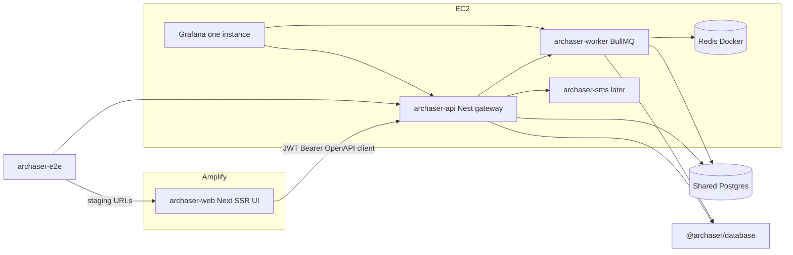

# Nest.js backend split — living roadmap

**Status:** PRD migration horizon complete in-repo (slices 01–10 scaffolds) · **Next action:** staging cutover — Amplify + private npm `@archaser/database` + ENABLE_CRON_JOBS=false after worker; optional ElastiCache revisit  
**Resume file:** keep this document updated when a stage finishes (`Status`, decision log, “Next action”).

## Target architecture

## Decision log (locked)

| # | Topic | Decision |
|---|-------|----------|
| D1 | Backend shape | Nest modular monolith first, then peel microservices |
| D2 | Auth owner | Nest owns auth; Amplify UI is client-only |
| D3 | Auth transport | JWT in `Authorization: Bearer` |
| D4 | Stage 1 cutover | EC2 first (Nest beside Next), then Amplify UI |
| D5 | Data | Shared Postgres for a long time |
| D6 | First peel | Cron / worker |
| D7 | Grafana | One Grafana; dashboards/folders per service |
| D8 | Tests (original) | **Superseded by D17** |
| D9 | Peel order after worker | SMS → Billing connectors → Reports |
| D10 | Amplify | Next SSR on Amplify; no DB/business logic in Next |
| D11 | API ↔ worker | Queue-based (not DB-only handoff) |
| D12 | Queue | Redis + Bull/BullMQ |
| D13 | Redis hosting | Redis in Docker on app EC2 |
| D14 | UI → services | Main Nest API is gateway/BFF |
| D15 | Schedules | Worker owns BullMQ repeatables (from CronJob config); API = config + run-now |
| D16 | Repo layout | Separate FE and BE repositories (not a monorepo) |
| D17 | Initial repos | `archaser-web` + `archaser-api` + `archaser-e2e` |
| D18 | Contracts | OpenAPI from Nest + codegen in web |
| D19 | Peel packaging | New git repo per peeled Nest service |
| D20 | Prisma | Private npm `@archaser/database` |
| D21 | Bootstrap | Strangler **inside current repo first**, then extract repos |

## Staged backlog

### Stage 0 — Foundation (current repo) — **DONE**

- Nest app at [`apps/api`](apps/api) (`@archaser/api`) beside Next; PM2 entry `archaser-api` on port `3002` in [`ecosystem.config.js`](ecosystem.config.js).
- JWT credentials spike: `POST /auth/login`, protected `GET /auth/me`; OpenAPI UI at `/docs`.
- In-repo [`packages/database`](packages/database) (`@archaser/database`); schema/migrations still at repo-root [`prisma/`](prisma/) until Stage 1B extract — Nest queries shared Postgres via this package.
- **Stage 0 start:** `npm run build:api` then `npm run dev:api` (watch) or `npm run start:api` (prod build). Default port `NEST_PORT`/`PORT` = `3002`.
- UI / Pages API remain on Next; no Amplify cutover; production `/api` not routed to Nest yet.
- **Next action:** Nest owns auth (slice 02) — **done**; see Stage 1A auth note below.

### Stage 1A auth ownership (slice 02) — **DONE**

- Nest issues Bearer JWTs with Account/role claims; Google/Azure OAuth redirects on Nest with NextAuth SSO gates.
- Feature flag `NEXT_PUBLIC_USE_NEST_AUTH` + NextAuth nest-JWT bridge for EC2 UI; proxy fallback documented in `issues/02-nest-auth-ownership.md`.
- HTTP contract: `apps/api/test/auth.http.test.ts`.

### Stage 1A — Nest API on EC2 (strangler) — **IN PROGRESS** (core AR done)

- Port domains from [`pages/api/`](pages/api/) + [`server/`](server/) into Nest modules.
- Apache/PM2: Nest process beside current Next; route `/api` gradually to Nest.
- Keep UI on EC2 Next until APIs + auth are complete.
- Strip UI imports of `@/server` / Prisma (prep for Amplify).
- Realtime (`pages/api/ws/*`) stays on main API gateway.
- Metrics: Nest `/metrics`; Grafana folder `api`.
- **Done in slice 03:** core AR entities/ops/payment-import strangler + dual auth + `/metrics` + Grafana `api` dashboards. Proxy snippets in `issues/03-ec2-strangler-core-ar.md`.
- **Next action:** `issues/04-portal-credit-insurance-nest.md`.

### Stage 1B — Amplify UI

- Extract / create `archaser-web`; Amplify Hosting (SSR) pointing at Nest base URL.
- JWT storage + OpenAPI-generated client.
- Create `archaser-e2e` (Playwright/Vitest e2e against staging); remove e2e from deploy artifacts.
- Extract `archaser-api` + publish `@archaser/database` when Stage 1A stable (per D21).

### Stage 2 — Worker repo (`archaser-worker`)

- Docker Redis on EC2; BullMQ producers in API, consumers + repeatables in worker.
- Disable in-process `ENABLE_CRON_JOBS` on API.
- Grafana folder `worker`.

### Stage 3 — SMS (`archaser-sms`)

- Peel SMS APIs/webhooks; API gateway proxies; shared DB via `@archaser/database`.

### Stage 4 — Billing connectors (`archaser-connectors` or similar)

- Peel Priority/ERP sync; queue-driven work via worker or service-owned consumers.

### Stage 5 — Reports execution (`archaser-reports`)

- Peel report execute/schedule heavy path; gateway keeps CRUD facade if needed.

### Out of scope unless requested

- DB-per-service; separate Grafana instances; peeling core AR (Customer/Invoice/Activity) early; Redis → ElastiCache (revisit after Stage 2).

## Codebase scan (baseline)

**Required over the migration:** [`pages/api/`](pages/api/) (~139 handlers), [`server/`](server/) (services, cron, auth), [`lib/prisma.ts`](lib/prisma.ts), [`prisma/`](prisma/), [`middleware.ts`](middleware.ts), [`ecosystem.config.js`](ecosystem.config.js), deploy workflows, [`docker-compose.logging.yml`](docker-compose.logging.yml), UI paths importing `@/server` / Prisma, [`tests/`](tests/).

**Optional / later:** Mongo log models, SNS CloudFormation, portal server action [`app/actions/portalVerification.ts`](app/actions/portalVerification.ts).

**No change yet:** Product feature plans under `.cursor/plans/` unrelated to this migration.

## Discovery gates (blocking / informational)

| Gate | Type | Blocks |
|------|------|--------|
| Nest parity for Google + Azure AD SSO vs NextAuth | blocking | Stage 1A auth complete |
| Amplify SSR + App Router i18n/middleware without server DB | blocking | Stage 1B |
| Postgres connection budget with API + worker pools | blocking | Stage 2 |
| Docker Redis durability/backup acceptable for prod jobs | informational | Stage 2 → later ElastiCache |
| Private npm (GitHub Packages) for `@archaser/database` | blocking | Repo extract / Stage 2+ |

## Testing strategy (by stage)

- **Stage 0–1A:** Port/adapt unit tests with API; contract tests from OpenAPI.
- **Stage 1B:** `archaser-e2e` owns Playwright against Amplify + Nest staging.
- **Stage 2+:** Worker job tests in worker repo; gateway integration tests in api; e2e smoke for “run now” / scheduled path.

## How to resume in a later session

1. Open this plan; read **Status** / **Next action**.
2. Do not re-litigate locked D1–D21 unless explicitly changing a decision (then update the table).
3. Implement only the current stage; mark it done and set **Next action** to the following stage.

## Issues (vertical slices)

Tracer-bullet breakdown published as local markdown under `.scratch/nest-microservice-migration/`. **Hard blockers** are recorded in each slice's **Blocked by** header. Implement in dependency order; start a **fresh session per issue**.

**Overview:** `.scratch/nest-microservice-migration/OVERVIEW.md`

| # | Title | File | Waiting on | User stories |
|---|-------|------|------------|--------------|
| 1 | Nest foundation in current repo | `issues/01-nest-foundation.md` | — | 13, 14, 16, 21, 35, 36, 41 |
| 2 | Nest owns auth (JWT + SSO parity) | `issues/02-nest-auth-ownership.md` | 1 | 1, 2, 11, 38, 41 |
| 3 | EC2 strangler + core AR APIs on Nest | `issues/03-ec2-strangler-core-ar.md` | 2 | 3, 22, 28, 29, 30, 42, 44 |
| 4 | Portal and credit insurance APIs on Nest | `issues/04-portal-credit-insurance-nest.md` | 3 | 4, 5 |
| 5 | Remaining monolith APIs on Nest | `issues/05-remaining-monolith-apis.md` | 4 | 6, 7, 8, 9, 12, 22, 32, 37, 43, 45 |
| 6 | Amplify UI + web/api/e2e repo extract | `issues/06-amplify-and-repo-extract.md` | 5 | 2, 15, 17, 19, 20, 23, 34, 35, 40, 41 |
| 7 | Worker peel (Redis + BullMQ) | `issues/07-worker-peel.md` | 6 | 9, 10, 24, 25, 26, 31, 33, 45 |
| 8 | Peel SMS service | `issues/08-peel-sms.md` | 7 | 7, 18, 27, 39 |
| 9 | Peel Billing connectors service | `issues/09-peel-billing-connectors.md` | 8 | 8, 18, 27, 39 |
| 10 | Peel Reports execution service | `issues/10-peel-reports-execution.md` | 9 | 6, 18, 27, 37, 39 |
| 11 | Nest domain: Customers (replace jiti) | `issues/11-nest-domain-customers.md` | — | 3, 42, 44 |
| 12 | Nest domain: Invoices (replace jiti) | `issues/12-nest-domain-invoices.md` | — *(prefer after 11)* | 3, 42, 44 |
| 13 | Nest domain: Contacts + collection periods | `issues/13-nest-domain-contacts-collection-period.md` | — | 3, 42, 44 |
| 14 | Nest domain: Account admin entities | `issues/14-nest-domain-account-admin-entities.md` | — | 3, 12, 42 |
| 15 | Nest domain: Operations (disputes+) | `issues/15-nest-domain-operations.md` | — | 3, 42, 44 |
| 16 | Nest domain: Imports | `issues/16-nest-domain-imports.md` | — | 3, 22, 42 |
| 17 | Nest domain: Portal + credit insurance | `issues/17-nest-domain-portal-credit-insurance.md` | — | 4, 5 |
| 18 | Nest domain: System, reports, catch-all leftovers | `issues/18-nest-domain-system-reports-catchall.md` | — | 6, 9, 12, 32, 37, 43, 45 |
| 19 | Retire jiti strangler for product HTTP | `issues/19-retire-jiti-strangler.md` | 11–18 | 34, 35, 40, 41 |

**Status:** 01–10 done · Phase B **11–19 done** · **Next:** staging cutover / Amplify / private npm
