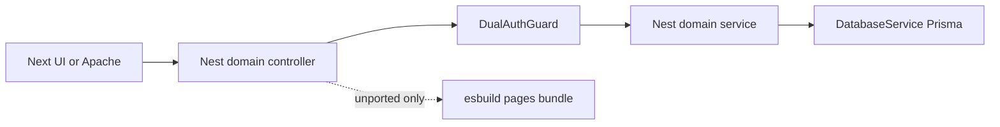

# Nest-native business logic (multi-domain)

## Decisions (locked)

- **Program:** all product domains, delivered as vertical slices (not one mega-PR).
- **Approach:** Nest-native rewrite against [`DatabaseService`](apps/api/src/database/database.service.ts) (`PrismaClient` from `@archaser/database`). Do **not** extract `@/server` / Pages handlers into packages.
- **Contract:** keep existing `/api/...` URLs and UI JSON shapes stable (DualAuth unchanged).
- **Interim:** unported paths may still call `EntityHandlersService` / `BundledPageHandlersService`; each slice removes its own bundle dependency.

## Prefactor (slice 0 — do first)

Shared Nest access context so every domain can filter by account / role / view-as without `AccessControlService.getToken`:

- Add `@CurrentUser()` (or equivalent) reading `DualAuthRequest.user` ([`JwtPayload`](apps/api/src/auth/auth.service.ts): `sub`, `account_id`, `role`, …).
- Add Nest `AccessScopeService` (name flexible) that ports the **account + BU + effective user** filtering rules from [`server/services/AccessControlService.ts`](server/services/AccessControlService.ts) / BU helpers onto `DatabaseService` + `JwtPayload`.
- HTTP unit tests: authenticated request exposes `account_id`; unauthorized still 401.

Without this, every domain will re-invent authz.

## Domain order (tracer bullets)

Implement **one domain (or tight pair) per session**. For each: Nest service + typed controller methods → tests → stop calling bundle for those routes → smoke with local rewrite.

| # | Domain | Nest entry | Source of truth today | Done when |
|---|--------|------------|----------------------|-----------|
| 0 | Access scope foundation | `apps/api/src/auth/` + small shared module | ACS / BU singletons in bundles | Controllers can inject scope from `req.user` |
| 1 | **Customers core** | [`customers/`](apps/api/src/customers/) | [`handlers/customers.ts`](pages/api/entities/handlers/customers.ts) list/stats/detail/PUT | Bundle unused for GET list/stats/detail + PUT |
| 2 | Customers nested | same module | activity, disputes, log-call, email, policies | Full `/api/entities/customers*` Nest-native |
| 3 | Invoices | [`invoices/`](apps/api/src/invoices/) | `handlers/invoices.ts` (~800 lines) | Bundle unused for invoices entity |
| 4 | Contacts + collection-period | [`contacts/`](apps/api/src/contacts/) | contacts + CCP handlers | Bundle unused for those types |
| 5 | Account admin entities | [`account-admin/`](apps/api/src/account-admin/) | accounts, users, BUs, banks | Bundle unused for those types |
| 6 | Operations | [`operations/`](apps/api/src/operations/) | `pages/api/operations/[...path].ts` | Bundle unused for ops |
| 7 | Imports | [`import/`](apps/api/src/import/) | import payment/customer/… | Dedicated import routes Nest-native (jobs may enqueue existing worker) |
| 8 | Portal + credit insurance | [`portal/`](apps/api/src/portal/), [`credit-insurance/`](apps/api/src/credit-insurance/) | portal UUID + CI leaves + insurance entities | Bundles unused for those paths |
| 9 | System / reports / catch-all leftovers | catch-all controller | remaining `pages/api` via manifest | No product HTTP needs `BundledPageHandlersService` except documented gaps |
| 10 | Retire bundles | `domain/`, scripts | `bundle-pages-handlers.cjs` | Drop jiti-era runtime; shrink/remove bundle script; thin or delete unused `pages/api` for migrated routes |

**Out of scope until later:** Nest WebSocket ownership; Amplify/repo extract (existing slices 06–10); rewriting UI.

## Customers core pattern (slice 1 — template for all)

Replace catch-all `@All` → bundle in [`customers.controller.ts`](apps/api/src/customers/customers.controller.ts) with explicit Nest handlers:

- `GET /api/entities/customers` — list (query: page, limit, search, filter, status, sort*, lastId, policy_id)
- `GET ?stats=true` — stats shape
- `GET /:id` — detail (credit-insurance enrichment parity as needed for UI)
- `PUT /:id` — update (validation parity: customer_number, country_id, …)
- Nested / POST create / DELETE: remain on bundle until slice 2 (or return same 501 as today for create/delete)

`CustomersService` uses `DatabaseService` + `AccessScopeService`; map BigInt/serialize like today’s list payload `{ customers, totalRecords, page, limit }`.

Tests: extend [`apps/api/test/core-ar.http.test.ts`](apps/api/test/core-ar.http.test.ts) — **do not** mock `EntityHandlersService` for core customers paths; mock Prisma on `DatabaseService` instead. Assert 401 + list/detail shapes; assert bundle `dispatch` **not** called for those routes.

## Per-slice Definition of Done

- Nest service owns behavior for the claimed routes (no esbuild require for those paths).
- DualAuth 401 + happy-path HTTP tests.
- Local rewrite smoke for the domain.
- Issue/OVERVIEW note updated; next domain listed.

## Codebase scan

**Required**

- [`apps/api/src/customers/`](apps/api/src/customers/), [`invoices/`](apps/api/src/invoices/), [`contacts/`](apps/api/src/contacts/), [`account-admin/`](apps/api/src/account-admin/), [`operations/`](apps/api/src/operations/), [`import/`](apps/api/src/import/), [`portal/`](apps/api/src/portal/), [`credit-insurance/`](apps/api/src/credit-insurance/)
- [`apps/api/src/domain/entity-handlers.service.ts`](apps/api/src/domain/entity-handlers.service.ts), [`bundled-page-handlers.service.ts`](apps/api/src/domain/bundled-page-handlers.service.ts), [`create-entity-domain.controller.ts`](apps/api/src/domain/create-entity-domain.controller.ts)
- [`apps/api/src/auth/dual-auth.guard.ts`](apps/api/src/auth/dual-auth.guard.ts), [`auth.service.ts`](apps/api/src/auth/auth.service.ts)
- [`apps/api/src/database/database.service.ts`](apps/api/src/database/database.service.ts)
- Legacy sources: [`pages/api/entities/handlers/*.ts`](pages/api/entities/handlers/), [`pages/api/operations/`](pages/api/operations/), [`pages/api/import/`](pages/api/import/), [`server/services/AccessControlService.ts`](server/services/AccessControlService.ts), [`CustomerService.ts`](server/services/CustomerService.ts) (behavior reference only)
- Tests: [`apps/api/test/core-ar.http.test.ts`](apps/api/test/core-ar.http.test.ts), [`portal-insurance.http.test.ts`](apps/api/test/portal-insurance.http.test.ts)
- Tracker: [`.scratch/nest-microservice-migration/OVERVIEW.md`](.scratch/nest-microservice-migration/OVERVIEW.md) + new Phase C issue slices `20+`

**Optional / out of scope unless requested**

- UI OpenAPI client regen; Amplify env; staging Apache (already prepared); peeling worker/SMS repos; Nest WS
- Full idiomatic DTO validation everywhere on day one (add as each route is ported)
- Deleting all of `pages/api` before every Nest path is green

**No change needed**

- Next rewrite flags (D8–D16); DualAuth cookie bridge until Amplify; Grafana/Prometheus port map (Nest EC2 `:3010`)

## Plan improvements / risks

- **View-as / BU filters** are easy to miss — slice 0 must cover them or Customers list will diverge.
- **Credit-insurance fields on customer detail** are heavy — port enough for UI detail smoke in slice 1; deep CI stays until slice 8 if needed.
- **Import + email** have side effects — keep job enqueue contracts identical.
- Incorrect assumption to avoid: “bundle gone after Customers core” — nested customer routes still need slice 2.
- Follow-up (out of scope): unit tests for AccessScopeService algorithms; report-builder fields.

## Tracking

Publish Phase C slices under `.scratch/nest-microservice-migration/issues/20-…` (via `/to-issues` after plan approval) and sync the living plan table. Implement **slice 0 → 1** first in Agent mode.
