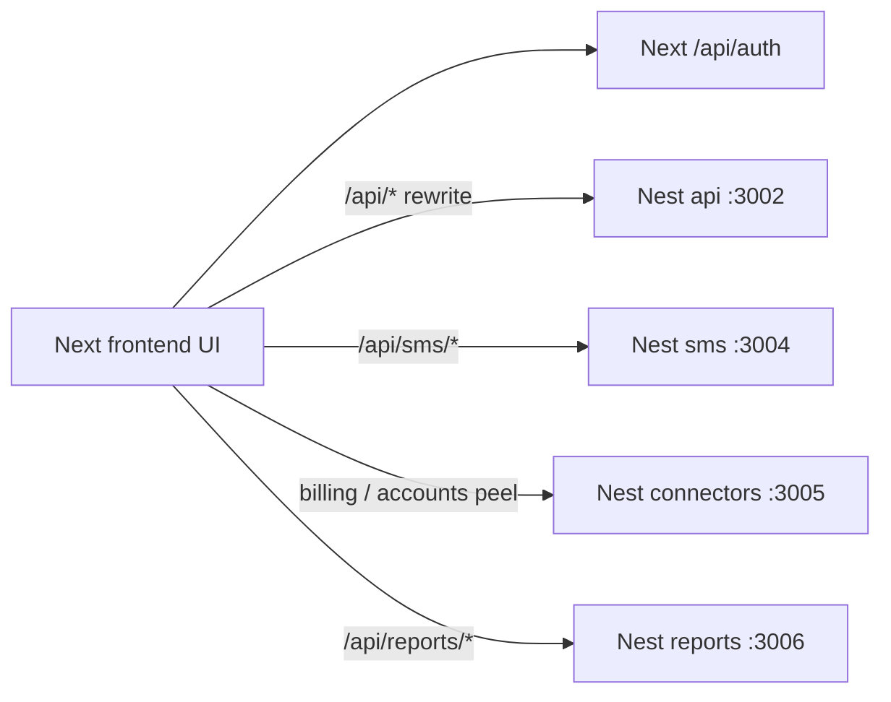

# Next–Nest screen parity

## Overview

Make every live Archaser screen work on the current split: **Next.js is the UI**, **Nest is the product API**. Do not put product HTTP back on Next (`pages/api` stays NextAuth only). Do not redesign screens. If a page and Nest disagree, **change Nest** until the page’s existing JSON and staging behavior match.

### Objectives

- Grids, forms, and dashboards fill and save for an internal admin and a portal customer.
- Same-origin `/api/*` from the UI; Nest (and SMS / connectors / reports peels) serve those paths.
- Local proof, then the same screens on staging, then a Hebrew/RTL smoke.

### Scope

- In: every live App Router screen under `frontend/app/[locale]/app/**` and `frontend/app/[locale]/portal/**`.
- Out: migrating axios/`apiFetch` to the typed OpenAPI client; new visual design; folding peels back into one Nest process; reviving Next product `pages/api`.

## Decision log

| # | Topic | Decision | Rationale / plan impact |
|---|-------|----------|-------------------------|
| D1 | What “done” means | Every live screen works against Nest (grids/forms/dashboards fill and save). Next=UI, Nest=API. | Program is product parity, not another architecture rewrite. |
| D2 | UI vs Nest JSON | Keep the JSON the page already reads. Change Nest. | Faster screen fixes; reports/customers already use `{ data, totalRecords }` in most places. |
| D3 | Walk order | Shared grids first, then collections screens, then the rest. | ~20 surfaces share `ViewBasedDataGrid` → `/api/reports/:id/execute`. |
| D4 | Proof | Browser happy path: data shows, one filter/sort, one save/export if the button exists. | HTTP 200 is not enough; UI may read a different key. |
| D5 | Where | Fix local (rewrites + reports peel on). Re-check the same screens on staging per slice. | Staging is the running product; local is the fix loop. |
| D6 | Wrong numbers | Match staging behavior (totals, filters, who can click). Change Nest if local ≠ staging. | Old Next handlers are gone; staging is the only live spec. |
| D7 | Who logs in | One internal admin + one portal customer. | Agent 403 on Settings is not a Nest bug. |
| D8 | AWS / SMS / ERP | Local: page + Nest answer (empty/error OK without credentials). Staging: live action when env exists. | Upload is still a Nest stub; connectors/SMS are peels. |
| D9 | Locale | Functionality in English first. Hebrew/RTL smoke after, no extra Nest work unless a route is locale-specific. | Nest JSON is locale-agnostic; RTL is CSS. |

## Current architecture (do not change)

- Frontend: `frontend/` (`@archaser/web`). Product calls: `frontend/lib/api.ts`, `frontend/utils/apiFetch.ts`.
- Backend: `backend/api`, `backend/sms`, `backend/connectors`, `backend/reports`.
- DualAuth: Bearer and/or NextAuth cookie. Local browser uses the cookie session.
- Typed client `frontend/utils/nestOpenApiClient.ts` exists and stays unused in this program (D1).

## Impact analysis

### Codebase search

- `ViewBasedDataGrid` / `useViewExecution`: Customers, Disputes, dashboard chart-details, operation-dashboard details, credit-dashboard report, customer unpaid invoices / banks / contacts.
- Nest reports: `backend/reports/src/reports/` — execute, export, share, schedule, user-default already mounted.
- Nest customers: `backend/api/src/customers/` — list often `{ data, totalRecords }`; search still `{ items }` (D2 fix when that screen is empty).
- Upload stub: `backend/api/src/upload/upload.controller.ts`; UI: account details `apiFetch("/api/upload/s3")`.
- OpenAPI copies already match (`frontend/openapi/openapi.json` = `backend/api/openapi.json`). Update both when Nest JSON changes (D2).
- Stale plans: `nest_full_backend_cutover_*.plan.md` still tracks deleting Next product APIs (already gone). `fe_be_api_reconnect.plan.md` inventory/parity is done; this program is the screen walk those PRs did not close.

### Affected areas

- **Frontend:** only if a page mis-reads the agreed JSON or RTL breaks (D2, D9). No new theme/CSS unless a screen is unusable.
- **Backend:** Nest controllers/services/DTOs so responses match the page and staging.
- **Peels:** reports first (Slice 1); connectors/SMS in Slice 5.
- **i18n:** no new keys unless a broken empty/error state is missing copy (ask before editing locale files).
- **Tests:** Nest HTTP tests when a handler’s JSON or rule changes; browser proof is the gate (D4).

## Implementation steps

### Slice 1 — Shared grids

1. Local: `USE_NEST_API_REWRITE=true`, reports peel on (`USE_REPORTS_NEST_REWRITE` not `false`), Next + `api` + `reports` running, DB with at least one account/customers.
2. Admin login → Customers list: rows, sort/filter, export if visible.
3. Same grid spine: Disputes, customer contacts/banks/unpaid invoices, dashboard chart-details, operation-dashboard details, credit report grid.
4. If empty/wrong: fix Nest reports execute (and any D2 shape mismatch). Do not change the grid contract.
5. Staging re-check of the same pages (D5, D6).

### Slice 2 — Collections screens

Login, financial dashboard KPIs, customer detail header and actions, invoice flows that are not the shared grid, remaining AR modals. Staging totals win (D6).

### Slice 3 — Rest of internal app

Agents, control-center, legal, import, report builder, settings trees, activity sequences/templates, credit dashboards / portfolio health.

### Slice 4 — Portal

One portal customer: home, invoices, disputes, payment, promise-to-pay, verify. Admin-only screens are out for this user (D7).

### Slice 5 — Admin + third-party

Admin accounts, cron, logs, system health, SMS. Local: shell + Nest response. Staging: S3 upload, SMS, billing connector when credentials exist (D8).

### Slice 6 — Hebrew/RTL

Re-open Slice 1–5 screens under `/he/...`. Fix layout/copy only. No Nest JSON work unless a path is locale-specific (D9).

## Testing strategy

| Requirement | Decision | How |
|-------------|---------|-----|
| Screen shows real data | D4 | Browser: open page, rows/KPIs visible |
| Grid extras already in UI | D3, D4 | One export or save-view if the button exists |
| Numbers match product | D6 | Compare to staging |
| Local vs staging | D5 | Local fix, staging confirm per slice |
| Role noise | D7 | Admin for app; portal user for portal |
| Third-party | D8 | Staging live action; local may stub |
| Locale | D9 | EN functional; HE smoke last |
| Nest change safety | plan.mdc | HTTP test on changed route (auth 401 + happy shape) |

## Discovery gates (blocking)

| Gate | If yes | If no |
|------|--------|-------|
| Local Next rewrite + Nest :3002 + reports :3006 + DB with customers | Slice 1 can start | Unblock env before any screen work |
| Staging admin user + portal customer | D5/D7 proof | Staging re-check slips; do not call a slice done |
| Staging AWS/SMS/ERP credentials | Slice 5 live actions | Document skip per D8; page shell still required |
| OpenAPI export after Nest DTO change | FE+BE copies stay equal | Parity script will fail on next FE CI |

## Risks

| Risk | Mitigation |
|------|------------|
| Empty local DB looks like a Nest bug | Seed or copy a small staging subset before Slice 1 |
| Reports peel off by accident (`USE_REPORTS_NEST_REWRITE=false`) | Slice 1 checklist includes peel on; main API does not mount `/api/reports` |
| Stale cutover plan sends work back into Next `pages/api` | This plan is SoT; do not revive product Pages API |
| Scope explosion (every role × every locale) | D7 + D9 |

## Deployment / rollout

- No big-bang flag. Ship Nest JSON/behavior fixes per slice; FE only when UI/RTL is wrong.
- Paired FE+BE PRs only when OpenAPI or a page must change with Nest.
- Reverse-proxy stays: Amplify UI at `staging.archaser.com`; Nest peels on `api.staging.archaser.com` (`/api/auth` on Amplify; `/api/ws` and product `/api/*` on Nest).

## Plan edits (other docs)

- [ ] `nest_full_backend_cutover_*.plan.md` — mark product `pages/api` deletion **done**; point remaining work here (screen parity), not bundle strangler.
- [ ] `fe_be_api_reconnect.plan.md` — inventory/parity **done**; remaining “paired PRs / UI works” = this plan.
- [ ] `nest_microservice_migration_*.plan.md` — keep peels; next product work is this walk, not a new peel.
- [ ] `api.mdc` (both repos) — still says all APIs live in `pages/api`; update when someone next edits rules (out of this program unless asked).
