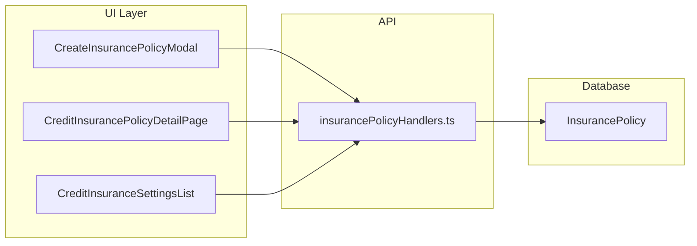

# Add Cost Calculation Method and Cost % to Insurance Policies

## Scope

Extend **credit insurance** `InsurancePolicy` (Primary and TopUp) with two new fields:

| Field | DB name | Type | Behavior |
|-------|---------|------|----------|
| Cost Calculation Method | `cost_calculation_method` | Optional enum: `ActualSales`, `Limit` | Picklist; empty allowed |
| Cost % | `cost_percent` | Optional `Decimal(10, 2)` | Required when method is set; any positive number; cleared when method is cleared |

These fields apply to **both** policy kinds (unlike limit/scoring fields, which are Primary-only and nulled for TopUp in [`parsePolicyScalarFields`](pages/api/entities/insurancePolicyHandlers.ts)).



---

## Codebase scan — files to change

### Required (8 files)

| Layer | File | Why |
|-------|------|-----|
| Schema | [`prisma/schema.prisma`](prisma/schema.prisma) | New enum + model columns |
| Migration | `prisma/migrations/20260621_insurance_policy_cost_fields.sql` (new) | DB DDL |
| API | [`pages/api/entities/insurancePolicyHandlers.ts`](pages/api/entities/insurancePolicyHandlers.ts) | Parse, validate, POST/PUT payloads |
| Service | [`server/services/InsurancePolicyService.ts`](server/services/InsurancePolicyService.ts) | Add fields to `listPoliciesPaged` sort allowlist |
| Modal | [`app/[locale]/app/settings/CreateInsurancePolicyModal.tsx`](app/[locale]/app/settings/CreateInsurancePolicyModal.tsx) | Form state, validation, save payload, reset/load |
| Detail | [`app/[locale]/app/settings/credit-insurance-policies/[policyId]/page.tsx`](app/[locale]/app/settings/credit-insurance-policies/[policyId]/page.tsx) | `PolicyDetail` type, edit + readonly UI, validation |
| List | [`app/[locale]/app/settings/CreditInsuranceSettingsList.tsx`](app/[locale]/app/settings/CreditInsuranceSettingsList.tsx) | **4 touchpoints:** `PolicyApiRow`, `mapPolicyToRow`, grid columns, `handleExport` |
| i18n | [`locales/en/settings.json`](locales/en/settings.json), [`locales/he/settings.json`](locales/he/settings.json) | Labels + validation message |

### CreditInsuranceSettingsList — export correction

Export does **not** auto-include new grid columns. [`handleExport`](app/[locale]/app/settings/CreditInsuranceSettingsList.tsx) manually maps API rows to export objects (lines 216–229). Must add `cost_calculation_method` (translated label) and `cost_percent` (with `%`) there, in addition to `PolicyApiRow` and `mapPolicyToRow`.

---

## Codebase scan — files that do NOT need changes

| File | Reason |
|------|--------|
| [`ReplacePolicyModal.tsx`](app/[locale]/app/settings/ReplacePolicyModal.tsx) | Bulk replace by policy ID only; no field editing |
| [`CustomerCreditInsuranceInfo.tsx`](app/[locale]/app/customers/[customerId]/CustomerCreditInsuranceInfo.tsx) | Customer-level policy assignment; not policy definition |
| [`enrichCustomersWithActivePolicy.ts`](server/services/creditInsurance/enrichCustomersWithActivePolicy.ts) | `INSURANCE_POLICY_SELECT` is for cover limits on customer dashboard, not cost |
| [`InsurancePolicyService.getCustomerPrefillForEdit`](server/services/InsurancePolicyService.ts) | Prefills customer term/limit fields from policy; cost is policy-level only |
| [`pages/api/import/customer/index.ts`](pages/api/import/customer/index.ts) | Resolves policy by number + term defaults; no cost import |
| [`creditInsuranceDashboardService.ts`](server/services/creditInsurance/creditInsuranceDashboardService.ts) | Uses `max_total_cover` for dashboard KPIs, not cost |
| [`CustomerTopUpService.ts`](server/services/creditInsurance/CustomerTopUpService.ts) | Top-up amounts are separate from policy cost config |
| [`reportMetadata.ts`](server/services/reportMetadata.ts) | Only exposes `InsurancePolicy.policy_number` on Customer reports |
| [`reportCreditInsuranceFieldUsage.ts`](server/utils/reportCreditInsuranceFieldUsage.ts) | Credit-insurance report field registry; no policy cost fields today |
| [`ReportQueryBuilder.ts`](server/services/ReportQueryBuilder.ts) | Only references `InsurancePolicy.policy_number` |
| [`types/Customer.ts`](types/Customer.ts) | `InsurancePolicy` relation is `{ policy_number }` only |
| [`shared/customerPolicyAdapter.ts`](shared/customerPolicyAdapter.ts) | Policy number resolution for report rows |
| Existing unit tests | No tests assert full `InsurancePolicy` field sets; mocks use generic `insurancePolicy` model |

---

## Optional / out of scope (unless requested later)

- **Report builder:** Add `InsurancePolicy.cost_calculation_method` / `InsurancePolicy.cost_percent` to [`reportMetadata.ts`](server/services/reportMetadata.ts) and [`reportCreditInsuranceFieldUsage.ts`](server/utils/reportCreditInsuranceFieldUsage.ts) if cost should appear in saved reports.
- **Unit test:** Extract `parsePolicyCostFields` and add `tests/unit/pages/insurancePolicyHandlers.costFields.test.ts` for server validation edge cases.
- **Customer UI:** Surface cost fields on customer credit-insurance panel if business wants users to see policy cost config per customer (not in current request).

---

## 1. Database and Prisma

**Files:** [`prisma/schema.prisma`](prisma/schema.prisma), new migration `prisma/migrations/20260621_insurance_policy_cost_fields.sql`

- Add enum:
```prisma
enum cost_calculation_method {
  ActualSales
  Limit
}
```

- Add to `InsurancePolicy` model (after `reporting_days`):
```prisma
cost_calculation_method  cost_calculation_method?
cost_percent               Decimal?                  @db.Decimal(10, 2)
```

- SQL migration (follow existing pattern in [`20260610_credit_insurance_top_up.sql`](prisma/migrations/20260610_credit_insurance_top_up.sql)):
  - `CREATE TYPE "cost_calculation_method" AS ENUM ('ActualSales', 'Limit');`
  - `ALTER TABLE "InsurancePolicy" ADD COLUMN IF NOT EXISTS ...`

- Run `npx prisma generate` after schema change (no `migrate dev` / `db push --force-reset`).

---

## 2. API validation and persistence

**File:** [`pages/api/entities/insurancePolicyHandlers.ts`](pages/api/entities/insurancePolicyHandlers.ts)

Add `parsePolicyCostFields(body)` separate from `parsePolicyScalarFields`:

- Parse `cost_calculation_method`: accept `"ActualSales"` / `"Limit"` or null/empty; reject unknown values with 400.
- Parse `cost_percent`: when method is set, require a valid number `> 0`; when method is null/empty, force `cost_percent: null` (even if client sends a value — matches “clear both” behavior).
- When method is set but percent missing/invalid: throw `"cost_percent is required when cost_calculation_method is set"` (or similar).

Wire into **POST** and **PUT** payloads alongside existing scalar fields (not inside the TopUp-nulling block).

Add `cost_calculation_method` and `cost_percent` to `listPoliciesPaged` allowed sort fields in [`InsurancePolicyService.ts`](server/services/InsurancePolicyService.ts) so grid column sorting works.

No changes needed in [`InsurancePolicyService.createPolicy`](server/services/InsurancePolicyService.ts) / `updatePolicy` — they already spread arbitrary fields into Prisma.

---

## 3. Policy form UI (Primary + TopUp)

### Create/edit modal

**File:** [`app/[locale]/app/settings/CreateInsurancePolicyModal.tsx`](app/[locale]/app/settings/CreateInsurancePolicyModal.tsx)

- State: `costCalculationMethod` (`"" | "ActualSales" | "Limit"`), `costPercent` (string).
- Reset/load from `policyDetail` in existing `useEffect` / reset callback.
- Place fields in the **common** section (after `insurer_name`), **outside** `{policyKind === "Primary" && (...)}` so both kinds see them.
- **Cost Calculation Method:** MUI `Select` with empty option + two `MenuItem`s (same pattern as `policy_kind`).
- **Cost %:** `TextField` with `inputMode="decimal"`, `inputProps={{ min: 0, step: "any" }}`; always visible, disabled when no method, `required` only when method is set.
- On method change to empty: `setCostPercent("")` and clear `cost_percent` error.
- Client validation (mirror server):
  - If method set and percent empty → required error
  - If method set and percent not a positive number → invalid number error
- Include `cost_calculation_method` and `cost_percent` in save payload.

### Policy detail page

**File:** [`app/[locale]/app/settings/credit-insurance-policies/[policyId]/page.tsx`](app/[locale]/app/settings/credit-insurance-policies/[policyId]/page.tsx)

Mirror modal changes:

- Extend `PolicyDetail` type with new fields.
- Input state, load from `data`, validation in `savePolicyMutation`, payload on save.
- **Edit mode:** same Select + TextField pair (both policy kinds).
- **Read-only mode:** add `PolicyReadonlyField` rows for both fields (translate enum label for method; append `%` for percent display).
- Same clear-on-method-clear behavior.

---

## 4. Policy list table + export

**File:** [`app/[locale]/app/settings/CreditInsuranceSettingsList.tsx`](app/[locale]/app/settings/CreditInsuranceSettingsList.tsx)

1. Extend `PolicyApiRow` with `cost_calculation_method?` and `cost_percent?`.
2. Update `mapPolicyToRow` to pass through new fields.
3. Add two grid columns after `reporting_days`:
   - `cost_calculation_method` — translated label or `-`
   - `cost_percent` — `12.5%` or `-` (pattern from [`CustomerTopUpList.tsx`](app/[locale]/app/customers/[customerId]/CustomerTopUpList.tsx))
4. Update `handleExport` return mapping with the same two fields.

---

## 5. Translations

**Files:** [`locales/en/settings.json`](locales/en/settings.json), [`locales/he/settings.json`](locales/he/settings.json)

Under `credit_insurance`, add (alphabetically within each section, EN/HE in sync):

- `columns.cost_calculation_method`, `columns.cost_percent`
- `fields.cost_calculation_method`, `fields.cost_percent`
- `fields.cost_calculation_method_actual_sales`, `fields.cost_calculation_method_limit`
- `validation.cost_percent_required_when_method_set`

English labels: **Cost Calculation Method**, **Cost %**, **Actual Sales**, **Limit**.

---

## 6. Testing strategy

| Test | What it covers |
|------|----------------|
| Manual — Primary policy | Create/edit with method + percent; save; verify list + detail page |
| Manual — TopUp policy | Same on TopUp; confirm limit fields still nulled but cost fields persist |
| Manual — conditional validation | Set method without percent → blocked; clear method → percent cleared on save |
| Manual — API edge case | PUT with method=null but cost_percent sent → server stores null for both |
| Manual — export | Export policies grid; verify new columns appear in file |
| Static analysis | `npx tsc --noEmit` |

No existing unit tests for `insurancePolicyHandlers.ts`; optional follow-up: extract `parsePolicyCostFields` and add a small unit test file.
