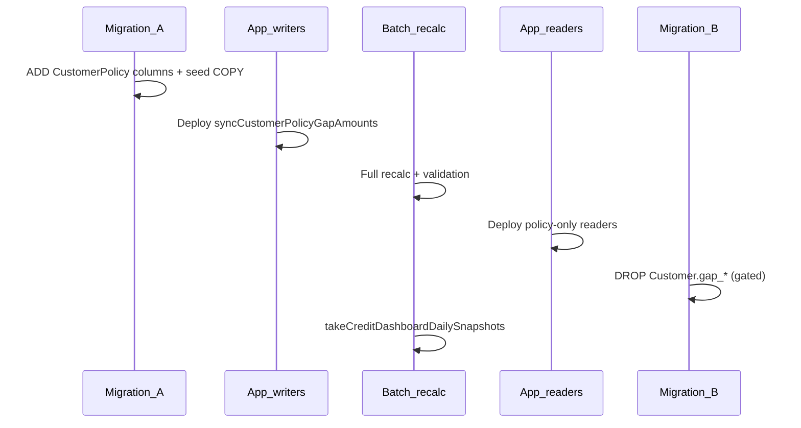

# Move uninsured & capacity gap to CustomerPolicy (multi-currency)

## Policy: CustomerPolicy only — no Customer gap columns

- **Remove** from `Customer`: `gap_in_base_currency`, `gap_in_base_currency_date`.
- **No dual-read**, no dual-write, no fallback to `Customer.gap_*`.
- **Single source of truth:** `CustomerPolicy` row(s) — active row updated by sync; deactivated row keeps frozen snapshot (see below).
- **API convenience:** customer GET may expose top-level `capacity_gap_amount` / `uninsured_amount` as **aliases from active policy** (not persisted on `Customer`).

## Product naming (avoid wiring mistakes)

| Name in API / DB | Meaning |
|------------------|---------|
| `capacity_gap_amount` | Open AR above approved limit (≥ 0, account currency + buckets) |
| `uninsured_amount` | `openAr − approvedLimit` (may be negative internally; display clamps ≥ 0) |
| `terms_breach_outstanding` | Sum of breach-flagged invoice outstanding — **unchanged**, still computed live |
| UI label `credit_insurance.uninsured_amount` on [`CustomerDashboardCards`](app/[locale]/app/customers/[customerId]/CustomerDashboardCards.tsx) | Actually **terms breach** KPI — do not bind to `uninsured_amount` |

Optional follow-up (not this migration): rename API `uninsured_amount` → `limit_excess_amount` to reduce confusion.

**Not in scope:** `terms_breach_outstanding` storage migration. `Invoice.in_capacity_gap` stays on invoices.

## Architecture improvements

### 1. Rename sync service

Refactor [`computeGapInBaseCurrencyService.ts`](server/services/creditInsurance/computeGapInBaseCurrencyService.ts) → **`syncCustomerPolicyGapAmounts.ts`** (or equivalent). Update [`computeGapInBaseCurrency.ts`](server/cron-jobs/computeGapInBaseCurrency.ts) job description/logs. Name should reflect policy writes + uninsured + buckets, not only “base currency gap.”

### 2. Single computation module (writers only)

Consolidate gap math currently spread across:

- `computeGapInBaseCurrencyService`
- `computeDashboardCapacityGap` in [`creditInsuranceDashboardService.ts`](server/services/creditInsurance/creditInsuranceDashboardService.ts)
- `computeCustomerCapacityGapAmount` / `computeCustomerCapacityGapAmountForAccountDisplay` in [`invoiceInsuranceFields.ts`](server/services/creditInsurance/invoiceInsuranceFields.ts)

**Rule:** One internal module used **only by the sync writer**. All GET/dashboard/report paths read **stored** `CustomerPolicy` fields via `storedCapacityGapAmount(c)` (no live FX recompute).

Remove `computeDashboardCapacityGap` from dashboard hot paths after migration. Display helpers in `invoiceInsuranceFields` become thin readers of policy fields (or deprecated wrappers).

### 3. Shared top-2 currency aggregation

Extract “group open Due/Overdue AR by `customer_currency`, sort desc, take top 2” into a shared helper (same line-outstanding rule as [`CustomerService`](server/services/CustomerService.ts) due aggregation and [`syncInvoiceCapacityGapFlags`](server/services/creditInsurance/syncInvoiceCapacityGapFlags.ts)). Use for both due denormalization and gap bucket fields — avoid duplicated grouping logic.

### 4. `min(capacity_gap, total_ar)` — apply at read time

Customer GET today caps displayed gap: `capacity_gap_amount = min(storedGap, total_ar)`.

**Decision:** Store **uncapped** gap on `CustomerPolicy` (keeps FIFO / `in_capacity_gap` alignment with raw over-limit amount). Apply `min(gap, total_ar)` consistently at **read time** in:

- [`pages/api/entities/[...path].ts`](pages/api/entities/[...path].ts) customer KPIs
- Dashboard summary aggregation (if summing per-customer gaps for portfolio total, sum capped values OR document that stored gap is already ≤ AR — prefer explicit cap at read for portfolio card)
- Customer dashboard view model

Document in `types/Customer.ts` on `capacity_gap_amount` alias.

### 5. Freeze gap on policy deactivation

When `CustomerPolicy.is_active` flips to `false` (policy change, bulk replace, manual deactivation):

- Run gap sync **once** on the row being deactivated so `capacity_gap_amount`, `uninsured_amount`, and buckets reflect final state.
- New active row gets fresh sync on activation.

Implement in [`CustomerPolicyService`](server/services/creditInsurance/CustomerPolicyService.ts) policy-switch / bulk-replace paths (verify bulk replace today).

### 6. Null stored gap handling

After deploy, `capacity_gap_amount` may be null until batch/cron runs.

- **Deploy gate:** Migration B (drop Customer columns) runs only after batch recalc validation passes.
- **Optional repair:** cron retry or ops script for `capacity_gap_amount IS NULL AND approved_limit IS NOT NULL AND is_active = true`.
- **UI:** If active policy has limit but `capacity_gap_amount == null`, show `—` or `0` with documented rule (prefer `0` for consistency unless product wants “pending”).

Do **not** recompute on every GET.

## Target schema (`CustomerPolicy`)

**Account currency (primary)**

- `capacity_gap_amount` `Float?` (≥ 0, uncapped at AR — see §4)
- `capacity_gap_amount_date` `DateTime?` `@db.Date`
- `uninsured_amount` `Float?`

**Top-2 invoice currencies (due-style)**

- `capacity_gap_amount1` / `capacity_gap_currency1`
- `capacity_gap_amount2` / `capacity_gap_currency2`
- `uninsured_amount1` / `uninsured_currency1`
- `uninsured_amount2` / `uninsured_currency2`

Per-bucket when `approved_limit_currency` matches bucket:  
`gap = max(0, bucketOpenAr - approvedLimit)`, `uninsured = bucketOpenAr - approvedLimit`.  
Else bucket fields = `0`; account-level fields hold FX-adjusted values.

**Optional index (if explain plans need it):** partial index on active policies with `capacity_gap_amount > 0` for capacity report filtering.

**Drop from `Customer`:** `gap_in_base_currency`, `gap_in_base_currency_date`; remove from [`types/Customer.ts`](types/Customer.ts) select.

## Migration / deploy sequence (two migrations, one PR)

| Step | Action |
|------|--------|
| A1 | **Migration A:** add `CustomerPolicy` columns; optional `UPDATE` copy `Customer.gap_in_base_currency` → active policy |
| A2 | Deploy **writers** only (`syncCustomerPolicyGapAmounts`) |
| A3 | **Batch recalc** + validation (see Data fix) |
| A4 | Deploy **readers** + dashboard + customer VM |
| A5 | **Migration B:** drop `Customer.gap_*` — **only if** validation passes |
| A6 | **Post-deploy:** re-run `takeCreditDashboardDailySnapshots` so MoM % on capacity gap card is correct |

**No application dual-read.**

## Data fix / full recalculation

- SQL seed does **not** replace full recalc (uninsured + buckets).
- Batch: FX rates → `syncCustomerPolicyGapAmounts` per eligible customer → `syncInvoiceCapacityGapFlagsForCustomer`.
- Ops wrapper: `scripts/recalculate-customer-policy-gap-amounts.ts` (thin, same entry point).
- **Pre-drop validation:** snapshot legacy `Customer.gap_in_base_currency` (temp table or export); after recalc compare active policy `capacity_gap_amount` (same-currency cases should match; FX may differ if rates updated).
- Log `missingRates` count.

## Sync triggers (complete list)

| Trigger | File / path |
|---------|-------------|
| Nightly cron | [`computeGapInBaseCurrency.ts`](server/cron-jobs/computeGapInBaseCurrency.ts) via `cronManager` |
| Invoice save | [`InvoiceService.ts`](server/services/InvoiceService.ts) |
| Insurance field sync | [`syncCustomerInsuranceFields.ts`](server/services/creditInsurance/syncCustomerInsuranceFields.ts) |
| Before invoice FIFO flags | [`syncInvoiceCapacityGapFlags.ts`](server/services/creditInsurance/syncInvoiceCapacityGapFlags.ts) |
| **Import complete** | [`postImportOverdueMetrics.ts`](server/services/creditInsurance/postImportOverdueMetrics.ts) — **add** gap sync for affected `customerIds` (in scope) |
| Policy limit/currency change | `syncCustomerInsuranceFields` + policy deactivation freeze |
| **Bulk policy replace** | [`CustomerPolicyService`](server/services/creditInsurance/CustomerPolicyService.ts) — verify and call gap sync + deactivation freeze |

## Read-path updates

| Area | Change |
|------|--------|
| [`syncInvoiceCapacityGapFlags.ts`](server/services/creditInsurance/syncInvoiceCapacityGapFlags.ts) | Read `capacity_gap_amount` from active policy |
| [`invoiceInsuranceFields.ts`](server/services/creditInsurance/invoiceInsuranceFields.ts) | Thin readers; remove `gap_in_base_currency` |
| [`pages/api/entities/[...path].ts`](pages/api/entities/[...path].ts) | KPIs from policy; cap gap at read; `risk_exposure` uses capped stored gap |
| [`customerPolicyTypes.ts`](server/services/creditInsurance/customerPolicyTypes.ts) / [`resolveActiveCustomerPolicy.ts`](server/services/creditInsurance/resolveActiveCustomerPolicy.ts) | Extend selects |
| [`enrichCustomersWithActivePolicy.ts`](server/services/creditInsurance/enrichCustomersWithActivePolicy.ts) | Overlay gap/uninsured + buckets on enriched rows |
| [`customerCreditInsuranceHeaderAmounts.ts`](server/services/creditInsurance/customerCreditInsuranceHeaderAmounts.ts) | Prefer `capacity_gap_amount1` + currency for secondary line; skip duplicate when bucket currency equals account currency |
| [`shared/customerPolicyAdapter.ts`](shared/customerPolicyAdapter.ts) | Extend `CustomerPolicyHistoryRow` |

## Account credit dashboard

UI ([`CreditDashboardScreen`](app/[locale]/app/credit-dashboard/CreditDashboardScreen.tsx), [`CreditReportSummaryCards`](app/[locale]/app/credit-dashboard/report/CreditReportSummaryCards.tsx), [`CreditInsuranceReportGrid`](app/[locale]/app/credit-dashboard/report/CreditInsuranceReportGrid.tsx)) — **no change** if API shapes stable.

**Backend:** Replace five `computeDashboardCapacityGap` call sites in [`creditInsuranceDashboardService.ts`](server/services/creditInsurance/creditInsuranceDashboardService.ts) with `storedCapacityGapAmount` on enriched customers. Remove `gap_in_base_currency` from customer `select` in `getCapacityGapReport`.

**Policy-scoped dashboard:** When `policyId` is set, `enrichCustomersWithPolicyScope` uses matching policy row — stored gap must live on the row enrichment reads (active or scoped inactive row per existing rules).

**Perf:** Prefer filtering `CustomerPolicy.capacity_gap_amount > 0` for capacity report instead of computing gap for all customers with AR.

**Report naming follow-up (optional):** `getCapacityGapReport` field `uninsuredGap` is capacity gap — consider API alias `capacityGap` later.

**Snapshots:** [`creditDashboardSnapshotService.ts`](server/services/creditInsurance/creditDashboardSnapshotService.ts) picks up corrected totals after summary fix; run snapshot cron after batch recalc (deploy step A6).

## Customer page credit dashboard

| Component | Change |
|-----------|--------|
| [`CustomerPolicyHistoryItem`](types/Customer.ts) | Gap/uninsured + buckets |
| [`customerDashboardCardViewModel.ts`](app/[locale]/app/customers/[customerId]/customerDashboardCardViewModel.ts) | KPI from `activeCustomerPolicy.capacity_gap_amount` (capped at read if needed); inactive policy cards use **that row’s** stored `capacity_gap_amount` (from deactivation freeze), not live AR − limit |
| [`CustomerDashboardCards.tsx`](app/[locale]/app/customers/[customerId]/CustomerDashboardCards.tsx) | Consumes VM; terms breach label unchanged |

## Testing strategy

| Test | Covers |
|------|--------|
| `syncCustomerPolicyGapAmounts.test.ts` | Writes policy only; outdated_dcl; buckets; deactivation freeze |
| **Golden reconciliation** | Fixture vs legacy `computeDashboardCapacityGap` / old `gap_in_base_currency` (same-currency + one cross-currency) |
| **Dashboard summary** | Two customers with known stored gaps → `getCreditDashboardSummary().capacityGap.totalAmount` equals sum of capped stored values |
| [`syncInvoiceCapacityGapFlags.test.ts`](tests/unit/creditInsurance/syncInvoiceCapacityGapFlags.test.ts) | Cross-currency FIFO from policy `capacity_gap_amount` |
| [`enrichCustomersWithActivePolicy.test.ts`](tests/unit/creditInsurance/enrichCustomersWithActivePolicy.test.ts) | Overlay includes gap fields |
| [`customerDashboardCardViewModel.test.ts`](tests/unit/app/customers/customerDashboardCardViewModel.test.ts) | Active + inactive policy rows |
| Repo grep | `gap_in_base_currency` → zero (except migration SQL) |

**Static checks:** `npx tsc --noEmit`, `npm run test:unit`, `npm run lint`.

## Full file inventory

### Schema / ops

- [`prisma/schema.prisma`](prisma/schema.prisma)
- `prisma/migrations/` — **A** add columns + seed; **B** drop Customer gap columns
- [`scripts/database/add-currency-rate-and-customer-gap-fields.sql`](scripts/database/add-currency-rate-and-customer-gap-fields.sql) — deprecate; companion drop script
- `scripts/recalculate-customer-policy-gap-amounts.ts` (optional ops)

### Sync / write

- `syncCustomerPolicyGapAmounts.ts` (from `computeGapInBaseCurrencyService.ts`)
- [`computeGapInBaseCurrency.ts`](server/cron-jobs/computeGapInBaseCurrency.ts), [`cronManager.ts`](server/services/cronManager.ts)
- [`syncInvoiceCapacityGapFlags.ts`](server/services/creditInsurance/syncInvoiceCapacityGapFlags.ts)
- [`syncCustomerInsuranceFields.ts`](server/services/creditInsurance/syncCustomerInsuranceFields.ts)
- [`InvoiceService.ts`](server/services/InvoiceService.ts)
- [`postImportOverdueMetrics.ts`](server/services/creditInsurance/postImportOverdueMetrics.ts) — **add gap sync**
- [`currencyRateService.ts`](server/services/currencyRateService.ts)
- Shared open-AR-by-currency helper (new or in CustomerService)

### Policy / enrichment

- [`customerPolicyTypes.ts`](server/services/creditInsurance/customerPolicyTypes.ts)
- [`resolveActiveCustomerPolicy.ts`](server/services/creditInsurance/resolveActiveCustomerPolicy.ts)
- [`enrichCustomersWithActivePolicy.ts`](server/services/creditInsurance/enrichCustomersWithActivePolicy.ts)
- [`CustomerPolicyService.ts`](server/services/creditInsurance/CustomerPolicyService.ts) — deactivation freeze + bulk replace
- [`customerPolicyQueryHelpers.ts`](server/services/creditInsurance/customerPolicyQueryHelpers.ts)
- [`loadEffectiveInsuranceForCustomers.ts`](server/services/creditInsurance/loadEffectiveInsuranceForCustomers.ts)

### Dashboard / API

- [`creditInsuranceDashboardService.ts`](server/services/creditInsurance/creditInsuranceDashboardService.ts)
- [`creditDashboardSnapshotService.ts`](server/services/creditInsurance/creditDashboardSnapshotService.ts)
- [`invoiceInsuranceFields.ts`](server/services/creditInsurance/invoiceInsuranceFields.ts)
- [`customerCreditInsuranceHeaderAmounts.ts`](server/services/creditInsurance/customerCreditInsuranceHeaderAmounts.ts)
- [`pages/api/credit-insurance/summary.ts`](pages/api/credit-insurance/summary.ts), [`report.ts`](pages/api/credit-insurance/report.ts), [`summary-history.ts`](pages/api/credit-insurance/summary-history.ts)
- [`pages/api/entities/[...path].ts`](pages/api/entities/[...path].ts)
- [`pages/api/entities/customerPolicyHandlers.ts`](pages/api/entities/customerPolicyHandlers.ts)

### Customer UI

- [`types/Customer.ts`](types/Customer.ts)
- [`customerDashboardCardViewModel.ts`](app/[locale]/app/customers/[customerId]/customerDashboardCardViewModel.ts)
- [`shared/customerPolicyAdapter.ts`](shared/customerPolicyAdapter.ts)
- [`CustomerDashboardCards.tsx`](app/[locale]/app/customers/[customerId]/CustomerDashboardCards.tsx)

### Tests

- New/updated files listed in Testing strategy above
- [`customerPolicy.test.ts`](tests/unit/creditInsurance/customerPolicy.test.ts)

## Optional follow-ups (out of scope for initial migration)

- **`CustomerPolicyTrend`:** add `capacity_gap_amount` to daily trend upsert if portfolio gap history is needed
- **Report builder:** audit [`ReportQueryBuilder`](server/services/ReportQueryBuilder.ts) / saved reports for Customer gap fields → `CustomerPolicy` join
- **API rename:** report `uninsuredGap` → `capacityGap`; API `uninsured_amount` → `limit_excess_amount`
- **Multi-currency columns** on account credit report grid
