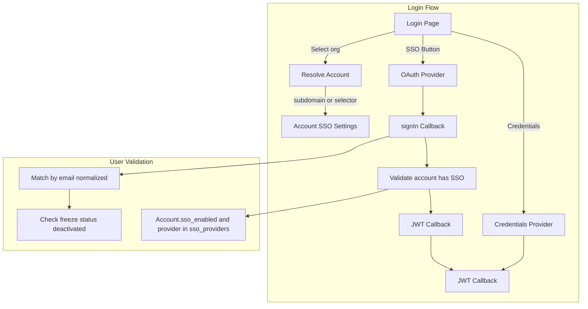

# SSO Implementation Plan

## Overview

Implement per-account SSO with Google and Microsoft (Azure AD) providers. Each account can enable/disable SSO and choose which providers (Google, Microsoft) to allow. Users must be pre-provisioned. Account context is determined by subdomain or organization selector on the login page.

## Context

- **Current auth**: NextAuth v4 with CredentialsProvider (username/password), JWT session strategy
- **User model**: Match OAuth users to existing User records by email (normalized)
- **Account model**: Has `sub_domain` for portal URLs; will add `sso_enabled`, `sso_providers`
- **Key files**: [pages/api/auth/[...nextauth].ts](pages/api/auth/[...nextauth].ts), [app/[locale]/(auth)/login/page.tsx](app/[locale]/(auth)/login/page.tsx)

## Architecture



## Implementation Steps

### 1. Add Account SSO Schema

**File**: [prisma/schema.prisma](prisma/schema.prisma)

Add to Account model:

```prisma
sso_enabled    Boolean?  @default(false)
sso_providers  String?   @db.VarChar(100)  // e.g. "google,microsoft" or "google" or "microsoft"
```

Create migration. Add index on `sub_domain` if not exists (for account lookup).

### 2. Add OAuth Providers to NextAuth

**File**: [pages/api/auth/[...nextauth].ts](pages/api/auth/[...nextauth].ts)

- Import `GoogleProvider` from `next-auth/providers/google`
- Import `AzureADProvider` from `next-auth/providers/azure-ad`
- Add providers conditionally (only when env vars are set):

```typescript
...(process.env.GOOGLE_CLIENT_ID && process.env.GOOGLE_CLIENT_SECRET
  ? [GoogleProvider({ clientId: process.env.GOOGLE_CLIENT_ID, clientSecret: process.env.GOOGLE_CLIENT_SECRET })]
  : []),
...(process.env.MICROSOFT_CLIENT_ID && process.env.MICROSOFT_CLIENT_SECRET
  ? [AzureADProvider({
      clientId: process.env.MICROSOFT_CLIENT_ID,
      clientSecret: process.env.MICROSOFT_CLIENT_SECRET,
      tenantId: process.env.MICROSOFT_TENANT_ID,
    })]
  : []),
```

**Note**: Azure AD callback URL is `{NEXTAUTH_URL}/api/auth/callback/azure-ad` (provider ID is `azure-ad`, not `microsoft`).

### 3. Email Normalization

**All user matching** must use normalized email to handle provider variations (e.g. `John.Doe@Company.com` vs `john.doe@company.com`):

```typescript
const normalizeEmail = (email: string) => email?.toLowerCase().trim() ?? "";
```

Use `normalizeEmail()` when querying users.

### 4. Update signIn Callback for OAuth User Matching and Account SSO Validation

**File**: [pages/api/auth/[...nextauth].ts](pages/api/auth/[...nextauth].ts)

- For `credentials` provider: return `true` (unchanged)
- For OAuth:
  - Extract email, normalize it, query `findFirst` with `deactivated_at: null`, include `Account: { select: { sso_enabled, sso_providers } }`
  - If no user: return `false` (reject)
  - If user found: validate (not frozen, status Active)
  - **Account SSO check**: Verify `user.Account.sso_enabled === true` and provider (e.g. "google", "azure-ad") is in `sso_providers` (split by comma). If not, return `false` with "SSO not enabled for your account"
  - Return `true`

### 5. Update jwt Callback for OAuth Users

When `user` is present and `account?.provider` is OAuth:
- Fetch DB user by normalized email using `findFirst` (with Account relation for SSO check if needed)
- Build same token structure as credentials (id, account_id, role, language, etc.)
- Apply same validation (freeze, status) before populating

### 6. Account Lookup API for Login Page

**New file**: `pages/api/auth/account-by-subdomain.ts`

- GET with query `subdomain` (e.g. `?subdomain=acme`)
- Look up Account by `sub_domain` (case-insensitive), select `id`, `name`, `sso_enabled`, `sso_providers`
- Return `{ accountId, name, ssoEnabled, ssoProviders: string[] }` or 404
- Public endpoint (no auth required) - only exposes minimal account info for login UX

**Alternative**: If app uses subdomain for login (e.g. `acme.archaser.com`), resolve account from hostname in middleware and pass to login page via header or cookie.

### 7. Update Login Page UI

**File**: [app/[locale]/(auth)/login/page.tsx](app/[locale]/(auth)/login/page.tsx)

- **Account context**:
  - **Subdomain**: If hostname has subdomain (e.g. `acme.archaser.com`), fetch account via API. Use that account for SSO display.
  - **No subdomain**: Add "Organization" field - user enters subdomain (e.g. "acme"). On blur/change, fetch account via `/api/auth/account-by-subdomain?subdomain=acme`. Store `accountId`, `ssoEnabled`, `ssoProviders`.
- **SSO buttons**: Only show when (a) global env vars set, (b) account resolved, (c) `account.ssoEnabled` and provider in `account.ssoProviders`. Show Google only if `ssoProviders` includes "google", Microsoft only if includes "microsoft".
- **Pass accountId to OAuth**: Before `signIn("google", ...)`, set cookie `sso_account_id={accountId}` (short-lived, 5 min). In signIn callback, read cookie from request to validate user belongs to that account (optional extra check). Or: include accountId in OAuth state if NextAuth supports custom state.
- Use `signIn("google", { redirect: true, callbackUrl: ... })`
- Add `aria-label` for accessibility
- Preserve RTL support for Hebrew
- Reuse redirect logic: admin (account_id 10013) -> ACCOUNTS, else DASHBOARD

### 8. Admin SSO Settings UI

**File**: [app/[locale]/app/admin/accounts/[AccountId]/details/AccountDetails.tsx](app/[locale]/app/admin/accounts/[AccountId]/details/AccountDetails.tsx) or new section

- Add "SSO" section with:
  - Checkbox: "Enable SSO for this account"
  - Checkboxes: "Google", "Microsoft" (when enabled)
- Save to Account via existing entities API
- Only show when global env vars are set for each provider
- Add to account edit form and API (entities path for Account update)

### 9. Custom Error Page for SSO Failures

Configure NextAuth `pages.error` or use `redirect` in signIn to send users to a page with clear error messages when:
- No account found
- Account frozen
- Account inactive
- SSO not enabled for your account

Add translation keys for each scenario.

### 10. Audit Logging

Use `createLogRecord` (same pattern as [app/[locale]/(auth)/login/page.tsx](app/[locale]/(auth)/login/page.tsx) lines 159-205, 271-286):

- **signIn callback**: Log SSO attempts (provider, email, accountId, outcome: success/rejected/rejected_sso_disabled)
- **Login page**: Log SSO button clicks and redirects

### 11. Environment Variables

**File**: [docs/SECURITY_ENVIRONMENT_VARIABLES.md](docs/SECURITY_ENVIRONMENT_VARIABLES.md)

- `GOOGLE_CLIENT_ID`, `GOOGLE_CLIENT_SECRET` (already documented)
- `MICROSOFT_CLIENT_ID`, `MICROSOFT_CLIENT_SECRET`, `MICROSOFT_TENANT_ID`

**Optional feature flags** (if not using env presence):
- `ENABLE_GOOGLE_SSO`, `ENABLE_MICROSOFT_SSO` - set to `true` to show buttons

### 12. Translations

**Files**: [locales/en/auth.json](locales/en/auth.json), [locales/he/auth.json](locales/he/auth.json), [locales/en/accounts.json](locales/en/accounts.json), [locales/he/accounts.json](locales/he/accounts.json)

Auth:
- `actions.sign_in_with_google`, `actions.sign_in_with_microsoft` (Google exists)
- `messages.google_signin_error`, `messages.microsoft_signin_error`
- `messages.google_user_not_found`, `messages.microsoft_user_not_found`
- `messages.sso_no_account`, `messages.sso_account_frozen`, `messages.sso_account_inactive`
- `messages.sso_not_enabled_for_account` - "SSO is not enabled for your account. Please use username and password."

Account selector:
- `fields.organization` - "Organization"
- `fields.organization_placeholder` - "Enter your organization (e.g. acme)"
- `messages.organization_not_found` - "Organization not found. Please check and try again."

Accounts (for admin SSO settings):
- `fields.sso_enabled` - "Enable SSO"
- `fields.sso_providers` - "SSO Providers"
- `fields.sso_provider_google` - "Google"
- `fields.sso_provider_microsoft` - "Microsoft"

### 13. IdP Configuration

**Google Cloud Console**:
- Redirect URI: `{NEXTAUTH_URL}/api/auth/callback/google`
- Scopes: `email`, `profile`

**Azure Portal (Microsoft Entra ID)**:
- Redirect URI: `{NEXTAUTH_URL}/api/auth/callback/azure-ad` (use `azure-ad`, not `microsoft`)
- API permissions: User.Read, email, profile
- Tenant ID: specific tenant for Enterprise-only (excludes personal accounts)

### 14. Documentation

**New file**: `docs/SSO_SETUP.md`

- Step-by-step Google Cloud Console setup
- Step-by-step Azure AD setup
- Redirect URIs for dev/staging/production
- Per-account SSO configuration (admin UI)
- Troubleshooting (common errors, logs to check)

### 15. Rollback

To disable SSO globally:
- Remove or unset `GOOGLE_CLIENT_ID`, `GOOGLE_CLIENT_SECRET` (and Microsoft vars)
- Providers will not be registered; SSO buttons will not appear
- Credentials login continues to work

To disable SSO for a specific account:
- Set `sso_enabled` to false or clear `sso_providers` in Admin UI

## Security Checklist

- [ ] Consider stricter auth rate limit (e.g. 10-20/min vs default 10000)
- [ ] Email normalization for all matching
- [ ] HTTPS required for OAuth in production
- [ ] Audit logging for all SSO events
- [ ] Account-by-subdomain API returns only minimal data (id, name, sso_enabled, sso_providers)
- [ ] Validate account SSO settings in signIn before allowing OAuth sign-in

## Testing Strategy

### Unit Tests

- User matching: 0 users, 1 user
- Email normalization (case, whitespace)
- Validation: freeze, inactive, deactivated
- Account SSO validation: sso_enabled false, provider not in sso_providers
- Account resolution by subdomain

### Integration Tests

- signIn callback behavior for each provider (with account SSO check)
- jwt callback for OAuth users
- Account-by-subdomain API

### Manual Testing

- Google sign-in (account with SSO enabled)
- Microsoft sign-in (account with SSO enabled)
- Reject when account has SSO disabled
- Reject when provider not in account's sso_providers
- Account selector flow (subdomain entry)
- Subdomain-based account resolution
- Admin SSO settings (enable/disable, provider selection)
- RTL layout
- Error scenarios (no account, frozen, inactive, sso not enabled)
- SSO buttons hidden when account has SSO disabled

## Files to Create

| File | Purpose |
|------|---------|
| `pages/api/auth/account-by-subdomain.ts` | Resolve account by subdomain for login page |
| `prisma/migrations/YYYYMMDD_add_account_sso.sql` | Add sso_enabled, sso_providers to Account |
| `docs/SSO_SETUP.md` | IdP setup and troubleshooting |

## Files to Modify

| File | Changes |
|------|---------|
| `prisma/schema.prisma` | Add sso_enabled, sso_providers to Account |
| `pages/api/auth/[...nextauth].ts` | Add providers, signIn (with account SSO check), jwt callbacks, email normalization |
| `app/[locale]/(auth)/login/page.tsx` | Account selector, SSO buttons per account, pass accountId |
| `app/[locale]/app/admin/accounts/[AccountId]/details/` | Add SSO settings section |
| `pages/api/entities/[...path].ts` | Include sso_enabled, sso_providers in Account CRUD |
| `locales/en/auth.json`, `locales/he/auth.json` | Translation keys |
| `locales/en/accounts.json`, `locales/he/accounts.json` | SSO settings translations |
| `docs/SECURITY_ENVIRONMENT_VARIABLES.md` | Microsoft env vars |

## Dependencies

- `next-auth` v4.24.11 (already installed)
- No new packages required
