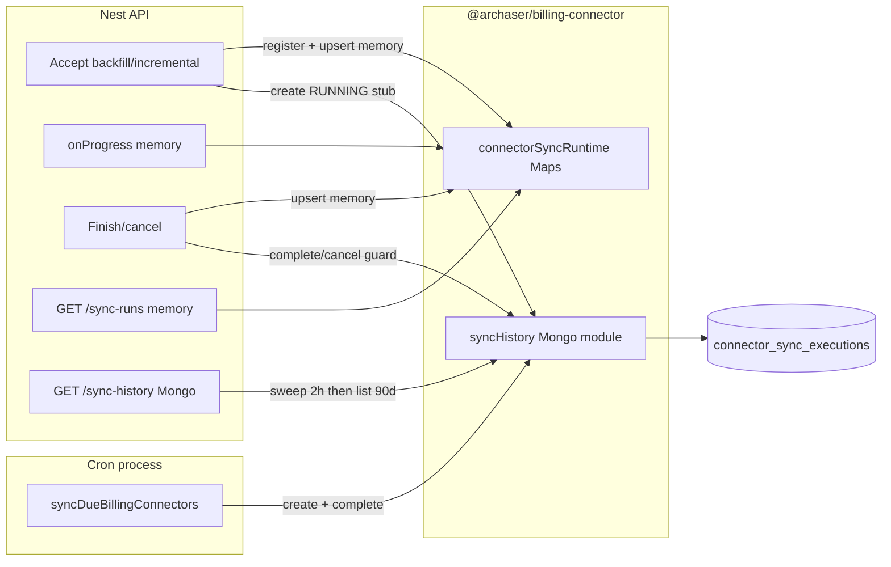

# Sync history → Mongo

## Goal

Persist billing-connector Sync history in MongoDB (`connector_sync_executions`) so it survives API/cron restarts. Keep **live progress** in process memory. Replace the Sync history accordion `List` with `EndlessScrollDataGrid` (same pattern as preview sample rows).

## Decision log (grilling)

| # | Topic | Decision |
|---|-------|----------|
| D1 | What Mongo owns | Start stub + finish/cancel/timeout; **no** per-page live `entity_stats` patches |
| D2 | Which syncs | Nest-triggered **and** scheduled/cron incremental |
| D3 | Crash mid-run | Running stub at start → Timed out if process dies |
| D4 | Stale timeout | **2 hours** after `started_at` |
| D5 | List window | Last **90 days** (align with Mongo TTL) |
| D5b | History UI | `EndlessScrollDataGrid` like preview |
| D6 | Columns | Core + per-entity counts |
| D7 | Read paths | Split history vs progress |
| D8 | Endpoints | Keep `GET …/sync-runs` memory-only for progress; add `GET …/sync-history` for Mongo |
| D9 | Cron writes | Shared helper; cron writes Mongo directly |
| D10 | Public id | UUID as `execution_id` on Mongo doc (API `id`) |
| D11 | Sweeper | On Nest `/sync-history` + optionally after cron due-sync pass |
| D12 | Code location | Inside `@archaser/billing-connector` (+ `mongoose`) |
| D13 | Stop → Mongo | Mark TIMEOUT/cancelled immediately; finish must not overwrite with SUCCESS |
| D14 | Count cells | Always `pulled / success / failed` |
| D15 | Cutover on grid | Omit this pass |

**Defaults:** Preview syncs stay out of history. Memory `/sync-runs` still holds the active run and the just-finished run so the progress session can show final state. No backfill of pre-deploy memory history.

## Architecture

## Data model

Collection: `connector_sync_executions` (existing TTL ~90 days on `started_at`).

**Add / enforce:**

- `execution_id: string` (UUID, **unique** index) — public API `id`
- Existing: `connector_id`, `account_id`, `provider`, `trigger`, `sync_mode`, `status`, timestamps, `duration_seconds`, `entity_stats`, `error_message`, `error_type`
- `entity_stats` values: `pulled` / `success` / `failed` / `skipped` (optional `status` / `sample_errors` for `_maturity` if already produced on finish — store as Mixed/flexible subdocs so Link payments works)

**Do not** persist cutover options this pass (D15).

## Backend implementation

### 1. Package module (`@archaser/billing-connector`)

- Add `mongoose` dependency.
- New Nest-friendly module under e.g. `src/syncHistory/` (model + service + `ensureMongoConnection` using `MONGODB_URI`, same default as Nest logs).
- **Do not** revive excluded Next `@/` services as-is; rewrite thin APIs:
  - `createRunningExecution({ executionId, accountId, connectorId, provider, trigger, syncMode })`
  - `completeExecution(executionId, { status, entityStats, errorMessage, errorType, completedAt })` — **no-op or refuse** if current status is already terminal cancelled/TIMEOUT from Stop
  - `markExecutionCancelled(executionId, …)`
  - `listExecutionsForAccount(accountId, { since: 90d })`
  - `sweepStaleRunning({ olderThanHours: 2 })` (account-scoped or global for cron)
- Include new files in `tsconfig` (keep legacy `src/models/**` / `ConnectorSyncExecutionService` excluded unless deleted later).
- Export from package `index`.

### 2. Nest writers — [`api/src/billing-connector/billing-connector.service.ts`](api/src/billing-connector/billing-connector.service.ts)

On accept (after UUID + `registerRunningSync` + memory `upsertSyncRun`):

- Load connector; `createRunningExecution` with same UUID.

On `onProgress`:

- Memory `patchSyncRunEntityStats` only (unchanged).

On finish / crash in `runAcceptedSync`:

- Memory upsert (unchanged).
- `completeExecution` with final `entity_stats` / status; respect cancel guard (D13).

On `cancelSync`:

- Memory TIMEOUT (unchanged).
- `markExecutionCancelled` immediately.

### 3. Cron writer — [`packages/billing-connector/src/services/syncDueBillingConnectors.ts`](packages/billing-connector/src/services/syncDueBillingConnectors.ts)

Per due connector:

- Generate UUID; `createRunningExecution` (`trigger: scheduled`).
- Pass `executionId` into `runInProcessSync` if needed for correlation.
- On return: `completeExecution` with mapped status + `entity_stats`.
- After the due-sync loop (or per account): `sweepStaleRunning`.

Ensure cron runtime has `MONGODB_URI` (document in plan / env notes).

### 4. API read — controller + service

- Keep `GET …/sync-runs` → memory `listSyncRuns` (progress).
- Add `GET …/sync-history` → sweep stale for account (or global), then list last 90 days, map to `ConnectorSyncRunSummary`-compatible shape (`id` = `execution_id`).
- Auth: same as sync-runs (`assertAccess`).

### 5. Status mapping

| Outcome | Mongo `status` | `error_type` |
|---------|----------------|--------------|
| Success | SUCCESS | null |
| Failed | FAILED | message / unexpected |
| Operator stop | TIMEOUT | cancelled |
| Stale sweeper | TIMEOUT | timeout |

## Frontend implementation

### API client — [`shared/services/billingConnectorService.ts`](shared/services/billingConnectorService.ts)

- Add `fetchBillingConnectorSyncHistory(accountId)` → `GET …/sync-history`.
- Keep `fetchBillingConnectorSyncRuns` for progress polling.

### UI — [`BillingIntegrationSettings.tsx`](app/[locale]/app/admin/accounts/[AccountId]/details/components/BillingIntegrationSettings.tsx)

- Progress accordion: continue using `syncRuns` query (memory).
- Sync history accordion: new query to sync-history; replace `List` with `EndlessScrollDataGrid` patterned on [`ConnectorPreviewSyncResults.tsx`](shared/layout-components/import/ConnectorPreviewSyncResults.tsx).

**Columns (D6 + D14):**

| Column | Source |
|--------|--------|
| Started | `started_at` |
| Status | `status` |
| Mode | `sync_mode` |
| Trigger | `trigger` |
| Duration | `duration_seconds` |
| Error | `error_message` |
| Customer | `entity_stats.Customer` → `pulled / success / failed` |
| Contact | same |
| Invoice | same |
| Payment | same |
| Link payments | `entity_stats._maturity` (or empty `—`) |

Helper: format cell `"{pulled} / {success} / {failed}"`; missing entity → `—`.

No new translations this pass (English labels like existing Sync history / preview hardcoded admin strings). No new styles beyond existing grid patterns (styling approval not required if reusing EndlessScrollDataGrid defaults).

## Codebase scan

### Required

| Area | Path | Why |
|------|------|-----|
| Package history module | `packages/billing-connector/src/syncHistory/*` (new) | Shared Nest + cron Mongo access |
| Package exports / deps | `packages/billing-connector/package.json`, `src/index.ts`, `tsconfig.json` | mongoose + exports |
| Nest accept/finish/cancel | `api/src/billing-connector/billing-connector.service.ts` | Create/complete/cancel Mongo |
| Nest routes | `api/src/billing-connector/billing-connector.controller.ts` | `sync-history` |
| Cron due sync | `packages/billing-connector/src/services/syncDueBillingConnectors.ts` | D2 writers + sweep |
| Cron env | cron-jobs deploy/docs or handler wiring | `MONGODB_URI` |
| FE client | `shared/services/billingConnectorService.ts` | New fetch |
| FE UI | `…/BillingIntegrationSettings.tsx` | Grid + query |
| Grid pattern ref | `shared/layout-components/import/ConnectorPreviewSyncResults.tsx` | Reuse EndlessScrollDataGrid |

### Optional / out of scope

| Area | Why |
|------|-----|
| Mid-run Mongo `entity_stats` patches | D1 |
| Cutover columns / schema | D15 |
| Multi-pod `getRunningSync` lock via Mongo | Not grilled; memory lock remains |
| Preview → history | D2 |
| Port/delete excluded legacy `ConnectorSyncExecutionService` / Next aliases | Rewrite thin module instead |
| i18n EN/HE | Admin strings already English; no permission asked |
| Prisma / Postgres | History is Mongo-only |
| Frontend progress helpers | Keep reading `/sync-runs` |

### No change needed

| Area | Why |
|------|-----|
| `connectorSyncRuntime` progress Maps | Still source of truth for live progress |
| `stagedExtensionSync` / pull engine | Only emits `onProgress`; no Mongo |
| Account 10149 extension | Unrelated |
| Field mapper / preview sync | Unrelated to history persistence |

## Easy-to-miss touchpoints

- **Cancel vs finish race:** `completeExecution` must not flip cancelled → SUCCESS if worker drains after Stop.
- **Cron without connector row fields:** need `connector.id`, `provider`, `account_id` at create time.
- **UUID on create:** Nest already has `executionId`; cron must generate one and keep it through complete.
- **List vs progress confusion:** do not point the history grid at `/sync-runs`.
- **Empty after deploy:** expected until first new run.
- **Link payments key:** use `MATURITY_ENTITY_STATS_KEY` (`_maturity`) consistently when mapping columns.

## Testing strategy

| Unit | Covers |
|------|--------|
| History service create → complete → list | Happy path; `execution_id` round-trip |
| Cancel then complete | Final status stays TIMEOUT/cancelled |
| Sweeper | RUNNING older than 2h → TIMEOUT |
| Nest listSyncRuns unchanged | Progress still memory |
| FE (manual) | History grid columns; progress still updates mid-run; Stop updates history status |

Automated FE tests only if explicitly requested later.

## Out of scope unless requested

- Persisting live progress to Mongo / multi-instance run lease
- Cutover columns
- Migrating or reconstructing pre-change in-memory history
- Preview runs in history
- Changing Mongo TTL from 90 days

## Implementation order

1. Package `syncHistory` module + mongoose + exports
2. Nest wire create/complete/cancel + `GET sync-history`
3. Cron wire create/complete + sweep + env
4. Frontend fetch + EndlessScrollDataGrid
5. Manual verify: Nest run, Stop, cron (or simulated), restart API → history remains

## Issues (vertical slices)

Tracer-bullet breakdown published as local markdown under `.scratch/sync-history-mongo/`. **Hard blockers** are recorded in each slice's **Blocked by** header. Implement in dependency order; start a **fresh session per issue**.

**Overview:** `.scratch/sync-history-mongo/OVERVIEW.md`

| # | Title | File | Waiting on | User stories |
|---|-------|------|------------|--------------|
| 1 | Nest Mongo history API | `issues/01-nest-mongo-history-api.md` | — | — |
| 2 | Cron Mongo history | `issues/02-cron-mongo-history.md` | 01 | — |
| 3 | Sync history grid UI | `issues/03-history-grid-ui.md` | 01 | — |

**Status:** `ready-for-agent` on all slices.
